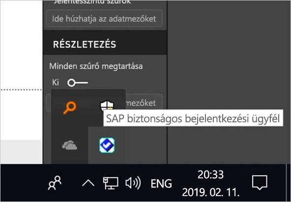
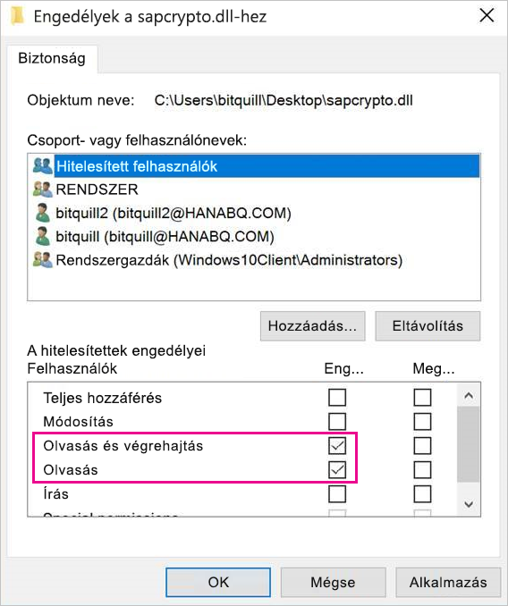
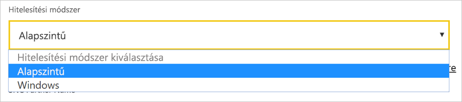
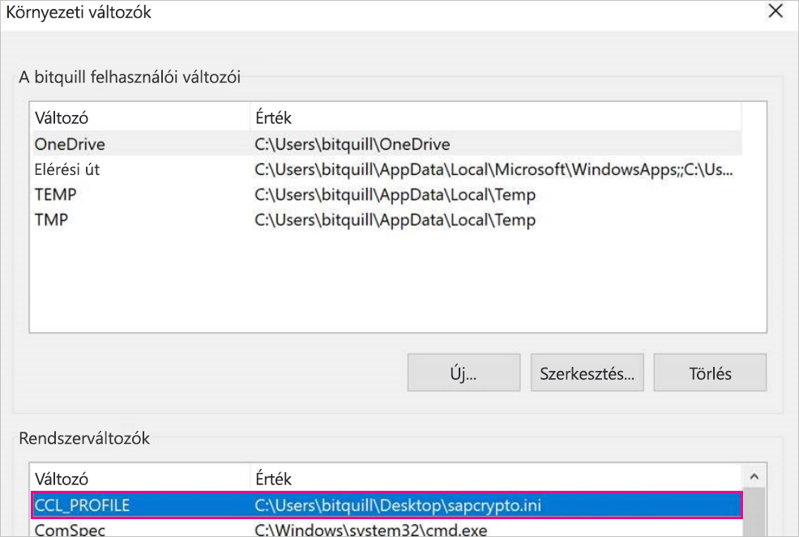
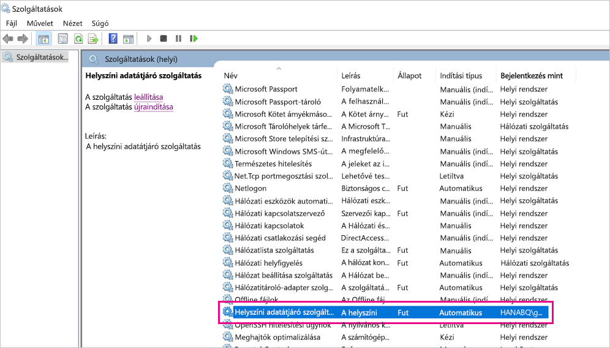
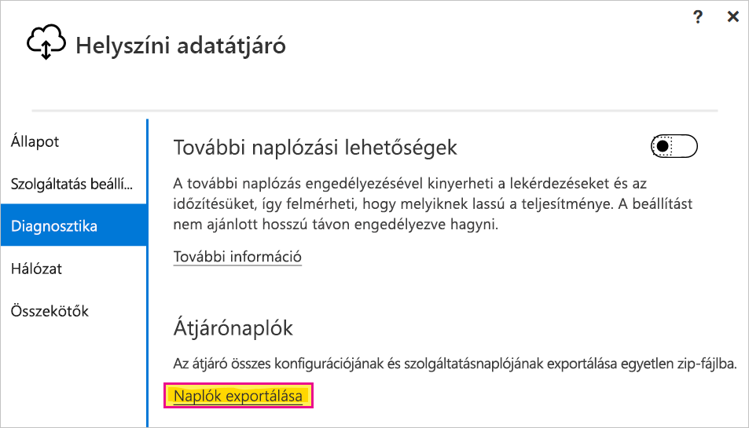
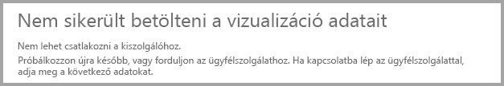
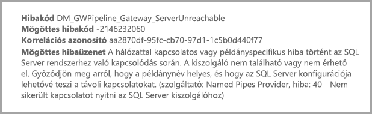

# <a name="use-kerberos-for-single-sign-on-sso-from-power-bi-to-on-premises-data-sources"></a>A Kerberos használata a Power BI-ból a helyszíni adatforrásokba történő egyszeri bejelentkezéshez (SSO)

Használja a [Kerberos által korlátozott delegálást](/windows-server/security/kerberos/kerberos-constrained-delegation-overview) a közvetlen egyszeri bejelentkezéses (SSO-) kapcsolat engedélyezéséhez. Az SSO engedélyezése egyszerűvé teszi a Power BI-jelentések és -irányítópultok számára az adatok helyszíni forrásokból történő frissítését.

## <a name="supported-data-sources"></a>Támogatott adatforrások

Jelenleg az alábbi adatforrások használatát támogatjuk:

* SQL Server
* SAP HANA
* SAP BW
* Teradata
* Spark
* Impala

Továbbá támogatjuk a [Security Assertion Markup Language (SAML)](service-gateway-sso-saml.md) protokollt használó SAP HANA rendszert is.

### <a name="sap-hana"></a>SAP HANA

Az egyszeri bejelentkezés SAP HANA rendszerrel való engedélyezéséhez először kövesse az alábbi lépéseket:

* Ellenőrizze, hogy az SAP HANA-kiszolgáló a minimálisan megkövetelt verzióval fut-e, ami az SAP HANA-kiszolgáló platformjának szintéjtől függ:
  * [HANA 2 SPS 01 Rev 012.03](https://launchpad.support.sap.com/#/notes/2557386)
  * [HANA 2 SPS 02 Rev 22](https://launchpad.support.sap.com/#/notes/2547324)
  * [HANA 1 SP 12 Rev 122.13](https://launchpad.support.sap.com/#/notes/2528439)
* Az átjárót tartalmazó számítógépen telepítse az SAP legfrissebb HANA ODBC-illesztőjét.  A minimális verzió a HANA ODBC 2017. augusztusi, 2.00.020.00-s verziója.

További információt az SAP HANA egyszeri bejelentkezésének a Kerberosszal történő beállításáról az SAP HANA biztonsági útmutatójának [Egyszeri bejelentkezés a Kerberosszal](https://help.sap.com/viewer/b3ee5778bc2e4a089d3299b82ec762a7/2.0.03/1885fad82df943c2a1974f5da0eed66d.html) című szakaszában találhat. Emellett a lap hivatkozásait is megtekintheti, amelyek közül az SAP Note 1837331 – HOWTO HANA DBSSO Kerberos/Active Directory különösen hasznos lehet.

## <a name="prepare-for-kerberos-constrained-delegation"></a>A Kerberos által korlátozott delegálás előkészítése

Számos elemet kell konfigurálni ahhoz, hogy a Kerberos által korlátozott delegálás megfelelően működjön, beleértve a *szolgáltatás egyszerű szolgáltatásneveit* (SPN) és a delegálási beállításokat a szolgáltatásfiókokhoz.

### <a name="prerequisite-1-install-and-configure-the-microsoft-on-premises-data-gateway"></a>1\. előfeltétel: A Microsoft helyszíni adatátjáró telepítése és konfigurálása

A helyszíni adatátjáró ezen kiadása támogatja a helyben történő frissítést, valamint a meglévő átjárók beállításainak átvételét.

### <a name="prerequisite-2-run-the-gateway-windows-service-as-a-domain-account"></a>2\. előfeltétel: Az átjáró Windows-szolgáltatásának futtatása tartományi fiókként

A standard telepítés során az átjáró a gép helyi szolgáltatásfiókjával fut (ebben az esetben: *NT Service\PBIEgwService*).


A Kerberos által korlátozott delegálás engedélyezéséhez az átjárót tartományi fiókkal kell futtatni, ha az Azure Active Directory (Azure AD) példánya még nincs szinkronizálva a helyi Active Directoryval (az Azure AD DirSync/Connect használatával). Ha szeretne tartományi fiókra váltani, lásd: [Az átjárószolgáltatás-fiók módosítása](/data-integration/gateway/service-gateway-service-account).

> [!NOTE]
> Ha az Azure AD Connect konfigurálva van, és a felhasználói fiókok szinkronizálva vannak, az átjárószolgáltatásnak nem kell helyi Azure AD-kereséseket végrehajtania futásidőben. Az átjárószolgáltatáshoz használhatja a helyi szolgáltatási SID-t (azaz nincs szükség tartományi fiókra). A Kerberos által korlátozott delegálás a cikkben ismertetett konfigurációs lépései ugyanezek, mint ez a konfiguráció. Csak a tartományi fiók helyett az átjáró számítógép-objektumára kell alkalmazni az Azure AD-ben.

### <a name="prerequisite-3-have-domain-admin-rights-to-configure-spns-setspn-and-kerberos-constrained-delegation-settings"></a>3\. előfeltétel: Tartományi rendszergazdai jogosultsággal kell rendelkezni az SPN-ek (SetSPN) és a Kerberos által korlátozott delegálási beállítások konfigurálásához

Nem ajánlott, hogy egy tartományi rendszergazda ideiglenesen vagy véglegesen jogosultságot adjon valaki másnak az egyszerű szolgáltatásnevek és a Kerberos-delegálás konfigurálására anélkül, hogy rendszergazdai jogosultságot követelne meg. A következő szakaszban részletezzük az ajánlott konfigurációs lépéseket.

## <a name="configure-kerberos-constrained-delegation-for-the-gateway-and-data-source"></a>A Kerberos által korlátozott delegálás konfigurálása az átjáróhoz és az adatforráshoz

Tartományi rendszergazdaként konfiguráljon egy SPN-t az átjárószolgáltatás tartományfiókjához, majd konfigurálja a delegálási beállításokat az átjárószolgáltatás tartományfiókján.

### <a name="configure-an-spn-for-the-gateway-service-account"></a>Az átjáró szolgáltatásfiókjához tartozó egyszerű szolgáltatásnév konfigurálása

Először állapítsa meg, hogy létre lett-e már hozva egyszerű szolgáltatásnév az átjáró szolgáltatásfiókjaként használt tartományi fiókhoz:

1. Tartományi rendszergazdaként nyissa meg az **Active Directory – felhasználók és számítógépek** területet.

2. Kattintson a jobb gombbal a tartományra, válassza a **Keresés** lehetőséget, és írja be az átjáró szolgáltatásfiókjának nevét.

3. A keresési eredményekben kattintson a jobb gombbal az átjáró szolgáltatásfiókjára, majd válassza a **Tulajdonságok** lehetőséget.

4. Ha a **Delegálás** lap megjelenik a **Tulajdonságok** párbeszédpanelen, már létrejött egy SPN. Lépjen tovább a delegálási beállítások konfigurálására.

    Ha nincs **Delegálás** lap a **Tulajdonságok** párbeszédpanelen, manuálisan létrehozhat egy egyszerű szolgáltatásnevet a fiókban. Ezzel hozzáadja a **Delegálás** lapot. Használja a [setspn eszközt](https://technet.microsoft.com/library/cc731241.aspx), amely a Windows rendszer része (tartományi rendszergazdai jogosultságokra van szükség az egyszerű szolgáltatásnév létrehozásához).

    Például tegyük fel, hogy az átjáró szolgáltatásfiókja „PBIEgwTest\GatewaySvc”, és az átjáró szolgáltatást futtató számítógép neve **Machine1**. Ebben a példában az adott számítógépen az átjáró-szolgáltatásfiók egyszerű szolgáltatásnevének beállításához a következő parancsot futtassa:

    

    Miután végzett ezzel a lépéssel, továbbléphet a delegálási beállítások konfigurálására.

### <a name="configure-delegation-settings-on-the-gateway-service-account"></a>Delegálási beállítások konfigurálása az átjáró szolgáltatásfiókon

A második konfigurációs követelmény a delegálási beállítások konfigurálása az átjáró-szolgáltatásfiókon. Számos eszköz áll rendelkezésre a lépések végrehajtásához. Itt az Active Directory – felhasználók és számítógépek modult használjuk, a Microsoft Management Console (MMC) beépülő modulját, amellyel felügyelheti és közzéteheti az információkat a címtárban. A modul alapértelmezés szerint elérhető a tartományvezérlőkön. Más gépeken a Windows-szolgáltatás konfigurációján keresztül is engedélyezheti.

A Kerberos által korlátozott delegálást protokollváltással kell konfigurálni. Korlátozott delegálás esetén explicit módon kell meghatároznia, hogy melyik szolgáltatásokhoz szeretne delegálni. Például csak az SQL Server vagy az SAP HANA-kiszolgáló fogad delegálási hívást az átjáró szolgáltatásfiókjától.

Ez a szakasz azt feltételezi, hogy már konfigurálta az egyszerű szolgáltatásneveket az alapul szolgáló adatforrásokhoz (például SQL Server, SAP HANA, Teradata és Spark.). Az adatforrás-kiszolgálók egyszerű szolgáltatásneveinek konfigurálásával az adott adatbázis-kiszolgáló műszaki dokumentációjában ismerkedhet meg. Érdemes elolvasni az [Ellenőrző lista a Kerberoshoz](https://techcommunity.microsoft.com/t5/SQL-Server-Support/My-Kerberos-Checklist-8230/ba-p/316160) című blogbejegyzés *Milyen SPN-re van szükség az alkalmazáshoz?* részét.

A következő lépésekben egy helyszíni környezetet feltételezünk két géppel: egy átjárót tartalmazó géppel és egy SQL Servert futtató adatbázis-kiszolgálóval. A példa kedvéért a következő beállításokat és neveket is feltételezzük:

* Átjáró gépneve: **PBIEgwTestGW**
* Átjárószolgáltatás-fiók: **PBIEgwTest\GatewaySvc** (fiók megjelenítendő neve: Gateway Connector)
* SQL Server adatforrás gépneve: **PBIEgwTestSQL**
* SQL Server adatforrás szolgáltatásfiókja: **PBIEgwTest\SQLService**

A delegálási beállítások konfigurálása:

1. Tartományi rendszergazdai jogosultsággal nyissa meg az **Active Directory – felhasználók és számítógépek** modult.

2. Kattintson a jobb gombbal az átjáró-szolgáltatásfiókra (**PBIEgwTest\GatewaySvc**), majd válassza a **Tulajdonságok** lehetőséget.

3. Válassza a **Delegálás** lapot.

4. Válassza **A számítógépen csak a megadott szolgáltatások delegálhatók** > **Bármely hitelesítési protokoll használatával** elemet.

5. **A fiók az alábbi szolgáltatásokhoz használhat delegált hitelesítő adatokat** szakaszban kattintson a **Hozzáadás** elemre.

6. Az új párbeszédpanelen válassza a **Felhasználók vagy számítógépek** elemet.

7. Adja meg az adatforrás szolgáltatásfiókját, például az SQL Server-adatforrások a következőhöz hasonló szolgáltatásfiókot használnak: **PBIEgwTest\SQLService**. Miután hozzáadta a fiókot, kattintson az **OK** gombra.

8. Válassza ki azt az egyszerű szolgáltatásnevet, amelyet létrehozott az adatbázis-kiszolgálóhoz. A példánkban az egyszerű szolgáltatásnév az **MSSQLSvc** kifejezéssel kezdődik. Ha megadta az adatbázis-szolgáltatás teljes tartománynevét és a NetBIOS egyszerű szolgáltatásnevét is, válassza ki mindkettőt. Lehet, hogy csak az egyiket látja.

9. Kattintson az **OK** gombra. Ekkor az SPN-nek meg kell jelennie a listában.

    Ha szeretné, kiválaszthatja a **Kibontva** lehetőséget, hogy a teljes tartománynév és a NetBIOS egyszerű szolgáltatásnév is megjelenjen. A párbeszédpanel az alábbihoz hasonlít, ha bejelölte a **Kibontva** lehetőséget. Kattintson az **OK** gombra.

    

Végül az átjárószolgáltatást futtató gépen (a példánkban **PBIEgwTestGW**) az átjárószolgáltatás-fióknak meg kell adnia az **Ügyfél megszemélyesítése hitelesítés után** helyi szabályzatot és **Az operációs rendszer részeként való működés (SeTcbPrivilege)** jogosultságot. Ezt a konfigurációt a Helyi csoportszabályzat-szerkesztőben hajthatja végre és ellenőrizheti (**gpedit**).

1. Az átjárót tartalmazó számítógépen futtassa a következőt: *gpedit.msc*.

1. Navigáljon a **Helyi számítógép-szabályzat** > **Számítógép konfigurációja** > **A Windows beállításai** > **Biztonsági beállítások** > **Helyi szabályzatok** > **Felhasználói jogok kiosztása** elemhez.

    

1. A **Felhasználói jogok kiosztása** lehetőségnél a szabályzatok listájából válassza ki az **Ügyfél megszemélyesítése hitelesítés után** elemet.

    

    Kattintson a jobb gombbal, és nyissa meg a **Tulajdonságok** elemet. Ellenőrizze a fiókok listáját. A listának tartalmaznia kell az átjáró-szolgáltatásfiókot (**PBIEgwTest\GatewaySvc**).

1. A **Felhasználói jogok kiosztása** lehetőségnél a szabályzatok listájából válassza ki **Az operációs rendszer részeként való működés (SeTcbPrivilege)** elemet. Győződjön meg róla, hogy az átjáró-szolgáltatásfiók a fiókok listájában is szerepel.

1. Indítsa újra a **helyszíni adatátjáró** szolgáltatás folyamatát.

Az SAP HANA használata esetén javasoljuk, hogy kövesse az alábbi lépéseket, amelyek egy kis teljesítménynövekedést eredményezhetnek.

1. Az átjáró telepítési könyvtárában keresse meg, majd nyissa meg ezt a konfigurációs fájlt: *Microsoft.PowerBI.DataMovement.Pipeline.GatewayCore.dll.config*.

1. Keresse meg a *FullDomainResolutionEnabled* tulajdonságot, és módosítsa *True* értékre.

    ```xml
    <setting name=" FullDomainResolutionEnabled " serializeAs="String">
          <value>True</value>
    </setting>
    ```

## <a name="run-a-power-bi-report"></a>Power BI-jelentés futtatása

A konfigurációs lépések elvégzése után konfigurálja az adatforrást a Power BI-ban az **Átjáró kezelése** lapon. Ezután az itt található **Speciális beállítások** területen engedélyezze az egyszeri bejelentkezést, majd tegye közzé az adatforráshoz kötött jelentéseket és adathalmazokat.


Ez a konfiguráció a legtöbb esetben működik. A Kerberos esetében azonban más konfigurációkra lehet szükség a környezettől függően. Ha a jelentés továbbra sem töltődik be, forduljon a tartományi rendszergazdájához a probléma részletesebb kivizsgálásához.

## <a name="configure-sap-bw-for-sso-using-commoncryptolib"></a>Az SAP BW konfigurálása egyszeri bejelentkezéshez a CommonCryptoLib használatával

Most, hogy megismerkedett a Kerberos átjáróval történő működésével, konfigurálhat egy egyszeri bejelentkezést az SAP Business Warehouse (SAP BW) szolgáltatáshoz. Az alábbi lépések azt feltételezik, hogy már [előkészült a Kerberos által korlátozott delegáláshoz](#prepare-for-kerberos-constrained-delegation) a cikkben korábban leírtak szerint.

> [!NOTE]
> Ezek az utasítások az SAP BW **Alkalmazáskiszolgáló** egyszeri bejelentkezéses telepítését ismertetik. A Microsoft jelenleg nem támogatja az SSO-kapcsolatokat az SAP BW **Üzenetkezelő** kiszolgálóihoz.

1. Ellenőrizze, hogy a BW-kiszolgáló megfelelően van-e konfigurálva a Kerberos egyszeri bejelentkezéshez. Ha igen, akkor használhatja az egyszeri bejelentkezést a BW-kiszolgáló eléréséhez egy SAP-eszköz, például az SAP GUI használatával. A telepítés lépéseivel kapcsolatos további információkért lásd: [SAP egyszeri bejelentkezés: Hitelesítés Kerberos/SPNEGO használatával](https://blogs.sap.com/2017/07/27/sap-single-sign-on-authenticate-with-kerberosspnego/). A BW-kiszolgálónak a CommonCryptoLib-et kell használnia a SNC-kódtárként, és rendelkeznie kell egy „CN =” résszel (például: „CN = BW1”) kezdődő SNC-névvel. Az SNC-nevekre vonatkozó követelményekkel kapcsolatos további információkért lásd: [SNC-paraméterek Kerberos-konfigurációhoz](https://help.sap.com/viewer/df185fd53bb645b1bd99284ee4e4a750/3.0/en-US/360534094511490d91b9589d20abb49a.html) (az SNC/Identity/as paraméter).

1. Ha még nem tette meg, végezze el a [Felkészülés a Kerberos által korlátozott delegálásra](https://docs.microsoft.com/power-bi/service-gateway-sso-kerberos#prepare-for-kerberos-constrained-delegation) című témakörben ismertetett lépéseket. Ügyeljen rá, hogy az átjáró Szolgáltatás felhasználója úgy legyen konfigurálva, hogy delegált hitelesítő adatokat nyújtson a Active Directory-környezetben a BW-alkalmazáskiszolgálót képviselő Szolgáltatás felhasználójának.

1. Ha még nem tette meg, telepítse az [SAP .NET-összekötő](https://support.sap.com/en/product/connectors/msnet.html) x64-es verzióját azon a számítógépen, amelyen az átjáró telepítve van. Azt, hogy az összetevő telepítve van-e, úgy ellenőrizheti, ha a BW-kiszolgálóhoz megpróbál kapcsolódni a Power BI Desktopban. Ha nem tud kapcsolatot létesíteni a 2.0-ás implementációval, a .NET-összekötő nincs telepítve.

1. Ügyeljen rá, hogy az SAP biztonságos bejelentkezési ügyfél (SLC) ne fusson azon a számítógépen, amelyen az átjáró telepítve van. Az SLC olyan módon gyorsítótárazza a Kerberos-jegyeket, amely zavarhatja az átjárók számára a Kerberos használatát az egyszeri bejelentkezéshez. Ha az SLC telepítve van, távolítsa el, vagy lépjen ki az SAP biztonságos bejelentkezési ügyfélből: kattintson a jobb gombbal a tálcán található ikonra, és válassza a Kijelentkezés és Kilépés lehetőséget, mielőtt az átjáróval egyszeri bejelentkezést használna. Az SLC nem támogatott a Windows Server rendszerű gépeken. További információt az [SAP 2780475 megjegyzés](https://launchpad.support.sap.com/#/notes/2780475) című cikkben talál (s-felhasználó szükséges hozzá).

    

    Ha eltávolítja az SLC-t, vagy ha a **Kijelentkezés** és **Kilépés** lehetőséget választotta, nyisson meg egy parancsablakot, és a `klist purge` paranccsal törölje a gyorsítótárazott Kerberos-jegyeket, mielőtt az átjárón keresztül egyszeri bejelentkezést használna.

1. Töltse le a CommonCryptoLib (sapcrypto.dll) **8.5.25 vagy újabb** verzióját az SAP Launchpadből, és másolja azt az átjárót tartalmazó számítógép egyik mappájába. Ugyanabban a könyvtárban, ahová a sapcrypto.dll fájlt másolta, hozzon létre egy sapcrypto.ini nevű fájlt a következő tartalommal:

    ```
    ccl/snc/enable\_kerberos\_in\_client\_role = 1
    ```

    Az .ini fájl tartalmazza a CommonCryptoLib által az SSO engedélyezéséhez szükséges konfigurációs adatokat az átjárót használó forgatókönyvekben.

    > [!NOTE]
    > Ezeket a fájlokat ugyanazon a helyen kell tárolni; más szóval a _/Path/to/sapcrypto/_ könyvtárnak tartalmaznia kell a sapcrypto.ini és a sapcrypto.dll fájlt is.

    Mind az átjáró-szolgáltatás felhasználójának, mind pedig a Szolgáltatás felhasználó által megszemélyesített Active Directory- (AD-) felhasználónak rendelkeznie kell olvasási és végrehajtási engedélyekkel mindkét fájlhoz. Javasoljuk, hogy az .ini és a .dll kiterjesztésű fájlokra vonatkozó engedélyeket adja meg a Hitelesített felhasználók csoport számára. Tesztelési célból ezeket az engedélyeket explicit módon megadhatja az átjáró Szolgáltatás felhasználója és a megszemélyesített felhasználó számára is. Az alábbi képernyőképen a Hitelesített felhasználók csoport számára **olvasási &amp; végrehajtási** engedélyeket adtuk meg a sapcrypto.dll fájlhoz:

    

1. Ha nem rendelkezik SAP Business Warehouse-kiszolgáló adatforrással, a Power BI szolgáltatás **Átjárók kezelése** lapján adjon hozzá egy adatforrást. Ha már rendelkezik olyan BW-adatforrással, amely ahhoz az átjáróhoz van társítva, amelyen az SSO-csatlakozást szeretné használni, készítse elő szerkesztésre.

    Az **SNC-kódtár** esetében válassza vagy az **SNC\_LIB vagy az SNC\_LIB\_64 környezeti változót** vagy az **Egyéni** lehetőséget. Ha az **SNC\_LIB** beállítást választja, akkor az átjárógépen az SNC\_LIB\_64 környezeti változó értékét a sapcrypto.dll fájlnak az átjárógépen található példányára mutató abszolút elérési útra kell beállítania, ami lehet például: C:\Users\Test\Desktop\sapcrypto.dll. Ha az **Egyéni** lehetőséget választja, illessze be a sapcrypto.dll fájl abszolút elérési útját az egyéni SNC-kódtár elérési útja mezőbe, amely az **Átjárók kezelése** oldalon jelenik meg.

    A **Speciális beállítások** területen jelölje be az **Egyszeri bejelentkezés használata Kerberosszal DirectQuery-lekérdezéseknél** jelölőnégyzetet. A megadott felhasználónévnek csak a BW-kiszolgálóhoz való kapcsolódáshoz kell engedéllyel rendelkeznie, és elsősorban arra szolgál, hogy az adatforrás-kapcsolatot a létrehozása után tesztelni tudja. A felhasználó az importálási alapú adatkészletből létrehozott jelentések frissítéséhez is használható, ha van ilyen. Ha **Alapszintű** hitelesítést választ, meg kell adnia egy BW-felhasználót. Ha a **Windows**-hitelesítés lehetőséget választja, meg kell adnia egy olyan Windows Active Directory felhasználót, aki a BW-felhasználóhoz van hozzárendelve az SAP grafikus felhasználói felületén lévő SU01 tranzakción keresztül. A többi mezőnek (**Rendszer száma **,** Ügyfél-azonosító **,** SNC-partner neve** stb.) meg kell egyeznie azzal az információval, amelyet a Power BI Desktopban adna meg ahhoz, hogy a BW kiszolgálóhoz egyszeri bejelentkezéssel csatlakozzon. Válassza az **Alkalmaz** lehetőséget, és tesztelje a kapcsolatot.

    

1. Hozzon létre egy CCL\_PROFILE rendszerkörnyezeti változót, amely a sapcrypto.ini fájlra mutat:

    

    Ne feledje, hogy a sapcrypto .dll és .ini kiterjesztésű fájloknak ugyanazon a helyen kell lenniük. A fenti példában az sapcrypto.ini az asztalon található, ezért a sapcrypto.dll fájlt is az asztalon kell elhelyezni.

1. Indítsa újra az átjárószolgáltatást:

    

1. Tegyen közzé egy **DirectQuery-alapú** BW-jelentést a Power BI Desktopból. Ennek a jelentésnek azokat az adatokat kell használnia, amelyek elérhetőek annak a BW-felhasználónak a számára, aki ahhoz az Azure Active Directory- (AAD-) felhasználóhoz van rendelve, amelyik bejelentkezik a Power BI szolgáltatásba. A frissítés működése miatt az importálás helyett a DirectQueryt kell használnia. Importálási alapú jelentések frissítésekor az átjáró azokat a hitelesítő adatokat használja, amelyet a BW-adatforrás létrehozásakor a **Felhasználónév** és **Jelszó** mezőkbe beírt. Más szóval a Kerberos SSO **nincs** használatban. A közzétételkor ügyeljen arra, hogy azt az átjárót válassza ki, amelyet a BW egyszeri bejelentkezéshez konfigurált, ha több átjáróval rendelkezik. A Power BI szolgáltatásban most már frissítheti a jelentést, és létrehozhat új jelentést is a közzétett adatkészlet alapján.

### <a name="troubleshooting"></a>Hibaelhárítás

Ha nem tudja frissíteni a jelentést a Power BI szolgáltatásban, a probléma diagnosztizálásához használhatja az átjáró nyomkövetését, a CPIC-nyomkövetést és a CommonCryptoLib-nyomkövetést is. A CPIC-nyomkövetés és a CommonCryptoLib SAP-termékek, így a Microsoft nem tud közvetlen támogatást biztosítani hozzájuk. Azon Active Directory felhasználók számára, akik SSO-hozzáférést kapnak a BW-hez, egyes Active Directory konfigurációknál előfordulhat, hogy a felhasználóknak a rendszergazdák csoport tagjainak kell lenniük azon a gépen, amelyen az átjáró telepítve van.

1. **Átjárónaplók:** Reprodukálja a problémát, nyissa meg az [átjáró alkalmazást](https://docs.microsoft.com/data-integration/gateway/service-gateway-app), lépjen a **Diagnosztika** lapra, és válassza a **Naplók exportálása** lehetőséget:

    

1. **CPIC-nyomkövetés:** A CPIC-nyomkövetés engedélyezéséhez állítsa be a következő két környezeti változót: CPIC\_TRACE és CPIC\_TRACE\_DIR. Az első változó beállítja a nyomkövetési szintet, a második változó pedig beállítja a nyomkövetési fájl könyvtárát. A címtárnak olyan helyen kell lennie, amelyet a Hitelesített felhasználók csoport tagjai írhatnak. A CPIC\_TRACE értékét állítsa 3-ra, a CPIC\_TRACE\_DIR értékét pedig arra a könyvtárra, amelybe a nyomkövetési fájlokat szeretné írni.

    

    Reprodukálja a problémát, és ellenőrizze, hogy a CPIC\_TRACE\_DIR tartalmaz-e nyomkövetési fájlokat.

1. **CommonCryptoLib-nyomkövetés:** Kapcsolja be a CommonCryptoLib-nyomkövetést úgy, hogy két sort ad hozzá a korábban létrehozott sapcrypto.ini fájlhoz:

    ```
    ccl/trace/level=5
    ccl/trace/directory=\\<drive\\>:\logs\sectrace
    ```

    Fontos, hogy a _ccl/trace/directory_ beállítást olyan hely megadásával módosítsa, amelyre a Hitelesített felhasználók csoport tagjai írni tudnak. Másik lehetőségként létrehozhat egy új .ini fájlt a viselkedés módosításához. Az sapcrypto.ini és az sapcrypto.dll fájlok könyvtárában hozzon létre egy sectrace.ini nevű fájlt az alábbi tartalommal.  Cserélje le a DIRECTORY beállítást a számítógépének egy olyan helyére, amelyet a Hitelesített felhasználó írni tud:

    ```
    LEVEL = 5
    
    DIRECTORY = \\<drive\\>:\logs\sectrace
    ```

    Most reprodukálja a problémát, és ellenőrizze, hogy a DIRECTORY beállításban megadott hely tartalmaz-e nyomkövetési fájlokat. Ha elkészült, kapcsolja ki a CPIC- és a CCL-nyomkövetést.

    A CommonCryptoLib-nyomkövetésről az [SAP 2491573 megjegyzésben](https://launchpad.support.sap.com/#/notes/2491573) talál további információt (s-felhasználó szükséges).

## <a name="configure-sap-bw-for-sso-using-gsskrb5gx64krb5"></a>Az SAP BW konfigurálása egyszeri bejelentkezéshez gsskrb5/gx64krb5 használatával

Ha nem tudja használni a CommonCryptoLib-et SNC-kódtárként, használja helyette a gsskrb5/gx64krb5-öt. A telepítési lépések azonban lényegesen összetettebbek, és az SAP már nem nyújt támogatást az gsskrb5-höz.

Ez az útmutató próbál olyan átfogó lennie, amennyire csak lehetséges. Ha már végrehajtott ezek közül néhány lépést, azokat kihagyhatja. Például már létrehozhatott egy szolgáltatásfelhasználót az SAP BW-kiszolgálóhoz, és leképezhette rá az egyszerű szolgáltatásnevet, vagy már telepíthette a `gsskrb5` kódtárat.

### <a name="set-up-gsskrb5gx64krb5-on-client-machines-and-the-sap-bw-server"></a>A gsskrb5/gx64krb5 telepítése az ügyfélgépekre és az SAP BW-kiszolgálóra

> [!NOTE]
> A `gsskrb5/gx64krb5` kódtárat már nem támogatja az SAP. További információt az [SAP 352295 megjegyzés](https://launchpad.support.sap.com/#/notes/352295) című cikkben talál. Vegye figyelembe azt is, hogy a `gsskrb5/gx64krb5` nem teszi lehetővé az adatátjáróból az SAP BW üzenetkiszolgálóba irányuló SSO-kapcsolatokat. Csak az SAP BW-alkalmazáskiszolgálóba irányuló kapcsolatok lehetségesek. Mostantól a sapcrypto/CommonCryptoLib is használható SNC-kódtárként, ami leegyszerűsíti a telepítés folyamatát. 

A `gsskrb5`-öt az ügyfélnek és a kiszolgálónak is használnia kell az SSO-kapcsolat átjárón keresztüli létrehozásához.

1. A kívánt bitszámtól függően töltse le a `gsskrb5` vagy a `gx64krb5` elemet a [SAP Note 2115486](https://launchpad.support.sap.com/) oldalról (ehhez szükséges egy SAP S-felhasználó). Legalább az 1.0.11.x verzióval kell rendelkeznie.

1. Helyezze a kódtárat egy olyan helyre az átjárót tartalmazó számítógépen, amely hozzáférhető átjárópéldánya számára (és az SAP GUI számára is, ha szeretné tesztelni az egyszeri bejelentkezési kapcsolatot az SAP Logon használatával).

1. Helyezzen egy másik másolatot az SAP BW-kiszolgálógépre egy, az SAP BW-kiszolgáló által hozzáférhető helyre.

1. Az ügyfélgépen és a kiszolgálógépen állítsa be az `SNC_LIB` és az `SNC_LIB_64` környezeti változókat úgy, hogy azok a gsskrb5.dll vagy a gx64krb5.dll helyeire mutassanak. Ne feledje, hogy csak az egyik kódtárra van szükség, nem mindkettőre.

### <a name="create-a-sap-bw-service-user-and-enable-snc-communication"></a>BW-szolgáltatásfelhasználó létrehozása és SNC-kommunikáció engedélyezése

A már elvégzett átjárókonfiguráción kívül még el kell végeznie néhány SAP BW-specifikus lépést. A dokumentáció [Delegálási beállítások konfigurálása az átjáró szolgáltatásfiókján](#configure-delegation-settings-on-the-gateway-service-account) szakasza azt feltételezi, hogy már konfigurálta az egyszerű szolgáltatásneveket az alapul szolgáló adatforrásokhoz. Az SAP BW konfigurációjának befejezéséhez:

1. Hozzon létre egy szolgáltatásfelhasználót (először csak egy egyszerű Active Directory-felhasználót) egy Active Directory-tartományvezérlő kiszolgálón az SAP BW-alkalmazáskiszolgáló számára az Active Directory-környezetben. Ezután rendeljen hozzá egy egyszerű szolgáltatásnevet.

    Az SAP ajánlása szerint az egyszerű szolgáltatásnévnek `SAP/` kezdetűnek kell lennie, de valószínűleg más előtagok is használhatók, például `HTTP/`. Az egyszerű szolgáltatásnév `SAP/` utáni része már szabadon választható; használhatja például az SAP BW-kiszolgáló szolgáltatásfelhasználójának felhasználónevét. Ha például a `BWServiceUser@\<DOMAIN\>` szolgáltatásfelhasználót hozza létre, egyszerű szolgáltatásnévként használhatja a `SAP/BWServiceUser` nevet. Az egyszerű szolgáltatásnév leképezésének egyik módja a setspn parancs. Például az előbb létrehozott szolgáltatásfelhasználó egyszerű szolgáltatásnevének beállításához futtassa a következő parancsot egy parancsablakban a tartományvezérlő gépen: `setspn -s SAP/ BWServiceUser DOMAIN\ BWServiceUser`. További információt az SAP BW dokumentációjában talál.

1. Biztosítson hozzáférést a szolgáltatásfelhasználónak az SAP BW-alkalmazáskiszolgálóhoz:

    1. Az SAP BW kiszolgálógépén adja hozzá a szolgáltatásfelhasználót az SAP BW-kiszolgáló Helyi rendszergazdák csoportjához. Nyissa meg a Számítógép-felügyelet programot, és kattintson duplán a kiszolgálójához tartozó Helyi rendszergazdák csoport elemre.

        

    1. Kattintson duplán a Helyi rendszergazdák csoportra, majd válassza a **Hozzáadás** lehetőséget a szolgáltatásfelhasználó a csoporthoz történő hozzáadásához. A **Névellenőrzés** lehetőség használatával ellenőrizze, hogy helyesen írta-e be a nevet. Kattintson az **OK** gombra.

1. Állítsa be az SAP BW-kiszolgáló szolgáltatásfelhasználóját azon felhasználóként, amely elindítja az SAP BW-kiszolgálószolgáltatást az SAP BW-kiszolgálógépen.

    1. Nyissa meg a **Futtatás** lehetőséget, és írja be a „Services.msc” kifejezést. Keresse meg az SAP BW-alkalmazáskiszolgáló példányának megfelelő szolgáltatást. Kattintson rá a jobb gombbal, és válassza a **Tulajdonságok** elemet.

        

    1. Váltson a **Bejelentkezés** lapra, és módosítsa a felhasználót az SAP BW-szolgáltatásfelhasználójára. Adja meg a felhasználó jelszavát, és válassza az **OK** lehetőséget.

1. Jelentkezzen be a kiszolgálóba az SAP Logon programban, és állítsa be az alábbi profilparamétereket az RZ10 tranzakció használatával:

    1. Állítsa az snc/identity/as profilparamétert a p:\<a létrehozott SAP BW-szolgáltatásfelhasználóra\>, például: p:BWServiceUser@MYDOMAIN.COM. Figyelje meg a szolgáltatásfelhasználó egyszerű felhasználóneve előtt szereplő p: elemet. Ez nem p:CN=, mintha a közös titkosítási kódtárat használná SNC-kódtárként.

    1. Állítsa az snc/gssapi\_lib profilparamétert \<a kiszolgálógépen található gsskrb5.dll/gx64krb5.dll elérési útjára (a használandó kódtár az operációs rendszer bitszámától függ)\>. Ne feledje a kódtárat egy olyan helyre helyezni, amelyhez az SAP BW-alkalmazáskiszolgáló hozzá tud férni.

    1. Emellett módosítsa az alábbi profilparaméterek értékeit az igényeinek megfelelően. Vegye figyelembe, hogy az utolsó öt lehetőség lehetővé teszi, hogy az ügyfelek SNC konfigurálása nélkül csatlakozzanak z SAP BW-kiszolgálóhoz az SAP Logon használatával.

        | **Beállítás** | **Érték** |
        | --- | --- |
        | snc/data\_protection/max | 3 |
        | snc/data\_protection/min | 1 |
        | snc/data\_protection/use | 9 |
        | snc/accept\_insecure\_cpic | 1 |
        | snc/accept\_insecure\_gui | 1 |
        | snc/accept\_insecure\_r3int\_rfc | 1 |
        | snc/accept\_insecure\_rfc | 1 |
        | snc/permit\_insecure\_start | 1 |

    1. Állítsa az snc/enable tulajdonság értékét 1-re.

1. A profilparaméterek beállítása után nyissa meg az SAP Felügyeleti konzolt a kiszolgálógépen, és indítsa újra az SAP BW-példányt. Ha a kiszolgáló nem indul el, ellenőrizze, hogy a profilparamétereket megfelelően állította-e be. A profilparaméterek beállításáról további információt az [SAP dokumentációjában](https://help.sap.com/saphelp_nw70ehp1/helpdata/en/e6/56f466e99a11d1a5b00000e835363f/frameset.htm) talál. Ha problémába ütközik, tekintse át a szakasz később részletezett, hibaelhárítással kapcsolatos információit.

### <a name="map-a-sap-bw-user-to-an-active-directory-user"></a>SAP BW-felhasználó leképezése egy Active Directory-felhasználóra

Képezzen le egy Active Directory-felhasználót egy SAP BW-alkalmazáskiszolgáló-felhasználóra, és tesztelje az egyszeri bejelentkezési kapcsolatot az SAP Logon programban.

1. Jelentkezzen be az SAP BW-kiszolgálóba az SAP Logon használatával. Futtassa az SU01 tranzakciót.

1. A **Felhasználó** mezőben adja meg az SAP BW-felhasználót, amely számára engedélyezni szeretné az egyszeri bejelentkezési kapcsolatot (az előző képernyőképen a BIUSER nevű felhasználó számára állítunk be engedélyeket). Válassza a **Szerkesztés** ikont (amely egy tollat ábrázol) az SAP Logon-ablak bal felső részében.

    

1. Válassza az **SNC** lapot. Az SNC-név beviteli mezőjében adja meg a p:\<Active Directory-felhasználó\>@\<tartománynév\> sztringet. Vegye figyelembe, hogy a kötelező p: elemnek meg kell előznie az Active Directory-felhasználó egyszerű felhasználónevét. A megadott Active Directory-felhasználónak ahhoz a személyhez vagy szervezethez kell tartoznia, amely számára engedélyezni szeretné az egyszeri bejelentkezési hozzáférést az SAP BW-alkalmazáskiszolgálójához. Ha például a testuser\@TESTDOMAIN.COM felhasználó számára szeretné engedélyezni az egyszeri bejelentkezési hozzáférést, adja meg a p:testuser@TESTDOMAIN.COM sztringet.

    

1. Válassza a **Mentés** ikont (amely egy hajlékonylemezt ábrázol) a képernyő bal felső sarkában.

### <a name="test-sign-in-by-using-sso"></a>Egyszeri bejelentkezés (SSO) használatával való bejelentkezés tesztelése

Győződjön meg arról, hogy be tud jelentkezni a kiszolgálóra. Használja az SAP Logont egyszeri bejelentkezéssel azon Active Directory-felhasználóként, amely számára az előbb engedélyezte az egyszeri bejelentkezési hozzáférést.

1. Azon Active Directory-felhasználóként, amely számára az előbb engedélyezte az egyszeri bejelentkezési hozzáférést, jelentkezzen be egy gépre, amelyen telepítve van az SAP Logon. Indítsa el az SAP Logont, és hozzon létre egy új kapcsolatot.

1. Az **Új rendszerbejegyzés létrehozása** képernyőn válassza a **Felhasználó által meghatározott rendszer** > **Tovább** lehetőséget.

    

1. A következő képernyőn adja meg a megfelelő részleteket az alkalmazáskiszolgálóval, a példányszámmal és a rendszer-azonosítóval együtt. Ezután válassza a **Befejezés** gombot.

1. Kattintson a jobb gombbal az új kapcsolatra, majd válassza a **Tulajdonságok** elemet. Válassza a **Hálózat** lapot. Az **SNC-név** ablakban adja meg a p:\<az SAP BW-szolgáltatásfelhasználó egyszerű felhasználóneve\> sztringet, például: p:BWServiceUser@MYDOMAIN.COM. Ezután válassza az **OK** gombot.

    

1. Kattintson duplán az előbb létrehozott kapcsolatra, hogy megkísérelje az egyszeri bejelentkezést az SAP BW-kiszolgálóra. Ha ez a kapcsolat sikeres, folytassa a következő lépéssel. Ellenkező esetben tekintse át a dokumentum korábbi lépéseit, hogy meggyőződjön arról, hogy azok megfelelően lettek elvégezve, vagy tekintse át az alábbi, hibaelhárítással kapcsolatos szakaszt. Ha ebben a környezetben nem tud csatlakozni az SAP BW-kiszolgálóhoz egyszeri bejelentkezéssel, akkor az átjárói környezetben sem fog tudni csatlakozni az SAP BW-kiszolgálóhoz egyszeri bejelentkezéssel.

### <a name="troubleshoot-installation-and-connections"></a>A telepítés és a kapcsolatok hibaelhárítása

Ha bármilyen problémát tapasztal, kövesse az alábbi lépéseket a gsskrb5-telepítés és az egyszeri bejelentkezési kapcsolatok SAP Logon programból történő hibaelhárításához.

* A kiszolgálónaplók (…work\dev\_w0 a kiszolgálógépen) megtekintése hasznos lehet a gsskrb5 telepítésének lépései során tapasztalt hibák elhárításában. Ez különösen igaz akkor, ha az SAP BW-kiszolgáló nem indul el a profilparaméterek módosítása után.

* Ha nem tudja elindítani az SAP BW szolgáltatást egy bejelentkezési hiba miatt, előfordulhat, hogy rossz jelszót adott meg az SAP BW indítási felhasználójának beállításakor. Ellenőrizze a jelszót úgy, hogy bejelentkezik egy Active Directory-környezetben található gépre az SAP BW-szolgáltatásfelhasználóként.

* Ha az SQL hitelesítő adatok meggátolják, hogy a kiszolgáló elinduljon, és ezért hibába ütközik, ellenőrizze, hogy biztosított-e hozzáférést a szolgáltatásfelhasználónak az SAP BW-adatbázishoz.

* Ekkor a következő üzenet jelenhet meg: „(GSS-API) specified target is unknown or unreachable.”(„(GSS-API) a megadott cél ismeretlen vagy elérhetetlen”). Ez általában azt jelenti, hogy rossz SNC-nevet adott meg. Ügyeljen arra, hogy az ügyfélalkalmazásban csak a „p:” elemet használja, ne a „p:CN=”-t vagy bármi mást, amely a szolgáltatásfelhasználó egyszerű felhasználónevétől eltér.

* Ekkor a következő üzenet jelenhet meg: „(GSS-API) An invalid name was supplied.” („(GSS-API) érvénytelen név lett megadva”). Győződjön meg arról, hogy a „p:” szerepel a kiszolgáló SNC-azonosítójának profilparaméter-értékében.

* Ekkor a következő üzenet jelenhet meg: „(SNC error) the specified module could not be found.” („(SNC-hiba) a megadott modul nem található”). Ezt általában az okozza, hogy a `gsskrb5.dll/gx64krb5.dll` olyan helyen található, amelynek hozzáféréséhez megemelt jogosultsági szint (rendszergazdai jogosultság) szükséges.

### <a name="add-registry-entries-to-the-gateway-machine"></a>Beállításjegyzékbeli bejegyzések hozzáadása az átjárót tartalmazó számítógépen

Adja hozzá a szükséges beállításjegyzék-bejegyzéseket annak a gépnek beállításjegyzékéhez, amelyre az átjáró telepítve van. A futtatandó parancsok:

1. REG ADD HKLM\SOFTWARE\Wow6432Node\SAP\gsskrb5 /v ForceIniCredOK /t REG\_DWORD /d 1 /f

1. REG ADD HKLM\SOFTWARE\SAP\gsskrb5 /v ForceIniCredOK /t REG\_DWORD /d 1 /f

### <a name="set-configuration-parameters-on-the-gateway-machine"></a>Konfigurációs paraméterek beállítása az átjárót tartalmazó számítógépen

Kétféleképpen lehet konfigurációs paramétereket megadni, attól függően, hogy konfigurálva van-e az Azure AD Connect, hogy a felhasználók Azure AD-felhasználóként jelentkezhessenek be a Power BI szolgáltatásba.

Ha konfigurálva van az Azure AD Connect, kövesse az alábbi lépéseket.

1. Nyissa meg az átjáró fő konfigurációs fájlját (`Microsoft.PowerBI.DataMovement.Pipeline.GatewayCore.dll`). A fájl alapértelmezett tárolási helye: C:\Program Files\Helyszíni adatátjáró.

1. Győződjön meg róla, hogy a **FullDomainResolutionEnabled** tulajdonság beállítása **Igaz**, és a **SapHanaSsoRemoveDomainEnabled** beállítása **Hamis**.

1. Mentse a konfigurációs fájlt.

1. A Feladatkezelő **Szolgáltatások** lapján kattintson a jobb gombbal, majd válassza az **Újraindítás** elemet.

    

Ha nincs konfigurálva az Azure AD Connect, kövesse ezeket a lépéseket minden olyan Power BI szolgáltatásbeli felhasználónál, amelyet szeretne egy Azure AD-felhasználóra leképezni. Ezekkel a lépésekkel manuálisan összekapcsolhat egy Power BI szolgáltatásbeli felhasználót az SASP BW-be való bejelentkezési engedéllyel rendelkező Active Directory-felhasználóval.

1. Nyissa meg az átjáró fő konfigurációs fájlját (`Microsoft.PowerBI.DataMovement.Pipeline.GatewayCore.dll`). A fájl alapértelmezett tárolási helye: C:\Program Files\Helyszíni adatátjáró.

1. Állítsa az **ADUserNameLookupProperty** tulajdonságot az `msDS-cloudExtensionAttribute1` tulajdonságra, és az **ADUserNameReplacementProperty** tulajdonságot az `SAMAccountName` tulajdonságra. Mentse a konfigurációs fájlt.

1. A Feladatkezelő **Szolgáltatások** lapján kattintson a jobb gombbal, majd válassza az **Újraindítás** elemet.

    

1. Állítsa be az Active Directory-felhasználó `msDS-cloudExtensionAttribute1` tulajdonságát. Ez az SAP BW-felhasználóra leképezett felhasználó. Állítsa be a tulajdonságot azon Power BI szolgáltatásbeli felhasználónak, akinek engedélyezni szeretné a Kerberos SSO-t. Az `msDS-cloudExtensionAttribute1` tulajdonság beállításának egyik módja az Active Directory – felhasználók és számítógépek MMC beépülő modul használata. (Más módszert is alkalmazhat.)

    1. Jelentkezzen be a tartományvezérlő gépbe rendszergazdaként.

    1. Nyissa meg a **Felhasználók** mappát a beépülő ablakban, és kattintson duplán az SAP BW-felhasználóhoz leképezett Active Directory-felhasználóra.

    1. Válassza az **Attribútumszerkesztő** lapot.

        Ha nem látja ezt a lapot, akkor keressen utasításokat azzal kapcsolatban, hogyan engedélyezze azt, illetve hogyan használjon egy másik metódust a tulajdonság beállításához. Válassza ki az egyik attribútumot, majd nyomja le az M billentyűt, hogy az „m betűvel kezdődő Active Directory-tulajdonságokhoz lépjen. Keresse meg az `msDS-cloudExtensionAttribute1` elemet, és kattintson rá duplán. Állítsa a tulajdonság értékét arra a felhasználónévre, amelyet a Power BI szolgáltatásba való bejelentkezéshez használ YourUser@YourDomain formátumban.

    1. Kattintson az **OK** gombra.

        

    1. Kattintson az **Alkalmaz** elemre. Ellenőrizze, hogy az **Érték** oszlopban a megfelelő érték lett-e beállítva.

### <a name="add-a-new-sap-bw-application-server-data-source-to-the-power-bi-service"></a>Új SAP BW-alkalmazáskiszolgáló-adatforrás hozzáadása a Power BI szolgáltatáshoz

Adja hozzá az SAP BW-adatforrást az átjáróhoz: kövesse a cikkben szereplő korábbi, [jelentés futtatásával](#run-a-power-bi-report) kapcsolatos utasításokat.

1. Az adatforrás konfigurációs ablakában adja meg az Alkalmazáskiszolgáló **Gazdagépnév**, **Rendszer száma** és **Ügyfél-azonosító** adatait, ahogy azt a Power BI Desktopból az SAP BW-kiszolgálóba való bejelentkezés során tenné.

1. Az **SNC-partner neve** mezőben adja meg a p: \<az SAP BW-szolgáltatás felhasználójára leképezett egyszerű szolgáltatásnév\> értéket. Ha például az SPN SAP/BWServiceUser@MYDOMAIN.COM, adja meg a p:SAP/BWServiceUser@MYDOMAIN.COM értéket az **SNC-partner neve** mezőben.

1. Az SNC-kódtárnál válassza az **SNC_LIB** vagy az **SNC_LIB_64** lehetőséget. 32 bites forgatókönyvekhez használja az **SNC_LIB**, 64 bites forgatókönyvekhez pedig az **SNC_LIB_64** lehetőséget. Ellenőrizze, hogy ezek a környezeti változók a gsskrb5.dll vagy a gx64krb5.dll fájlra mutatnak-e (a bitszámtól függően).

1. Ha a **Windows** lehetőséget választotta a **Hitelesítési módszer** beállításnál, a **Felhasználónév** és a **Jelszó** adatoknak egy olyan Active Directory-felhasználó felhasználónevének és jelszavának kell lenniük, amely engedéllyel rendelkezik az SAP BW-kiszolgálóba való bejelentkezéshez egyszeri bejelentkezés használatával. Más szóval ezek egy olyan Active Directory-felhasználóhoz tartoznak, amely le lett képezve egy SAP BW-felhasználóra az SU01 tranzakció használatával. Ha az **Alapszintű** lehetőséget választotta, a **Felhasználónév** és a **Jelszó** adatoknál a SAP BW-felhasználó felhasználónevét és jelszavát kell megadnia. Ezek a hitelesítő adatok csak akkor lesznek használva, ha az **Egyszeri bejelentkezés használata a Kerberoson keresztül DirectQuery-lekérdezésekhez** jelölőnégyzet nincs bejelölve.

1. Jelölje be az **Egyszeri bejelentkezés használata a Kerberoson keresztül DirectQuery-lekérdezésekhez** jelölőnégyzetet, majd válassza az **Alkalmaz** lehetőséget. Ha a tesztkapcsolat nem volt sikeres, ellenőrizze, hogy az előző telepítési és konfigurációs lépések megfelelően lettek elvégezve.

    Az átjáró mindig a beírt hitelesítő adatokat használja tesztkapcsolatot létesítéséhez a kiszolgálóval és az importáláson alapuló jelentések ütemezett frissítéséhez. Az átjáró csak akkor próbálkozik SSO-kapcsolat létrehozásával, ha az **SSO használata Kerberoson keresztül a DirectQuery-lekérdezésekhez** lehetőség ki van választva, és a felhasználó hozzáfér egy közvetlen lekérdezésen alapuló jelentéshez vagy adatkészlethez.

### <a name="test-your-setup"></a>Telepítés tesztelése

Tegyen közzé egy DirectQuery-jelentést a Power BI Desktopból a Power BI szolgáltatásba a telepítés teszteléséhez. Ellenőrizze, hogy be van-e jelentkezve a Power BI szolgáltatásba Azure AD-felhasználóként vagy egy olyan felhasználóként, akit hozzárendelt egy Azure AD-felhasználó `msDS-cloudExtensionAttribute1` tulajdonságához. Ha a telepítés sikeresen befejeződött, képes lesz létrehozni egy jelentést a Power BI szolgáltatásban közzétett adathalmaz alapján. Emellett lekérhet adatokat a jelentés vizualizációin keresztül.

### <a name="troubleshoot-gateway-connectivity-issues"></a>Átjáróhoz való csatlakozás hibaelhárítása

1. Tekintse meg az átjárónaplókat. Nyissa meg az átjárókonfigurációs alkalmazást, és válassza a **Diagnosztika** > **Naplók exportálása** lehetőséget. A legutóbbi hibák a vizsgált naplófájlok alján jelennek meg.

    

1. Kapcsolja be az SAP BW-nyomkövetést, és tekintse át a létrehozott naplófájlokat. Számos különböző típusú SAP BW-nyomkövetés érhető el. Erről további információt az SAP dokumentációjában talál.

## <a name="errors-from-an-insufficient-kerberos-configuration"></a>A Kerberos elégtelen konfigurálásából származó hibák

Ha az alapul szolgáló adatbázis-kiszolgáló és átjáró nincsenek megfelelően konfigurálva a Kerberos által korlátozott delegáláshoz, a következő, adatbetöltési hibával kapcsolatos hibaüzenetet kaphatja:



A hibaüzenethez (DM_GWPipeline_Gateway_ServerUnreachable) kapcsolódó technikai részletek a következőképpen nézhetnek ki:



Az eredmény az, hogy az átjáró nem tudja megfelelően megszemélyesíteni az eredeti felhasználót, és nem sikerült a csatlakozási kísérlet az adatbázissal.

## <a name="next-steps"></a>Következő lépések

A **helyszíni adatátjáróval** és a **DirectQueryvel** kapcsolatos további információkért lásd az alábbi forrásanyagokat:

* [Mi az a helyszíni adatátjáró?](/data-integration/gateway/service-gateway-onprem)
* [A DirectQuery használata a Power BI-ban](desktop-directquery-about.md)
* [A DirectQuery által támogatott adatforrások](desktop-directquery-data-sources.md)
* [A DirectQuery és az SAP BW](desktop-directquery-sap-bw.md)
* [A DirectQuery és az SAP HANA](desktop-directquery-sap-hana.md)
