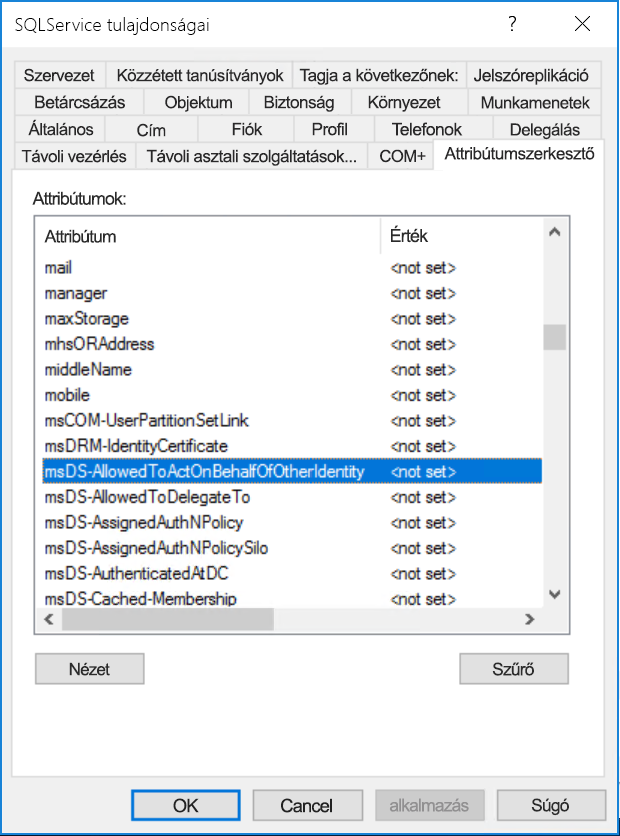

# <a name="configure-kerberos-based-sso-from-power-bi-service-to-on-premises-data-sources"></a>Kerberos-alapú egyszeri bejelentkezés konfigurálása a Power BI szolgáltatásról helyszíni adatforrásokhoz

Az SSO engedélyezése egyszerűvé teszi a Power BI-jelentések és -irányítópultok számára az adatok helyszíni forrásokból történő frissítését, miközben tiszteletben tartják azokat a felhasználói engedélyeket is, amelyeket azokon a forrásokon konfiguráltak. Használja a [Kerberos által korlátozott delegálást](/windows-server/security/kerberos/kerberos-constrained-delegation-overview) a közvetlen egyszeri bejelentkezéses (SSO-) kapcsolat engedélyezéséhez. 

## <a name="prerequisites"></a>Előfeltételek

Számos elemet kell konfigurálni ahhoz, hogy a korlátozott Kerberos-delegálás megfelelően működjön, beleértve a szolgáltatásfiókokhoz tartozó _Egyszerű szolgáltatásneveket_ (SPN) és delegálási beállításokat.

### <a name="install-and-configure-the-microsoft-on-premises-data-gateway"></a>A Microsoft helyszíni adatátjáró telepítése és konfigurálása

A helyszíni adatátjáró támogatja a helyben történő frissítést, valamint a meglévő átjárók _beállításainak átvételét_.

### <a name="run-the-gateway-windows-service-as-a-domain-account"></a>Az átjáró Windows-szolgáltatásának futtatása tartományi fiókként

A standard telepítés során az átjáró a gép helyi szolgáltatásfiókjával (**NT Service\PBIEgwService**) fut.


A korlátozott Kerberos-delegálás engedélyezéséhez az átjárót tartományi fiókkal kell futtatni, ha az Azure Active Directory (Azure AD) példánya még nincs szinkronizálva a helyi Active Directoryval (az Azure AD DirSync/Connect használatával). Ha szeretne tartományi fiókra váltani, tekintse meg [Az átjárószolgáltatás-fiók módosítása](/data-integration/gateway/service-gateway-service-account) című cikket.

> [!NOTE]
> Ha az Azure AD Connect konfigurálva van, és a felhasználói fiókok szinkronizálva vannak, az átjárószolgáltatásnak nem kell helyi Azure AD-kereséseket végrehajtania futásidőben. Ehelyett egyszerűen a helyi szolgáltatási SID-t is használhatja az átjárószolgáltatáshoz, így minden szükséges konfigurációt elvégezhet az Azure AD-ben. A korlátozott Kerberos-delegálás a cikkben ismertetett konfigurációs lépései ugyanazok, mint az Azure AD-hez szükséges lépések. A tartományi fiók helyett ezeket az átjáró számítógép-objektumára (amelyet a helyi szolgáltatási SID azonosít) kell alkalmazni az Azure AD-ben.

## <a name="obtain-domain-admin-rights-to-configure-spns-setspn-and-kerberos-constrained-delegation-settings"></a>Tartományi rendszergazdai jogosultságok beszerzése az SPN-ek (SetSPN) és a korlátozott Kerberos-delegálás beállításainak konfigurálásához

Az SPN-ek és a Kerberos delegálási beállításainak konfigurálásához a tartományi rendszergazdának el kell kerülnie a jogosultságok tartományi rendszergazdai jogosultságokkal nem rendelkezőknek való megadását. A következő szakaszban részletezzük az ajánlott konfigurációs lépéseket.

## <a name="configure-kerberos-constrained-delegation-for-the-gateway-and-data-source"></a>A Kerberos által korlátozott delegálás konfigurálása az átjáróhoz és az adatforráshoz

Amennyiben szükséges, tartományi rendszergazdaként konfiguráljon egy SPN-t az átjárószolgáltatás tartományi fiókjához, majd konfigurálja a delegálási beállításokat az átjárószolgáltatás tartományi fiókján.

### <a name="configure-an-spn-for-the-gateway-service-account"></a>Az átjáró szolgáltatásfiókjához tartozó egyszerű szolgáltatásnév konfigurálása

Először állapítsa meg, hogy létre lett-e már hozva egyszerű szolgáltatásnév az átjáró szolgáltatásfiókjaként használt tartományi fiókhoz:

1. Tartományi rendszergazdaként indítsa el az **Active Directory – Felhasználók és számítógépek** Microsoft Management Console (MMC) beépülő modulját.

2. Kattintson a jobb gombbal a tartománynévre a bal oldali panelen, válassza a **Keresés** lehetőséget, majd írja be az átjáró szolgáltatásfiókjának nevét.

3. A keresési eredményekben kattintson a jobb gombbal az átjáró szolgáltatásfiókjára, majd válassza a **Tulajdonságok** lehetőséget.

4. Ha a **Delegálás** lap látható a **Tulajdonságok** párbeszédpanelen, akkor már létre lett hozva egy egyszerű szolgáltatásnév, ezért továbbléphet [A korlátozott Kerberos-delegálás használni kívánt típusának meghatározása](#decide-on-the-type-of-kerberos-constrained-delegation-to-use) szakaszra.

5. Ha nincs **Delegálás** lap a **Tulajdonságok** párbeszédpanelen, az engedélyezéséhez manuálisan létrehozhat egy egyszerű szolgáltatásnevet a fiókban. Használja a [setspn eszközt](https://technet.microsoft.com/library/cc731241.aspx), amely a Windows rendszer része (tartományi rendszergazdai jogosultságokra van szükség az egyszerű szolgáltatásnév létrehozásához).

   Tegyük fel például, hogy az átjáró szolgáltatásfiókja **Contoso\GatewaySvc**, az átjárószolgáltatást futtató számítógép neve pedig **MyGatewayMachine**. Az átjárószolgáltatás-fiók egyszerű szolgáltatásnevének beállításához futtassa a következő parancsot:

   ```setspn -a gateway/MyGatewayMachine Contoso\GatewaySvc```

   Az egyszerű szolgáltatásnevet az **Active Directory – felhasználók és számítógépek** MMC beépülő moduljával is beállíthatja.
   
### <a name="add-gateway-service-account-to-windows-authorization-and-access-group-if-required"></a>Átjáró-szolgáltatásfiók hozzáadása a Windows hitelesítési és hozzáférési csoporthoz, ha szükséges

Bizonyos esetekben az átjáró-szolgáltatásfiókot hozzá kell adni a Windows hitelesítési és hozzáférési csoporthoz. Ilyen eset lehet, ha az Active Directory környezeti biztonságát kell megerősíteni, és ha az átjáró-szolgáltatásfiók és az átjáró által megszemélyesített felhasználói fiókok külön tartományokban vagy erdőkben találhatók. Az átjáró-szolgáltatásfiókot a Windows hitelesítési és hozzáférési csoporthoz olyan helyzetekben is hozzáadhatja, amikor a tartomány/erdő nem lett megerősítve, de nem kötelező.

További információ: [Windows hitelesítési és hozzáférési csoport](/windows/security/identity-protection/access-control/active-directory-security-groups#bkmk-winauthaccess).

A konfigurációs lépés elvégzéséhez minden tartományhoz, amely olyan Active Directory-felhasználókat tartalmaz, akiknél szeretné, hogy az átjáró-szolgáltatásfiók elvégezze a megszemélyesítést:
1. Jelentkezzen be a tartományban lévő számítógépen, és indítsa el az Active Directory felhasználók és számítógépek MMC beépülő modult.
2. Keresse meg a **Windows hitelesítési és hozzáférési csoport** csoportot, amely általában a **Beépített** (Builtin) tárolóban található.
3. Kattintson duplán a csoportra, majd kattintson a **Tagok** fülre.
4. Kattintson a **Hozzáadás** elemre, és módosítsa a tartomány helyét arra a tartományra, amelyen az átjáró-szolgáltatásfiók található.
5. Írja be az átjáró-szolgáltatásfiók nevét, és kattintson a **Névellenőrzés** lehetőségre, és ellenőrizze, hogy az átjáró-szolgáltatásfiók elérhető-e.
6. Kattintson az **OK** gombra.
7. Kattintson az **Alkalmaz** gombra.
8. Indítsa újra az átjárószolgáltatást.

### <a name="decide-on-the-type-of-kerberos-constrained-delegation-to-use"></a>A korlátozott Kerberos-delegálás használni kívánt típusának meghatározása

A delegálási beállításokat szabványos korlátozott Kerberos-delegáláshoz vagy erőforrás-alapú korlátozott Kerberos-delegáláshoz konfigurálhatja. Az erőforrás-alapú delegálást akkor célszerű használnia (ehhez a Windows Server 2012 vagy újabb verzió szükséges), ha az adatforrás egy másik tartományhoz tartozik, mint az átjáró. A delegálás két megközelítése közötti különbségekkel kapcsolatos további információért lásd: [A korlátozott Kerberos-delegálás áttekintése](/windows-server/security/kerberos/kerberos-constrained-delegation-overview).

 Attól függően, hogy melyik megközelítést szeretné használni, az alábbi szakaszok egyikére lépjen tovább. Ne végezze el mindkét szakaszt:
 - [Átjárószolgáltatás-fiók konfigurálása szabványos korlátozott Kerberos-delegáláshoz](#configure-the-gateway-service-account-for-standard-kerberos-constrained-delegation)
- [Átjárószolgáltatás-fiók konfigurálása erőforrás-alapú korlátozott Kerberos-delegáláshoz](#configure-the-gateway-service-account-for-resource-based-kerberos-constrained-delegation). 

## <a name="configure-the-gateway-service-account-for-standard-kerberos-constrained-delegation"></a>Átjárószolgáltatás-fiók konfigurálása szabványos korlátozott Kerberos-delegáláshoz

> [!NOTE]
> Ha engedélyezni szeretné a [szabványos korlátozott Kerberos-delegálást](/windows-server/security/kerberos/kerberos-constrained-delegation-overview), hajtsa végre a szakasz lépéseit. Egyébként, ha az erőforrás-alapú korlátozott Kerberos-delegálást szeretné engedélyezni, hajtsa végre az [Átjárószolgáltatás-fiók konfigurálása erőforrás-alapú korlátozott Kerberos-delegáláshoz](#configure-the-gateway-service-account-for-resource-based-kerberos-constrained-delegation) szakasz lépéseit.

Itt az átjárószolgáltatás-fiók delegálási beállításait adjuk meg. Számos eszköz áll rendelkezésre a lépések végrehajtásához. Itt az **Active Directory – felhasználók és számítógépek** MMC beépülő moduljával felügyeljük és tesszük közzé az információkat a címtárban. Ez alapértelmezés szerint elérhető a tartományvezérlőkön; más gépeken a Windows-szolgáltatás konfigurálásával engedélyezheti.

A Kerberos által korlátozott delegálást protokollváltással kell konfigurálni. Korlátozott delegálás esetén explicit módon kell meghatároznia, hogy mely szolgáltatások számára engedélyezi, hogy az átjáró bemutathassa neki a delegált hitelesítő adatokat. Például csak az SQL Server vagy az SAP HANA-kiszolgáló fogad delegálási hívást az átjáró szolgáltatásfiókjától.

Ez a szakasz azt feltételezi, hogy már konfigurálta az egyszerű szolgáltatásneveket az alapul szolgáló adatforrásokhoz (például SQL Server, SAP HANA, SAP BW, Teradata és Spark). Ezen adatforrás-kiszolgálói egyszerű szolgáltatásnevek konfigurálásának módjáról a megfelelő adatbázis-kiszolgáló technikai dokumentációjában, illetve a [My Kerberos Checklist](https://techcommunity.microsoft.com/t5/SQL-Server-Support/My-Kerberos-Checklist-8230/ba-p/316160) (Kerberos-ellenőrzőlista) című blogbejegyzés *What SPN does your app require?* (Milyen egyszerű szolgáltatásnév szükséges az alkalmazáshoz?) című szakaszában olvashat.

A következő lépésekben egy helyszíni környezetet feltételezünk két géppel, ugyanabban a tartományban: egy átjárót tartalmazó géppel és egy SQL Servert futtató adatbázis-kiszolgálóval, amelyet már korábban konfigurált a Kerberos-alapú egyszeri bejelentkezéshez. A lépéseket a többi támogatott adatforráshoz is felhasználhatja, feltéve, hogy az adatforrás már konfigurálva van Kerberos-alapú egyszeri bejelentkezéshez. Ebben a példában a következő beállításokat használjuk:

* Active Directory-tartomány (Netbios): **Contoso**
* Átjáró gépneve: **MyGatewayMachine**
* Átjárószolgáltatás-fiók: **Contoso\GatewaySvc**
* SQL Server adatforrás gépneve: **TestSQLServer**
* SQL Server adatforrás szolgáltatásfiókja: **Contoso\SQLService**

A delegálási beállítások konfigurálása:

1. Tartományi rendszergazdai jogosultsággal nyissa meg az **Active Directory – felhasználók és számítógépek** MMC beépülő modulját.

2. Kattintson a jobb gombbal az átjáró-szolgáltatásfiókra (**Contoso\GatewaySvc**), majd válassza a **Tulajdonságok** lehetőséget.

3. Válassza a **Delegálás** lapot.

4. Válassza **A számítógépen csak a megadott szolgáltatások delegálhatók** > **Bármely hitelesítési protokoll használatával** elemet.

5. **A fiók az alábbi szolgáltatásokhoz használhat delegált hitelesítő adatokat** szakaszban kattintson a **Hozzáadás** elemre.

6. Az új párbeszédpanelen válassza a **Felhasználók vagy számítógépek** elemet.

7. Adja meg az adatforrás szolgáltatásfiókját, majd válassza az **OK** lehetőséget.

   Egy SQL Server-adatforrás szolgáltatásfiókja például a *Contoso\SQLService* fiókhoz hasonló lehet. Ehhez a fiókhoz már be kell legyen állítva az adatforrás megfelelő SPN-je. 

8. Válassza ki azt az egyszerű szolgáltatásnevet, amelyet létrehozott az adatbázis-kiszolgálóhoz. 

   A példánkban az egyszerű szolgáltatásnév az *MSSQLSvc* kifejezéssel kezdődik. Ha megadta az adatbázis-szolgáltatás teljes tartománynevét és a NetBIOS egyszerű szolgáltatásnevét is, válassza ki mindkettőt. Előfordulhat, hogy csak egy jelenik meg.

9. Válassza az **OK** lehetőséget. 

   Ekkor meg kell jelennie az SPN-nek azon szolgáltatások listájában, amelyekhez az átjáró szolgáltatás fiókja delegált hitelesítő adatokat tud megjeleníteni.

    

10. A telepítési folyamat folytatásához lépjen tovább az [Átjárószolgáltatás-fiók helyi szabályzatjogosultságainak megadása az átjárógépen](#grant-the-gateway-service-account-local-policy-rights-on-the-gateway-machine) című szakaszra.

## <a name="configure-the-gateway-service-account-for-resource-based-kerberos-constrained-delegation"></a>Átjárószolgáltatás-fiók konfigurálása erőforrás-alapú korlátozott Kerberos-delegáláshoz

> [!NOTE]
> Ha engedélyezni szeretné az [erőforrás-alapú korlátozott Kerberos-delegálást](/windows-server/security/kerberos/kerberos-constrained-delegation-overview#resource-based-constrained-delegation-across-domains), hajtsa végre a szakasz lépéseit. Egyébként, ha a szabványos korlátozott Kerberos-delegálást szeretné engedélyezni, hajtsa végre az [Átjárószolgáltatás-fiók konfigurálása szabványos korlátozott Kerberos-delegáláshoz](#configure-the-gateway-service-account-for-standard-kerberos-constrained-delegation) szakasz lépéseit.

Az [erőforrás-alapú korlátozott Kerberos-delegálással](/windows-server/security/kerberos/kerberos-constrained-delegation-overview#resource-based-constrained-delegation-across-domains) engedélyezheti az egyszeri bejelentkezéses csatlakozást a Windows Server 2012-es és újabb verzióiban. A delegálás ezen típusa lehetővé teszi, hogy az előtérbeli és háttérbeli szolgáltatások eltérő tartományokban legyenek. Ennek működéséhez a háttérbeli szolgáltatástartománynak meg kell bíznia az előtérbeli szolgáltatástartományban.

A következő lépésekben egy helyszíni környezetet feltételezünk két géppel, eltérő tartományokban: egy átjárót tartalmazó géppel és egy SQL Servert futtató adatbázis-kiszolgálóval, amelyet már korábban konfigurált a Kerberos-alapú egyszeri bejelentkezéshez. A lépéseket a többi támogatott adatforráshoz is felhasználhatja, feltéve, hogy az adatforrás már konfigurálva van Kerberos-alapú egyszeri bejelentkezéshez. Ebben a példában a következő beállításokat használjuk:

* Active Directory-előtértartomány (Netbios): **ContosoFrontEnd**
* Active Directory-háttértartomány (Netbios): **ContosoBackEnd**
* Átjáró gépneve: **MyGatewayMachine**
* Átjárószolgáltatás-fiók: **ContosoFrontEnd\GatewaySvc**
* SQL Server adatforrás gépneve: **TestSQLServer**
* SQL Server adatforrás szolgáltatásfiókja: **ContosoBackEnd\SQLService**

Végezze el az alábbi konfigurációs lépéseket:

1. Az **Active Directory – felhasználók és számítógépeknek** MMC beépülő moduljának a **ContosoFrontEnd** tartomány tartományvezérlőjén való használatával győződjön meg arról, hogy nincsenek delegálási beállítások alkalmazva az átjárószolgáltatás-fiókra.

    

2. Az **Active Directory – felhasználók és számítógépek** eszköz a **ContosoBackEnd** tartomány tartományvezérlőjén való használatával győződjön meg arról, hogy nincsenek delegálási beállítások alkalmazva a háttérbeli szolgáltatásfiókra.

    

3. A fiók tulajdonságainak **Attribútumszerkesztő** lapján győződjön meg arról, hogy nincs beállítva az **msDS-AllowedToActOnBehalfOfOtherIdentity** attribútum.

    

4. Hozzon létre egy csoportot az **Active Directory – felhasználók és számítógépek** eszközben a **ContosoBackEnd** tartomány tartományvezérlőjén. Add hozzá a **GatewaySvc** átjárószolgáltatás-fiókot a **ResourceDelGroup** csoporthoz. 

    

5. Nyisson meg egy parancssort, és futtassa a következő parancsokat a **ContosoBackEnd** tartomány tartományvezérlőjén a háttérbeli szolgáltatásfiók **msDS-AllowedToActOnBehalfOfOtherIdentity** attribútumának frissítéséhez:

    ```powershell
    $c = Get-ADGroup ResourceDelGroup
    Set-ADUser SQLService -PrincipalsAllowedToDelegateToAccount $c
    ```

6. Ellenőrizze az **Active Directory – felhasználók és számítógépek** eszközben, hogy a frissítés megjelenik-e a háttérbeli szolgáltatásfiók tulajdonságainak **Attribútumszerkesztő** lapján. 

## <a name="grant-the-gateway-service-account-local-policy-rights-on-the-gateway-machine"></a>Átjárószolgáltatás-fiók helyi szabályzatjogosultságainak megadása az átjárógépen

Végül az átjárószolgáltatást futtató gépen (a példánkban **MyGatewayMachine**) az adja meg az átjárószolgáltatás-fióknak az **Ügyfél megszemélyesítése hitelesítés után** és **Az operációs rendszer részeként való működés (SeTcbPrivilege)** helyi szabályzatot. Ezt a konfigurációt a Helyi csoportszabályzat-szerkesztőben (**gpedit**) végezze el.

1. Az átjárógépen futtassa a **gpedit.msc** eszközt.

2. Lépjen a **Helyi számítógép-házirend** &gt; **Számítógép konfigurációja** &gt; **Windows-beállítások** &gt; **Biztonsági beállítások** &gt; **Helyi házirendek** &gt; **Felhasználói jogok hozzárendelése** területre.

    

3. A **Felhasználói jogok kiosztása** lehetőségnél a szabályzatok listájából válassza ki az **Ügyfél megszemélyesítése hitelesítés után** elemet.

    
    
4. Kattintson a jobb gombbal a szabályzatra, nyissa meg a **Tulajdonságokat**, majd tekintse meg a fiókok listáját. 

    A listának tartalmaznia kell az átjárószolgáltatás-fiókot (**Contoso\GatewaySvc** vagy **ContosoFrontEnd\GatewaySvc** a korlátozott delegálás típusától függően).

5. A **Felhasználói jogok kiosztása** szakaszban a szabályzatok listájából válassza ki **Az operációs rendszer részeként való működés (SeTcbPrivilege)** elemet. Győződjön meg arról, hogy az átjárószolgáltatás-fiók szerepel a fiókok listájában.

6. Indítsa újra a **helyszíni adatátjáró** szolgáltatás folyamatát.

### <a name="set-user-mapping-configuration-parameters-on-the-gateway-machine-if-necessary"></a>Felhasználóleképezési konfigurációs paraméterek beállítása az átjárógépen (szükség esetén)

Ha nincs konfigurálva az Azure AD Connect, kövesse ezeket a lépéseket a Power BI szolgáltatás egy felhasználójának egy helyi Active Directory-felhasználóra való leképezéséhez. Az így leképezett Active Directory-felhasználóknak SSO-engedéllyel kell rendelkezniük az adatforráshoz. További információt a [Guy in a Cube-videóban](https://www.youtube.com/watch?v=NG05PG9aiRw) találhat.

1. Nyissa meg a Microsoft.PowerBI.DataMovement.Pipeline.GatewayCore.dll fő átjárókonfigurációs fájlt. A fájl alapértelmezett tárolási helye: C:\Program Files\Helyszíni adatátjáró.

1. Állítsa az **ADUserNameLookupProperty** tulajdonságot egy nem használt Active Directory-attribútumra. A következő lépésekben az `msDS-cloudExtensionAttribute1` attribútumot fogjuk használni. Ez az attribútum csak a Windows Server 2012-es és újabb verzióiban érhető el. 

1. Állítsa az **ADUserNameReplacementProperty** tulajdonságot az `SAMAccountName` értékre, majd mentse a konfigurációs fájlt.

1. A Feladatkezelő **Szolgáltatások** lapján kattintson a jobb gombbal, majd válassza az **Újraindítás** elemet.

    

1. Minden felhasználó esetén, aki számára engedélyezni szeretné a Kerberos SSO-t, állítsa egy helyi (és az adatforráshoz SSO-engedéllyel bíró) Active Directory-felhasználó `msDS-cloudExtensionAttribute1` tulajdonságát a Power BI szolgáltatás felhasználójának teljes felhasználónevére (UPN-jére). Ha például test@contoso.com felhasználóként jelentkezik be a Power BI szolgáltatásba, ezt a felhasználót pedig egy helyi, SSO-engedéllyel rendelkező Active Directory-felhasználóhoz szeretné rendelni (például hozzá: test@LOCALDOMAIN.COM), állítsa a felhasználó `msDS-cloudExtensionAttribute1` tulajdonságát a test@contoso.com értékre.

    Az `msDS-cloudExtensionAttribute1` tulajdonságot beállíthatja az Active Directory – felhasználók és számítógépek MMC beépülő moduljával:
    
    1. Tartományi rendszergazdaként futtassa az **Active Directory – felhasználók és számítógépek** modult.
    
    1. Kattintson a jobb gombbal a tartománynévre, válassza a **Keresés** lehetőséget, majd írja be a leképezendő helyi Active Directory-felhasználó fióknevét.
    
    1. Válassza az **Attribútumszerkesztő** lapot.
    
        Keresse meg az `msDS-cloudExtensionAttribute1` elemet, és kattintson rá duplán. Állítsa a tulajdonság értékét arra a teljes felhasználónévre (UPN-re), amelyet a Power BI szolgáltatásba való bejelentkezéshez használ.
    
    1. Válassza az **OK** lehetőséget.
    
        
    
    1. Kattintson az **Alkalmaz** elemre. Ellenőrizze, hogy az **Érték** oszlopban a megfelelő érték lett-e beállítva.

## <a name="complete-data-source-specific-configuration-steps"></a>Az adatforrás-specifikus konfigurációs lépések végrehajtása

Az SAP HANA és az SAP BW további adatforrás-specifikus konfigurációs követelményekkel és előfeltételekkel rendelkezik, amelyeket teljesítenie kell, ha az adatforrásokra irányuló SSO-kapcsolatot kíván létrehozni az átjárón keresztül. További információért tekintse meg az [SAP HANA konfigurációs oldalát](service-gateway-sso-kerberos-sap-hana.md) és az [SAP BW – CommonCryptoLib (sapcrypto.dll) konfigurációs oldalt](service-gateway-sso-kerberos-sap-bw-commoncryptolib.md). Az [SAP BW-t a gx64krb5 SNC-könyvtár használatához is konfigurálhatja](service-gateway-sso-kerberos-sap-bw-gx64krb.md), ezt azonban nem javasoljuk, mivel már nem támogatja az SAP. Célszerűbb a CommonCryptoLib _vagy_ a gx64krb5 könyvtárat használnia SNC-könyvtárként. Ne végezze el mindkét könyvtár konfigurációs lépéseit.

> [!NOTE]
> A BW SSO-val egyéb SNC-könyvtárak is működhetnek, azonban ezeket nem támogatja hivatalosan a Microsoft.

## <a name="run-a-power-bi-report"></a>Power BI-jelentés futtatása

Miután az összes konfigurációs lépést elvégzett, konfigurálja az SSO-hoz használandó adatforrást a Power BI-ban az **Átjáró kezelése** lapon. Több átjáró esetén ügyeljen arra, hogy azt az átjárót válassza ki, amelyet a Kerberos SSO-hoz konfigurált. Ezután az adatforrás **Speciális beállítások** területén jelölje be az **Egyszeri bejelentkezés használata Kerberosszal DirectQuery-lekérdezéseknél** jelölőnégyzetet.


 Tegyen közzé egy DirectQuery-alapú jelentést a Power BI Desktopban. Ennek a jelentésnek azokat az adatokat kell használnia, amelyek elérhetőek azon felhasználó számára, aki ahhoz az (Azure) Active Directory-felhasználóhoz van rendelve, amelyik bejelentkezik a Power BI szolgáltatásba. A frissítés működése miatt az importálás helyett a DirectQueryt kell használnia. Importálási alapú jelentések frissítésekor az átjáró azokat a hitelesítő adatokat használja, amelyet beírt a **Felhasználónév** és a **Jelszó** mezőbe az adatforrás létrehozásakor. Más szóval a Kerberos SSO *nincs* használatban. A közzétételkor azt az átjárót válassza ki, amelyet az egyszeri bejelentkezéshez konfigurált, ha több átjáróval rendelkezik. A Power BI szolgáltatásban most már frissítheti a jelentést, és létrehozhat új jelentést is a közzétett adathalmaz alapján.

Ez a konfiguráció a legtöbb esetben működik. A Kerberos esetében azonban más konfigurációkra lehet szükség a környezettől függően. Ha a jelentés nem töltődik be, kérje a probléma részletesebb kivizsgálását a tartományi rendszergazdától. Ha az adatforrás az SAP BW, tekintse meg a [CommonCryptoLib](service-gateway-sso-kerberos-sap-bw-commoncryptolib.md#troubleshooting) és a [gx64krb5/gsskrb5](service-gateway-sso-kerberos-sap-bw-gx64krb.md#troubleshooting) adatforrás-specifikus konfigurációs oldalain található hibaelhárítási szakaszokat a kiválasztott SNC-kódtártól függően.

## <a name="next-steps"></a>Következő lépések

A helyszíni adatátjáróval és a DirectQueryvel kapcsolatos további információkért lásd az alábbi forrásanyagokat:

* [Mi az a helyszíni adatátjáró?](/data-integration/gateway/service-gateway-onprem)
* [A DirectQuery használata a Power BI-ban](desktop-directquery-about.md)
* [A DirectQuery által támogatott adatforrások](desktop-directquery-data-sources.md)
* [A DirectQuery és az SAP BW](desktop-directquery-sap-bw.md)
* [DirectQuery és SAP HANA](desktop-directquery-sap-hana.md)
