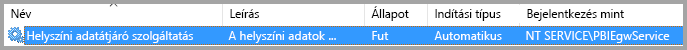
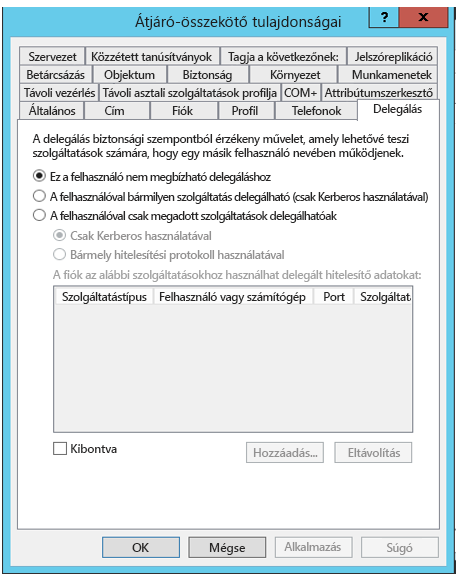
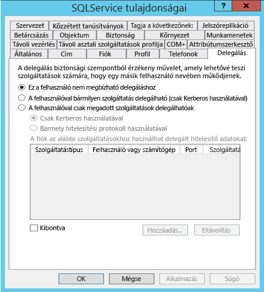
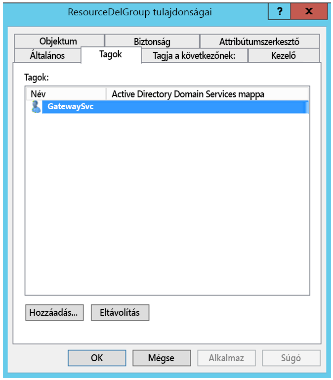
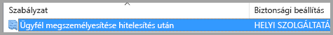
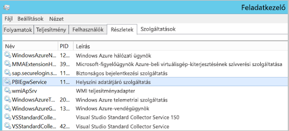
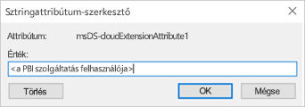
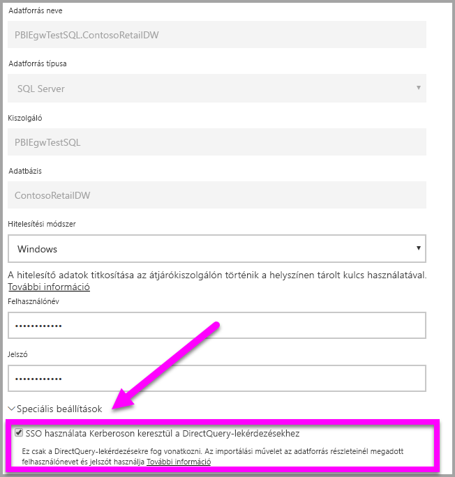

# <a name="configure-kerberos-based-sso-from-power-bi-service-to-on-premises-data-sources"></a>Kerberos-alapú egyszeri bejelentkezés konfigurálása a Power BI szolgáltatásról helyszíni adatforrásokhoz

Használja a [Kerberos által korlátozott delegálást](/windows-server/security/kerberos/kerberos-constrained-delegation-overview) a közvetlen egyszeri bejelentkezéses (SSO-) kapcsolat engedélyezéséhez. Az SSO engedélyezése egyszerűvé teszi a Power BI-jelentések és -irányítópultok számára az adatok helyszíni forrásokból történő frissítését.

Számos elemet kell konfigurálni ahhoz, hogy a Kerberos által korlátozott delegálás megfelelően működjön, beleértve a _szolgáltatás egyszerű szolgáltatásneveit_ (SPN) és a delegálási beállításokat a szolgáltatásfiókokhoz.

### <a name="prerequisite-1-install-and-configure-the-microsoft-on-premises-data-gateway"></a>1. előfeltétel: A Microsoft helyszíni adatátjáró telepítése és konfigurálása

A helyszíni adatátjáró támogatja a helyben történő frissítést, valamint a meglévő átjárók _beállításainak átvételét_.

### <a name="prerequisite-2-run-the-gateway-windows-service-as-a-domain-account"></a>2. előfeltétel: Az átjáró Windows-szolgáltatásának futtatása tartományi fiókként

A szabványos telepítés során az átjáró a gép helyi szolgáltatásfiókjával fut (ebben az esetben: _NT Service\PBIEgwService_), az alábbi képen látható módon:



A Kerberos által korlátozott delegálás engedélyezéséhez az átjárót tartományi fiókkal kell futtatni, ha az Azure Active Directory (Azure AD) példánya még nincs szinkronizálva a helyi Active Directoryval (az Azure AD DirSync/Connect használatával). Ha szeretne tartományi fiókra váltani, tekintse meg [Az átjárószolgáltatás-fiók módosítása](/data-integration/gateway/service-gateway-service-account) című cikket.

> [!NOTE]
> Ha az Azure AD Connect konfigurálva van, és a felhasználói fiókok szinkronizálva vannak, az átjárószolgáltatásnak nem kell helyi Azure AD-kereséseket végrehajtania futásidőben. Ehelyett egyszerűen a helyi szolgáltatási SID-t az átjárószolgáltatáshoz, így minden szükséges konfigurációt elvégezhet az Azure Active Directoryban. A Kerberos által korlátozott delegálás a cikkben ismertetett konfigurációs lépései ugyanazok, mint az Azure Active Directoryhoz szükséges lépések. A tartományi fiók helyett ezeket csupán az átjáró számítógép-objektumára (amelyet a helyi szolgáltatási SID azonosít) kell alkalmazni az Azure AD-ben.

### <a name="prerequisite-3-have-domain-admin-rights-to-configure-spns-setspn-and-kerberos-constrained-delegation-settings"></a>3. előfeltétel: Tartományi rendszergazdai jogosultsággal kell rendelkezni az SPN-ek (SetSPN) és a Kerberos által korlátozott delegálási beállítások konfigurálásához

Nem ajánlott, hogy egy tartományi rendszergazda ideiglenesen vagy véglegesen jogosultságot adjon valaki másnak az egyszerű szolgáltatásnevek és a Kerberos-delegálási beállítások konfigurálására anélkül, hogy rendszergazdai jogosultságot követelne meg. A következő szakaszban részletezzük az ajánlott konfigurációs lépéseket.

## <a name="configure-kerberos-constrained-delegation-for-the-gateway-and-data-source"></a>A Kerberos által korlátozott delegálás konfigurálása az átjáróhoz és az adatforráshoz

Tartományi rendszergazdaként konfiguráljon egy SPN-t az átjárószolgáltatás tartományfiókjához (amennyiben ez szükséges), majd konfigurálja a delegálási beállításokat az átjárószolgáltatás tartományfiókján.

### <a name="configure-an-spn-for-the-gateway-service-account"></a>Az átjáró szolgáltatásfiókjához tartozó egyszerű szolgáltatásnév konfigurálása

Először állapítsa meg, hogy létre lett-e már hozva egyszerű szolgáltatásnév az átjáró szolgáltatásfiókjaként használt tartományi fiókhoz:

1. Tartományi rendszergazdaként futtassa az **Active Directory – felhasználók és számítógépek** modult.

2. Kattintson a jobb gombbal a tartományra, válassza a **Keresés** lehetőséget, és írja be az átjáró szolgáltatásfiókjának nevét.

3. A keresési eredményekben kattintson a jobb gombbal az átjáró szolgáltatásfiókjára, majd válassza a **Tulajdonságok** lehetőséget.

4. Ha a **Delegálás** lap látható a **Tulajdonságok** párbeszédpanelen, akkor már létre lett hozva egy egyszerű szolgáltatásnév, ezért továbbléphet a [erőforrás-alapú vagy szabványos korlátozott Kerberos-delegálásról](#decide-on-resource-based-or-standard-kerberos-constrained-delegation) szóló következő alszakaszra.

    Ha nincs **Delegálás** lap a **Tulajdonságok** párbeszédpanelen, manuálisan létrehozhat egy egyszerű szolgáltatásnevet a fiókban. Használja a [setspn eszközt](https://technet.microsoft.com/library/cc731241.aspx), amely a Windows rendszer része (tartományi rendszergazdai jogosultságokra van szükség az egyszerű szolgáltatásnév létrehozásához).

    Például tegyük fel, hogy az átjáró szolgáltatásfiókja **Contoso\GatewaySvc**, és az átjáró szolgáltatást futtató számítógép neve **MyGatewayMachine**. Az átjáró-szolgáltatásfiók egyszerű szolgáltatásnevének beállításához a következő parancsot kell futtatnia:

    

    Az egyszerű szolgáltatásnevet a Active Directory – Felhasználók és számítógépek (Microsoft Management Console) beépülő modullal is beállíthatja.

### <a name="decide-on-resource-based-or-standard-kerberos-constrained-delegation"></a>Az erőforrás-alapú vagy a szabványos Kerberos által korlátozott delegálás kiválasztása

A delegálási beállításokat erőforrás-alapú korlátozott Kerberos-delegáláshoz _vagy_ szabványos korlátozott Kerberos-delegáláshoz konfigurálhatja. Az erőforrás-alapú delegálást akkor célszerű használnia, ha az adatforrás egy másik tartományhoz tartozik, mint az átjáró. Ehhez a megközelítéshez azonban a Windows Server 2012 vagy újabb verzió szükséges. További információt a delegálás két módja közötti különbségekről a [korlátozott Kerberos-delegálás áttekintési lapján](/windows-server/security/kerberos/kerberos-constrained-delegation-overview) találhat.

 Ha választott egy módszert, lépjen a [Átjárószolgáltatás-fiók konfigurálása szabványos korlátozott Kerberos-delegáláshoz](#configure-the-gateway-service-account-for-standard-kerberos-constrained-delegation) __vagy__ az [Átjárószolgáltatás-fiók konfigurálása erőforrás-alapú korlátozott Kerberos-delegáláshoz](#configure-the-gateway-service-account-for-resource-based-kerberos-constrained-delegation) című szakaszra. Ne végezze el mindkét alszakaszt.

## <a name="configure-the-gateway-service-account-for-standard-kerberos-constrained-delegation"></a>Átjárószolgáltatás-fiók konfigurálása szabványos korlátozott Kerberos-delegáláshoz

> [!NOTE]
> Ha engedélyezni szeretné a szabványos korlátozott Kerberos-delegálást, hajtsa végre a szakasz lépéseit. Ha az erőforrás-alapú korlátozott Kerberos-delegálást szeretné engedélyezni, hajtsa végre az [Átjárószolgáltatás-fiók konfigurálása erőforrás-alapú korlátozott Kerberos-delegáláshoz](#configure-the-gateway-service-account-for-resource-based-kerberos-constrained-delegation) alszakasz lépéseit.

Itt megadhatja az átjárószolgáltatás-fiók delegálási beállításait. Számos eszköz áll rendelkezésre a lépések végrehajtásához. Itt az Active Directory – felhasználók és számítógépek modult használjuk, a Microsoft Management Console (MMC) beépülő modulját, amellyel felügyelheti és közzéteheti az információkat a címtárban. Ez alapértelmezés szerint elérhető a tartományvezérlőkön, azonban más gépeken a Windows-szolgáltatás konfigurációján keresztül is engedélyezheti.

A Kerberos által korlátozott delegálást protokollváltással kell konfigurálni. Korlátozott delegálás esetén explicit módon kell meghatároznia, hogy melyik szolgáltatások számára szeretné engedélyezni, hogy az átjáró bemutathassa neki a delegált hitelesítő adatokat. Például csak az SQL Server vagy az SAP HANA-kiszolgáló fogad delegálási hívást az átjáró szolgáltatásfiókjától.

Ez a szakasz azt feltételezi, hogy már konfigurálta az egyszerű szolgáltatásneveket az alapul szolgáló adatforrásokhoz (például SQL Server, SAP HANA, SAP BW, Teradata és Spark). Az adatforrás-kiszolgálók egyszerű szolgáltatásneveinek konfigurálásával az adott adatbázis-kiszolgáló műszaki dokumentációjában ismerkedhet meg. Érdemes elolvasni az [Ellenőrző lista a Kerberoshoz](https://techcommunity.microsoft.com/t5/SQL-Server-Support/My-Kerberos-Checklist-8230/ba-p/316160) című blogbejegyzés *Milyen SPN-re van szükség az alkalmazáshoz?* részét.

A következő lépésekben egy helyszíni környezetet feltételezünk két géppel: egy átjárót tartalmazó géppel és egy SQL Servert futtató adatbázis-kiszolgálóval, amelyet már korábban konfigurált a Kerberos-alapú egyszeri bejelentkezéshez. A lépéseket a többi támogatott adatforráshoz is felhasználhatja, feltéve, hogy az adatforrás már konfigurálva van Kerberos-alapú egyszeri bejelentkezéshez. A példa kedvéért a következő beállításokat és neveket is feltételezzük:

* Active Directory-tartomány (Netbios): Contoso
* Átjáró gépneve: **MyGatewayMachine**
* Átjárószolgáltatás-fiók: **Contoso\GatewaySvc**
* SQL Server adatforrás gépneve: **TestSQLServer**
* SQL Server adatforrás szolgáltatásfiókja: **Contoso\SQLService**

A delegálási beállítások konfigurálása:

1. Tartományi rendszergazdai jogosultsággal nyissa meg az **Active Directory – felhasználók és számítógépek** modult.

2. Kattintson a jobb gombbal az átjáró-szolgáltatásfiókra (**Contoso\GatewaySvc**), majd válassza a **Tulajdonságok** lehetőséget.

3. Válassza a **Delegálás** lapot.

4. Válassza **A számítógépen csak a megadott szolgáltatások delegálhatók** > **Bármely hitelesítési protokoll használatával** elemet.

5. **A fiók az alábbi szolgáltatásokhoz használhat delegált hitelesítő adatokat** szakaszban kattintson a **Hozzáadás** elemre.

6. Az új párbeszédpanelen válassza a **Felhasználók vagy számítógépek** elemet.

7. Adja meg az adatforrás szolgáltatásfiókját, például az SQL Server-adatforrások a következőhöz hasonló szolgáltatásfiókot használnak: **Contoso\SQLService**. Miután hozzáadta a fiókot, kattintson az **OK** gombra.

8. Válassza ki azt az egyszerű szolgáltatásnevet, amelyet létrehozott az adatbázis-kiszolgálóhoz. A példánkban az egyszerű szolgáltatásnév az **MSSQLSvc** kifejezéssel kezdődik. Ha megadta az adatbázis-szolgáltatás teljes tartománynevét és a NetBIOS egyszerű szolgáltatásnevét is, válassza ki mindkettőt. Lehet, hogy csak az egyiket látja.

9. Kattintson az **OK** gombra. Ekkor az SPN-nek meg kell jelennie a listában.

    

A telepítési folyamat folytatásához lépjen az [Átjárószolgáltatás-fiók helyi szabályzatjogosultságainak megadása az átjárógépen](#grant-the-gateway-service-account-local-policy-rights-on-the-gateway-machine) című szakaszra.

## <a name="configure-the-gateway-service-account-for-resource-based-kerberos-constrained-delegation"></a>Átjárószolgáltatás-fiók konfigurálása erőforrás-alapú korlátozott Kerberos-delegáláshoz

> [!NOTE]
> Ha engedélyezni szeretné az erőforrás-alapú korlátozott Kerberos-delegálást, hajtsa végre a szakasz lépéseit. Ha a szabványos korlátozott Kerberos-delegálást szeretné engedélyezni, hajtsa végre az [Átjárószolgáltatás-fiók konfigurálása szabványos korlátozott Kerberos-delegáláshoz](#configure-the-gateway-service-account-for-standard-kerberos-constrained-delegation) alszakasz lépéseit.

Az [erőforrás-alapú korlátozott Kerberos-delegálással](/windows-server/security/kerberos/kerberos-constrained-delegation-overview) engedélyezheti az egyszeri bejelentkezéses csatlakozást a Windows Server 2012-n és a szolgáltatás és újabb verzióin, az előtérbeli és háttérbeli szolgáltatások így eltérő tartományokban is lehetnek. Ennek működéséhez a háttérbeli szolgáltatástartománynak meg kell bíznia az előtérbeli szolgáltatástartományban.

A következő lépésekben egy helyszíni környezetet feltételezünk két géppel, eltérő tartományokban: egy átjárót tartalmazó géppel és egy SQL Servert futtató adatbázis-kiszolgálóval, amelyet már korábban konfigurált a Kerberos-alapú egyszeri bejelentkezéshez. A lépéseket a többi támogatott adatforráshoz is felhasználhatja, feltéve, hogy az adatforrás már konfigurálva van Kerberos-alapú egyszeri bejelentkezéshez. A példa kedvéért a következő beállításokat és neveket is feltételezzük:

* Átjáró gépneve: **MyGatewayMachine**
* Átjárószolgáltatás-fiók: **ContosoFrontEnd\GatewaySvc**
* SQL Server adatforrás gépneve: **TestSQLServer**
* SQL Server adatforrás szolgáltatásfiókja: **ContosoBackEnd\SQLService**

A példaként megadott nevekkel és beállításokkal a konfigurációs lépések a következők:

1. A Microsoft Management Console (MMC) beépülő moduljának, az **Active Directory – felhasználók és számítógépeknek** a **PBIEgwTestFront-end** tartománybeli tartományvezérlőn való használatával győződjön meg róla, hogy nem alkalmazott delegálási beállításokat az átjárószolgáltatás-fiókra.

    

2. Az **Active Directory – felhasználók és számítógépek** beépülő modul a **ContosoBackEnd** tartománybeli tartományvezérlőn való használatával győződjön meg róla, hogy nem alkalmazott delegálási beállításokat a háttérbeli szolgáltatásfiókra. Emellett győződjön meg arról, hogy nincs beállítva az **msDS-AllowedToActOnBehalfOfOtherIdentity** attribútum ehhez a fiókhoz. Ezt az **attribútumszerkesztőben**, a következő kép szerint találhatja meg:

    

3. Hozzon létre egy csoportot az **Active Directory – felhasználók és számítógépek** beépülő modulban a **ContosoBackEnd** tartománybeli tartományvezérlőn. Adja hozzá a csoporthoz az átjárószolgáltatás-fiókot, a következő képhez hasonlóan. A képen egy új, _ResourceDelGroup_ nevű csoport látható, amelyhez hozzáadja a **GatewaySvc** átjárószolgáltatás-fiókot.

    

4. Nyissa meg a parancssort, és futtassa a következő parancsokat a **ContosoBackEnd** tartománybeli tartományvezérlőn az **msDS-AllowedToActOnBehalfOfOtherIdentity** attribútum a háttérbeli szolgáltatásfiókon való frissítéséhez:

    ```powershell
    $c = Get-ADGroup ResourceDelGroup
    Set-ADUser SQLService -PrincipalsAllowedToDelegateToAccount $c
    ```

5. Az **Active Directory – felhasználók és számítógépek** modulban ellenőrizheti, hogy a frissítés megjelenik-e a háttérbeli szolgáltatásfiók tulajdonságainak „Attribútumszerkesztő” lapján.

## <a name="grant-the-gateway-service-account-local-policy-rights-on-the-gateway-machine"></a>Átjárószolgáltatás-fiók helyi szabályzatjogosultságainak megadása az átjárógépen

Végül az átjárószolgáltatást futtató gépen (a példánkban **MyGatewayMachine**) az átjárószolgáltatás-fióknak meg kell adnia az **Ügyfél megszemélyesítése hitelesítés után** helyi szabályzatot és **Az operációs rendszer részeként való működés (SeTcbPrivilege)** jogosultságot. Ezt a konfigurációt a Helyi csoportszabályzat-szerkesztőben hajthatja végre és ellenőrizheti (**gpedit**).

1. Az átjárót tartalmazó számítógépen futtassa a következőt: *gpedit.msc*.

2. Navigáljon a **Helyi számítógép-szabályzat** > **Számítógép konfigurációja** > **A Windows beállításai** > **Biztonsági beállítások** > **Helyi szabályzatok** > **Felhasználói jogok kiosztása** elemhez.

    

3. A **Felhasználói jogok kiosztása** lehetőségnél a szabályzatok listájából válassza ki az **Ügyfél megszemélyesítése hitelesítés után** elemet.

    

    Kattintson a jobb gombbal, és nyissa meg a **Tulajdonságok** elemet. Ellenőrizze a fiókok listáját. A listának tartalmaznia kell az átjáró-szolgáltatásfiókot (**Contoso\GatewaySvc**).

4. A **Felhasználói jogok kiosztása** lehetőségnél a szabályzatok listájából válassza ki **Az operációs rendszer részeként való működés (SeTcbPrivilege)** elemet. Győződjön meg róla, hogy az átjáró-szolgáltatásfiók a fiókok listájában is szerepel.

5. Indítsa újra a **helyszíni adatátjáró** szolgáltatás folyamatát.

### <a name="set-user-mapping-configuration-parameters-on-the-gateway-machine-if-required"></a>Felhasználóleképezési konfigurációs paraméterek beállítása az átjárót tartalmazó számítógépen (szükség esetén)

Ha nincs konfigurálva az Azure AD Connect, kövesse ezeket a lépéseket a Power BI szolgáltatás egy felhasználójának egy helyi Active Directory-felhasználóra való leképezéséhez. Az így leképezett Active Directory-felhasználóknak SSO-engedéllyel kell rendelkezniük az adatforráshoz. További információt ebben a [Guy in a Cube-videóban](https://www.youtube.com/watch?v=NG05PG9aiRw) találhat.

1. Nyissa meg az átjáró fő konfigurációs fájlját (`Microsoft.PowerBI.DataMovement.Pipeline.GatewayCore.dll`). A fájl alapértelmezett tárolási helye: C:\Program Files\Helyszíni adatátjáró.

1. Állítsa az **ADUserNameLookupProperty** tulajdonságot egy nem használt Active Directory-attribútumra. Feltételezzük, hogy a következő lépésekben az`msDS-cloudExtensionAttribute1` attribútumot használja, bár ez csak a Windows Server 2012-ben és a későbbi verziókban érhető el. Állítsa az **ADUserNameReplacementProperty** értékét a következőre: `SAMAccountName`. Mentse a konfigurációs fájlt.

1. A Feladatkezelő **Szolgáltatások** lapján kattintson a jobb gombbal, majd válassza az **Újraindítás** elemet.

    

1. Minden felhasználó esetén, aki számára engedélyezni szeretné a Kerberos SSO-t, állítsa egy helyi (és az adatforráshoz SSO-engedéllyel bíró) Active Directory-felhasználó `msDS-cloudExtensionAttribute1` tulajdonságát a Power BI szolgáltatás felhasználójának teljes felhasználónevére. Ha például `test@contoso.com` felhasználóként jelentkezik be a Power BI szolgáltatásba, ezt a felhasználót pedig egy helyi, SSO-engedéllyel rendelkező Active Directory-felhasználóhoz szeretné rendelni (például hozzá: `test@LOCALDOMAIN.COM`), állítsa `test@LOCALDOMAIN.COM` `msDS-cloudExtensionAttribute1` tulajdonságát a következőre: `test@contoso.com`.

Az `msDS-cloudExtensionAttribute1` attribútumot az Active Directory – Felhasználók és számítógépek (Microsoft Management Console – MMC) beépülő modullal is beállíthatja.

1. Tartományi rendszergazdaként futtassa az Active Directory – Felhasználók és számítógépek MMC-modult.

1. Kattintson a jobb gombbal a tartományra, válassza a Keresés lehetőséget, és írja be a leképezési helyi Active Directory-felhasználó fióknevét.

1. Válassza az **Attribútumszerkesztő** lapot.

    Keresse meg az `msDS-cloudExtensionAttribute1` elemet, és kattintson rá duplán. Állítsa a tulajdonság értékét arra a teljes felhasználónévre, amelyet a Power BI szolgáltatásba való bejelentkezéshez használ.

1. Kattintson az **OK** gombra.

    

1. Kattintson az **Alkalmaz** elemre. Ellenőrizze, hogy az **Érték** oszlopban a megfelelő érték lett-e beállítva.

## <a name="complete-data-source-specific-configuration-steps"></a>Az adatforrás-specifikus konfigurációs lépések végrehajtása

Az SAP HANA és az SAP BW további adatforrás-specifikus konfigurációs követelményekkel és előfeltételekkel rendelkezik, amelyeket teljesítenie kell, ha az adatforrásokra irányuló SSO-kapcsolatot kíván létrehozni az átjárón keresztül. A részletekért tekintse meg az [SAP HANA konfigurációs oldalát](service-gateway-sso-kerberos-sap-hana.md) és az [SAP BW – CommonCryptoLib (sapcrypto.dll) konfigurációs oldalt](service-gateway-sso-kerberos-sap-bw-commoncryptolib.md). Emellett az [SAP BW-t a gx64krb5 SNC-könyvtár használatához is konfigurálhatja](service-gateway-sso-kerberos-sap-bw-gx64krb.md), ezt azonban nem javasoljuk, mivel már nem támogatja az SAP. Célszerűbb a CommonCryptoLib _vagy_ a gx64krb5 könyvtárat használnia SNC-könyvtárként. Ne konfiguráljon mindkét könyvtárhoz.

> [!NOTE]
> A BW SSO-val egyéb SNC-könyvtárak is működhetnek, azonban ezeket nem támogatja hivatalosan a Microsoft.

## <a name="run-a-power-bi-report"></a>Power BI-jelentés futtatása

A konfigurációs lépések elvégzése után konfigurálja az SSO-hoz használandó adatforrást a Power BI-ban az **Átjáró kezelése** lapon. Több átjáró esetén ügyeljen arra, hogy azt az átjárót válassza ki, amelyet a Kerberos SSO-hoz konfigurált. Ezután az adatforrás **Speciális beállítások** területén jelölje be az „Egyszeri bejelentkezés használata Kerberosszal DirectQuery-lekérdezéseknél” jelölőnégyzetet.



 Tegyen közzé egy **DirectQuery-alapú** jelentést a Power BI Desktopból. Ennek a jelentésnek azokat az adatokat kell használnia, amelyek elérhetőek annak a felhasználónak a számára, aki ahhoz az (Azure) Active Directory-felhasználóhoz van rendelve, amelyik bejelentkezik a Power BI szolgáltatásba. A frissítés működése miatt az importálás helyett a DirectQueryt kell használnia. Importálási alapú jelentések frissítésekor az átjáró azokat a hitelesítő adatokat használja, amelyet az adatforrás létrehozásakor a **Felhasználónév** és **Jelszó** mezőkbe beírt. Más szóval a Kerberos SSO **nincs** használatban. A közzétételkor ügyeljen arra, hogy azt az átjárót válassza ki, amelyet az egyszeri bejelentkezéshez konfigurált, ha több átjáróval rendelkezik. A Power BI szolgáltatásban most már frissítheti a jelentést, és létrehozhat új jelentést is a közzétett adatkészlet alapján.

Ez a konfiguráció a legtöbb esetben működik. A Kerberos esetében azonban más konfigurációkra lehet szükség a környezettől függően. Ha a jelentés továbbra sem töltődik be, forduljon a tartományi rendszergazdájához a probléma részletesebb kivizsgálásához. Ha az adatforrás az SAP BW, megtekintheti a [CommonCryptoLib](service-gateway-sso-kerberos-sap-bw-commoncryptolib.md#troubleshooting) és a [gx64krb5/gsskrb5](service-gateway-sso-kerberos-sap-bw-gx64krb.md#troubleshooting) adatforrás-specifikus konfigurációs oldalain található hibaelhárítási szakaszokat.

## <a name="next-steps"></a>Következő lépések

A **helyszíni adatátjáróval** és a **DirectQueryvel** kapcsolatos további információkért lásd az alábbi forrásanyagokat:

* [Mi az a helyszíni adatátjáró?](/data-integration/gateway/service-gateway-getting-started)
* [A DirectQuery használata a Power BI-ban](desktop-directquery-about.md)
* [A DirectQuery által támogatott adatforrások](desktop-directquery-data-sources.md)
* [A DirectQuery és az SAP BW](desktop-directquery-sap-bw.md)
* [A DirectQuery és az SAP HANA](desktop-directquery-sap-hana.md)
