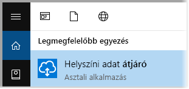
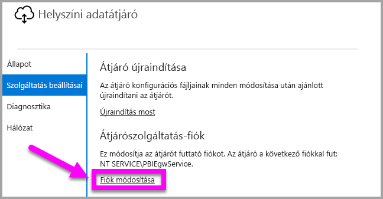

# <a name="use-kerberos-for-single-sign-on-sso-from-power-bi-to-on-premises-data-sources"></a>A Kerberos használata a Power BI-ból a helyszíni adatforrásokba történő egyszeri bejelentkezéshez (SSO)

Használja a [Kerberos által korlátozott delegálást](https://technet.microsoft.com/library/jj553400.aspx) a közvetlen SSO-kapcsolat engedélyezéséhez. Az SSO engedélyezése egyszerűvé teszi a Power BI-jelentések és -irányítópultok számára az adatok helyszíni forrásokból történő frissítését.

## <a name="supported-data-sources"></a>Támogatott adatforrások

Jelenleg az alábbi adatforrások használatát támogatjuk:

* SQL Server
* SAP HANA
* SAP BW
* Teradata
* Spark
* Impala

Továbbá támogatjuk a [Security Assertion Markup Language (SAML)](service-gateway-sso-saml.md) protokollt használó SAP HANA rendszert is.

### <a name="sap-hana"></a>SAP HANA

Az egyszeri bejelentkezés SAP HANA rendszerrel való engedélyezéséhez először kövesse az alábbi lépéseket:

* Ellenőrizze, hogy az SAP HANA-kiszolgáló a minimálisan megkövetelt verzióval fut-e, ami az SAP HANA-kiszolgáló platformjának szintéjtől függ:
  * [HANA 2 SPS 01 Rev 012.03](https://launchpad.support.sap.com/#/notes/2557386)
  * [HANA 2 SPS 02 Rev 22](https://launchpad.support.sap.com/#/notes/2547324)
  * [HANA 1 SP 12 Rev 122.13](https://launchpad.support.sap.com/#/notes/2528439)
* Az átjárót tartalmazó számítógépen telepítse az SAP legfrissebb HANA ODBC-illesztőjét.  A minimális verzió a HANA ODBC 2017. augusztusi, 2.00.020.00-s verziója.

További információt az egyszeri bejelentkezés az SAP HANA-hoz a Kerberossal való konfigurálásához az SAP HANA biztonsági útmutatójának [Egyszeri bejelentkezés a Kerberosszal](https://help.sap.com/viewer/b3ee5778bc2e4a089d3299b82ec762a7/2.0.03/en-US/1885fad82df943c2a1974f5da0eed66d.html) című témakörében, valamint az onnan hivatkozó oldalakon találhat, különös tekintettel az SAP 1837331 számú megjegyzésére (HOWTO HANA DBSSO Kerberos/Active Directory]).

## <a name="preparing-for-kerberos-constrained-delegation"></a>A Kerberos által korlátozott delegálás előkészítése

Számos elemet kell konfigurálni ahhoz, hogy a Kerberos által korlátozott delegálás megfelelően működjön, beleértve a *szolgáltatás egyszerű szolgáltatásneveit* (SPN) és a delegálási beállításokat a szolgáltatásfiókokhoz.

### <a name="prerequisite-1-install--configure-the-on-premises-data-gateway"></a>1. előfeltétel: A helyszíni adatátjáró telepítése és konfigurálása

A helyszíni adatátjáró ezen kiadása támogatja a helyben történő frissítést, valamint a meglévő átjárók beállításainak átvételét.

### <a name="prerequisite-2-run-the-gateway-windows-service-as-a-domain-account"></a>2. előfeltétel: Az átjáró Windows-szolgáltatásának futtatása tartományi fiókként

A standard telepítés során az átjáró a gép helyi szolgáltatásfiókjával fut (ebben az esetben: *NT Service\PBIEgwService*), az alábbi képen látható módon:


A **Kerberos által korlátozott delegálás** engedélyezéséhez az átjárót tartományi fiókkal kell futtatni, ha az Azure AD még nincs szinkronizálva a helyi Active Directoryval (az Azure AD DirSync/Connect használatával). Ha a fiókot egy tartományi fiókra kell váltania, tekintse meg a cikk [Átjáró váltása tartományi fiókra](#switching-the-gateway-to-a-domain-account) részét.

> [!NOTE]
> Ha az Azure AD DirSync / Connect konfigurálva van, és a felhasználói fiókok szinkronizálva vannak, az átjárószolgáltatásnak nem kell helyi AD-kereséseket végrehajtania futásidőben, és használhatja a helyi szolgáltatási SID-et (azaz nincs szükség tartományi fiókra) az átjárószolgáltatáshoz. A Kerberos által korlátozott delegálás cikkben ismertetett konfigurációs lépések ugyanazok, mint ez a konfiguráció (csak a tartományi fiók helyett az átjáró számítógép-objektumát kell Active Directoryban alkalmazni).

### <a name="prerequisite-3-have-domain-admin-rights-to-configure-spns-setspn-and-kerberos-constrained-delegation-settings"></a>3. előfeltétel: Tartományi rendszergazdai jogosultsággal kell rendelkezni az SPN-ek (SetSPN) és a Kerberos által korlátozott delegálási beállítások konfigurálásához

Habár technikailag lehetséges az, hogy egy tartományi rendszergazda ideiglenesen vagy véglegesen jogosultságot adjon valaki másnak az egyszerű szolgáltatásnevek és a Kerberos-delegálás konfigurálására anélkül, hogy rendszergazdai jogosultságra lenne szükség, nem ez az ajánlott eljárás. A következő szakaszban részletezzük a **3. előfeltételhez** szükséges konfigurációs lépéseket.

## <a name="configuring-kerberos-constrained-delegation-for-the-gateway-and-data-source"></a>A Kerberos által korlátozott delegálás konfigurálása az átjáróhoz és az adatforráshoz

A rendszer megfelelő konfigurálásához a következő két elemet kell konfigurálni vagy érvényesíteni:

1. Szükség esetén konfiguráljon egy egyszerű szolgáltatásnevet az átjárószolgáltatás tartományfiókjához.

2. Delegálási beállítások konfigurálása az átjárószolgáltatás tartományfiókján.

Vegye figyelembe, hogy ezen két konfigurációs lépés végrehajtásához tartományi rendszergazdai jogosultságok szükségesek.

A következő szakaszok ezeket a lépéseket ismertetik.

### <a name="configure-an-spn-for-the-gateway-service-account"></a>Az átjáró szolgáltatásfiókjához tartozó egyszerű szolgáltatásnév konfigurálása

Először az alábbi lépések végrehajtásával állapítsa meg, hogy létre lett-e már hozva egyszerű szolgáltatásnév az átjáró szolgáltatásfiókjaként használt tartományi fiókhoz:

1. Tartományi rendszergazdaként futtassa az **Active Directory – felhasználók és számítógépek** modult.

2. Kattintson a jobb gombbal a tartományra, válassza a **Keresés** lehetőséget, és írja be az átjáró szolgáltatásfiókjának nevét

3. A keresési eredményekben kattintson a jobb gombbal az átjáró szolgáltatásfiókjára, majd válassza a **Tulajdonságok** lehetőséget.

4. Ha a **Delegálás** lap látható a **Tulajdonságok** párbeszédpanelen, akkor már létre lett hozva egy egyszerű szolgáltatásnév, ezért továbbléphet a delegálási beállítások konfigurálásáról szóló következő alszakaszra.

    Ha nincs **Delegálás** lap a **Tulajdonságok** párbeszédpanelen, manuálisan létrehozhat egy egyszerű szolgáltatásnevet a fiókban, így megjelenik a **Delegálás** lap (ez a delegálási beállítások konfigurálásának legegyszerűbb módja). Egyszerű szolgáltatásnevet létrehozhat a [setspn eszközzel](https://technet.microsoft.com/library/cc731241.aspx), amely a Windows rendszer része (tartományi rendszergazdai jogosultságokra van szükség az egyszerű szolgáltatásnév létrehozásához).

    Például tegyük fel, hogy az átjáró szolgáltatásfiókja „PBIEgwTest\GatewaySvc”, és az átjáró szolgáltatást futtató számítógép neve **Machine1**. Ebben a példában az adott számítógépen az átjáró-szolgáltatásfiók egyszerű szolgáltatásnevének beállításához a következő parancsot futtatná:

    

    Miután végzett ezzel a lépéssel, továbbléphet a delegálási beállítások konfigurálására.

### <a name="configure-delegation-settings-on-the-gateway-service-account"></a>Delegálási beállítások konfigurálása az átjáró szolgáltatásfiókon

A második konfigurációs követelmény a delegálási beállítások konfigurálása az átjáró-szolgáltatásfiókon. Számos eszköz áll rendelkezésre a lépések végrehajtásához. Ebben a cikkben az **Active Directory – felhasználók és számítógépek** modult használjuk, a Microsoft Management Console (MMC) beépülő modulját, amellyel felügyelheti és közzéteheti az információkat a címtárban. A modul alapértelmezés szerint elérhető a tartományvezérlőkön. Más gépeken a **Windows-szolgáltatás** konfigurációján keresztül is engedélyezheti.

A **Kerberos által korlátozott delegálást** protokollváltással kell konfigurálni. Korlátozott delegálás esetén explicit módon kell meghatároznia, hogy melyik szolgáltatásokhoz szeretne delegálni. Például csak az SQL Server vagy az SAP HANA-kiszolgáló fogad delegálási hívást az átjáró szolgáltatásfiókjától.

Ez a szakasz azt feltételezi, hogy már konfigurálta az egyszerű szolgáltatásneveket az alapul szolgáló adatforrásokhoz (például SQL Server, SAP HANA, Teradata, Spark stb.). Az adatforrás-kiszolgálók egyszerű szolgáltatásneveinek konfigurálásával az adott adatbázis-kiszolgáló műszaki dokumentációjában ismerkedhet meg. Emellett megtekintheti a blogbejegyzést, amely azt ismerteti, hogy [*milyen egyszerű szolgáltatásnévre van szükség az alkalmazásához.*](https://blogs.msdn.microsoft.com/psssql/2010/06/23/my-kerberos-checklist/)

A következő lépésekben egy helyszíni környezetet feltételezünk két géppel: egy átjárót tartalmazó géppel és egy SQL Servert futtató adatbázis-kiszolgálóval. A példa kedvéért a következő beállításokat és neveket is feltételezzük:

* Átjáró-számítógép neve: **PBIEgwTestGW**
* Átjáró-szolgáltatásfiók: **PBIEgwTest\GatewaySvc** (fiók megjelenített neve: Gateway Connector)
* SQL Server adatforrás gépének neve: **PBIEgwTestSQL**
* SQL Server adatforrás szolgáltatásfiókja: **PBIEgwTest\SQLService**

A példaként megadott nevekkel és beállításokkal a konfigurációs lépések a következők:

1. Tartományi rendszergazdai jogosultsággal futtassa az **Active Directory – felhasználók és számítógépek** modult.

2. Kattintson a jobb gombbal az átjáró-szolgáltatásfiókra (**PBIEgwTest\GatewaySvc**), majd válassza a **Tulajdonságok** lehetőséget.

3. Válassza a **Delegálás** lapot.

4. Válassza **A számítógépen csak a megadott szolgáltatások delegálhatók** elemet.

5. Válassza a **Bármely hitelesítési protokoll használatával** elemet.

6. **A fiók az alábbi szolgáltatásokhoz használhat delegált hitelesítő adatokat** szakaszban kattintson a **Hozzáadás** elemre.

7. Az új párbeszédpanelen válassza a **Felhasználók vagy számítógépek** elemet.

8. Adja meg az SQL Server-adatbázisszolgáltatás szolgáltatásfiókját (**PBIEgwTest\SQLService**), és kattintson az **OK** gombra.

9. Válassza ki azt az egyszerű szolgáltatásnevet, amelyet létrehozott az adatbázis-kiszolgálóhoz. A példánkban az egyszerű szolgáltatásnév az **MSSQLSvc** kifejezéssel kezdődik. Ha megadta az adatbázis-szolgáltatás teljes tartománynevét és a NetBIOS egyszerű szolgáltatásnevét is, válassza ki mindkettőt. Lehet, hogy csak az egyiket látja.

10. Kattintson az **OK** gombra. Ekkor az SPN-nek meg kell jelennie a listában.

11. Ha szeretné, kiválaszthatja a **Kibontva** lehetőséget, hogy a teljes tartománynév és a NetBIOS egyszerű szolgáltatásnév is megjelenjen.

12. A párbeszédpanel az alábbihoz fog hasonlítani, ha bejelölte a **Kibontva** lehetőséget. Kattintson az **OK** gombra.

    

Végül az átjáró-szolgáltatást futtató gépen (a példánkban **PBIEgwTestGW**) az átjáró-szolgáltatásfióknak meg kell adni az „Ügyfél megszemélyesítése hitelesítés után” helyi házirendet. Ezt a Helyi csoportházirend-szerkesztőben hajthatja végre/ellenőrizheti (**gpedit**).

1. Az átjárót tartalmazó számítógépen futtassa a következőt: *gpedit.msc*.

1. Navigáljon a **Helyi számítógép-házirend > Számítógép konfigurációja > A Windows beállításai > Biztonsági beállítások > Helyi házirend > Felhasználói jogok kiosztása** elemhez az alábbi képen látható módon.

    

1. A **Felhasználói jogok kiosztása** lehetőségnél a házirendek listájából válassza ki az **Ügyfél megszemélyesítése hitelesítés után** elemet.

    

    Kattintson a jobb gombbal, és nyissa meg az **Ügyfél megszemélyesítése hitelesítés után** elem **Tulajdonságok** elemét, majd ellenőrizze a fiókok listáját. A listának tartalmaznia kell az átjáró-szolgáltatásfiókot (**PBIEgwTest\GatewaySvc**).

1. A **Felhasználói jogok kiosztása** lehetőségnél a házirendek listájából válassza ki az **Az operációs rendszer részeként való működés (SeTcbPrivilege)** elemet. Győződjön meg róla, hogy az átjáró-szolgáltatásfiók a fiókok listájában is szerepel.

1. Indítsa újra a **helyszíni adatátjáró** szolgáltatás folyamatát.

Az SAP HANA használata esetén javasoljuk, hogy kövesse az alábbi lépéseket, amelyek egy kis teljesítménynövekedést eredményezhetnek.

1. Az átjáró telepítési könyvtárában keresse meg és nyissa meg a következő konfigurációs fájlt: *Microsoft.PowerBI.DataMovement.Pipeline.GatewayCore.dll.config*.

1. Keresse meg a *FullDomainResolutionEnabled* tulajdonságot, és módosítsa *True* értékre.

    ```xml
    <setting name=" FullDomainResolutionEnabled " serializeAs="String">
          <value>True</value>
    </setting>
    ```

## <a name="running-a-power-bi-report"></a>Power BI-jelentés futtatása

A cikkben szereplő korábbi konfigurációs lépések elvégzése után konfigurálja az adatforrást a Power BI-ban az **Átjáró kezelése** lapon. Ezután az itt található **Speciális beállítások** területen engedélyezze az egyszeri bejelentkezést, majd tegye közzé az adatforráshoz kötött jelentéseket és adathalmazokat.


Ez a konfiguráció a legtöbb esetben működik. A Kerberos esetében azonban más konfigurációkra lehet szükség a környezettől függően. Ha a jelentés továbbra sem töltődik be, forduljon a tartományi rendszergazdájához a probléma részletesebb kivizsgálásához.

## <a name="switching-the-gateway-to-a-domain-account"></a>Átjáró váltása tartományi fiókra

A cikk korábbi részeiben már volt szó az átjáró helyi szolgáltatásfiók helyett tartományi fiókként történő futtatására váltásáról a **helyszíni adatátjáró** felhasználói felületén. Ennek a lépései a következők:

1. Indítsa el a **helyszíni adatátjáró** konfigurációs eszközét.

   

2. A főoldalon kattintson a **Bejelentkezés** gombra, majd jelentkezzen be Power BI-fiókjával.

3. A sikeres bejelentkezés után válassza a **Szolgáltatásbeállítások** fület.

4. Válassza a **Fiók módosítása** elemet a részletes útmutató elindításához, ahogy az az alábbi képen látható.

   

## <a name="configuring-sap-bw-for-sso"></a>Az SAP BW konfigurálása egyszeri bejelentkezéshez

Most, hogy megismerkedett a Kerberos átjáróval történő működésével, konfigurálhat egy egyszeri bejelentkezést az SAP Business Warehouse (SAP BW) szolgáltatáshoz. Az alábbi lépések azt feltételezik, hogy már [előkészült a Kerberos által korlátozott delegáláshoz](#preparing-for-kerberos-constrained-delegation) a cikkben korábban leírtak szerint.

Ez az útmutató próbál olyan átfogó lennie, amennyire csak lehetséges. Ha már végrehajtott néhány lépést, azokat kihagyhatja: például már létrehozott egy szolgáltatásfelhasználót a BW-kiszolgálóhoz, és leképezte rá az egyszerű szolgáltatásnevet, vagy már telepítette a gsskrb5 kódtárat.

### <a name="setup-gsskrb5-on-client-machines-and-the-bw-server"></a>A gsskrb5 telepítése az ügyfélgépekre és a BW-kiszolgálóra

A gsskrb5-öt az ügyfélnek és a kiszolgálónak is használnia kell az SSO-kapcsolat átjárón keresztüli létrehozásához. A közös titkosítási kódtár (sapcrypto) jelenleg nem támogatott.

1. Töltse le a gsskrb5/gx64krb5 dll-fájlokat az [SAP Note 2115486](https://launchpad.support.sap.com/) oldaláról (ehhez szükséges egy SAP S-felhasználó). Győződjön meg arról, hogy a gsskrb5.dll és a gx64krb5.dll legalább 1.0.11.x verziójával rendelkezik.

1. Helyezze a kódtárat egy olyan helyre az átjárót tartalmazó számítógépen, amely hozzáférhető átjárópéldánya számára (és az SAP GUI számára is, ha szeretné tesztelni az egyszeri bejelentkezési kapcsolatot az SAP GUI / Logon használatával).

1. Helyezzen egy másik másolatot a BW-kiszolgálógépre egy, a BW-kiszolgáló által hozzáférhető helyre.

1. Az ügyfélgépen és a kiszolgálógépen állítsa be az SNC\_LIB és az SNC\_LIB\_64 környezeti változókat úgy, hogy azok a gsskrb5.dll és a gx64krb5.dll helyeire mutassanak.

### <a name="create-a-bw-service-user-and-enable-snc-communication-using-gsskrb5-on-the-bw-server"></a>BW-szolgáltatásfelhasználó létrehozása és SNC-kommunikáció engedélyezése gsskrb5 használatával a BW-kiszolgálón

A már elvégzett átjárókonfiguráción kívül még el kell végeznie néhány SAP BW-specifikus lépést. A dokumentáció [**Delegálási beállítások konfigurálása az átjáró szolgáltatásfiókján**](#configure-delegation-settings-on-the-gateway-service-account) szakasza azt feltételezi, hogy már konfigurálta az egyszerű szolgáltatásneveket az alapul szolgáló adatforrásokhoz. Az SAP BW konfigurációjának befejezéséhez:

1. Hozzon létre egy szolgáltatásfelhasználót (először csak egy egyszerű Active Directory-felhasználót) egy Active Directory-tartományvezérlő kiszolgálón a BW-alkalmazáskiszolgáló számára az Active Directory-környezetben. Ezután rendeljen hozzá egy egyszerű szolgáltatásnevet.

    Az SAP ajánlása szerint az egyszerű szolgáltatásnévnek SAP/ kezdetűnek kell lennie, de valószínűleg más előtagok is használhatók, például HTTP/. Az egyszerű szolgáltatásnév SAP/ utáni része már szabadon választható; használhatja például a BW-kiszolgáló szolgáltatásfelhasználójának felhasználónevét. Ha például a BWServiceUser@\<DOMAIN\> szolgáltatásfelhasználót hozza létre, egyszerű szolgáltatásnévként használhatja a SAP/BWServiceUser nevet. Az egyszerű szolgáltatásnév leképezésének egyik módja a setspn parancs. Például az előbb létrehozott szolgáltatásfelhasználó egyszerű szolgáltatásnevének beállításához hajtsa végre a következő parancsot egy parancsablakban a tartományvezérlő gépen: `setspn -s SAP/ BWServiceUser DOMAIN\ BWServiceUser`. További információt az SAP BW dokumentációjában talál.

1. Biztosítson hozzáférést a szolgáltatásfelhasználónak a BW-alkalmazáskiszolgálóhoz:

    1. A BW-kiszolgálógépén adja hozzá a szolgáltatásfelhasználót a BW-kiszolgáló Helyi rendszergazdák csoportjához: nyissa meg a Számítógép-felügyelet programot, és kattintson duplán a kiszolgálójához tartozó Helyi rendszergazdák csoport elemre.

        

    1. Kattintson duplán a Helyi rendszergazdák csoportra, majd válassza a **Hozzáadás** lehetőséget a BW-szolgáltatásfelhasználójának a csoporthoz történő hozzáadásához. A **Névellenőrzés** gomb használatával ellenőrizze, hogy helyesen írta-e be a nevet. Kattintson az **OK** gombra.

1. Állítsa be a BW-kiszolgáló szolgáltatásfelhasználóját azon felhasználóként, amely elindítja a BW-kiszolgálószolgáltatást a BW-kiszolgálógépen.

    1. Nyissa meg a „Futtatás” programot, és írja be a következőt: „Services.msc”. Keresse meg a BW-alkalmazáskiszolgáló példányának megfelelő szolgáltatást. Kattintson rá a jobb gombbal, és válassza a **Tulajdonságok** elemet.

        

    1. Váltson a **Bejelentkezés** lapra, és módosítsa a felhasználót a BW-szolgáltatásfelhasználójára a fent megadottak szerint. Adja meg a felhasználó jelszavát, és válassza az **OK** lehetőséget.

1. Jelentkezzen be a kiszolgálóba az SAP GUI / Logon programban, és állítsa be az alábbi profilparamétereket az RZ10 tranzakció használatával:

    1. Állítsa az snc/identity/as profilparamétert a p:\<a létrehozott BW-szolgáltatásfelhasználóra\>, például: p:BWServiceUser@MYDOMAIN.COM. Figyelje meg, hogy a szolgáltatásfelhasználói UPN előtti p: nem p:CN=, mint ha a közös titkosítási kódtárat használná SNC-kódtárként.

    1. Állítsa az snc/gssapi\_lib profilparamétert \<a kiszolgálógépen található gsskrb5.dll/gx64krb5.dll elérési útjára (a használandó kódtár az operációs rendszer bitszámától függ)\>. Ne feledje a kódtárat egy olyan helyre helyezni, amelyhez a BW-alkalmazáskiszolgáló hozzá tud férni.

    1. Emellett módosítsa az alábbi profilparaméterek értékeit az igényeinek megfelelően. Vegye figyelembe, hogy az utolsó öt lehetőség lehetővé teszi, hogy az ügyfelek SNC konfigurálása nélkül csatlakozzanak a BW-kiszolgálóhoz az SAP Logon / GUI használatával.

        | **Beállítás** | **Érték** |
        | --- | --- |
        | snc/data\_protection/max | 3 |
        | snc/data\_protection/min | 1 |
        | snc/data\_protection/use | 9 |
        | snc/accept\_insecure\_cpic | 1 |
        | snc/accept\_insecure\_gui | 1 |
        | snc/accept\_insecure\_r3int\_rfc | 1 |
        | snc/accept\_insecure\_rfc | 1 |
        | snc/permit\_insecure\_start | 1 |

    1. Állítsa az snc/enable tulajdonság értékét 1-re.

1. A profilparaméterek beállítása után nyissa meg az SAP Felügyeleti konzolt a kiszolgálógépen, és indítsa újra a BW-példányt. Ha a kiszolgáló nem indul el, ellenőrizze, hogy a profilparamétereket megfelelően állította-e be. A profilparaméterek beállításáról további információt az [SAP dokumentációjában](https://help.sap.com/saphelp_nw70ehp1/helpdata/en/e6/56f466e99a11d1a5b00000e835363f/frameset.htm) talál. Ha problémába ütközik, tekintse át a szakasz később részletezett, hibaelhárítással kapcsolatos információit.

### <a name="map-a-bw-user-to-an-active-directory-user"></a>BW-felhasználó leképezése egy Active Directory-felhasználóra

Képezzen le egy Active Directory-felhasználót egy SAP BW-alkalmazáskiszolgáló-felhasználóra, és tesztelje az egyszeri bejelentkezési kapcsolatot az SAP GUI / Logon programban.

1. Jelentkezzen be a BW-kiszolgálóba az SAP GUI / Logon használatával. Hajtsa végre az SU01 tranzakciót.

1. A **Felhasználó** mezőben adja meg a BW-felhasználót, amely számára engedélyezni szeretné az egyszeri bejelentkezési kapcsolatot (az alábbi képernyőképen a BIUSER nevű felhasználó számára állítunk be engedélyeket). Válassza a **Szerkesztés** ikont (amely egy tollat ábrázol) az SAP Logon-ablak bal felső részében.

    

1. Válassza az **SNC** lapot. Az SNC-név beviteli mezőjében adja meg a p:\<Active Directory-felhasználó\>@\<tartománynév\> sztringet. Vegye figyelembe, hogy a kötelező p: elemnek meg kell előznie az Active Directory-felhasználó egyszerű felhasználónevét. A megadott Active Directory-felhasználónak ahhoz a személyhez vagy szervezethez kell tartoznia, amely számára engedélyezni szeretné az egyszeri bejelentkezési hozzáférést a BW-alkalmazáskiszolgálójához. Ha például a [testuser@TESTDOMAIN.COM](mailto:testuser@TESTDOMAIN.COM) felhasználó számára szeretné engedélyezni az egyszeri bejelentkezési hozzáférést, adja meg a p:testuser@TESTDOMAIN.COM sztringet.

    

1. Válassza a mentés ikont (amely egy hajlékonylemezt ábrázol a képernyő bal felső sarkában).

### <a name="test-sign-in-using-sso"></a>Egyszeri bejelentkezés (SSO) használatával való bejelentkezés tesztelése

Ellenőrizze, hogy be tud-e jelentkezni a kiszolgálóba az SAP Logon / SAP GUI használatával egyszeri bejelentkezéssel azon Active Directory-felhasználóként, amely számára az előbb engedélyezte az egyszeri bejelentkezési hozzáférést.

1. Jelentkezzen be a gépre, amelyre az SAP Logon telepítve van *azon Active Directory-felhasználóként, amely számára az előbb engedélyezte az egyszeri bejelentkezési hozzáférést*, és indítsa el az SAP GUI / Logon programot. Hozzon létre egy új kapcsolatot.

1. Az **Új rendszerbejegyzés létrehozása** ablakban válassza a **Felhasználó által meghatározott rendszer** elemet, majd válassza a **Tovább** lehetőséget.

    

1. A következő oldalon adja meg a megfelelő részleteket az alkalmazáskiszolgálóval, a példányszámmal és a rendszer-azonosítóval együtt, majd válassza a **Befejezés** lehetőséget.

1. Kattintson a jobb gombbal az új kapcsolatra, majd válassza a **Tulajdonságok** elemet. Válassza a **Hálózat** lapot. Az **SNC-név** ablakban adja meg a p:\<a BW-szolgáltatásfelhasználó egyszerű felhasználóneve\> sztringet, például p:BWServiceUser@MYDOMAIN.COM, majd válassza az **OK** gombot.

    

1. Kattintson duplán az előbb létrehozott kapcsolatra, hogy megkísérelje az egyszeri bejelentkezést a BW-kiszolgálóra. Ha ez a kapcsolat sikeres, folytassa a következő lépéssel. Ellenkező esetben tekintse át a dokumentum korábbi lépéseit, hogy meggyőződjön arról, hogy azok megfelelően lettek elvégezve, vagy tekintse át az alábbi, hibaelhárítással kapcsolatos szakaszt. Vegye figyelembe, hogy ha ebben a környezetben nem tud csatlakozni a BW-kiszolgálóhoz egyszeri bejelentkezéssel, akkor az átjárói környezetben sem fog tudni csatlakozni a BW-kiszolgálóhoz egyszeri bejelentkezéssel.

### <a name="troubleshoot-installation-and-connections"></a>A telepítés és a kapcsolatok hibaelhárítása

Ha bármilyen problémát tapasztal, kövesse az alábbi lépéseket a gsskrb5-telepítés és az egyszeri bejelentkezési kapcsolatok SAP GUI / Logon programból történő hibaelhárításához.

1. A kiszolgálónaplók (…work\dev\_w0 a kiszolgálógépen) megtekintése hasznos lehet a gsskrb5 telepítésének lépései során tapasztalt hibák elhárításában, különösen akkor, ha a BW-kiszolgáló nem indul el a profilparaméterek módosítása után.

1. Ha nem tudja elindítani a BW szolgáltatást egy bejelentkezési hiba miatt, előfordulhat, hogy rossz jelszót adott meg a BW indítási felhasználójának beállításakor. Ellenőrizze a jelszót úgy, hogy bejelentkezik egy Active Directory-környezetben található gépre a BW-szolgáltatásfelhasználóként.

1. Ha az SQL hitelesítő adatok meggátolják, hogy a kiszolgáló elinduljon, és ezért hibába ütközik, ellenőrizze, hogy biztosított-e hozzáférést a szolgáltatásfelhasználónak a BW-adatbázishoz.

1. „(GSS-API) a megadott cél ismeretlen vagy elérhetetlen”: Ez általában azt jelenti, hogy rossz SNC-nevet adott meg. Ügyeljen arra, hogy az ügyfélalkalmazásban csak a „p:”-ot használja, ne a „p:CN=”-t vagy bármi mást, ami a szolgáltatásfelhasználó egyszerű felhasználónevétől eltér.

1. „(GSS-API) érvénytelen név lett megadva”: győződjön meg arról, hogy a „p:” szerepel a kiszolgáló SNC-azonosítójának profilparaméter-értékében.

1. „(SNC-hiba) a megadott modul nem található”: ezt általában az okozza, hogy a gsskrb5.dll/gx64krb5.dll olyan helyen található, amelynek hozzáféréséhez megemelt jogosultsági szint (rendszergazdai jogosultság) szükséges.

### <a name="add-registry-entries-to-the-gateway-machine"></a>Beállításjegyzékbeli bejegyzések hozzáadása az átjárót tartalmazó számítógépen

Adja hozzá a szükséges beállításjegyzék-bejegyzéseket annak a gépnek beállításjegyzékéhez, amelyre az átjáró telepítve van.

1. Hajtsa végre a következő parancsokat egy parancsablakban:

    1. REG ADD HKLM\SOFTWARE\Wow6432Node\SAP\gsskrb5 /v ForceIniCredOK /t REG\_DWORD /d 1 /f

    1. REG ADD HKLM\SOFTWARE\SAP\gsskrb5 /v ForceIniCredOK /t REG\_DWORD /d 1 /f

### <a name="set-configuration-parameters-on-the-gateway-machine"></a>Konfigurációs paraméterek beállítása az átjárót tartalmazó számítógépen

Kétféleképpen lehet konfigurációs paramétereket megadni, attól függően, hogy konfigurálva van-e az Azure AD DirSync, hogy a felhasználók Azure AD-felhasználóként jelentkezhessenek be a Power BI szolgáltatásba.

Ha konfigurálva van az Azure AD DirSync, kövesse az alábbi lépéseket.

1. Nyissa meg a *Microsoft.PowerBI.DataMovement.Pipeline.GatewayCore.dll* fő átjárókonfigurációs fájlt. A fájl alapértelmezett tárolási helye: *C:\Program Files\Helyszíni adatátjáró*.

1. Győződjön meg róla, hogy a **FullDomainResolutionEnabled** tulajdonság beállítása Igaz, és a **SapHanaSsoRemoveDomainEnabled** beállítása Hamis.

1. Mentse a konfigurációs fájlt.

1. Indítsa újra az átjárószolgáltatást a Feladatkezelő Szolgáltatások lapján (kattintson a jobb gombbal, majd válassza az Újraindítás elemet)

    

Ha nincs konfigurálva az Azure AD DirSync, kövesse ezeket a lépéseket **minden olyan Power BI szolgáltatásbeli felhasználónál, amelyet szeretne egy Azure AD-felhasználóra leképezni**. Ezekkel a lépésekkel manuálisan összekapcsolhat egy Power BI szolgáltatásbeli felhasználót a BW-be való bejelentkezési engedéllyel rendelkező Active Directory-felhasználóval.

1. Nyissa meg a Microsoft.PowerBI.DataMovement.Pipeline.GatewayCore.dll fő átjárókonfigurációs fájlt. A fájl alapértelmezett tárolási helye: C:\Program Files\Helyszíni adatátjáró.

1. Állítsa az **ADUserNameLookupProperty** tulajdonságot az msDS-cloudExtensionAttribute1 tulajdonságra, és az **ADUserNameReplacementProperty** tulajdonságot az SAMAccountName tulajdonságra. Mentse a konfigurációs fájlt.

1. Indítsa újra az átjárószolgáltatást a Feladatkezelő **Szolgáltatások** lapján (kattintson a jobb gombbal, majd válassza az **Újraindítás** elemet).

    

1. Állítsa a BW-felhasználóra leképezett Active Directory-felhasználó msDS-cloudExtensionAttribute1 tulajdonságát arra a Power BI szolgáltatásbeli felhasználóra, amely számára engedélyezni szeretné a Kerberoson keresztüli egyszeri bejelentkezést. Az msDS-cloudExtensionAttribute1 tulajdonság beállításának egyik módja az Active Directory – felhasználók és számítógépek MMC beépülő modul használata (de egyéb metódusokat is lehet használni).

    1. Jelentkezzen be a tartományvezérlő gépbe rendszergazdaként.

    1. Nyissa meg a **Felhasználók** mappát a beépülő ablakban, és kattintson duplán a BW-felhasználóhoz leképezett Active Directory-felhasználóra.

    1. Válassza az **Attribútumszerkesztő** lapot.

        Ha nem látja ezt a lapot, akkor keressen utasításokat azzal kapcsolatban, hogyan engedélyezze azt, illetve hogyan használjon egy másik metódust az msDS-cloudExtensionAttribute1 tulajdonság beállításához. Válassza ki az egyik attribútumot, majd nyomja le az „m” billentyűt, hogy az „m”-mel kezdődő Active Directory-tulajdonságokhoz lépjen. Keresse meg az msDS-cloudExtensionAttribute1 tulajdonságot, és kattintson rá duplán. Állítsa a tulajdonság értékét arra a felhasználónévre, amelyet a Power BI szolgáltatásba való bejelentkezéshez használ YourUser@YourDomain formátumban.

    1. Kattintson az **OK** gombra.

        

    1. Kattintson az **Alkalmaz** elemre. Ellenőrizze, hogy az Érték oszlopban a megfelelő érték lett-e beállítva.

### <a name="add-a-new-bw-application-server-data-source-to-the-power-bi-service"></a>Új BW-alkalmazáskiszolgáló-adatforrás hozzáadása a Power BI szolgáltatáshoz

Adja hozzá a BW-adatforrást az átjáróhoz: kövesse a cikkben szereplő korábbi, [jelentés futtatásával](#running-a-power-bi-report) kapcsolatos utasításokat.

1. Az adatforrás konfigurációs ablakában adja meg az Alkalmazáskiszolgáló **Gazdagépnév**, **Rendszer száma** és **Ügyfél-azonosító** adatait, ahogy azt a Power BI Desktopból a BW-kiszolgálóba való bejelentkezés során tenné. A **Hitelesítési módszer** elemnél válassza a **Windows** lehetőséget.

1. Az **SNC-partner neve** mezőben adja meg a p: \<a BW-szolgáltatás felhasználójára leképezett egyszerű szolgáltatásnév\> értéket. Ha például az SPN SAP/BWServiceUser@MYDOMAIN.COM, adja meg a p:SAP/BWServiceUser@MYDOMAIN.COM értéket az **SNC-partner neve** mezőben.

1. Az SNC-kódtárnál válassza az SNC\_LIB vagy az SNC\_LIB\_64 lehetőséget.

1. A **Felhasználónév** és a **Jelszó** adatoknak egy olyan Active Directory-felhasználó felhasználónevének és jelszavának kell lenniük, amely engedéllyel rendelkezik a BW-kiszolgálóba való bejelentkezéshez egyszeri bejelentkezés használatával (ez egy olyan Active Directory-felhasználó, amely le lett képezve egy BW-felhasználóra az SU01 tranzakció használatával). Ezek a hitelesítő adatok csak akkor lesznek használva, ha az **Egyszeri bejelentkezés használata a Kerberoson keresztül DirectQuery-lekérdezésekhez** jelölőnégyzet *nincs* bejelölve.

1. Jelölje be az **Egyszeri bejelentkezés használata a Kerberoson keresztül DirectQuery-lekérdezésekhez** jelölőnégyzetet, majd válassza az **Alkalmaz** lehetőséget. Ha a tesztkapcsolat nem volt sikeres, ellenőrizze, hogy az előző telepítési és konfigurációs lépések megfelelően lettek elvégezve.

    Az átjáró mindig a beírt hitelesítő adatokat használja tesztkapcsolatot létesítéséhez a kiszolgálóval és az importáláson alapuló jelentések ütemezett frissítéséhez. Az átjáró csak akkor próbálkozik SSO-kapcsolat létrehozásával, ha az **SSO használata Kerberoson keresztül a DirectQuery-lekérdezésekhez** lehetőség ki van választva, és a felhasználó hozzáfér egy közvetlen lekérdezésen alapuló jelentéshez vagy adatkészlethez.

### <a name="test-your-setup"></a>Telepítés tesztelése

Tegyen közzé egy DirectQuery-jelentést a Power BI Desktopból a Power BI szolgáltatásba a telepítés teszteléséhez. Ellenőrizze, hogy be van-e jelentkezve a Power BI szolgáltatásba Azure AD-felhasználóként vagy egy olyan felhasználóként, akit hozzárendelt egy Azure AD-felhasználó msDS-cloudExtensionAttribute1 tulajdonságához. Ha a telepítés sikeresen befejeződött, képes lesz létrehozni egy jelentést a Power BI szolgáltatásban közzétett adathalmaz alapján, és lekérni adatokat a jelentés vizualizációin keresztül.

### <a name="troubleshooting-gateway-connectivity-issues"></a>Átjáróhoz való csatlakozás hibaelhárítása

1. Tekintse meg az átjárónaplókat. Nyissa meg az átjárókonfigurációs alkalmazást, válassza a **Diagnosztika** lapot, majd válassza a **Naplók exportálása** lehetőséget. A legutóbbi hibák a vizsgált naplófájlok alján jelennek meg.

    

1. Kapcsolja be a BW-nyomkövetést, és tekintse át a létrehozott naplófájlokat. Számos különböző típusú BW-nyomkövetés érhető el. Erről további információt az SAP dokumentációjában talál.

## <a name="errors-from-an-insufficient-kerberos-configuration"></a>A Kerberos elégtelen konfigurálásából származó hibák

Ha az alapul szolgáló adatbázis-kiszolgáló és átjáró nincsenek megfelelően konfigurálva a **Kerberos által korlátozott delegáláshoz**, a következő hibaüzenetet kaphatja:


A hibaüzenethez (DM_GWPipeline_Gateway_ServerUnreachable) kapcsolódó technikai részletek pedig a következőképpen nézhetnek ki:


Az eredmény az, hogy az átjáró nem tudta megfelelően megszemélyesíteni az eredeti felhasználót, és nem sikerült a csatlakozási kísérlet az adatbázissal.

## <a name="next-steps"></a>Következő lépések

A **helyszíni adatátjáróval** és a **DirectQueryvel** kapcsolatos további információkért lásd az alábbi forrásanyagokat:

* [Helyszíni adatátjáró](service-gateway-onprem.md)
* [A DirectQuery használata a Power BI-ban](desktop-directquery-about.md)
* [A DirectQuery által támogatott adatforrások](desktop-directquery-data-sources.md)
* [A DirectQuery és az SAP BW](desktop-directquery-sap-bw.md)
* [A DirectQuery és az SAP HANA](desktop-directquery-sap-hana.md)