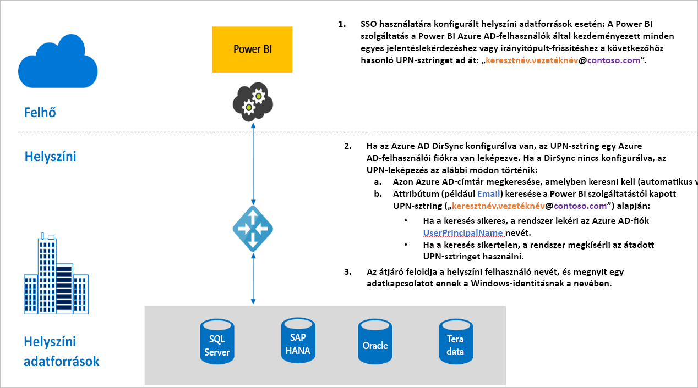

# Az egyszeri bejelentkezés (SSO) áttekintése a Power BI-ban található átjárókhoz

Közvetlen egyszeri bejelentkezéses kapcsolatot létesíthet, ha engedélyezi a Power BI-jelentések és -irányítópultok számára, hogy helyszíni adatokból végezzenek frissítést. Ehhez a helyszíni adatátjárót Kerberos általi korlátozott delegálással vagy a Security Assertion Markup Language (SAML) használatával kell konfigurálni. A helyszíni adatátjáró elősegíti az SSO-t a DirectQuery használatakor, amellyel a helyszíni adatforrásokhoz kapcsolódik.

Jelenleg az alábbi adatforrások használatát támogatjuk:

* SQL Server ([Kerberos](service-gateway-sso-kerberos.md))
* SAP HANA ([Kerberos](service-gateway-sso-kerberos.md) és [SAML](service-gateway-sso-saml.md)
* SAP BW ([Kerberos](service-gateway-sso-kerberos.md)
* Teradata ([Kerberos](service-gateway-sso-kerberos.md))
* Spark ([Kerberos](service-gateway-sso-kerberos.md))
* Impala ([Kerberos](service-gateway-sso-kerberos.md))

Ha egy felhasználó DirectQuery jelentést használ a Power BI szolgáltatásban, az összes keresztszűrő, szeletelő, rendezés és szerkesztési művelet olyan lekérdezéseket eredményezhet, amelyek az alapul szolgáló helyszíni adatforrásból dolgoznak.  Ha az egyszeri bejelentkezés konfigurálva van az adatforráshoz, akkor a Power BI-t használó felhasználó identitása alatt futnak a lekérdezések (vagyis a webtartalmakon vagy a Power BI-mobilalkalmazásokon keresztül). Így minden felhasználó pontosan azokat az adatokat látja, amelyekhez engedélye van az alapul szolgáló adatforrásban. Ha az egyszeri bejelentkezés konfigurálva van, nincsenek különböző felhasználók között megosztott adatok a gyorsítótárazás során.

## A lekérdezés lépései SSO futtatása esetén

Az SSO-val futó lekérdezés három lépésből áll, az alábbi ábrán látható módon.

> [!NOTE]
> Az egyszeri bejelentkezés az Oracle-ben még nem érhető el, de fejlesztés alatt áll és hamarosan elérhetővé válik.

További információk a lépésekről:

1. Az egyes lekérdezésekhez a **Power BI szolgáltatás** hozzárendeli az *egyszerű felhasználónevet* (UPN), amikor elküldi a lekérdezési kérést a konfigurált átjáróra.

2. Az átjárónak le kell képeznie az Azure Active Directory UPN-jét egy helyi Active Directory-identitásra.

   a.  Ha az Azure AD DirSync (más néven *Azure AD Connect*) konfigurálva van, akkor a leképezés automatikusan működik az átjáróban.

   b.  Ellenkező esetben az átjáró kikeresheti és leképezheti az Azure AD UPN-jét egy helyi felhasználóra a helyi Active Directory-tartományra irányuló keresés végrehajtásával.

3. Az átjárószolgáltatás folyamata megszemélyesíti a leképezett helyi felhasználót, megnyitja a kapcsolatot az alapul szolgáló adatbázishoz, és elküldi a lekérdezést. Az átjárót nem kell ugyanarra a gépre telepíteni, mint az adatforrást.

## Következő lépések

Most, hogy megismerte az SSO alapjait, a Kerberos és a SAML használatával kapcsolatos részletesebb információkért olvassa el az alábbi cikkeket:

* [Egyszeri bejelentkezés (SSO) – Kerberos](service-gateway-sso-kerberos.md)
* [Egyszeri bejelentkezés (SSO) – SAML](service-gateway-sso-saml.md)
