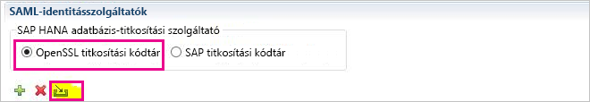
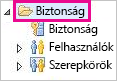
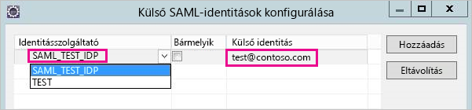
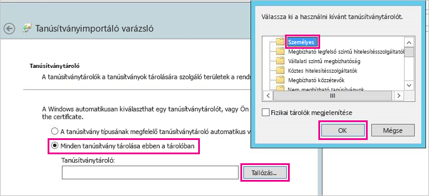
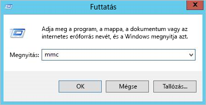
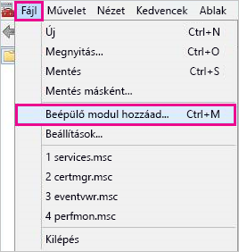
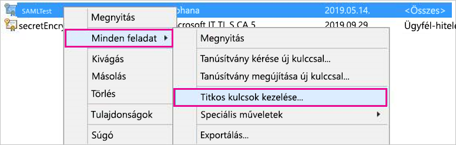
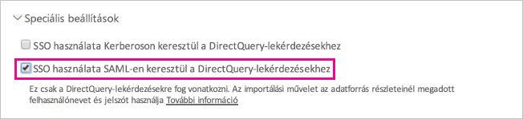

# <a name="use-security-assertion-markup-language-saml-for-single-sign-on-sso-from-power-bi-to-on-premises-data-sources"></a>A Security Assertion Markup Language (SAML) használata a Power BI-ból a helyszíni adatforrásokba történő egyszeri bejelentkezéshez (SSO)

Használhatja a [Security Assertion Markup Language- (SAML-)](https://www.onelogin.com/pages/saml) protokollt a közvetlen SSO-kapcsolat engedélyezéséhez. Az SSO engedélyezése egyszerűvé teszi a Power BI-jelentések és -irányítópultok számára az adatok helyszíni forrásokból történő frissítését.

## <a name="supported-data-sources"></a>Támogatott adatforrások

Jelenleg az SAP HANA használata támogatott a SAML-protokoll esetén. További információt az egyszeri bejelentkezés a SAML használatával az SAP HANA rendszerhez történő beállításáról és konfigurálásáról a [SAML-alapú a BI Platformhoz történő egyszeri bejelentkezést a HANA használatakor](https://wiki.scn.sap.com/wiki/display/SAPHANA/SAML+SSO+for+BI+Platform+to+HANA) ismertető témakörben talál az SAP HANA dokumentációjában.

További adatforrásokat a [Kerberos](service-gateway-sso-kerberos.md) használata esetén támogatunk.

Ne feledje, hogy a HANA számára a titkosítás engedélyezése **nagyon** ajánlott még az SAML SSO-kapcsolat létrehozása előtt (vagyis a HANA-kiszolgálót úgy kell konfigurálnia, hogy fogadja a titkosított kapcsolatokat, és az átjárót is úgy kell konfigurálnia, hogy titkosítást használjon a HANA-kiszolgálóval való kommunikációhoz). A HANA ODBC-illesztőprogram alapértelmezés szerint **nem** képes az SAML helyességi feltételeinek titkosítására, és bekapcsolt titkosítás nélkül az aláírt SAML típusú helyességi feltételt a rendszer az átjáróról a HANA-kiszolgálóra korlátozás nélkül küldi, így azt harmadik felek elfoghatják és újra felhasználhatják.

## <a name="configuring-the-gateway-and-data-source"></a>Az átjáró és az adatforrás konfigurálása

Az SAML használatához megbízhatósági kapcsolatot kell létrehoznia a HANA-kiszolgáló, amelyhez engedélyezni szeretné az SSO-t és az átjáró között, amely ebben a forgatókönyvben az SAML-identitásszolgáltatóként (IdP) szolgál. Ezt a kapcsolatot többféleképpen is létre lehet hozni, például az átjáró identitásszolgáltatója X509 szabvány szerint tanúsítványának a HANA-kiszolgálók megbízhatósági tárolójába való importálásával vagy az átjáró X509-tanúsítványának a HANA-kiszolgálók számára megbízhatónak minősülő legfelső szintű hitelesítésszolgáltató (CA) általi aláírásával. Ebben az útmutatóban az utóbbi megközelítést ismertetjük, de használhat más megközelítést is, ha az kényelmesebb.

Azt is vegye figyelembe, hogy ebben az útmutatóban OpenSSL-t használunk a HANA-kiszolgáló titkosítási szolgáltatójaként, de OpenSSL helyett az SAP titkosítási kódtár (másként CommonCryptoLib vagy sapcrypto) is használható a beállítási lépések végrehajtásához a bizalmi kapcsolat létrehozásakor. További információt a hivatalos SAP-dokumentációban találhat.

A következő lépések azt ismertetik, hogyan hozhat létre megbízhatósági kapcsolatot a HANA-kiszolgáló és az átjáró identitásszolgáltatója között az átjáró identitásszolgáltatója X509-tanúsítványának a HANA-kiszolgáló által megbízhatónak tekintett legfelső szintű hitelesítésszolgáltató általi aláírásával.

1. Hozza létre a legfelső szintű hitelesítésszolgáltató X509-tanúsítványát és titkos kulcsát. A legfelső szintű hitelesítésszolgáltató X509-tanúsítványának és a titkos kulcsának .pem formátumban történő létrehozásához például:

```
openssl req -new -x509 -newkey rsa:2048 -days 3650 -sha256 -keyout CA_Key.pem -out CA_Cert.pem -extensions v3_ca
```

Adja hozzá a tanúsítványt (például CA_Cert.pem) a HANA-kiszolgáló megbízhatósági tárolójához, hogy a HANA-kiszolgáló megbízzon a most létrehozott legfelső szintű hitelesítésszolgáltató által aláírt minden tanúsítványban. A HANA-kiszolgáló megbízhatósági tárolójának helye az **ssltruststore** konfigurációs beállítás vizsgálatával található meg. Ha követte a SAP dokumentációját azzal kapcsolatban, hogyan konfigurálja az OpenSSL-t, akkor a HANA-kiszolgáló már megbízhat egy legfelső szintű hitelesítésszolgáltatóban, amelyet újból felhasználhat. A részletekért [olvassa el, hogyan konfigurálja az OpenSSL-t az SAP HANA Studio és az SAP HANA-kiszolgálók közötti kommunikációhoz](https://archive.sap.com/documents/docs/DOC-39571). Ha több HANA-kiszolgálóval is rendelkezik, amelyekhez engedélyezi szeretné az SAML SSO-t, győződjön meg róla, hogy mindegyik kiszolgáló megbízik ebben a legfelső szintű hitelesítésszolgáltatóban.

1. Hozza létre az átjáró identitásszolgáltatója X509-tanúsítványát. Egy évig érvényes tanúsítvány-aláírási kérelemnek (IdP_Req.pem) és egy titkos kulcsnak (IdP_Key.pem) a létrehozásához például futtassa a következő parancsot:

```
 openssl req -newkey rsa:2048 -days 365 -sha256 -keyout IdP_Key.pem -out IdP_Req.pem -nodes
```


Írja alá a tanúsítvány-aláírási kérelmet annak a legfelső szintű hitelesítésszolgáltatónak a használatával, amelyet megbízhatóként konfigurált a HANA-kiszolgálókban. Ha például az IdP_Req.pem kérelmet a CA_Cert.pem és CA_Key.pem (a tanúsítvány és a legfelső szintű hitelesítésszolgáltató kulcsa) használatával szeretné aláírni, hajtsa végre a következő parancsot:

  ```
openssl x509 -req -days 365 -in IdP_Req.pem -sha256 -extensions usr_cert -CA CA_Cert.pem -CAkey CA_Key.pem -CAcreateserial -out IdP_Cert.pem
```
Az eredményül kapott identitásszolgáltatói tanúsítvány egy évig lesz érvényes (lásd a -days kapcsolót). Most importálja az identitásszolgáltatói tanúsítványát a HANA Studióban egy új SAML-identitásszolgáltató létrehozásához.

1. Az SAP HANA Studio felületén kattintson a jobb gombbal az SAP HANA-kiszolgáló mezőjére, majd nyissa meg a **Security** > **Open Security Console** > **SAML Identity Provider** > **OpenSSL Cryptographic Library** (Biztonság>Biztonsági konzol megnyitása>SAML-identitásszolgáltató>OpenSSL titkosítási kódtár) elemet.

    

1. Válassza az **Import** (Importálás) lehetőséget, keresse meg az IdP_Cert.pem nevű elemet, és importálja azt.

1. Az SAP HANA Studio felületén nyissa meg a **Security** (Biztonság) mappát.

    

1. Nyissa meg a **Users** (Felhasználók) menüt, majd válassza ki azt a felhasználót, akihez társítani szeretné a Power BI-felhasználóját.

1. Válassza ki a **SAML** majd a **Configure** (Konfigurálás) elemet.

    

1. Válassza ki a 2. lépésben létrehozott identitásszolgáltatót. A **külső azonosító**, adja meg a Power BI-felhasználó egyszerű Felhasználónevét (általában az e-mail-cím a felhasználó bejelentkezik a Power bi-bA), majd válassza ki **Hozzáadás**. Vegye figyelembe, hogy ha konfigurálta az átjáró használatához a ADUserNameReplacementProperty konfigurációs beállítást kell megadnia, amely felváltja a Power BI-felhasználó eredeti UPN értékét. Például ha a ADUserNameReplacementProperty SAMAccountName kell adnia a felhasználó SAMAccountName.

    

Most, hogy rendelkezik a beállított tanúsítvánnyal és identitással, alakítsa át a tanúsítványt pfx-formátumúra, és konfigurálja az átjárót tartalmazó számítógépet a tanúsítvány használatára.

1. Alakítsa át a tanúsítványt pfx-formátumúra a következő parancs futtatásával. Vegye figyelembe, hogy ez a parancs a „root” értéket állítja be a pfx-fájl jelszavaként.

    ```
    openssl pkcs12 -export -out samltest.pfx -in IdP_Cert.pem -inkey IdP_Key.pem -passin pass:root -passout pass:root
    ```

1. Másolja a pfx-fájlt az átjárót tartalmazó számítógépre:

    1. Kattintson duplán a samltest.pfx fájlra, majd válassza a **Helyi gép** > **Tovább** elemet.

    1. Írja be a jelszót, majd válassza a **Tovább** elemet.

    1. Válassza a **Minden tanúsítvány tárolása ebben a tárolóban** lehetőséget, majd kattintson a **Tallózás** > **Személyes** > **OK** elemre.

    1. Kattintson a **Tovább**, majd a **Befejezés** gombra.

    

1. Biztosítsa az átjárószolgáltatás-fiók hozzáférését a tanúsítvány titkos kulcsához:

    1. Az átjárót tartalmazó számítógépen futtassa a Microsoft Management Console-t (MMC).

        

    1. A **Fájl** menüben válassza ki a **Beépülő modul hozzáadása/eltávolítása** elemet.

        

    1. Válassza ki a **Tanúsítványok** > **Hozzáadás** elemet, majd kattintson a **Számítógép-fiók** > **Tovább** elemre.

    1. Kattintson a **Helyi számítógép** > **Befejezés** > **OK** elemre.

    1. Bontsa a **Tanúsítványok** > **Személyes** > **Tanúsítványok** tartalmát, és keresse meg a tanúsítványt.

    1. Kattintson a jobb gombbal a tanúsítványra, és válassza a **Minden feladat** > **Titkos kulcsok kezelése** elemet.

        

    1. Adja hozzá az átjárószolgáltatás-fiókot a listához. Alapértelmezés szerint a fiók az **NT SERVICE\PBIEgwService**. Úgy tudhatja meg, hogy melyik fiók futtatja az átjárószolgáltatást, hogy elindítja a **services.msc** parancsot, és megkeresi a **Helyszíni adatátjáró szolgáltatás** bejegyzést.

        

Végül kövesse ezeket a lépéseket a tanúsítvány-ujjlenyomat az átjáró konfigurációjához történő hozzáadásához.

1. Az alábbi PowerShell-parancs futtatásával megjelenítheti a számítógépén található tanúsítványokat.

    ```powershell
    Get-ChildItem -path cert:\LocalMachine\My
    ```
1. Másolja ki az Ön által létrehozott tanúsítvány ujjlenyomatát.

1. Keresse meg az átjáró könyvtárát, amelynek alapértelmezett helye: C:\Program Files\On-premises data gateway.

1. Nyissa meg a PowerBI.DataMovement.Pipeline.GatewayCore.dll.config fájlt, és keresse meg a \*SapHanaSAMLCertThumbprint\* szakaszt. Illessze be a vágólapra másolt ujjlenyomatot.

1. Indítsa újra az átjárószolgáltatást.

## <a name="running-a-power-bi-report"></a>Power BI-jelentés futtatása

Most már használhatja az **Átjáró kezelése** lapot a Power BI-ban az adatforrás konfigurálásához, a **Speciális beállítások** alatt pedig engedélyezze az SSO-t. Ezután közzétehet az adatforráshoz kötődő jelentéseket és adatkészleteket.



## <a name="troubleshooting"></a>Hibaelhárítás

Az SSO konfigurálása után a következő hibaüzenet jelenhet meg a Power BI-portálon: „A megadott hitelesítő adatok nem használhatók az SapHana forráshoz.” Ez a hiba azt jelenti, hogy az SAP HANA elutasította az SAML-hitelesítő adatokat.

A hitelesítés követése részletes információt nyújt az SAP HANA hitelesítési hibáinak elhárításához. SAP HANA-kiszolgálójához az alábbi lépések végrehajtásával konfigurálhat követést.

1. Az SAP HANA-kiszolgálón az alábbi lekérdezés futtatásával kapcsolhatja be a hitelesítés követését.

    ```
    ALTER SYSTEM ALTER CONFIGURATION ('indexserver.ini', 'SYSTEM') set ('trace', 'authentication') = 'debug' with reconfigure 
    ```

1. Reprodukálja a felmerült hibát.

1. A HANA Studióban nyissa meg a felügyeleti konzolt, majd lépjen a **Diagnosztikai fájlok** lapra.

1. Nyissa meg a legújabb indexkiszolgálói nyomkövetést, és keresse meg a SAMLAuthenticator.cpp fájlt.

    Itt részletes hibaüzenetet kell találnia, amely az alábbi példához hasonlóan megadja a hiba elsődleges okát.

    ```
    [3957]{-1}[-1/-1] 2018-09-11 21:40:23.815797 d Authentication   SAMLAuthenticator.cpp(00091) : Element '{urn:oasis:names:tc:SAML:2.0:assertion}Assertion', attribute 'ID': '123123123123123' is not a valid value of the atomic type 'xs:ID'.
    [3957]{-1}[-1/-1] 2018-09-11 21:40:23.815914 i Authentication   SAMLAuthenticator.cpp(00403) : No valid SAML Assertion or SAML Protocol detected
    ```

1. A hibaelhárítás befejezése után kapcsolja ki a hitelesítés követését az alábbi lekérdezés futtatásával.

    ```
    ALTER SYSTEM ALTER CONFIGURATION ('indexserver.ini', 'SYSTEM') UNSET ('trace', 'authentication');
    ```

## <a name="next-steps"></a>Következő lépések

A **helyszíni adatátjáróval** és a **DirectQueryvel** kapcsolatos további információkért lásd az alábbi forrásanyagokat:

* [On-premises data gateway (Helyszíni adatátjáró)](service-gateway-onprem.md)
* [A DirectQuery használata a Power BI-ban](desktop-directquery-about.md)
* [A DirectQuery által támogatott adatforrások](desktop-directquery-data-sources.md)
* [A DirectQuery és az SAP BW](desktop-directquery-sap-bw.md)
* [A DirectQuery és az SAP HANA](desktop-directquery-sap-hana.md)
