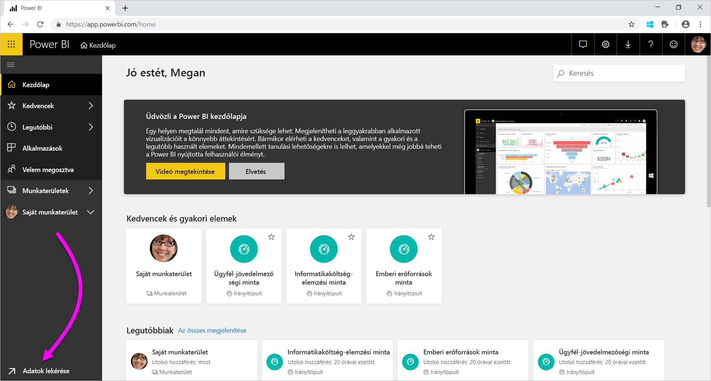
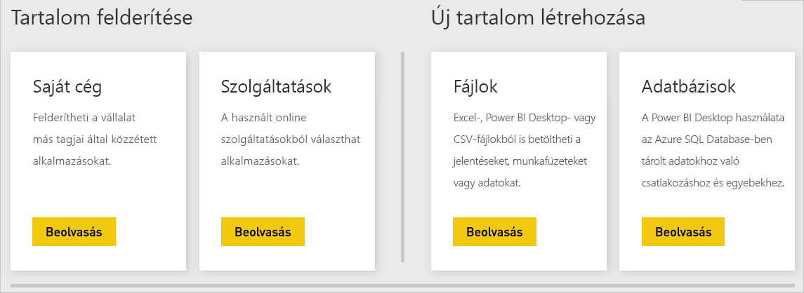
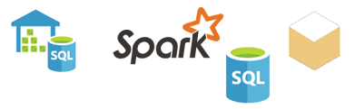

# Adatforrások a Power BI szolgáltatásban
A Power BI legfontosabb összetevői maguk az adatok. Tegyük fel, hogy adatfeltárást végez. Ezt megteheti diagramok és irányítópultok létrehozásával vagy **Q&A**-beli kérdésfeltevéssel. A látott vizualizációk és válaszok egy adatkészletből merítik az adatokat. De honnan származik ez az adatkészlet? Egy adatforrásból.

Ez a cikk sorra veszi az adatforrástípusokat, amelyekhez a Power BI szolgáltatásból kapcsolódhat. Ne feledje, hogy adatokhoz sok más típusú adatforrásból is hozzájuthat. Az ilyen adatforrásokhoz szükség lehet a Power BI Desktop vagy az Excel speciális adatlekérdezési és modellezési funkcióinak a használatára. Ezeket később tárgyaljuk részletesebben. Egyelőre tekintsük át azokat a különféle adatforrástípusokat, amelyek közvetlenül a Power BI szolgáltatás webhelyéről elérhetők.

A Power BI bármelyik adatforrásából kérhet le adatokat. Ehhez a lap bal alsó sarkában található **Adatok lekérése** lehetőségre van szüksége.

 

Az **Adatok lekérése** elem kiválasztása után kiválaszthatja az elérni kívánt adatokat

## Tartalom felderítése

A **Tartalom felderítése** szakasz előkészítve tartalmaz minden szükséges adatot és jelentést. A Power BI kétféle tartalomcsomaggal rendelkezik: Szervezeti és szolgáltatásokkal kapcsolatos. 

**Szervezeti**: Ha Ön és a cég más felhasználói Power BI Pro-fiókkal rendelkeznek, akkor létrehozhatnak, megoszthatnak és használhatnak is tartalomcsomagokat. További információ: [Céges tartalomcsomagok: bevezetés](service-organizational-content-pack-introduction.md).

**Szolgáltatások**: Több tucat, Power BI-tartalomcsomagokat kínáló szolgáltatás létezik, és a kör folyamatosan bővül. A szolgáltatások többsége saját fiók használatát követeli meg. További információ: [Kapcsolódás szolgáltatásokhoz a Power BI-jal](service-connect-to-services.md).

## Új tartalom létrehozása

Az **Új tartalom létrehozása** szakaszban több opciót is találhat tartalom létrehozására és importálására. A Power BI kétféle módot kínál saját tartalom létrehozására vagy importálására: Fájlok és adatbázisok. 

### Fájlok

**Excel** ( *.xlsx*, *.xlsm*) – Az Excel munkafüzetei különböző adattípusokat tartalmazhatnak. Tartalmazhatnak például olyan adatokat, amelyeket Ön adott meg munkalapokon. Olyan adatokat is tartalmazhatnak, amelyeket külső adatforrásokból kérdezett le és töltött be a Power Query segítségével. A Power Query az Excel 2016-ban vagy a Power Pivotben az **Adatok beolvasása és átalakítása** művelettel használható. Adatokat munkalapok táblázataiból vagy egy adatmodellből importálhat. További információ: [Adatok beolvasása a Power BI-ba fájlokból](service-get-data-from-files.md).

**Power BI Desktop** ( *.pbix*) – A Power BI Desktop használatával lekérdezhet és beolvashat külső adatforrásban lévő adatokat, és jelentéseket hozhat létre. Emellett mértékekkel és adatkapcsolatokkal bővítheti az adatmodellt, vagy importálhatja a Power BI Desktop-fájlt a Power BI-webhelyre. A Power BI Desktop a haladó felhasználók számára ideális. Ezek a felhasználók általában jól ismerik az adatforrásaikat. Emellett tisztában vannak az adatlekérdezéssel és -átalakítással, valamint az adatmodellezés fogalmaival. További információt a [Kapcsolódás adatokhoz a Power BI Desktopban](desktop-connect-to-data.md) című cikkben talál.

**Vesszővel tagolt értékek** ( *.csv*) – Ezek a fájlok adatsorokat tartalmazó, egyszerű szöveges fájlok. Minden sor egy vagy több értéket tartalmaz, vesszővel elválasztva. Egy név- és címadatokat tartalmazó *.csv* fájl például számos sorral rendelkezhet. Minden sor tartalmazhat keresztnévre, vezetéknévre, utcanévre, városra, államra és hasonlókra vonatkozó értékeket. *.csv*-fájlba nem importálhat adatokat, de sok alkalmazás, például az Excel képes egy különálló táblázat adatait *.csv*-fájlba menteni.

Más fájltípusok, például XML-táblázatok ( *.xml*) vagy szöveges fájlok ( *.txt*) esetében az adatok először a **Beolvasás és átalakítás** funkcióval kérdezhetők le, alakíthatók át és olvashatók be egy Excel- vagy egy Power BI Desktop-fájlba. Ezután importálhatja az Excel- vagy Power BI Desktop-fájlt a Power BI-ba.

Az is sokat számít, hogy hol tárolja a fájlokat. A OneDrive Vállalati verzió biztosítja a legnagyobb rugalmasságot és az integrációt a Power BI-jal. A fájlokat a helyi meghajtón is tárolhatja. Azonban ilyen esetben néhány további lépéssel jár az adatok frissítése. További információkat az alábbi cikkekben találhat.

### Adatbázisok

**Felhőbeli adatbázisok** – a Power BI szolgáltatásból élőben kapcsolódhat az alábbiakhoz:

* Azure SQL Database
* Azure SQL Data Warehouse
* Spark on Azure HDInsight

Ezen adatbázisokhoz élőben csatlakozhat a Power BI-ból. Tegyük fel, hogy egy Azure SQL-adatbázishoz csatlakozik. Ezután megkezdi az adatok felfedezését jelentések létrehozásával. Az adatok szeletelésekor vagy új mező a vizualizációhoz való hozzáadásakor a Power BI közvetlenül az adatbázisban végez lekérdezést. További információ: [Az Azure és a Power BI](service-azure-and-power-bi.md).

**Helyszíni adatbázisok** – A Power BI szolgáltatásból közvetlenül kapcsolódhat az SQL Server Analysis Services táblázatos modellű adatbázisaihoz. Ehhez Power BI Vállalati átjáróra lesz szüksége. Ha nem tudja biztosan, hogyan kapcsolódhat a cége táblázatos modellű adatbázisához, akkor egyeztessen a rendszergazdával vagy az informatikai részleggel. További információ: [Az SQL Server Analysis Services élő adatai a Power BI-ban](sql-server-analysis-services-tabular-data.md).

A cége más típusú adatbázisaihoz a Power BI Desktop vagy az Excel használatával kell kapcsolódnia, hogy lekérdezze és beolvassa az adatokat egy adatmodellbe. Ezután importálhatja a fájlt a Power BI-ba, ahol létezik egy adatkészlet. Ha konfigurálja az ütemezett frissítést, akkor a Power BI a fájlban lévő kapcsolódási információ és konfiguráció alapján közvetlenül az adatforráshoz kapcsolódva kérdezi le a frissítéseket. A Power BI ezután betölti ezeket a frissítéseket az adatkészletbe. További információt a [Kapcsolódás adatokhoz a Power BI Desktopban](desktop-connect-to-data.md) című cikkben talál.

## Mi a helyzet, ha az adataim másféle forrásból származnak?
A Power BI-jal több százféle adatforrás használható. Akárhonnan is tölti be az adatokat, azoknak a Power BI szolgáltatás által feldolgozható formátumban kell lenniük. A feldolgozható adatokkal a Power BI szolgáltatás jelentéseket és irányítópultokat képes létrehozni, **Q&A** kérdéseket képes megválaszolni, és hasonló műveleteket hajthat végre.

Egyes adatforrások adatai már a Power BI szolgáltatáshoz vannak formázva. Ilyen források például a Google Analytics és a Twilio szolgáltató tartalomcsomagjai. Az SQL Server Analysis Services táblázatos modellű adatbázisai is felhasználásra készek. Az olyan felhőbeli adatbázisokkal, mint az Azure SQL Database és a Spark on HDInsight élő kapcsolat hozható létre.

Más esetekben szükséges lehet a kívánt adatokat egy fájlba lekérdezni és betölteni. Tegyük fel, hogy logisztikai adatai vannak a cége egyik kiszolgálóján. Ezeket az adatokat egy adattárházbeli adatbázisban tárolja. A Power BI szolgáltatásban nem kapcsolódhat az adatbázishoz, hogy megkezdje az adatok vizsgálatát (hacsak nem táblázatos modellű adatbázis). A Power BI Desktop vagy az Excel használatával viszont egy adatmodellbe kérdezheti le és olvashatja be, majd fájlként mentheti a logisztikai adatokat. Ezt a fájlt aztán importálhatja a Power BI-ba, ahol létezik egy adatkészlet.

Most bizonyára arra gondol, hogy azok a logisztikai adatok naponta változnak az adatbázisban. Hogyan frissíthető tehát a Power BI-adatkészlet? Amikor importálja az adatokat az adatkészletbe, a Power BI Desktop- vagy Excel-fájlból kapcsolódási információkat is importál.

Tegyük fel, hogy ütemezett frissítést konfigurál, vagy manuális frissítést végez az adatkészleten. A Power BI az adatkészlet kapcsolati adatait, valamint néhány további beállítást használ az adatbázishoz való közvetlen kapcsolódáshoz. Ezután lekérdezi a frissítéseket, majd betölti őket az adatkészletbe. Megjegyzés: a helyszíni kiszolgáló és a Power BI közötti biztonságos adatátvitelhez valószínűleg Power BI-átjáró szükséges. Az átvitel után a jelentések és az irányítópultok vizualizációi automatikusan frissülnek.

Mint láthatja, annak ellenére, hogy az adatforráshoz nem lehet közvetlenül a Power BI-ból kapcsolódni, beolvashatja az adatokat a Power BI-ba. Mindez csupán néhány további lépést és talán némi informatikai segítséget igényel. További információ: [Adatforrások a Power BI Desktopban](desktop-data-sources.md).

## További részletek
A Power BI használata során gyakran találkozik az „adatkészlet” és az „adatforrás” kifejezéssel. Ezeket gyakran azonos értelemben használják. Valójában két különböző, bár összefüggő dolgot jelentenek.

Akkor hoz létre **adatkészletet** automatikusan a Power BI-ban, amikor az **Adatok lekérése** lehetőséget használja. Az **Adatok lekérése** funkcióval egy tartalomcsomaghoz vagy fájlhoz kapcsolódhat, és adatokat importálhat, vagy egy élő adatforráshoz kapcsolódhat. Az adathalmazok az adatforrást leíró információt és az adatforrásbeli hitelesítő adatokat tartalmazzák. Sok esetben pedig az adatoknak egy, az adatforrásból másolt részhalmazát is tartalmazzák. A jelentésekben és irányítópultokon létrehozott vizualizációk esetén az adatkészletben lévő adatok látszanak.

Egy **adatforrás** az adatkészletbeli adatok származási helye. Az adatok például származhatnak a következő helyekről:

* Online szolgáltatásból, például a Google Analytics vagy a QuickBooks szolgáltatásból
* Egy felhőbeli adatbázisból, például az Azure SQL Database-ből
* Egy saját céges, helyi gépen vagy kiszolgálón található adatbázisból vagy fájlból

## Adatfrissítés
Előfordulhat, hogy a fájlokat a helyi meghajtón vagy egy céges meghajtón menti. Power BI-átjáróra lehet szüksége, hogy az adatkészletet frissíthesse a Power BI-ban. A fájlt tároló számítógépnek bekapcsolva kell lennie a frissítéskor. A fájlt újra is importálhatja, vagy használhatja az Excel vagy a Power BI Desktop Közzététel lehetőségét, de ezek nem automatizált folyamatok.

Ha a fájlokat a OneDrive Vállalati verziójára vagy a SharePoint-csapatwebhelyekre menti, ezekhez kapcsolódhat, vagy importálhatjaja őket a Power BI-ba. Az adathalmaza, a jelentései és az indítópultjai így mindig naprakészek lesznek. Mivel a OneDrive és a Power BI is a felhőben van, a Power BI közvetlenül kapcsolódhat a mentett fájlhoz. Ezt körülbelül óránként egyszer végzi el, majd frissítéseket keres. Az adatkészlet és a vizualizációk automatikusan frissülnek, ha elérhetők frissítések.

A szolgáltatásokból származó tartalomcsomagok automatikusan frissülnek. Ez legtöbbször naponta egyszer történik meg. Frissíthet manuálisan is, de hogy megjelennek-e a frissített adatok, az a szolgáltatótól függ. A cége más tagjaitól származó tartalomcsomagok frissítései a felhasznált adatforrásoktól függnek. Az is számít, hogy a tartalomcsomag létrehozója hogyan állította be a frissítést.

Az Azure SQL Database, az Azure SQL Data Warehouse, és a Spark on Azure HDInsight mind felhőbeli adatforrások. Mivel a Power BI szolgáltatás is a felhőben fut, a Power BI élőben kapcsolódhat hozzájuk a **DirectQuery** használatával. A Power BI-ban látható tartalom mindig szinkronizálva van, ezért nincs szükség ütemezett frissítés beállítására.

Amikor a Power BI-ból kapcsolódik az SQL Server Analysis Serviceshez, élő kapcsolat jön létre, egy felhőbeli Azure-adatbázishoz hasonlóan. A különbség az, hogy az adatbázis egy saját céges kiszolgálón található. Az ilyen típusú kapcsolathoz Power BI-átjáró szükséges, amelyet az informatikai részleg konfigurál.

Az adatfrissítés kiemelten fontos a Power BI-ban, és túlságosan mély témakör ahhoz, hogy itt kifejtsük. Ha szeretné alaposan körüljárni, akkor olvassa el az [Adatfrissítés a Power BI-ban](refresh-data.md) című cikket.

## Megfontolandó szempontok és korlátozások
A Power BI szolgáltatásban használt összes adatforrásra érvényesek az alábbi szempontok és korlátozások. Léteznek más, egyes funkciókra vonatkozó korlátozások is, de a következő felsorolás a Power BI szolgáltatás egészére érvényes:

* **Adatkészletek méretkorlátja** – A Power BI szolgáltatásban a megosztott kapacitásban tárolt egyes adatkészletek méretének felső határa 1 GB. Ha nagyobb adatkészletekre van szüksége, használhatja a [Power BI Premiumot](service-premium-what-is.md).

* **Egyedi értékek egy oszlopban** – Ha egy Power BI-adatkészletben (más néven „Importálási” módban) végez gyorsítótárazást, az oszlopokban tárolható egyedi értékek maximális száma 1.999.999.997.

* **Sorokra vonatkozó korlát** – A **DirectQuery** használata esetén a Power BI korlátozza az alapul szolgáló adatforrásnak elküldhető lekérdezési eredményeket. Ha az adatforrásnak elküldött lekérdezés több mint 1.000.000 sort ad vissza, hibaüzenet jelenik meg, és a lekérdezés meghiúsul. Az alapul szolgáló adat azonban tartalmazhat több mint 1 millió sort. Nem valószínű, hogy ezt a korlátot eléri, mivel a legtöbb jelentés az adatokat kisebb eredménykészletekben összesíti.

* **Oszlopkorlát** – Az oszlopok legnagyobb megengedett száma egy adatkészletben, az adatkészlet összes táblájában összesen 16 000. Ez a korlátozás Power BI szolgáltatásra és a Power BI Desktopban használt adatkészletekre is vonatkozik. Power BI így nyomon követi az adatkészlet oszlopainak és tábláinak számát, ami azt jelenti, hogy az oszlopok maximális száma 16.000 mínusz egy az adatkészlet minden táblájánál.

