# Oktatóanyag: Első lépések a Power BI szolgáltatással
Ez az oktatóanyag a *Power BI szolgáltatás* néhány funkciójához nyújt bevezetést. Ennek során adatokhoz csatlakozhat, jelentést és irányítópultot hozhat létre, és kérdéseket tehet fel az adatokkal kapcsolatban. A Power BI szolgáltatásban ezeken kívül sok mást is megtehet, ez az oktatóanyag csak kedvcsináló. Ha szeretné megérteni, hogyan illeszkedik a Power BI szolgáltatás a többi Power BI-ajánlathoz, javasoljuk, olvassa el [A Power BI bemutatása](fundamentals/power-bi-overview.md) című szakaszt.

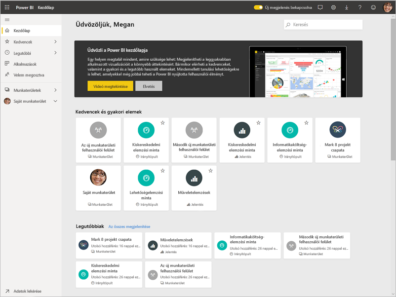

A jelen oktatóanyagban az alábbi lépéseket fogja végrehajtani:

> [!div class="checklist"]
> * Bejelentkezés a Power BI online-fiókjába, vagy regisztrálás, ha még nincs fiókja.
> * A Power BI szolgáltatás megnyitása.
> * Az adatok lekérése és megnyitása Jelentés nézetben.
> * Az adatok használata vizualizációk létrehozásához és jelentésként való mentéshez.
> * Irányítópult létrehozása jelentésből származó csempék rögzítésével.
> * Új vizualizációk hozzáadása az irányítópulthoz a Q&A természetes nyelvű eszközzel.
> * Az irányítópult csempéinek átméretezése, átrendezése és kezelése.
> * Erőforrások felszabadítása az adatkészlet, jelentés és irányítópult törlésével.

> [!TIP]
> Ehelyett egy ingyenes, saját tempóban elvégezhető tanfolyamot szeretne? [Regisztráljon Analyzing and Visualizing Data (Adatok elemzése és vizualizációja) tanfolyamunkra az Edx-en](https://aka.ms/edxpbi).

## Regisztráció a Power BI szolgáltatásra
Ha még nincs Power BI Pro-fiókja, a kezdés előtt [hozzon létre egy ingyenes Power BI Pro próbaverziós fiókot](https://app.powerbi.com/signupredirect?pbi_source=web).

A fiók létrehozása után írja be az *app.powerbi.com* címet a böngészőbe Power BI szolgáltatás megnyitásához. 

## 1\. lépés: Adatok lekérése

A Power BI-jelentések létrehozása többnyire a Power BI Desktopban kezdődik. Ezúttal a Power BI szolgáltatásban fogunk teljesen új jelentést létrehozni.

Ebben az oktatóanyagban az adatok egy CSV-fájlból származnak. Ha érdekli a megoldás, tartson velünk. [Töltse le a Pénzügyi minta CSV-fájlt](https://go.microsoft.com/fwlink/?LinkID=521962).

1. [Jelentkezzen be a Power BI-ba](https://www.powerbi.com/). Még nincs fiókja? Ne aggódjon, regisztrálhat ingyenes próbaverzióra.
2. A Power BI a böngészőjében nyílik meg. Kattintson az **Adatok lekérése** elemre a navigációs panel alján.

    Ekkor megnyílik az **Adatok lekérése** lap.   

3. Az **Új tartalom létrehozása** szakaszban válassza a **Fájlok** lehetőséget. 
   
   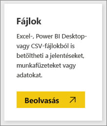
4.  Válassza a **Helyi fájl** lehetőséget.
   
    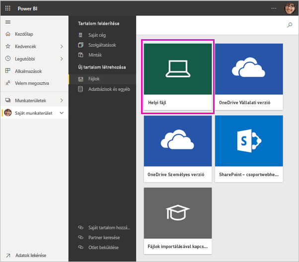

5. Tallózással keresse meg a fájlt a számítógépen, majd válassza a **Megnyitás** gombot.

5. Ebben az oktatóanyagban az **Importálás** lehetőséget választva fogjuk az Excel-fájlt adathalmazként felvenni, amelyből aztán jelentéseket és irányítópultokat hozhatunk létre. Ha a **Feltöltés** lehetőséget választja, az egész Excel-munkafüzet fel lesz töltve a Power BI-ba, ahol megnyithatja és szerkesztheti az Excel Online-ban.
   
   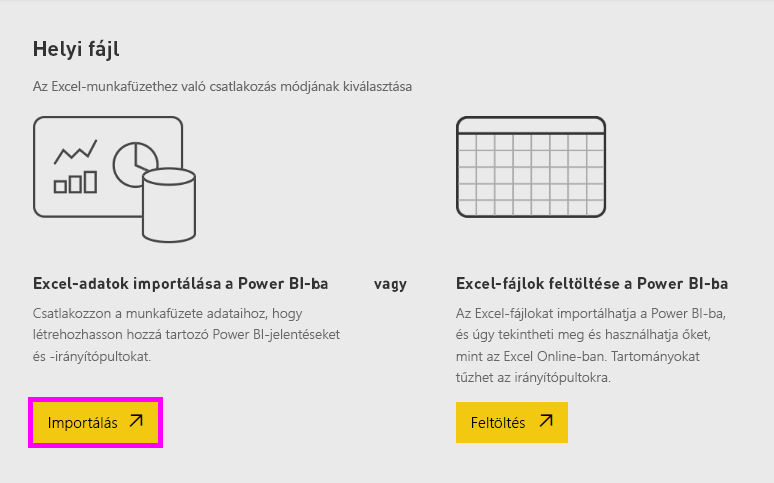
6. Ha az adathalmaz kész, válassza az **Adathalmazok** lehetőséget, majd a **Pénzügyi minta** adathalmaz melletti **Jelentés létrehozása** elemet a jelentésszerkesztő megnyitásához. 

    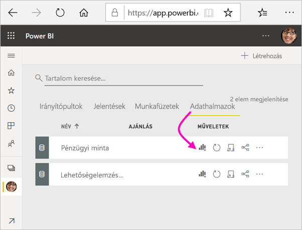

    A jelentésvászon üres. Jobb oldalon a **Szűrők**, a **Vizualizációk** és a **Mezők** panel látható.

    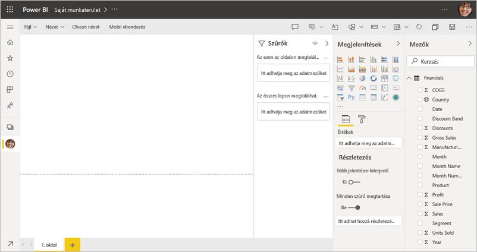

7. A felső navigációs ablaktáblán elérhető egy **Olvasó nézet** lehetőség. Mivel elérhető ez az opció, ez azt jelenti, hogy jelenleg Szerkesztési nézetben van. A jelentésszerkesztővel való ismerkedés nagyszerű módja egy [bemutató megtekintése](service-the-report-editor-take-a-tour.md).

    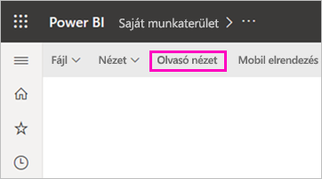

    Azért hozhat létre és módosíthat jelentéseket a Szerkesztési nézetében, mert Ön a jelentés *tulajdonosa*. Azaz *létrehozó*. Ha a jelentést megosztja a munkatársakkal, csak Olvasó nézetben fogják tudni használni azt; ők a *felhasználók*. További információ az [Olvasó nézetről és a Szerkesztési nézetről](consumer/end-user-reading-view.md).

## 2\. lépés: Diagram létrehozása jelentésben
Most, hogy adatokhoz csatlakozott, megismerkedhet a felülettel.  Ha valami érdekeset talál, létrehozhat egy irányítópultot, hogy figyelje, és hogy ellenőrizze, hogyan változik az idő múlásával. Nézzük meg, hogyan is működik ez.
    
1. A jelentésszerkesztőben először a lap jobb oldalán található **Mezők** ablaktábla használatával fogunk létrehozni egy vizualizációt. Jelölje be a **Gross Sales** (Bruttó értékesítés) és a **Date** (Dátum) melletti jelölőnégyzetet.
   
   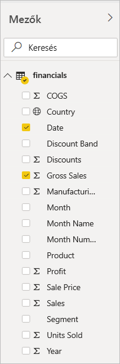

    A Power BI elemzi az adatokat, és létrehoz egy vizualizációt. Ha először a **Date** melletti négyzetet jelölte be, egy táblázat fog megjelenni. Ha először a **Gross Sales** négyzetét jelölte be, egy oszlopdiagram fog megjelenni. 

2. Váltson át egy másik adatmegjelenítési módra. Tekintsük meg ezeket az adatokat egy vonaldiagramon. A **Vizualizációk** panelen válassza a vonaldiagram ikont.
   
   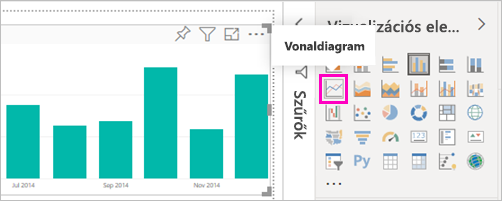

3. Ez a diagram érdekesnek tűnik, szóval *rögzítsük* egy irányítópulton. Vigye az egeret a vizualizáció fölé, és válassza a Rögzítés ikont. Ha rögzíti a vizualizációt, a rendszer az irányítópulton tárolja és naprakészen tartja, hogy egyetlen pillantással nyomon tudja követheti a legújabb értékeket.
   
   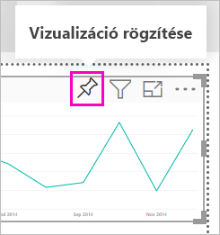

4. Mivel ez egy új jelentés, a rendszer először kéri, hogy mentse, mielőtt vizualizációkat rögzíthetne irányítópultokon. Adjon nevet a jelentésnek (példa: *Értékesítés az idő függvényében*), majd válassza a **Mentés** lehetőséget. 

5. Válassza az **Új irányítópult** lehetőséget, és adja meg hozzá az *Oktatóanyag pénzügyi mintája* nevet. 
   
   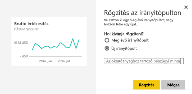
   
6. Válassza a **Rögzítés** lehetőséget.
   
    A jobb felső sarokban megjelenik a sikert jelző üzenet, amely tájékoztatja, hogy a vizualizáció csempeként hozzá lett adva az irányítópulthoz.
   
    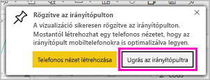

7. Az **Ugrás az irányítópultra** lehetőséggel megtekintheti az új irányítópultot a rajta csempeként rögzített vonaldiagrammal. 
   
   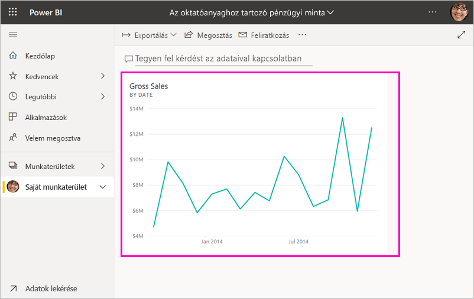
   
8. A jelentéshez visszatérhet, ha az új csempét választja az irányítópulton. A Power BI a jelentéshez lépteti vissza Olvasó nézetben. 

1. Térjen vissza a Szerkesztés nézetre, és válassza a **További lehetőségek** (...) elemet a felső navigációs ablaktábla **Szerkesztés** menüjében. Szerkesztés nézetben tovább böngészhet, és csempéket is rögzíthet.

    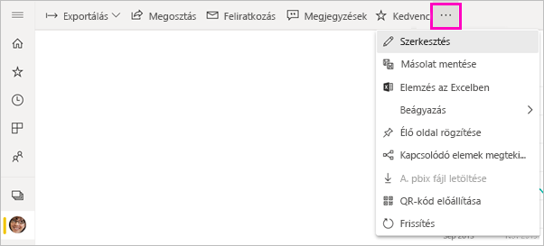

## 3\. lépés: Felfedezés a Q&A használatával

Az adatok gyors feltárásához próbáljon kérdést feltenni a Q&A kérdésmezőjében. A Q&A az adatokkal kapcsolatos természetes nyelvű lekérdezéseket hoz létre. Az irányítópulton a Q&A felül található (**Tegyen fel kérdést az adataival kapcsolatban**). A jelentésben a felső navigációs ablaktáblán helyezkedik el (**Kérdés feltevése**).

1. Az irányítópulthoz úgy térhet vissza, hogy a fekete **Power BI** sáv **Saját munkaterület** elemét választja.

    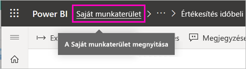

1. Az **Irányítópultok** lapon válassza ki saját irányítópultját.

    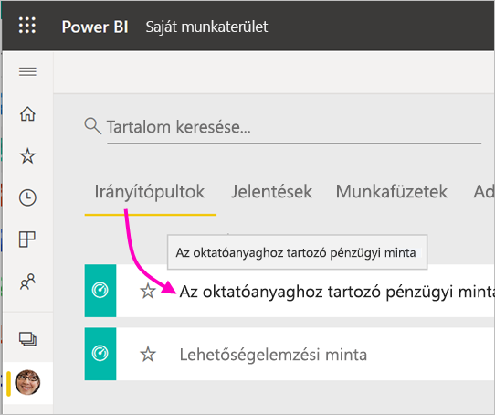

1. Válassza a **Tegyen fel kérdést az adataival kapcsolatban** lehetőséget. A Q&A automatikusan felkínál néhány javaslatot.

    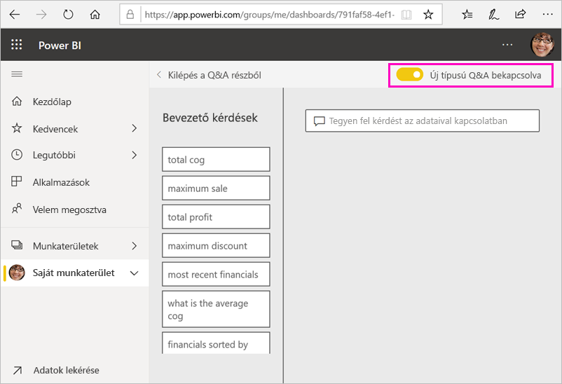

    > [!NOTE]
    > Ha nem lát javaslatokat, kapcsolja be az **új Q&A felületet**.

2. A javaslatok közül néhány csak egyetlen értéket ad vissza. Válassza ki például az **értékesítések maximuma** javaslatot.

    A Q&A megkeresi a választ, és egy *kártyavizualizáció* formájában jeleníti meg azt.

    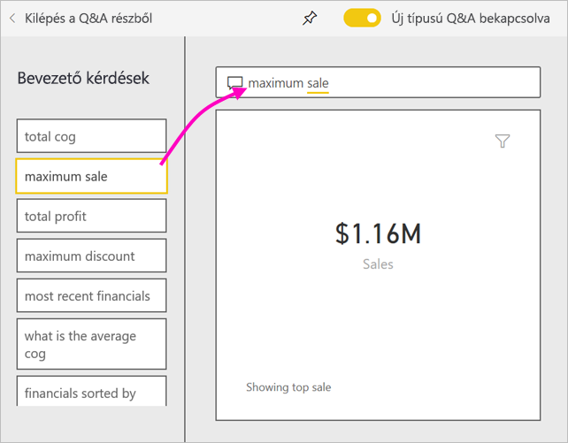

3. Válassza a gombostű ikont,  hogy ez a vizualizáció megjelenjen az Oktatóanyag pénzügyi mintája irányítópulton.

1. Görgessen lefelé a **Bevezető kérdések** listában, és válassza ki az **átlagos termékköltség havonta** kérdést. 

    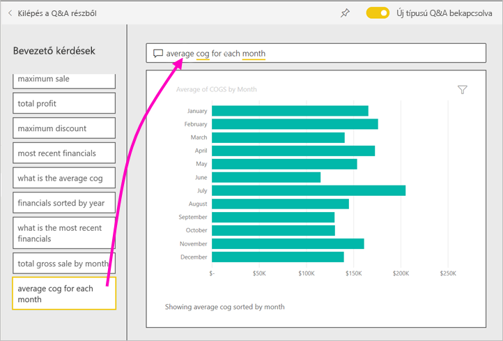

1. Rögzítse a sávdiagramot az **Oktatóanyag pénzügyi mintája** irányítópulton is.

1. Helyezze a kurzort a *havonta* szó mögé a Q&A mezőben, és gépelje be a *vonalként* szöveget. Válassza a **vonal (vizualizációsablon)** lehetőséget. 

    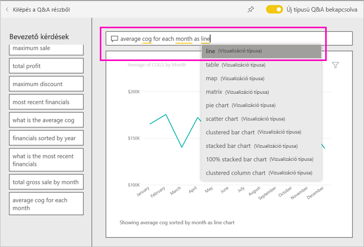

4. Válassza a **Q&A bezárása** lehetőséget az irányítópultra való visszatéréshez, ahol megjelennek a létrehozott új csempék. 

   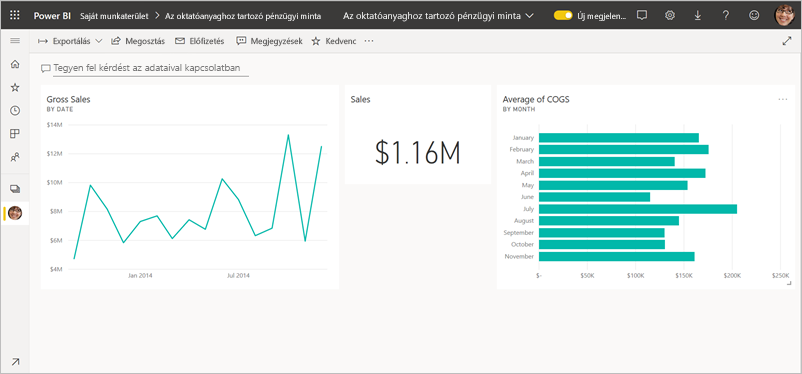

   Láthatja, hogy bár a diagramot vonaldiagrammá alakította, a csempe sávdiagram maradt, mert az volt, amikor rögzítette. 

## 4\. lépés: Csempék áthelyezése

Az irányítópult széles. A csempék átrendezhetők az irányítópulton lévő hely jobb kihasználásához.

1. Húzza felfelé a *Bruttó értékesítés* csempe jobb alsó sarkát amíg be nem igazodik az Értékesítés csempéével azonos magasságra, majd engedje el.

    

    A két csempe magassága most megegyezik.

    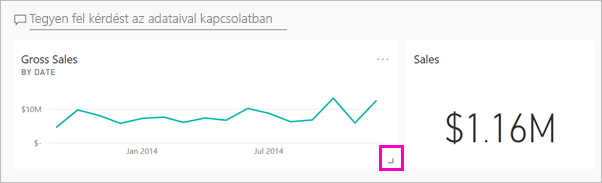

1. Húzza el a *Termékköltségek átlaga* sávdiagram-csempét, amíg be nem igazodik a *Bruttó értékesítések* vonaldiagram alá.

    Mindjárt jobban fest.

    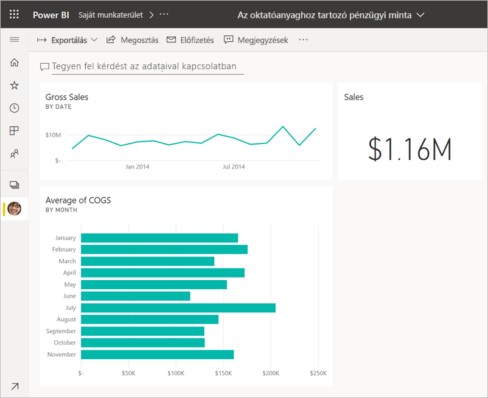

## 5\. lépés: Csempék kezelése

Még egy kezelési műveletet kell megfigyelnie, mielőtt saját irányítópultok és jelentések készítésébe fog. A különböző csempék kiválasztása más-más eredménnyel jár. 

1. Először válassza ki a jelentésből rögzített *Bruttó értékesítés* vonaldiagramot. 

    A Pwer BI megnyitja a jelentést Olvasás nézetben. 

2. Válassza a böngésző vissza gombját. 

1. Most válassza ki a *Termékköltségek átlaga* sávdiagramot, amelyet a Q&A-ban hozott létre. 

    A Power BI nem nyitja meg a jelentést. Ehelyett a Q&A nyílik meg, ugyanis ezt a diagramot itt hozta létre.

## Erőforrások felszabadítása
Most, hogy befejezte ezt az oktatóanyagot, törölheti az adatkészletet, a jelentést és az irányítópultot. 

1. A navigációs ablaktáblán a **Saját munkaterület** legyen megnyitva.
2. Válassza az **Adatkészletek** lapot, majd keresse meg az oktatóanyaghoz importált adatkészletet.  
3. Válassza a **További lehetőségek** (...), majd a **Törlés** elemet.

    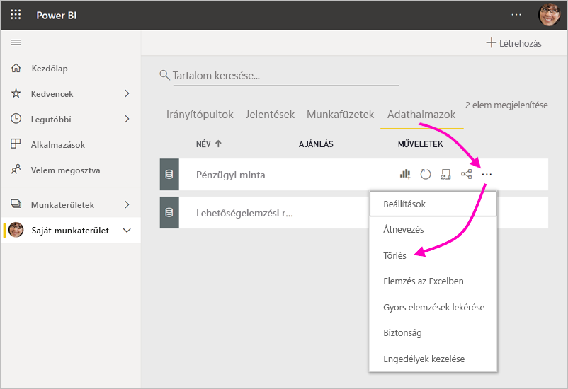

    Amikor adathalmazt töröl, a következő figyelmeztetés jelenik meg: **Minden olyan jelentés és irányítópulton található csempe is törlődni fog, amely tartalmazza az adathalmaz adatait**.

4. Válassza a **Törlés** elemet.

## Következő lépések

Az irányítópultokat még jobbá teheti további vizualizációs csempék hozzáadásával, és azok [átnevezésével, átméretezésével, összekapcsolásával és áthelyezésével](service-dashboard-edit-tile.md).

