# Oktatóanyag: Első lépések a Power BI szolgáltatásban (app.powerbi.com)
Ez az oktatóanyag segít az első lépések megtételében a *Power BI szolgáltatásban*. Ha szeretné megérteni, hogyan illeszkedik a Power BI szolgáltatás a többi Power BI-ajánlathoz, javasoljuk, először olvassa el [A Power BI bemutatása](power-bi-overview.md) című szakaszt.

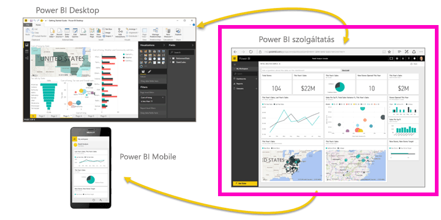

A jelen oktatóanyagban az alábbi lépéseket fogja végrehajtani:

> [!div class="checklist"]
> * Power BI-bemutatótartalmak keresése.
> * Bejelentkezés a Power BI online-fiókjába, vagy regisztrálás, ha még nincs fiókja.
> * A Power BI szolgáltatás megnyitása.
> * Az adatok lekérése és megnyitása Jelentés nézetben.
> * Az adatok használata vizualizációk létrehozásához és jelentésként való mentéshez.
> * Irányítópult létrehozása jelentésből származó csempék rögzítésével.
> * Új vizualizáció hozzáadása az irányítópulthoz a Q&A természetes nyelvű eszközzel.
> * Erőforrások felszabadítása az adatkészlet, jelentés és irányítópult törlésével.

## Regisztráció a Power BI szolgáltatásra
Ha még nincs Power BI Pro-fiókja, a kezdés előtt [hozzon létre egy ingyenes Power BI Pro próbaverziós fiókot](https://app.powerbi.com/signupredirect?pbi_source=web).

A fiók létrehozása után írja be az *app.powerbi.com* címet a böngészőbe Power BI szolgáltatás megnyitásához. 

Ha a Power BI Desktoppal kapcsolatos segítséget keres, olvassa el az [Első lépések a Power BI Desktopban](desktop-getting-started.md) című szakaszt. Ha a Power BI Mobile-lal kapcsolatos segítségre van szükséges, lásd: [Power BI-alkalmazások mobileszközökre](consumer/mobile/mobile-apps-for-mobile-devices.md).

> [!TIP]
> Ehelyett egy ingyenes, saját tempóban elvégezhető tanfolyamot szeretne? [Regisztráljon Analyzing and Visualizing Data (Adatok elemzése és vizualizációja) tanfolyamunkra az Edx-en](http://aka.ms/edxpbi).

Nézze meg [lejátszási listánkat a YouTube-on](https://www.youtube.com/playlist?list=PL1N57mwBHtN0JFoKSR0n-tBkUJHeMP2cP). A kezdéshez egy remek videó az *Introduction to Power BI service* (A Power BI szolgáltatás bemutatása):
> 
> <iframe width="560" height="315" src="https://www.youtube.com/embed/B2vd4MQrz4M" frameborder="0" allowfullscreen></iframe>
> 

## Mi az a Power BI szolgáltatás?
A Microsoft Power BI szolgáltatás más néven Power BI online vagy app.powerbi.com néven ismert. A Power BI segítségével naprakész maradhat az Ön számára fontos információkkal. A Power BI szolgáltatásban az *irányítópultokkal* ujjait a cége ütőerén tarthatja. Az irányítópulton *csempék* találhatók, amelyeket kiválasztva *jelentéseket* nyithat meg a további vizsgálódásokhoz. Több *adatkészlethez* is kapcsolódhat, hogy minden releváns adatát egy helyen tekinthesse meg. További segítségre van szüksége annak megértéséhez, hogy milyen elemekből épül fel a Power BI? Lásd: [A Power BI szolgáltatás alapfogalmai tervezők számára](service-basic-concepts.md).

Ha Excel- vagy CSV-fájlokba mentett fontos adatokkal rendelkezik, létrehozhat egy Power BI-irányítópultot, hogy tájékozott maradhasson, bárhol is van, és másokkal is megoszthassa az elemzéseket.  Előfizetett valamilyen SaaS-alkalmazásra, például a Salesforce-ra?  A gyors kezdéshez csatlakozzon a Salesforce-hoz, hogy automatikusan irányítópultot hozhasson létre az ott található adatokból, vagy [tekintse meg a többi SaaS-alkalmazást](service-get-data.md), amelyhez csatlakozhat. Ha egy cégnél dolgozik, nézze meg, hogy nem tettek-e közzé valamilyen [alkalmazást](service-create-distribute-apps.md) az Ön számára.

Olvassa el, milyen más módokon [kérhet még le adatokat a Power BI-ban](service-get-data.md).

## 1\. lépés: Adatok lekérése
Íme egy példa adatok CSV-fájlból való lekérésére. Szeretné követni az oktatóanyagban leírtakat? [Töltse le a Pénzügyi minta CSV-fájlt](http://go.microsoft.com/fwlink/?LinkID=521962).

1. [Jelentkezzen be a Power BI-ba](http://www.powerbi.com/). Még nincs fiókja? Ne aggódjon, regisztrálhat ingyenes próbaverzióra.
2. A Power BI a böngészőjében nyílik meg. Válassza az **Adatok lekérése** elemet a bal oldali navigációs sáv alján.

    Ekkor megnyílik az **Adatok lekérése** lap.   

3. Az **Új tartalom létrehozása** szakaszban válassza a **Fájlok** lehetőséget. 
   
   
4.  Válassza a **Helyi fájl** lehetőséget.
   
     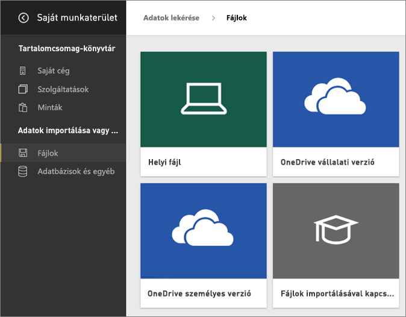

5. Tallózással keresse meg a fájlt a számítógépen, majd válassza a **Megnyitás** gombot.

5. Ebben az oktatóanyagban az **Importálás** lehetőséget választva fogjuk az Excel-fájlt adatkészletként felvenni, amelyből aztán jelentéseket és irányítópultokat hozhatunk létre. Ha a **Feltöltés** lehetőséget választja, az egész Excel-munkafüzet fel lesz töltve a Power BI-ba, ahol megnyithatja és szerkesztheti az Excel Online-ban.
   
   
6. Amikor készen áll az adatkészlet, válassza az **Adatkészlet megtekintése** gombot a jelentésszerkesztőben való megnyitásához. 

    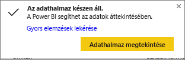

    Mivel még nem hoztunk létre vizualizációkat, a jelentésvászon üres lesz.

    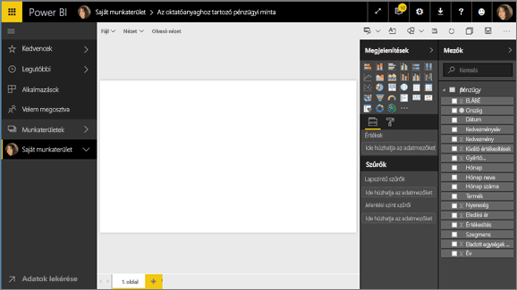

7. A felső navigációs sávon láthatja az **Olvasó nézet** lehetőséget. Mivel elérhető ez az opció, ez azt jelenti, hogy jelenleg Szerkesztési nézetben van. 

    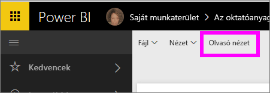

    Azért hozhat létre és módosíthat jelentéseket a Szerkesztési nézetében, mert Ön a jelentés *tulajdonosa*. Azaz *létrehozó*. Ha a jelentést megosztja a munkatársakkal, csak Olvasó nézetben fogják tudni használni azt; ők a *felhasználók*. További információ az [Olvasó nézetről és a Szerkesztési nézetről](consumer/end-user-reading-view.md).
    
    A jelentésszerkesztővel való ismerkedés nagyszerű módja egy [bemutató megtekintése](service-the-report-editor-take-a-tour.md).
 

## 2\. lépés: Az adatkészlet feltárása
Most, hogy adatokhoz csatlakozott, megismerkedhet a felülettel.  Ha valami érdekeset talál, létrehozhat egy irányítópultot, hogy figyelje, és hogy ellenőrizze, hogyan változik az idő múlásával. Nézzük meg, hogyan is működik ez.
    
1. A jelentésszerkesztőben a lap jobb oldalán található **Mezők** ablaktábla használatával fogunk létrehozni egy vizualizációt. Jelölje be a **Gross Sales** (Bruttó értékesítés) és a **Date** (Dátum) melletti jelölőnégyzetet.
   
   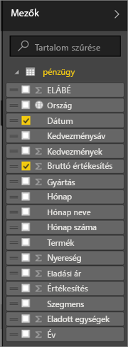

    A Power BI elemzi az adatokat, és létrehoz egy vizualizációt. Ha először a **Date** melletti négyzetet jelölte be, egy táblázat fog megjelenni. Ha először a **Gross Sales** négyzetét jelölte be, egy diagram fog megjelenni. 

2. Váltson át egy másik adatmegjelenítési módra. Tekintsük meg ezeket az adatokat egy vonaldiagramon. A **Vizualizációk** panelen válassza a vonaldiagram ikont.
   
   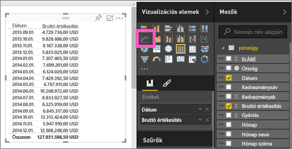

3. Ez a diagram érdekesnek tűnik, szóval *rögzítsük* egy irányítópulton. Vigye az egeret a vizualizáció fölé, és válassza a Rögzítés ikont. Ha rögzíti a vizualizációt, a rendszer az irányítópulton tárolja és naprakészen tartja, hogy egyetlen pillantással nyomon tudja követheti a legújabb értékeket.
   
   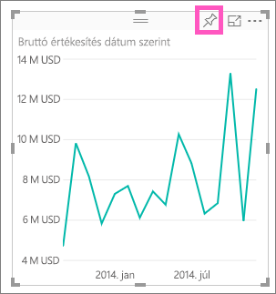

4. Mivel ez egy új jelentés, a rendszer először kéri, hogy mentse, mielőtt vizualizációkat rögzíthetne irányítópultokon. Adjon nevet a jelentésnek (példa: *Értékesítés az idő függvényében*), majd válassza a **Mentés és folytatás** lehetőséget. 
   
   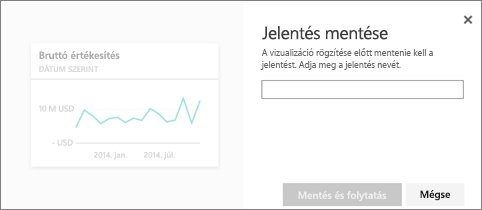
   
5. Rögzítse a vonaldiagramot az új irányítópulton, és adja neki a *Financial sample for tutorial* („Oktatóanyag pénzügyi mintája”) nevet. 
   
   
   
6. Válassza a **Rögzítés** lehetőséget.
   
    A jobb felső sarokban megjelenik a sikert jelző üzenet, amely tájékoztatja, hogy a vizualizáció csempeként hozzá lett adva az irányítópulthoz.
   
    

7. A csempeként az új irányítópulthoz rögzített vonaldiagram megtekintéséhez válassza az **Ugrás az irányítópultra** lehetőséget. Az irányítópultot még jobbá teheti további vizualizációs csempék hozzáadásával, és a [csempék átnevezésével, átméretezésével, összekapcsolásával és áthelyezésével](service-dashboard-edit-tile.md).
   
   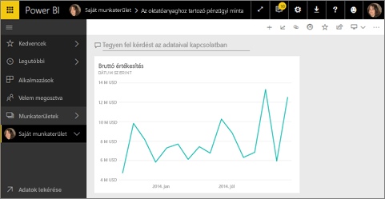
   
8. A jelentéshez visszatérhet, ha az új csempét választja az irányítópulton. A Power BI a jelentéshez lépteti vissza Olvasó nézetben. A felső navigációs sávon a **Jelentés szerkesztése** lehetőséget választva váltson vissza a Szerkesztési nézetre. A Szerkesztési nézetben tovább ismerkedhet a csempékkel, valamint rögzítheti azokat. 

## 3\. lépés:  A felülettel való ismerkedés folytatása a Q&A-val (a természetes nyelvű lekérdezésekkel)
1. Az adatok gyors feltárásához próbáljon kérdést feltenni a Q&A mezőben. A Q&A-kérdésmező az irányítópult tetején (**Tegyen fel kérdést az adataival kapcsolatban**), illetve a jelentés felső navigációs sávjában (**Kérdés feltevése**) található. Próbálja meg beírni például a *what segment had the most revenue* („melyik szegmensben volt a legnagyobb árbevétel”) kérdést.
   
   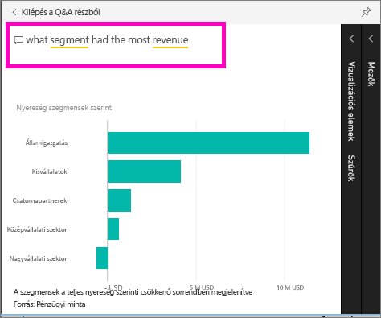

2. A Q&A megkeresi a választ, és egy vizualizáció formájában jeleníti azt meg. Válassza a gombostű ikont,  hogy ezt a vizualizációt is megjelenítse az irányítópulton.
3. Rögzítse a vizualizációt a **Financial sample for tutorial** irányítópulton.
   
    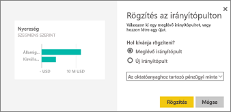

4. Térjen vissza az irányítópultra, melyen meg fog jelenni az új csempe.

   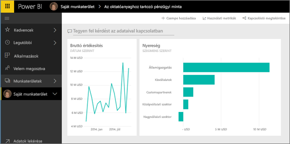

## Erőforrások felszabadítása
Most, hogy befejezte ezt az oktatóanyagot, törölheti az adatkészletet, a jelentést és az irányítópultot. 

1. A bal oldali navigációs sávon válassza a **Saját munkaterület** lehetőséget.
2. Válassza az **Adatkészletek** lapot, majd keresse meg az oktatóanyaghoz importált adatkészletet.  
3. Válassza a három pontot (...), majd a **Törlés** lehetőséget.

    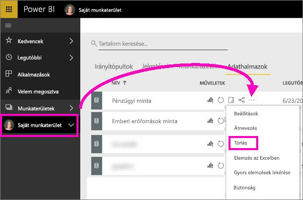

    Az adatkészlet törlésével a Power BI a jelentést és az irányítópultot is törli. 

## Következő lépések

> [!div class="nextstepaction"]
> [Kapcsolódás a Power BI segítségével a használt online szolgáltatásokhoz](service-connect-to-services.md)

