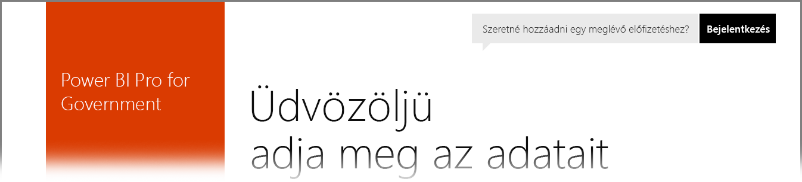

# Power BI az USA kormányzati ügyfelei számára
A **Power BI szolgáltatás** külön verziója érhető el az USA kormányzati ügyfeleinek az **egyesült államokbeli Office 365-közösségi** előfizetések részeként. A jelen cikkben a **Power BI szolgáltatás** kifejezetten az USA kormányzati ügyfeleinek készült verzióját tárgyaljuk, amely elkülönül és különbözik a **Power BI szolgáltatás** kereskedelmi verziójától.

A következő szakaszok a **Power BI szolgáltatás** US Government verziójában elérhető *funkciókat* ismerteti, tisztáz néhány *korlátozást*, gyakori kérdéseket (**GYIK**) és válaszokat sorol fel (beleértve a regisztráció leírását), és további információkra mutató hivatkozásokat tartalmaz.

## A Power BI US Government funkciói
Fontos megjegyezni, hogy a **Power BI US Government** csak **Pro licenccel** érhető el, ingyenes licenccel nem. A Power BI szolgáltatás bizonyos funkciói elérhetők a szolgáltatás **Power BI US Government** verziójában.

A **Power BI US Government**-ügyfelek a következő funkciókat érhetik el, mivel azok a **Pro** licenc funkcióihoz tartoznak:

* Irányítópultok és jelentések létrehozása és megtekintése
* [Adatkapacitás-korlátok](service-admin-manage-your-data-storage-in-power-bi.md)
* [Ütemezett adatfrissítés](refresh-data.md)
* Frissíthető csoportos irányítópultok
* Active Directory-csoportok hozzáférés-vezérlés megosztásához és kezeléséhez
* Jelentések és [adatok importálása](service-get-data.md) Excel-, CSV- és Power BI Desktop-fájlokból
* Adatkezelési átjáró
* Az Azure SQL és a Blob Storage használatával tárolt valamennyi Power BI-adat titkosítva van
* Kapcsolódás szolgáltatásokhoz [tartalomcsomagok](service-connect-to-services.md) használatával

## Kapcsolat a kormányzati és a globális Azure-felhőszolgáltatások között 

Az Azure több felhő között van elosztva. Alapértelmezés szerint a bérlő megnyithat tűzfalszabályokat egy felhőspecifikus példányhoz, a felhők közötti kapcsolódás azonban másféle jellegű, és meghatározott tűzfalszabályokat kell megnyitni ahhoz, hogy a szolgáltatások között sikeres kommunikáció történjen. Ha Ön Power BI-ügyfélként a nyilvános felhőben meglévő SQL-példányait szeretné elérni, akkor az SQL-ben meghatározott tűzfalszabályokat kell megnyitnia az Azure Government Cloud IP-tartományban az alábbi adatközpontokhoz:

* USGov Iowa
* USGov Virginia
* USGov Texas
* USGov Arizona

A nyilvános felhőben elérhetők az IP-tartományok. A kormányzati felhővel kapcsolatos legfrissebb információkat az [Azure kormányzati szolgáltatás letölthető dokumentációjában](https://www.microsoft.com/download/details.aspx?id=57063) találja meg.

## A Power BI US Government korlátozásai
A **Power BI szolgáltatás** kereskedelmi verziójában elérhető egyes funkciók az USA kormányzati ügyfelek számára nyújtott **Power BI szolgáltatásban***nem* elérhetők. A Power BI csapata folyamatosan dolgozik, hogy ezeket a funkciókat az USA kormányzati ügyfelek számára is elérhetővé tegye, és frissíteni fogja ezt a cikket, amikor a funkciók elérhetővé válnak.

* **Beágyazás SharePoint Online-ba** – a Power BI-kijelzővel nem ágyazhatók be tartalmak a SharePoint Online-ba. A biztonságos beágyazás azonban működik az [*Embed* kijelzővel](https://docs.microsoft.com/power-bi/service-embed-secure). Hozzá kell adnia az *app.powerbigov.us* címet a kivételek listájához, amit a [Tartalom SharePoint-oldalakon való beágyazásának engedélyezése vagy korlátozása](https://support.office.com/article/allow-or-restrict-the-ability-to-embed-content-on-sharepoint-pages-e7baf83f-09d0-4bd1-9058-4aa483ee137b) című cikk útmutatásával tehet meg.
* A **Power BI US Government** csak **Pro licenccel** érhető el. Felügyeleti portálon (vagy felhasználók által) Power BI (ingyenes) licencre tett bármilyen hivatkozás egy kereskedelmi Power BI szolgáltatásfelhőben fut.
* **Naplózás** – 2018. júniustól már elérhető a naplózás az Office 365 Biztonsági és Megfelelőségi portálján.
* **Külső felhasználói megosztás** – A megosztás csak a Power BI-bérlőn belül lehetséges, és 2018. júniustól a megosztás a Power BI-bérlőn kívüli felhasználókkal is engedélyezett. Lásd a [Power BI tartalmak terjesztése Azure AD B2B külső vendégfelhasználóknak](service-admin-azure-ad-b2b.md) című témakört.
* **Használati metrikák irányítópultokhoz és jelentésekhez** – jelentésekhez és irányítópultokhoz nem érhetők el használati metrikák. A cégen belüli tartalmak használatáról az auditnaplók adataiból lehetséges használatra vonatkozó információt szerezni.
* **Adatfolyamok** – Az adatfolyamok nem érhetők el.
* **Oldalakra osztott jelentések** – az oldalakra osztott jelentések jelenleg csak a USGov Virginia régióban érhetők el.  Tervezzük a USGov Texas régió támogatását, de ez még nem érhető el.
* Power BI-tartalmak Kormányzati közösségi felhőből (GCC-ből) csak Office 365 SKU-val ágyazhatók be. A GCC High ügyfelei [Office 365 vagy Azure SKU-t](developer/embedded-faq.md#what-is-the-difference-between-the-a-skus-in-azure-and-the-em-skus-in-office-365) használhatnak.

Ha fiókjához **Power BI** ingyenes licencek vannak társítva, akkor a fiók a **Power BI** szolgáltatás kereskedelmi verzióját futtatja, és nem tartozik a **Power BI US Government** ajánlat hatálya alá. Ilyen ingyenes fiók esetén a következő problémákba ütközhet:

* Az átjáró, a mobilalkalmazás és a Desktop nem képes a hitelesítésre
* Nem lehet hozzáférni az Azure kereskedelmi verziójú adatforrásaihoz
* A PBIX-fájlokat manuálisan kell feltölteni a kereskedelmi verzióból
* A Power BI mobilalkalmazásai nem érhetők el

A problémák megoldása érdekében forduljon a fiók kapcsolattartójához.

## Gyakori kérdések (GYIK) a Power BI szolgáltatás US Government verziójáról
A következő kérdéseket (és válaszokat) azért tesszük közzé, hogy gyorsan hozzájusson a szükséges információkhoz a szolgáltatással kapcsolatban.

**Kérdés:** Hogyan migrálhatom kereskedelmi **Power BI**-adataimat a **Power BI szolgáltatás** US Government verziójába?

**Válasz:** A rendszergazdának a **Power BI** egy új példányát kell létrehoznia egy különálló, a US Government verzióra érvényes előfizetés alatt. Ez után replikálhatja adatait a **Power BI szolgáltatás** US Government verziójában, törölheti kereskedelmi licencét, meglévő tartományát pedig az új, US Government verzióbeli szolgáltatáshoz társíthatja.

**Kérdés:** Miért nem tudok egy adott tartalomcsomaghoz kapcsolódni?

**Válasz:** Tartalomcsomaghoz csak engedélyezett előfizetéssel kapcsolódhat.

**Kérdés:** Érdekel a **Power BI** beszerzése egyesült államokbeli kormányzati cégem számára. Hogyan kezdjek hozzá?

**Válasz:** A regisztráció (vagy más néven *előkészítés*) menete a meglévő licenctől és előfizetéstől függően változhat. További információt a [Regisztráció a Power BI US Governmentre](service-govus-signup.md) című cikkben talál.

**Kérdés:** Eltér-e a **Power BI** US Government verziójához és a **Power BI** kereskedelmi verziójához való kapcsolódáshoz használt URL-cím? Más URL-cím tartozik a Kormányzati közösségi felhő High- (GCC High-) ügyfeleihez?

**Válasz:** Igen, a két URL-cím eltér. A következő táblázatban az URL-címek láthatók:

| Kereskedelmi verzió URL-címe | US Government verzió URL-címe | US Government URL-cím GCC High-hoz |
| --- | --- | --- |
| https://app.powerbi.com/ |[https://app.powerbigov.us](https://app.powerbigov.us) | [https://app.high.powerbigov.us](https://app.high.powerbigov.us) |

**Kérdés:** A fiókom egyszerre több országos felhőben is regisztrálva van. A **Power BI Desktop** használatakor hogyan tudom kiválasztani, hogy melyik felhőhöz szeretnék csatlakozni?

**Válasz:** A **Power BI Desktop** 2018. júliusi verziójától kezdve a **Power BI Desktopba** történő bejelentkezéskor kiválasztható, melyik felhőhöz szeretne csatlakozni.

## Következő lépések
A Power BI sokféle feladat elvégzésére alkalmas. További információt és tananyagokat – beleértve a szolgáltatásra való regisztrációt bemutató cikket – ezekben a forrásokban talál:

* [Regisztráció a Power BI US Governmentre](service-govus-signup.md)
* <a href="https://channel9.msdn.com/Blogs/Azure/Cognitive-Services-HDInsight-and-Power-BI-on-Azure-Government">Power BI US Government bemutató</a>
* [Power BI-oktatócsomag](guided-learning/index.yml)
* [Első lépések a Power BI szolgáltatással](service-get-started.md)
* [Mi az a Power BI Desktop?](desktop-what-is-desktop.md)

