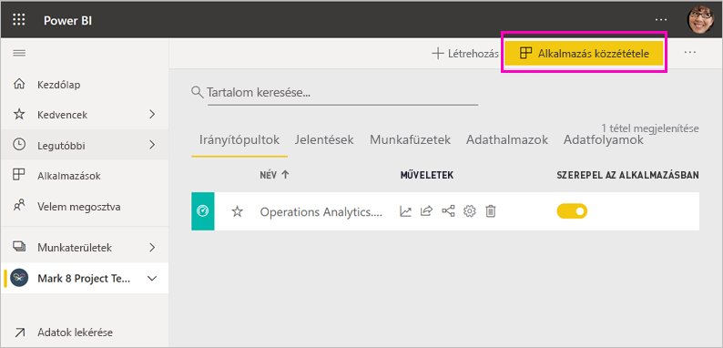
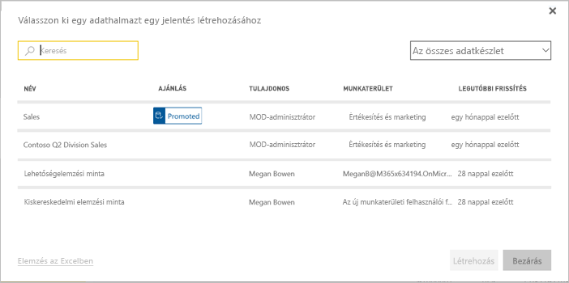
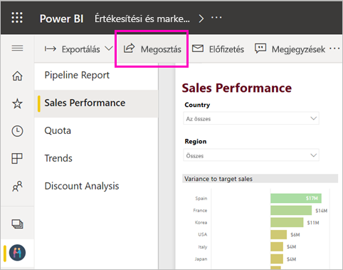
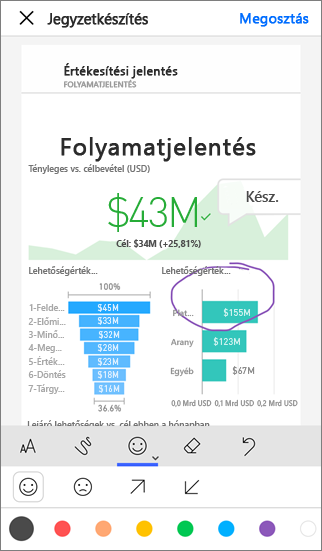

# A munka megosztásának módjai a Power BI-ban

Ön az irányítópultokat és jelentéseket létrehozó személy. Előfordulhat, hogy a munkatársaival együtt dolgozott rajtuk. Ezután szeretné, hogy mások is elérhessék, amit létrehozott. Mi a terjesztésük legjobb módja? Ebben a témakörben összehasonlítjuk a Power BI-ban való közös munka és megosztás alábbi lehetőségeit:

* Jelentések és irányítópultok létrehozása a munkatársakkal a *munkaterületeken*.
* A létrehozott irányítópultok és jelentések egyesítése *alkalmazásként*, és ezek terjesztése egy nagyobb csoport vagy a teljes cég számára.
* *Megosztott adatkészletek* létrehozása, amelyekkel a munkatársak jelentéseket készíthetnek saját munkaterületeiken.
* *Sablonalkalmazás* létrehozása, amelyet külső Power BI-felhasználóknak terjeszthet a Microsoft AppSource segítségével.
* Irányítópultok és jelentések megosztása csak néhány személlyel, a szolgáltatásból vagy a Power BI-mobilalkalmazásokból.
* Jelentések nyomtatása.
* Jelentések *beágyazása* biztonságos portálokon vagy nyilvános webhelyeken.

Bármelyik lehetőséget is választja, a tartalom megosztásához [Power BI Pro-licenccel](service-features-license-type.md) kell rendelkeznie, vagy a tartalmat [prémium szintű kapacitásban](service-premium-what-is.md) kell elhelyeznie. A tartalmat megtekintő munkatársakra vonatkozó licenckövetelményeket a választott lehetőség határozza meg. Az alábbi szakaszokban megtalálhatja a részleteket. 

*Alkalmazások a Power BI szolgáltatásban*

## Együttműködés a munkaterületen

Amikor a csapatok együtt dolgoznak, ugyanazon dokumentumokhoz való hozzáférésre van szükség a gyors együttműködés céljából. A Power BI munkaterületein a csapatok megoszthatják egymással irányítópultok, jelentések, adatkészletek és munkafüzetek tulajdonjogát és felügyeletét. Néha a Power BI-felhasználók a saját munkaterületeiket a céges struktúrák alapján hozzák létre, míg máskor konkrét projektekhez készítenek munkaterületeket. Más cégek több munkaterületet használnak a jelentések és az irányítópultok különböző verzióinak tárolására. 

A munkaterületek olyan szerepköröket biztosítanak, amelyek meghatározzák a munkatársak adott jogosultságait. Az ilyen szerepkörökkel meghatározható, hogy kik kezelhetik a teljes munkaterületet, és kik szerkeszthetik, valamint oszthatják meg annak tartalmát.

Előfordulhat, hogy természetes módon helyez el tartalmat a Saját munkaterületen, és osztja meg azt. A munkaterületek azonban jobb együttműködést biztosítanak a Saját munkaterülethez képest, mivel lehetővé teszik a tulajdonjog megosztását. Ön és csapata egyszerűen végezhet frissítéseket, vagy biztosíthat hozzáférést másoknak. A Saját munkaterület egyszeri használatra vagy személyes tartalom esetén nyújt optimális megoldást az egyéni felhasználóknak.

Tegyük fel, hogy van egy kész irányítópultja, amelyet szeretne megosztani a munkatársaival. Mi a legjobb módszer az irányítópult munkatársakkal való megosztásának? A válasz számos tényezőtől függ. 

- Ha a munkatársaknak naprakészen kell tartaniuk az irányítópultot, vagy a munkaterület minden tartalmához hozzá kell férniük, akkor célszerű, ha hozzáadja őket a munkaterülethez. 
- Ha a kollégáknak a munkaterület összes tartalma helyett csak az adott irányítópultot kell látniuk, ismét több alternatíva közül lehet választani. Ha néhány felhasználónak csak egyetlen irányítópultra van szüksége, az adott irányítópult megosztása lehet a legjobb megoldás.
- Azonban ha az irányítópult része egy nagyobb tartalomcsomagnak, amelyet számos munkatárssal kell megosztani, akkor valószínűleg egy *alkalmazás* közzététele a legjobb választás.

A Power BI új munkaterületi felhasználói felületet kínál. Az [Új munkaterületek létrehozása](service-create-the-new-workspaces.md) című cikkben további információt talál a munkaterületek változásairól. 

## Elemzések terjesztése egy alkalmazásban

Tegyük fel, hogy szeretné széles vállalati közönséggel megosztani az irányítópultját. Ön és a munkatársai létrehoztak egy *munkaterületet*, majd a munkaterületen létrehozták és kidolgozták az irányítópultokat, jelentéseket és adatkészleteket. Következő lépésként ki kell jelölnie a kívánt irányítópultokat és jelentéseket, és közzé kell tennie őket alkalmazásként egy adott csoportnak vagy a teljes vállalatnak.

Az alkalmazások a Power BI szolgáltatásban ([https://app.powerbi.com](https://app.powerbi.com)) könnyen megtalálhatók és telepíthetők. Elküldheti az üzleti felhasználóknak az alkalmazására mutató közvetlen hivatkozást, vagy rákereshetnek az alkalmazására az AppSource-ban. Ha a Power BI-rendszergazda engedélyezi ezt Önnek, akkor az alkalmazást akár közvetlenül is telepítheti a munkatársai Power BI-fiókjába. Többet is megtudhat [az alkalmazások közzétételéről](service-create-distribute-apps.md).

Miután a munkatársai telepítik az alkalmazást, megtekinthetik azt a böngészőjükben vagy egy mobileszközön.

Ahhoz, hogy a felhasználók megtekinthessék az alkalmazást, vagy Power BI Pro licenccel kell rendelkezniük nekik is, vagy pedig Power BI Premium-kapacitásban kell elhelyeznie az alkalmazást. Részletek: [Mi a Power BI Premium?](service-premium-what-is.md).

Alkalmazásokat munkahelyen kívüli személyeknek is közzétehet. Az ilyen személyek megtekinthetik az alkalmazás tartalmát, műveleteket végezhetnek vele, de megosztani nem tudják azt másokkal. Létrehozhat *sablonalkalmazásokat*, amelyeket bármelyik Power BI-ügyfélnek üzembe helyezhet.

## Adatkészlet megosztása

Lássuk be, egyes felhasználók tehetségesebbek, ha kiváló minőségű, pontosan megtervezett adatmodellek létrehozásáról van szó. Ez lehet akár Ön is. Ugyanazon pontosan kialakított adatmodellek használatából a teljes vállalat előnyre tehet szert. Ezt a szerepet töltik be a *megosztott adatkészletek*. Amikor egy olyan jelentést hoz létre, amely egy mindenki által használandó adatmodellre épül, elmentheti a jelentést a Power BI szolgáltatásban, majd használati jogosultságot adhat a megfelelő felhasználóknak. Ezután saját jelentéseket készíthetnek az Ön adatkészlete alapján. Így minden felhasználó ugyanazon adatokra alapozza a jelentéseit, aminek köszönhetően megegyezik azok igazságértéke.

További információ a [megosztott adatkészletek létrehozásáról](service-datasets-across-workspaces.md).

## Irányítópultok és jelentések megosztása

Tegyük fel, hogy véglegesített egy irányítópultot és egy jelentést a Saját munkaterületen vagy egy munkaterületen, és szeretne hozzáférést adni néhány másik személynek. Ennek egyik módja az, ha *megosztja* őket. 

A tartalmak megosztásához Power BI Pro-licenccel kell rendelkeznie mind Önnek, mind pedig azoknak, akikkel megosztja a tartalmat, kivéve ha a megosztott tartalmak [prémium szintű kapacitás](service-premium-what-is.md) munkaterületén találhatók. A megosztott irányítópultokat és jelentéseket a címzettek megtekinthetik és használhatják, de nem szerkeszthetik. Az irányítópultok és a jelentések adatait ugyanúgy látják, ahogyan Ön is, hacsak nem alkalmaz sorszintű biztonságot (RLS-t) a mögöttes adatkészletre. A munkatársai, akikkel megosztotta a tartalmat, továbboszthatják azt másokkal, ha engedélyezi. 

Akár cégen kívüli személyek is lehetnek a megosztás címzettjei. Az ilyen személyek megtekinthetik az irányítópultot vagy a jelentést, műveleteket végezhetnek velük, de megosztani nem tudják azokat. 

Többet is megtudhat az [irányítópultok és jelentések Power BI szolgáltatásban való megosztásáról](service-share-dashboards.md). Szűrőt is hozzáadhat egy hivatkozáshoz, és így [a jelentés szűrt nézetét is megoszthatja](service-share-reports.md).

## Jegyzetkészítés és megosztás a Power BI-mobilalkalmazásokból

Az iOS- és Android-készülékekhez készült Power BI mobilalkalmazásban jegyzeteket adhat hozzá a csempékhez, jelentésekhez és vizualizációkhoz, majd megoszthatja azokat bárkivel e-mailben.

Csempe, jelentés vagy vizualizáció megosztásakor az adott elem egy pillanatképét osztja meg, így a címzettek az e-mail elküldésekor érvényes pillanatnyi állapotot fogják látni. Az e-mail emellett tartalmaz egy hivatkozást is, mely az irányítópultra vagy a jelentésre mutat. Ha a címzettek rendelkeznek Power BI Pro licenccel, vagy ha a tartalom [prémium szintű kapacitásban](service-premium-what-is.md) található, és már megosztotta az objektumot velük, akkor megnyithatják azt. A csempékről készült pillanatképeket bárkinek elküldheti, nemcsak az azonos e-mail-tartományhoz tartozó munkatársainak.

Többet is megtudhat arról, hogy hogyan [láthat el jegyzetekkel és oszthat meg csempéket, jelentéseket és vizualizációkat](consumer/mobile/mobile-annotate-and-share-a-tile-from-the-mobile-apps.md) az iOS- és az Android-mobilalkalmazásokból.

A Windows 10-eszközökön futó Power BI alkalmazásból is [megoszthatja a csempék pillanatképét](consumer/mobile/mobile-windows-10-phone-app-get-started.md).

## Nyomtatás vagy mentés PDF-ként vagy más statikus fájlként

A Power BI szolgáltatásban nyomtathat vagy menthet PDF-fájlként (illetve más formátumú statikus fájlként) egy teljes irányítópultot, egy irányítópult-csempét, egy jelentéslapot vagy egy vizualizációt. A jelentéseket csak laponként tudja nyomtatni – nem nyomtathatja a teljes jelentést egyszerre. Többet is megtudhat a [nyomtatásról és a statikus fájlba mentésről](consumer/end-user-print.md).

## Jelentések beágyazása biztonságos portálokon vagy nyilvános webhelyeken

### Biztonságos portálok beágyazása

A Power BI-jelentéseket beágyazhatja biztonságos portálokon és webhelyeken is, ahol a felhasználók azokat meg szeretnék tekinteni.  
A Power BI szolgáltatás **Beágyazás a SharePoint Online-ban** és **Beágyazás** funkciói lehetővé teszik, hogy Ön biztonságosan ágyazhasson be jelentéseket a belső felhasználók számára. 

- A **Beágyazás a SharePoint Online-ban** funkció a SharePoint Online Power BI-kijelzővel működik. Ez egy egyszeri bejelentkezéses megoldást alkalmaz, segítségével pedig megszabható a jelentés beágyazásának módja. 
- A **Beágyazás** funkció bármely olyan portállal vagy webhellyel működik, amely támogatja tartalom beágyazását URL vagy iFrame használatával. 

Bármelyik lehetőséget is választja, a Power BI megköveteli az engedélyeket és az adatbiztonságot, mielőtt a felhasználók megnézhetnék a jelentést. A jelentést csak akkor nézheti meg bárki, ha ahhoz rendelkezik a megfelelő engedélyekkel. További információ a Power BI [Beágyazás a SharePoint Online-ban](service-embed-report-spo.md) és [Beágyazás](service-embed-secure.md) funkcióiról.

### Közzététel nyilvános webhelyeken

A **Közzététel a weben** lehetőséggel megoszthatja a Power BI-jelentéseit a teljes internettel úgy, hogy interaktív vizualizációkat ágyaz be blogbejegyzésekbe, weblapokra, közösségi webhelyekre és más online kommunikációs tartalmakba. Ezt bármilyen eszközről megteheti. Ha így tesz, bárki megtekintheti a jelentéseit az interneten, és nem felügyelheti, hogy ki láthatja a közzétett tartalmait. A felhasználóknak nem kell Power BI-licenccel rendelkezniük. A webes közzététel csak azokhoz a jelentésekhez érhető el, amelyeknek jogosult a szerkesztésére. Nem tehet közzé jelentéseket az interneten, ha azokat csak megosztották Önnel, vagy ha azok egy alkalmazásban vannak. Többet is megtudhat a [webes közzétételről](service-publish-to-web.md).

>[!Warning]
>A [Webes közzététel](service-publish-to-web.md) lehetőség a tartalmak nyilvános megosztására, nem pedig belső megosztásra szolgál.

## Sablonalkalmazások létrehozása és üzembe helyezése

A *sablonalkalmazások* nyilvános, gyakran a Microsoft AppSource-on keresztüli megosztáshoz lettek kialakítva. Ha létrehozott egy alkalmazást kevés kódolással vagy anélkül, azt üzembe helyezheti bármely Power BI-ügyfél részére. Az ügyfelek saját adataikhoz csatlakozhatnak, és saját fiókot példányosíthatnak. További információ a [Power BI sablonalkalmazásairól](service-template-apps-overview.md).

## Következő lépések

* [Irányítópultok megosztása munkatársakkal és másokkal](service-share-dashboards.md)
* [Alkalmazás létrehozása és közzététele a Power BI-ban](service-create-distribute-apps.md)
* [Jelentés beágyazása egy biztonságos portálon vagy webhelyen](service-embed-secure.md)

Visszajelzés küldene? Mondja el javaslatait a [Power BI-közösség webhelyén](https://community.powerbi.com/).

További kérdései vannak? [Kérdezze meg a Power BI közösségét](http://community.powerbi.com/)
