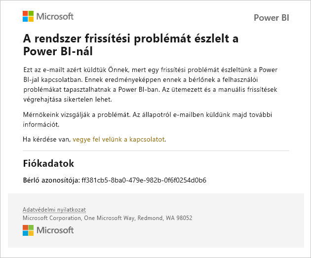
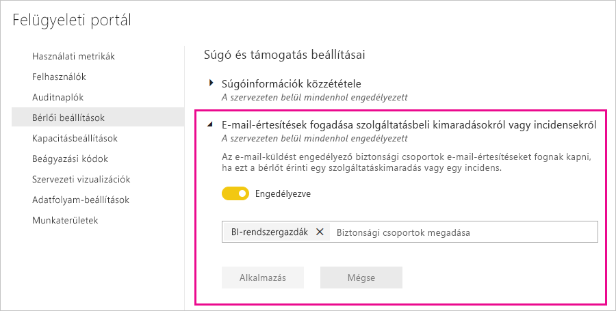

# Szolgáltatáskimaradásokkal kapcsolatos értesítések

Rendkívül fontos, hogy információt kapjon az üzletmenet szempontjából kritikus üzleti alkalmazások rendelkezésre állásáról. A Power BI értesítéseket küld az incidensekről, így Ön e-mailt kap a szolgáltatáskimaradásról és a teljesítménycsökkenésről. Habár a Power BI 99,9%-os szolgáltatói szerződést (SLA) kínál, így ez rendkívül ritkán fordul elő, szeretnénk garantálni, hogy Ön minden ilyen esetről értesüljön. Az alábbi képernyőképen láthatja, hogy milyen típusú e-maileket fog kapni, ha engedélyezi az értesítéseket:

Jelenleg a következő _megbízhatósági eseményekről_küld e-mailt a rendszer:

- Jelentés megnyitási megbízhatósága
- Modell frissítési megbízhatósága
- Lekérdezés frissítési megbízhatósága

Ilyen értesítések lehetnek például olyan esetekben, amikor a felhasználók hosszabb késleltetést tapasztalnak olyan műveletekben, mint a jelentések megnyitása, az adatkészlet frissítése vagy a lekérdezés-végrehajtás. Ha az incidens megoldódott, arról is e-mailt küldünk.

> [!NOTE]
> Ez a funkció jelenleg csak a Power BI Premium dedikált kapacitásainak esetében érhető el. A megosztott vagy beágyazott kapacitások esetében nem érhető el.

## Értesítések engedélyezése

Az értesítéseket a Power BI bérlői rendszergazdája engedélyezheti a felügyeleti portálon:

1. Adjon meg vagy hozzon létre egy levelezési biztonsági csoportot, amelynek a rendszer elküldheti az értesítéseket.

1. A felügyeleti portálon válassza a **Bérlői beállítások** lehetőséget. A **Súgó és támogatás beállításai**területen bontsa ki az **E-mail-értesítések fogadása szolgáltatásbeli kimaradásokról vagy incidensekről** elemet.

1. Engedélyezze az értesítéseket, adjon meg egy biztonsági csoportot, majd válassza az **Alkalmazás** lehetőséget.

    

> [!NOTE]
> A Power BI a következő fiókból küldi ki az értesítéseket: no-reply-powerbi@microsoft.com. Ügyeljen rá, hogy ez a fiók felkerüljön az engedélyezési listára, mivel így elkerülheti, hogy az értesítések a levélszemét mappába kerüljenek.

## Következő lépések

[A Power BI Pro és a Power BI Premium támogatási lehetőségei](service-support-options.md)

További kérdései vannak? [Kérdezze meg a Power BI közösségét](http://community.powerbi.com/)
