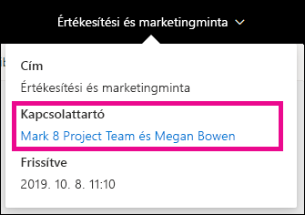
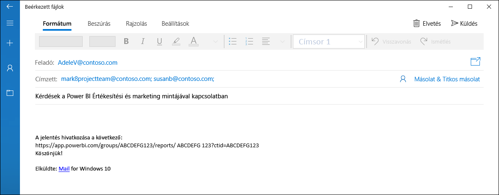
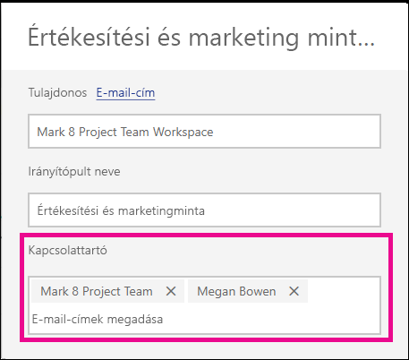

# Kapcsolattartási adatok beállítása jelentésekhez és irányítópultokhoz a Power BI szolgáltatásban
Ez a cikk egy irányítópult vagy jelentés kapcsolattartási adatainak beállítását ismerteti a Power BI szolgáltatásban.

> [!NOTE]
> Az elemekhez klasszikus vagy új munkaterületen is beállíthatók kapcsolattartási adatok. A Saját munkaterületen nem állíthatók be kapcsolattartási adatok az elemekhez. Az információs kártya akkor jelenik meg, ha a jelentést vagy irányítópultot az [új arculattal](service-new-look.md) jelenítik meg.

Egy elem kapcsolataihoz több felhasználó vagy csoport is felvehető. Ezek a következők lehetnek:
* Személy
* Office 365-csoport
* E-mailezési engedéllyel rendelkező biztonsági csoport
* Terjesztési lista

Alapértelmezés szerint az új jelentést vagy irányítópultot létrehozó személy a kapcsolattartó. A beállított érték felülírja az alapértelmezést. A kapcsolattartók listájáról természetesen az összes személy vagy csoport eltávolítható. Ilyenkor klasszikus munkaterület esetén a munkaterület Office 365-csoportja lesz megjelenítve. Az új felületű munkaterületeken a [munkaterület kapcsolatlistája](service-create-the-new-workspaces.md#workspace-contact-list) lesz használva. Ha a munkaterület kapcsolatlistája nincs beállítva, a munkaterület-rendszergazdák jelennek meg.

A kapcsolattartási adatok az elem megtekintő számára vannak megjelenítve. 

 

Ha a kapcsolattartók listájára kattint e-mail lesz létrehozva, amelyben kérdéseket tehet fel, vagy segítséget kérhet. 

 
 
A kapcsolattartók listájának adatai máshol is fel vannak használva. Bizonyos hibák esetén például megjelenik a hibáról tájékoztató párbeszédpanelen. Az elemmel kapcsolatos automatikus e-mail-üzenetek, például hozzáférési kérelmek a kapcsolattartási listának lesznek elküldve. 

> [!NOTE]
> Alkalmazás közzétételekor az egyes elemekhez beállított kapcsolattartási adatok az alkalmazást közzétevő vagy frissítő személyre lesznek beállítva. Beállítható az alkalmazás támogatási URL-címe, hogy az alkalmazás felhasználói szükség esetén segítséget kérhessenek.

## Kapcsolattartási adatok beállítása jelentéshez
1. Kattintson a **Jelentések** fülre a munkaterületén.
2. Keresse meg a kívánt jelentést, és válassza a **Beállítások** ikont.
3. Keresse meg a **Kapcsolattartó** beviteli mezőt, és adja meg annak értékét.

     

## Kapcsolattartási adatok beállítása irányítópulthoz
1. Kattintson az **Irányítópultok** fülre a munkaterületén.
2. Keresse meg a kívánt irányítópultot, és válassza a **Beállítások** ikont.
3. Keresse meg a **Kapcsolattartó** beviteli mezőt, és adja meg annak értékét.

     

## Korlátozások és szempontok
* A kapcsolattartó a Power BI szolgáltatásban létrehozott új elemekhez automatikusan be lesz állítva. A meglévő elemek alapértelmezés szerint megjelenítik a munkaterületet.
* A kapcsolattartási listára bármely felhasználó vagy csoport felvehető, de ezek nem kapnak automatikusan engedélyt az adott elemre. Használjon megosztást, vagy szerepkörön keresztül adjon hozzáférést a munkaterülethez azoknak a felhasználóknak, akiknek szükséges. 

## Következő lépések

További kérdései vannak? [Kérdezze meg a Power BI közösségét](http://community.powerbi.com/)
