# Automatizált Machine Learning a Power BI-ban

Az adatfolyamokhoz készült automatizált gépi tanulás (AutoML) funkció közvetlenül a Power BI-ban teszi lehetővé az üzleti elemzők számára a gépi tanulási (ML-) modellek betanítását, ellenőrzését és meghívását. Tartalmazza egy új ML-modell egyszerű létrehozását, amelyben az elemzők saját adatfolyamaik használatával határozhatják meg a modell betanításához szükséges bemeneti adatokat. A szolgáltatás automatikusan kinyeri a legfontosabb jellemzőket, kiválaszt egy megfelelő algoritmust, majd finomhangolja és ellenőrzi az ML-modellt. A modell betanítása után a Power BI automatikusan generál egy teljesítményjelentést, amely magában foglalja az ellenőrzés eredményeit. Ezt követően a modell az adatfolyamon belül bármely új vagy frissített adattal meghívható.

Az automatizált gépi tanulás funkció csak a Power BI Premium és Embedded kapacitásokon üzemeltetett adatfolyamok számára érhető el.

## Az AutoML használata

A [Power BI-adatfolyamok](service-dataflows-overview.md) lehetővé teszik a big data típusú adatok önkiszolgáló adatelőkészítését. Az AutoML az adatfolyamokba van integrálva, és közvetlenül a Power BI-ban segíti a hatékonyabb adat-előkészítési munkát a gépi tanulási modellek létrehozásához.

A Power BI-ban működő AutoML és az adatfolyamok használatával az adatelemzők egyszerűbben, és csupán a Power BI képességei révén építhetnek gépi tanulási modelleket. A Power BI nagyrészt automatizálja az ML-modellek létrehozásának adattudományos alapjait. Emellett segíti annak biztosítását, hogy a létrehozott modell jó minőségű legyen, és betekintést nyújt az ML-modell létrehozásához használt folyamatba.

Az AutoML az adatfolyamok **bináris előrejelzési**, **besorolási** és **regressziós modelljeit** támogatja. Ezek a felügyelt gépi tanulási módszerek típusai, ami azt jelenti, hogy a korábbi megfigyelések eredményeinek betanulása révén jelzik előre más megfigyelések eredményeit. Az AutoML-modell betanítására szolgáló bemeneti adatkészlet az ismert eredményekkel **címkézett** rekordhalmaz.

A Power BI-beli AutoML az [Azure Machine Learning](https://docs.microsoft.com/azure/machine-learning/service/overview-what-is-azure-ml) [automatizált gépi tanulásának](https://docs.microsoft.com/azure/machine-learning/service/concept-automated-ml) integrálásával hozza létre az ML-modelleket. Ennek ellenére az AutoML Power BI-beli használatához nincs szükség Azure-előfizetésre. Az ML-modellek betanításának és üzemeltetésének teljes folyamatát a Power BI szolgáltatás kezeli.

Egy ML-modell betanítása után az AutoML automatikusan létrehoz egy Power BI-jelentést, amely ismerteti az ML-modell valószínű teljesítményét. Az AutoML az áttekinthetőség érdekében kiemelten tünteti fel a bemeneti adatok között a modell előrejelzéseire legnagyobb hatást gyakorló tényezőket. A jelentés a modellhez tartozó fő mérőszámokat is tartalmazza.

A létrehozott jelentés más lapjain a modell statisztikai összegzése és a betanítási adatok láthatók. A statisztikai összegzés azon felhasználók számára fontos, akik látni szeretnék a modell teljesítményének szabványos adattudományos mértékeit. A betanítási adatok összegzik a modell létrehozásához futtatott összes iterációt a kapcsolódó modellezési paraméterekkel együtt. Azt is leírja, hogy az ML-modell hogy használta fel az egyes bemeneteket.

Ezután alkalmazhatja az ML-modellt az adatok pontozásához. A adatfolyam frissítésekor az adatok a ML-modellből származó előrejelzések alapján frissülnek. A Power BI az ML-modell által előállított minden egyes előrejelzéshez személyre szabott ismertetést nyújt.

## Gépi tanulási modell létrehozása

Ez a szakasz az AutoML-modell létrehozását ismerteti.

### Adat-előkészítés az ML-modell létrehozásához

Ha gépi tanulási modellt kíván létrehozni a Power BI-ban, először egy adatfolyamot kell létrehoznia az előzményalapú eredményekre vonatkozó információkat tartalmazó adatokhoz, mely az ML-modell betanítására szolgál. Ezenkívül számított oszlopokat is fel kell vennie minden olyan üzleti metrikához, amely az előrejelezni kívánt eredmény erős előrejelzője lehet. Az adatfolyam konfigurálásához lásd: [Önkiszolgáló adat-előkészítés a Power BI-ban](service-dataflows-overview.md).

Az AutoML konkrét adatkövetelményeket ad meg a gépi tanulási modell betanításához. Ezeket a követelményeket az alábbi szakaszok ismertetik az egyes modellek szerint.

### Az ML-modellek bemeneteinek konfigurálása

AutoML-modell létrehozásához válassza az adatfolyam-entitás **Műveletek** oszlopában található ML ikont, majd válassza a **Gépi tanulási modell hozzáadása** lehetőséget.

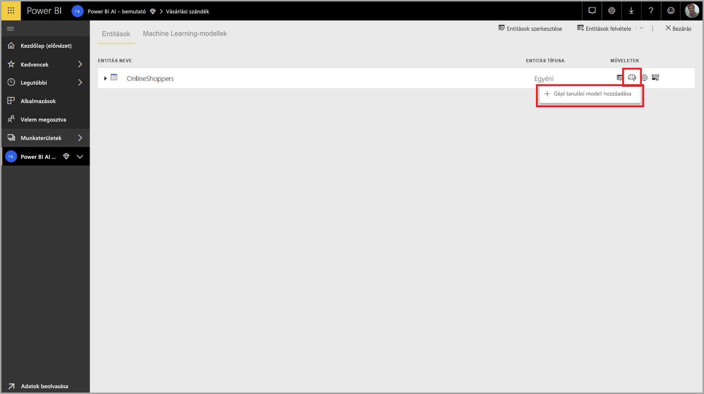

Ekkor elindul az ML-modell létrehozásának egyszerű folyamata, amelyen egy varázsló vezeti végig. A varázsló a következő egyszerű lépéseket tartalmazza.

**1. Az előzményadatokat tartalmazó entitás és az előrejelezni kívánt eredménymező kiválasztása**

Az eredmények mezője azonosítja az ML-modell betanításának címkeattribútumát az alábbi kép szerint.

**2. Modelltípus kiválasztása**

Ha megadja az eredménymezőt, az AutoML a címkeadatok elemzése alapján felajánlja a legnagyobb valószínűséggel betanítható ML-modelltípust. A Másik modell választása lehetőségre kattintva másik típust választhat az alább látható módon.

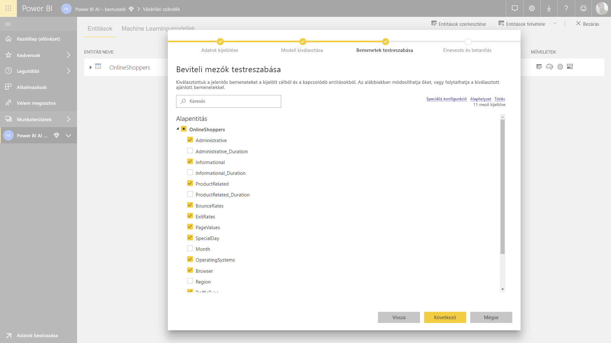

> [!NOTE]
> Előfordulhat, hogy egyes modellek nem támogatottak a kiválasztott adatokhoz, és ezért le vannak tiltva. A fenti példában le van tiltva a Regresszió, mert egy szöveges oszlop van kiválasztva eredménymezőként.

**3. Azon bemenetek kiválasztása, amelyeket a modell előrejelzési jelként használhat**

Az AutoML a kiválasztott entitás egy mintájának elemzése alapján javaslatot tesz az ML-modell betanításához használható bemenetekre. A nem kiválasztott mezők mellett magyarázatok vannak megadva. Ha egy adott mező túl sok különböző értékkel vagy csak egyetlen értékkel rendelkezik, vagy alacsony vagy magas a korrelációja a kimeneti mezővel, azt nem ajánlja a rendszer.

Az eredmény (vagy címke) mezőjétől függő bemenetek nem használhatók az ML-modell betanítására, mert hatással lennének a teljesítményére. Ezeket a mezőket „a kimeneti mezővel gyanúsan magas korrelációjúként” jelöli meg a rendszer. Ha belefoglalja ezeket a mezőket a betanítási adatokba, az címkeszivárgást okozhat, mely során a modell jól teljesít az ellenőrzési vagy tesztelési adatokon, de ezt a teljesítményt nem képes elérni, amikor éles környezetben használják pontozásra. A AutoML-modellek esetében valószínű probléma a címkeszivárgás, ha a betanítási modell teljesítménye túl jó, hogy igaz legyen.

A szolgáltatási javaslat egy adatmintán alapul, ezért vizsgálja felül a használt bemeneteket. Lehetősége van úgy módosítani a kijelöléseket, hogy csak azok a mezők szerepeljenek bennük, amelyeket tanulmányozni szeretne a modellel. Az entitás neve melletti jelölőnégyzet bejelölésével az összes mezőt is kiválaszthatja.

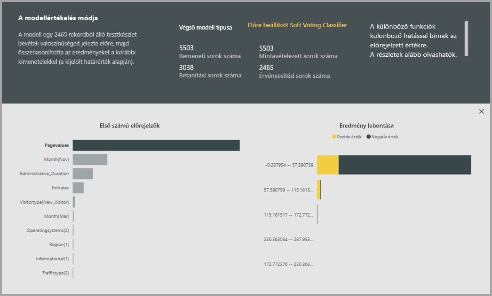

**4. A modell elnevezése és a konfiguráció mentése**

Az utolsó lépésben elnevezheti a modellt, majd a Mentés és betanítás lehetőséget választva megkezdheti az ML-modell betanítását. Dönthet úgy, hogy csökkenti a betanítási időt, hogy gyors eredményeket kapjon, vagy hogy növeli a betanítással töltött időt, hogy a modell a lehető legjobb legyen.

### Az ML-modell betanítása

Az ML-modellek betanítása az adatfolyamok frissítésének része. Az első lépésben az AutoML előkészíti az adatokat a betanításra.
Az AutoML az előzményadatokat betanítási és tesztelési adathalmazra osztja. A tesztelési adathalmaz egy validációs adatkészlet, amellyel a betanítás után ellenőrizhető a modell teljesítménye. Az adathalmazok **Betanítási és Tesztelési** entitásként szerepelnek az adatfolyamban. Az AutoML keresztvalidálást alkalmaz a modell ellenőrzéséhez.

Ezután a rendszer minden beviteli mezőt ellenőriz, és imputálás révén minden hiányzó értéket egy helyettesített értékkel vált fel. Az AutoML több különböző imputálási stratégiát használ. A numerikus jellemzőkként kezelt bemeneti attribútumok esetében a rendszer az oszlop értékeinek középértékét használja a bevitelhez. A kategorikus jellemzőkként kezelt bemeneti attribútumok esetében az AutoML az oszlop értékeinek módját használja a bevitelhez. A bevitelhez használt értékek középértékét és módját a mintavételezett betanítási adathalmazon számítja ki az AutoML-keretrendszer.

Ezt követően a rendszer szükség szerint alkalmaz mintavételezést és normalizálást az adatokra. A besorolási modellek esetében a AutoML rétegzett mintavételezést futtat a bemeneti adatokon, és kiegyensúlyozza az osztályokat, így biztosítva, hogy a sorok száma mindegyikben egyenlő legyen.

Az AutoML számos átalakítást alkalmaz minden egyes kiválasztott beviteli mezőre annak adattípusa és statisztikai tulajdonságai alapján. Az AutoML ezeket az átalakításokat az ML-modell betanítása során igénybe vehető funkciók kinyeréséhez használja fel.

Az AutoML-modellek betanítási folyamata a legjobb teljesítményű modell létrehozása érdekében akár 50 iterációt is tartalmazhat különböző modellezési algoritmusokkal és hiperparaméter-beállításokkal. Előfordulhat, hogy a betanítás korán, kisebb számú iteráció után ér véget, ha az AutoML azt észleli, hogy nincs érzékelhető teljesítményjavulás. Az egyes modellek teljesítményét a validációs tesztadatkészlettel történő értékelés ellenőrzi. Ebben a betanítási lépésben az AutoML számos folyamatot hoz létre az iterációk betanításához és ellenőrzéséhez. A modellek teljesítményének értékelése hosszabb időt vehet igénybe, amely néhány perctől több óráig, de legfeljebb a varázslóban konfigurált betanítási időig terjedhet az adatkészlet méretétől és az elérhető dedikált kapacitásbeli erőforrásoktól függően.

Bizonyos esetekben az előállított végső modell az együttes tanulás módszerét is felhasználhatja, amely több modellt vesz igénybe a jobb előrejelzési teljesítményhez.

### Az AutoML-modell áttekinthetősége

A modell betanítása után az AutoML elemzi a kapcsolatot a bemeneti funkciók és a modell kimenete között. Felméri a modell kimenetében bekövetkezett változás nagyságát minden bemeneti jellemző validációs tesztadatkészletére. Ez a _funkció fontossága_. Ez a frissítés részeként történik, a betanítás befejeződése után. Ezért a frissítés akár a varázslóban konfigurált betanítási időnél hosszabb időt is igénybe vehet.

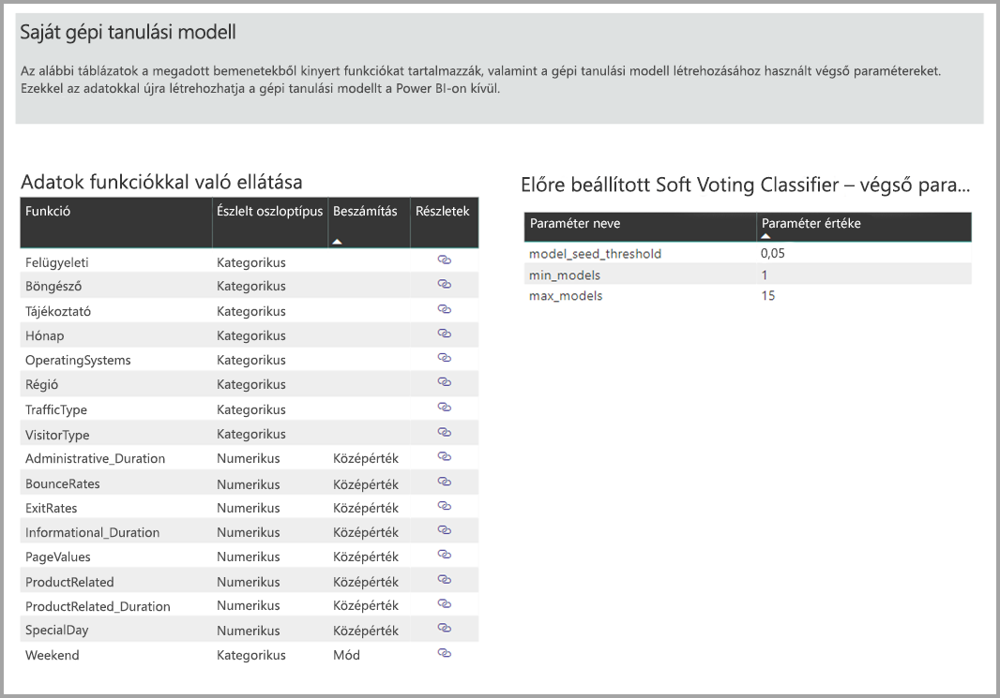

### AutoML modell-jelentés

Az AutoML létrehoz egy Power BI-jelentést, amely összegzi a modell validáció során nyújtott teljesítményét, valamit a globális funkciófontosságot. Ez a jelentés a Gépi tanulási modell lapon érhető el az adatfolyam sikeres frissítését követően. A jelentés összefoglalja az ML-modell validációs tesztadatokra alkalmazásának eredményeit és összeveti az előrejelzéseket az ismert kimeneti értékekkel.

A modellhez tartozó jelentés áttekintésével megértheti annak teljesítményét. Azt is ellenőrizheti, hogy a modell fő befolyásolói megfelelnek-e az ismert eredményekre vonatkozó üzleti információknak.

A jelentésben a modell teljesítményének leírásához használt diagramok és mértékek a modell típusától függenek. A teljesítménydiagramokat és -mértékeket a következő szakaszok mutatják be.

A jelentés egyéb oldalai adatelemzési szempontból írhatnak le statisztikai mértékeket a modellről. A **bináris előrejelzéshez** tartozó jelentés például tartalmaz egy nyereségi diagramot és a modell ROC-görbéjét.

A jelentésekhez egy **Betanítási adatok** oldal is tartozik, amely leírja a modell betanításának módját, és grafikonon ábrázolja a modell teljesítményét minden egyes iteráció futtatásakor.

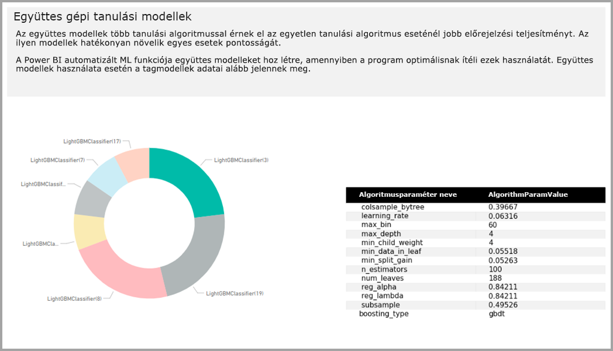

Az oldal egy másik szakasza a beviteli mező észlelt típusát és a hiányzó értékek kitöltéséhez használt beviteli módszert írja le. Tartalmazza a végső modell által használt paramétereket is.

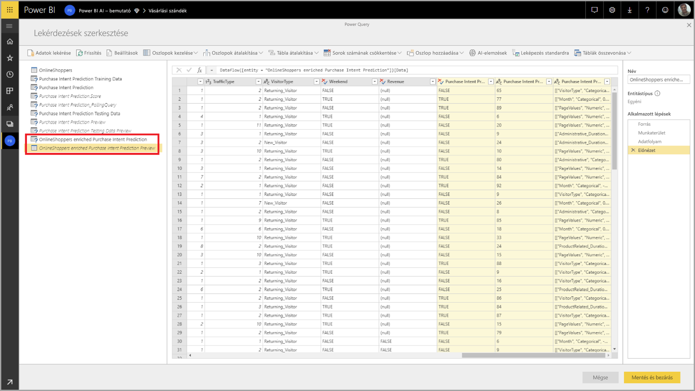

Ha a modell az együttes tanulás módszerét használta, akkor a **Betanítási adatok** oldalon az együttest alkotó minden egyes modell súlyozása és paraméterei egy grafikonon vannak ábrázolva.

## Az AutoML-modell alkalmazása

Ha elégedett a létrehozott ML-modell teljesítményével, akkor az adatfolyam minden frissülésekor alkalmazhatja új vagy frissített adatokra. Ezt a modellhez tartozó jelentésben teheti meg, a jobb felső sarokban található **Alkalmazás** gombot, vagy a Gépi tanulási modellek lap műveletei között található ML-modell alkalmazása gombot választva.

Az ML-modell alkalmazásához meg kell adnia annak az entitásnak a nevét, amelyre alkalmazni kívánja azt, és egy előtagot az entitáshoz hozzáadandó, a modell kimenetét jelző oszlopokhoz. Az oszlopnevek alapértelmezett előtagja a modell neve. Az _Alkalmazás_ funkció a modell típusára jellemző további paramétereket is tartalmazhat.

Az ML-modell alkalmazása két új adatfolyam-entitást hoz létre, amelyek a kimeneti entitásban lévő összes sorhoz tartozó előrejelzéseket és személyre szabott magyarázatokat tartalmazzák. Ha például a _PurchaseIntent_ modellt alkalmazza az _OnlineShoppers_ entitásra, a kimenet az **OnlineShoppers enriched PurchaseIntent** és az **OnlineShoppers enriched PurchaseIntent explanations** entitást hozza létre. A bővített entitás minden sorához tartozó **magyarázatok** több sorra vannak bontva a magyarázatok bővített entitásában a bemeneti jellemző alapján. A magyarázatok bővített entitásában szereplő sorok a bővített entitásban szereplő sorhoz való hozzárendelését az **ExplanationIndex** (Magyarázatindex) segíti.

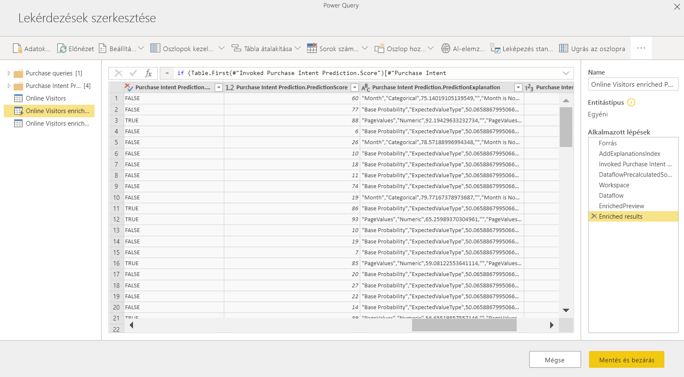

A modell alkalmazása után az AutoML mindig naprakészen tartja az előrejelzéseket, ha az adatfolyam frissül.

Ha Power BI-jelentésben szeretné felhasználni az ML-modell elemzéseit és előrejelzéseit, akkor a Power BI Desktopból kapcsolódhat a kimeneti entitáshoz az **adatfolyamok**-összekötő használatával.

## Bináris előrejelzési modellek

A bináris előrejelzési modellek, vagy hivatalos nevükön a **bináris besorolási modellek** egy adathalmaz két csoportba sorolására szolgálnak. Ezek olyan eseményeket jeleznek előre, amelyeknek kétféle kimenetelük lehet. Ilyen például, hogy konvertálódik-e egy értékesítési lehetőség, megszűnik-e egy felhasználói fiók, időben befizetnek-e egy számlát, megtévesztő-e egy tranzakció, és így tovább.

A bináris előrejelzési modell kimenete egy valószínűségi pontszám, amely annak a valószínűségét jelzi, hogy a célzott eredmény megvalósul-e.

### A bináris előrejelzési modell betanítása

Előfeltételek:

- Minden eredményosztályhoz legalább 20 sornyi előzményalapú adatra van szükség

A bináris előrejelzési modell létrehozási folyamata ugyanazokat a lépéseket követi, mint a többi AutoML-modellé, ahogy azt **Az ML-modellek bemeneteinek konfigurálása** című, fentebb olvasható szakasz ismerteti. Egyedül a Modell kiválasztása lépés eltérő, amelyben kiválaszthatja a célzott eredményértéket, amely a leginkább érdekli. Felhasználóbarát címkéket is megadhat a modell értékelési eredményeit összefoglaló, automatikusan előállított jelentés eredményeihez.

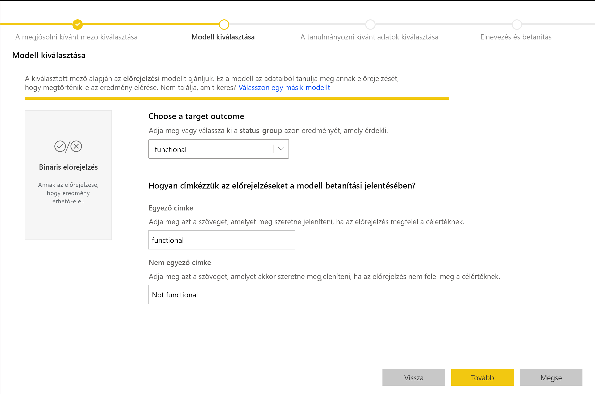

### A bináris előrejelzési modellhez tartozó jelentés

A bináris előrejelzési modell kimenete annak a valószínűsége, hogy a rekord megvalósítja-e a célzott eredményt. A jelentéshez tartozik egy szeletelő a valószínűségi küszöbérték meghatározásához, amely hatással van a küszöb feletti és alatti pontszámok értékelésére.

A jelentés a _Valós pozitív, álpozitív, valós negatív és téves negatív_ kifejezésekkel mutatja be a modell teljesítményét. Az Igaz pozitív és az Igaz negatív értékek a két osztály pontosan előrejelzett eredményeit jelölik az eredményadatokban. Az álpozitívok olyan rekordok, amelyekhez a célzott eredmény lett előrejelezve, de nem ezzel rendelkeznek. Ezzel szemben a téves negatívok olyan rekordok, amelyek a célzott eredménnyel rendelkeznek, de nem ez lett számukra előrejelezve.

A mértékek, például a Pontosság és a Visszahívás, a valószínűségi küszöb előrejelzett eredményekre gyakorolt hatását írják le. A valószínűségi szeletelő használatával olyan küszöböt választhat, amely kiegyensúlyozott kompromisszumot jelent a Pontosság és a Visszahívás között.

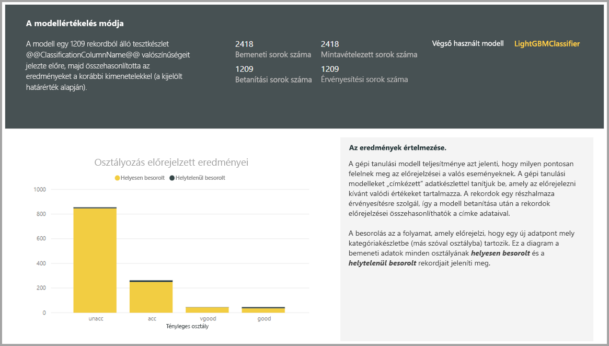

A jelentés egy költség-haszon elemzési eszközt is tartalmaz, amellyel azonosíthatja a sokaság azon részhalmazát, amelynek a legmagasabb profitot kell eredményeznie. A költség-haszon elemzés egy adott célzási egységköltségre, illetve a célzott eredmény eléréséből származó egységnyi haszonra adott becslés alapján tesz kísérletet a nyereség maximalizálására. Ezzel az eszközzel a gráf maximumpontja alapján kiválaszthatja a valószínűségi küszöbértéket a nyereség maximalizálása érdekében. Emellett a gráf alapján kiszámíthatja a kiválasztott valószínűségi küszöbértékhez tartozó nyereséget vagy költséget.

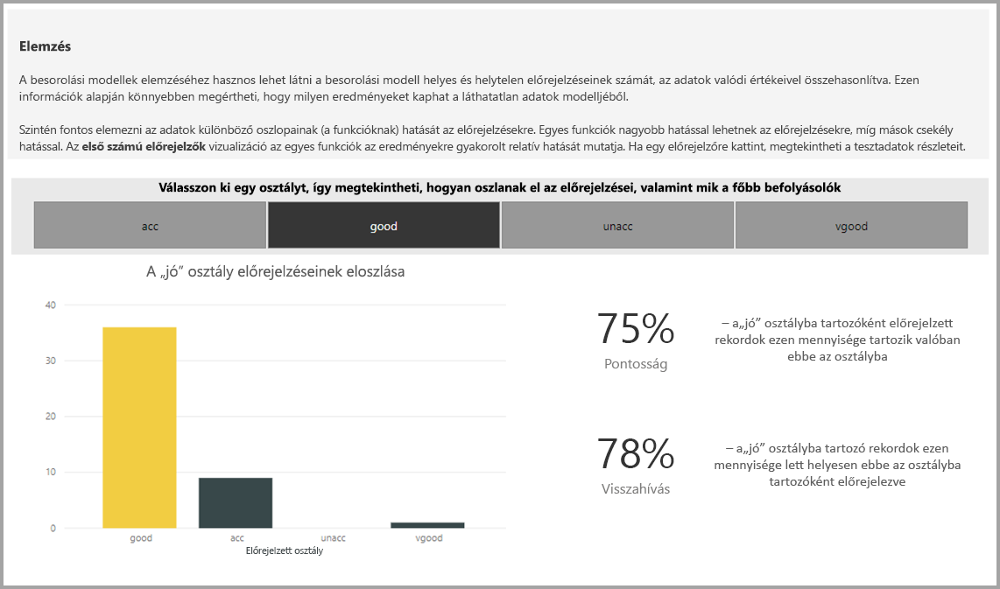

A modellhez tartozó jelentés **Pontossági jelentés** oldala tartalmaz egy _Összesített nyereségek_ diagramot és a modell ROC-görbéjét. Ezek a modell teljesítményének statisztikai mértékei. A jelentésekben megtalálható a feltüntetett diagramok leírása.

### A bináris előrejelzési modell alkalmazása

A bináris előrejelzési modell használatához meg kell adnia azt az entitást, amelynek adataira alkalmazni szeretné az ML-modell előrejelzéseit. További paraméter például a kimeneti oszlop nevének előtagja és az előrejelzett eredmény besorolásához használt valószínűségi küszöb.

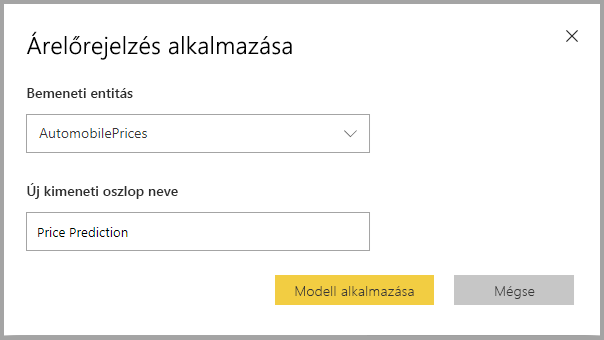

A bináris előrejelzési modell alkalmazásakor a modell négy kimeneti oszlopot ad hozzá a bővített kimeneti entitáshoz. **Outcome** (Eredmény), **PredictionScore** (Előrejelzési pontszám), **PredictionExplanation** (Előrejelzés magyarázata) és **ExplanationIndex** (Magyarázatindex). Az entitásban szereplő oszlopnevek előtagja a modell alkalmazásakor jön létre.

A **PredictionScore** (Előrejelzési pontszám) egy százalékos valószínűség, amely annak a valószínűségét jelzi, hogy a célzott eredmény megvalósul-e.

Az **Outcome** (Eredmény) oszlop tartalmazza az előrejelzett eredmény címkéjét. A küszöb feletti valószínűségű rekordok az előrejelzés szerint valószínűleg elérik a célzott eredményt, és True (Igaz) címkével vannak megjelölve. A küszöb feletti valószínűségű rekordok az előrejelzés szerint valószínűleg nem érik el az eredményt, és False (Hamis) címkével vannak megjelölve.

A **PredictionExplanation** oszlop annak a magyarázatát tartalmazza, hogy a bemeneti funkciók milyen konkrét hatást gyakoroltak a **PredictionScore** oszlop értékeire.

## Besorolási modellek

A besorolási modellek egy adatkészlet több csoportba vagy osztályba sorolására szolgálnak. Ezek olyan események előrejelzésére használhatók, ahol több lehetőség közül egy eredmény valósulhat meg. Ilyen például, hogy egy vásárló élettartam-értéke valószínűleg nagyon magas, magas, közepes vagy alacsony-e, vagy hogy az alapértelmezett kockázat magas, mérsékelt, alacsony, vagy nagyon alacsony-e, és így tovább.

A besorolási modell kimenete egy valószínűségi pontszám, amely annak a valószínűségét határozza meg, hogy egy rekord megvalósítja-e egy adott osztály feltételeit.

### A besorolási modell betanítása

A besorolási modell betanítási adatait tartalmazó bemeneti entitásnak tartalmaznia kell egy sztring vagy egész szám típusú mezőt, amely az eredmények mezője, és a korábbi ismert eredményeket határozza meg.

Előfeltételek:

- Minden eredményosztályhoz legalább 20 sornyi előzményalapú adatra van szükség

A besorolási modell létrehozási folyamata ugyanazokat a lépéseket követi, mint a többi AutoML-modellé, ahogy **Az ML-modellek bemenetének konfigurálása** című, fentebb olvasható szakasz ismerteti.

### A besorolási modellhez tartozó jelentés

A besorolási modellhez tartozó jelentés létrehozásához a rendszer a validációs tesztadatokra alkalmazza az ML-modellt, és összehasonlítja a rekord előrejelzett osztályát a ténylegesen megismert osztállyal.

A jelentés egy diagramot tartalmaz minden egyes ismert osztály pontosan és pontatlanul besorolt rekordjairól.

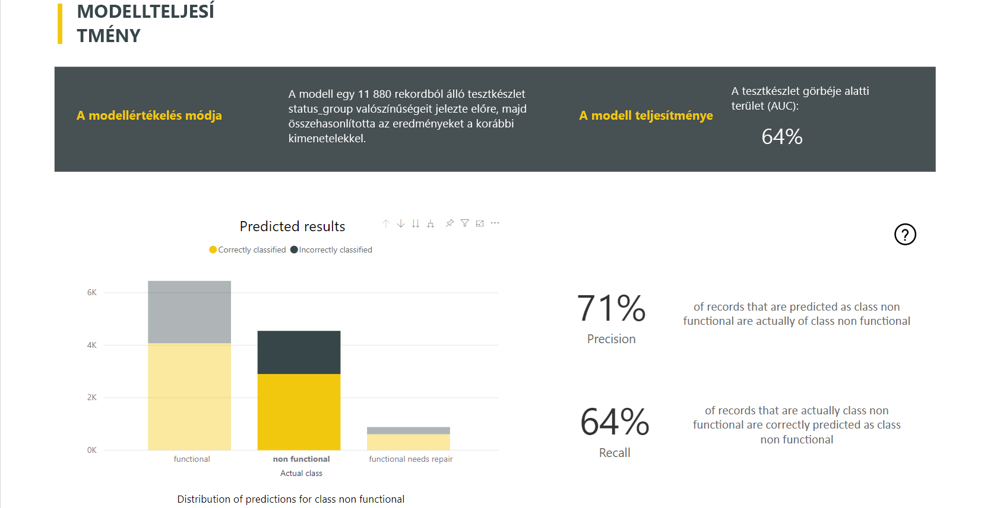

Egy további osztályspecifikus részletezés lehetővé teszi annak elemzését, hogy egy ismert osztály előrejelzései miképpen oszlanak meg. Itt azok az egyéb osztályok jelennek meg, ahol az adott ismert osztály rekordjainak besorolása valószínűleg helytelen.

A jelentésben szereplő modell magyarázata az osztályok legfontosabb előrejelzőit is tartalmazza.

A besorolási modellhez tartozó jelentésben a többi modelltípushoz hasonlóan szerepel egy Betanítási adatok oldal, amelyet a feljebb olvasható **Az AutoML-modellhez tartozó jelentés** szakasz ismertet.

### A besorolási modell alkalmazása

A besorolási ML-modell alkalmazásához meg kell adnia a bemeneti adatokat tartalmazó entitást és a kimeneti oszlop nevének előtagját.

A besorolási modell alkalmazásakor a modell öt kimeneti oszlopot ad hozzá a bővített kimeneti entitáshoz. **ClassificationScore** (Besorolási pontszám), **ClassificationResult** (Besorolási eredmény), **ClassificationExplanation** (Besorolás magyarázata), **ClassProbabilities** (Osztályvalószínűségek) és **ExplanationIndex** (Magyarázatindex). Az entitásban szereplő oszlopnevek előtagja a modell alkalmazásakor jön létre.

A **ClassProbabilities** (Osztályvalószínűségek) oszlop a rekord valószínűségi pontszámainak listáját tartalmazza minden lehetséges osztályhoz.

A **ClassificationScore** (Besorolási pontszám) a százalékos valószínűség, amely annak a valószínűségét határozza meg, hogy egy rekord megvalósítja-e egy adott osztály feltételeit.

A **ClassificationResult** (Besorolási eredmény) oszlop a rekord legvalószínűbb előrejelzett osztályát tartalmazza.

A **ClassificationExplanation** (Besorolás magyarázata) oszlop annak a magyarázatát tartalmazza, hogy a bemeneti jellemzők milyen konkrét hatást gyakoroltak a **ClassificationScore** (Besorolási pontszám) oszlop értékeire.

## Regressziós modellek

A regressziós modellek egy numerikus érték előrejelzésére szolgálnak. Ilyen például egy értékesítési ügylet várható bevétele, egy előfizetői fiók élettartama, egy várhatóan beérkező kintlevőség értéke, egy számla lehetséges befizetésének dátuma, és így tovább.

A regressziós modell kimenete az előrejelzett érték.

### A regressziós modell betanítása

A regressziós modell betanítási adatait tartalmazó bemeneti entitásnak tartalmaznia kell egy numerikus mezőt, amely az eredmények mezője, és az ismert eredményeket határozza meg.

Előfeltételek:

- Regressziós modellhez legalább 100 sor előzményalapú adatra van szükség

A regressziós modell létrehozási folyamata ugyanazokat a lépéseket követi, mint a többi AutoML-modellé, ahogy az **ML-modellek bemenetének konfigurálása** című, fentebb olvasható szakasz ismerteti.

### A regressziós modellhez tartozó jelentés

Hasonlóan a többi AutoML-jelentéshez, a regressziós jelentés is a modell validációs tesztadatokra alkalmazásának eredményein alapul.

A modellhez tartozó jelentés egy grafikonon veti össze az előrejelzett értékeket a tényleges értékekkel. A grafikonon az átlós vonaltól való távolság jelzi az előrejelzés hibáit.

A maradványhiba-diagram a különböző értékek átlagos hibaeloszlását mutatja be százalékosan a validációs tesztadatkészletben. A vízszintes tengely a tényleges érték középértékét jelzi a csoportban, a buborékok mérete az értékek gyakoriságát vagy számát mutatja az adott tartományban. A függőleges tengely az átlagos maradványhiba.

A regressziós modellhez tartozó jelentésben a többi modelltípushoz hasonlóan szerepel egy Betanítási adatok oldal, ahogy **Az AutoML-modellhez tartozó jelentés** című szakasz ismerteti.

### Regressziós modell alkalmazása

A regressziós ML-modell alkalmazásához meg kell adnia a bemeneti adatokat tartalmazó entitást és a kimeneti oszlop nevének előtagját.

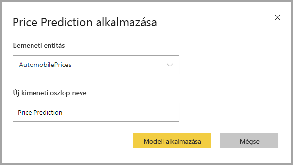

A regressziós modell alkalmazásakor a modell három kimeneti oszlopot ad hozzá a bővített kimeneti entitáshoz. **RegressionResult** (Regresszió eredménye), **RegressionExplanation** (Regresszió magyarázata) és **ExplanationIndex** (Magyarázatindex). Az entitásban szereplő oszlopnevek előtagja a modell alkalmazásakor jön létre.

A **RegressionResult** (Regresszió eredménye) oszlop a rekord előrejelzett értékét tartalmazza a bemeneti mezők alapján. A **RegressionExplanation** (Regresszió magyarázata) oszlop annak a magyarázatát tartalmazza, hogy a bemeneti jellemzők milyen konkrét hatást gyakoroltak a **RegressionResult** (Regresszió eredménye) oszlop értékeire.

## Következő lépések

Ez a cikk áttekintést nyújtott az adatfolyamokhoz készült Automatizált Machine Learning funkcióról a Power BI szolgáltatásban. A következő cikkek szintén hasznosak lehetnek.

- [Oktatóanyag: Gépi tanulási modell létrehozása a Power BI-ban](service-tutorial-build-machine-learning-model.md)
- [Oktatóanyag: A Cognitive Services használata a Power BI-ban](service-tutorial-use-cognitive-services.md)
- [Oktatóanyag: (Klasszikus) Machine Learning Studio-modell meghívása a Power BI-ban (előzetes verzió)](service-tutorial-invoke-machine-learning-model.md)
- [Cognitive Services-szolgáltatások a Power BI-ban](service-cognitive-services.md)
- [Az Azure Machine Learning integrálása a Power BI-jal](service-machine-learning-integration.md)

Az adatfolyamokkal kapcsolatban az alábbi cikkeket érdemes elolvasni:

- [Adatfolyamok létrehozása és használata a Power BI-ban](service-dataflows-create-use.md)
- [Számított entitások használata a Power BI Premiumban](service-dataflows-computed-entities-premium.md)
- [Adatfolyamok használata helyszíni adatforrásokkal](service-dataflows-on-premises-gateways.md)
- [Fejlesztői erőforrások Power BI-adatfolyamokhoz](service-dataflows-developer-resources.md)
- [Adatfolyamok és az Azure Data Lake integrációja (előzetes verzió)](service-dataflows-azure-data-lake-integration.md)
