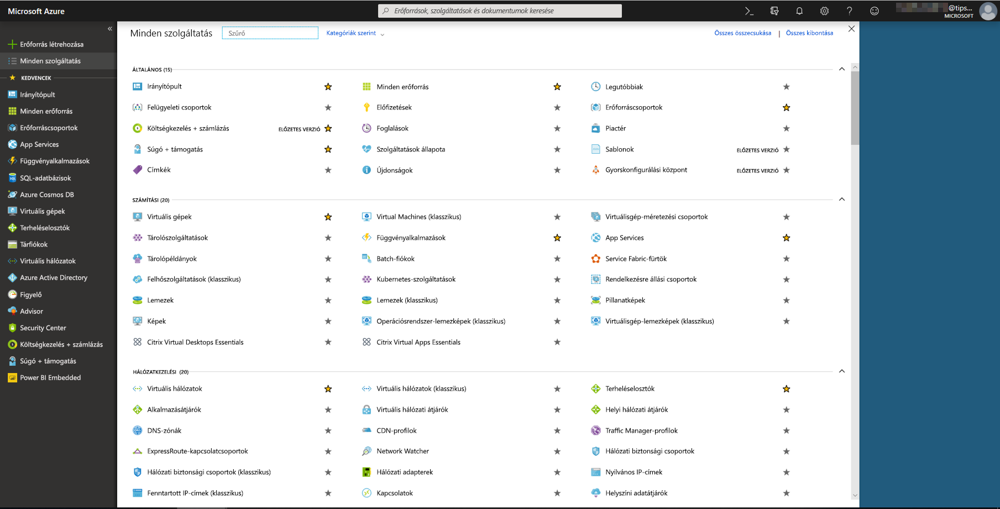
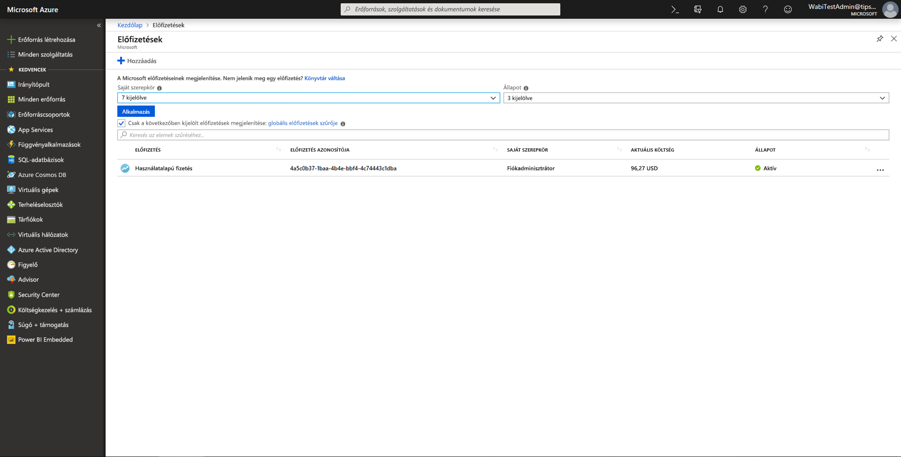
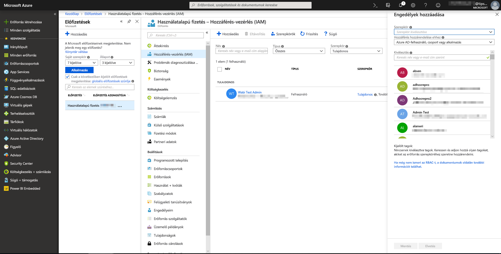
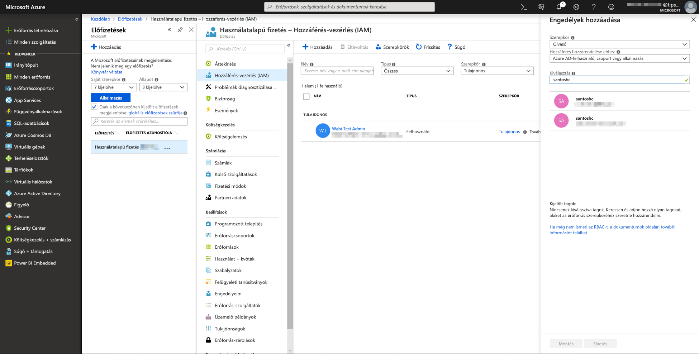
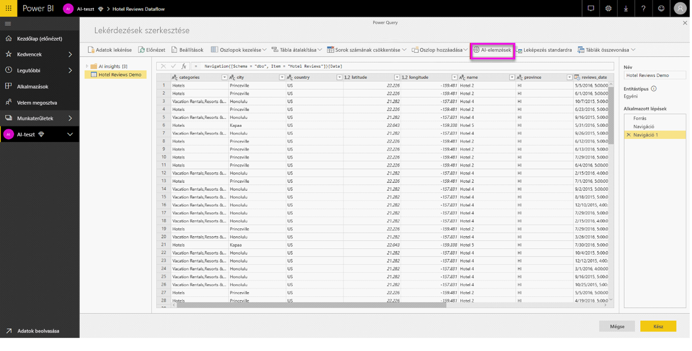
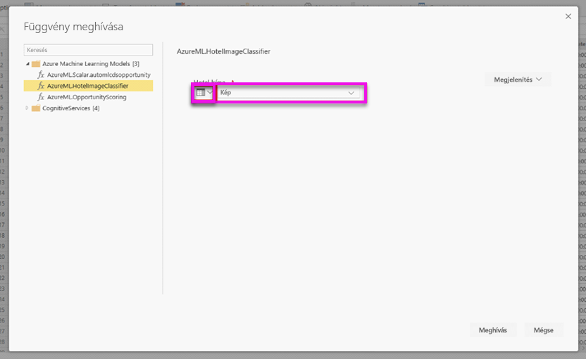
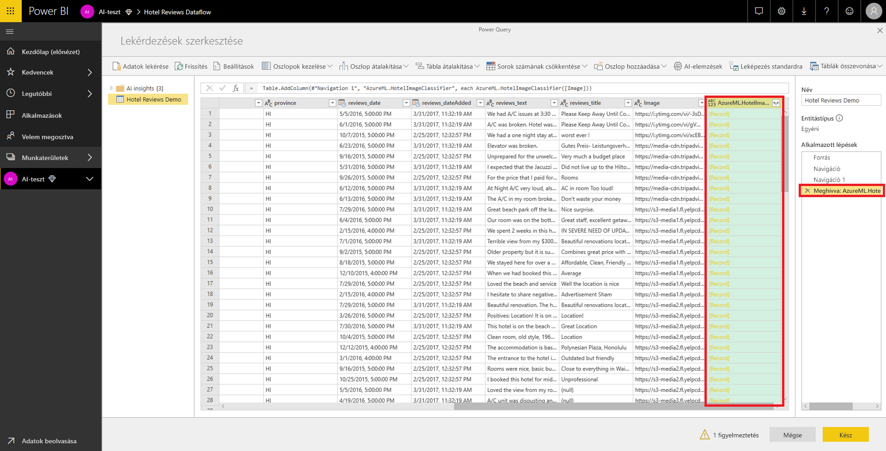
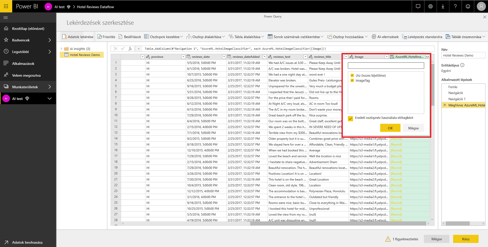

# Az Azure Machine Learning integrálása a Power BI-jal

Számos szervezet használja a **Machine Learning** modelljeit hatékonyabb üzleti elemzések és előrejelzések készítéséhez. A modellekből kinyerhető információk (valamint ezek megjelenítése) a jelentésekben, irányítópultokban és egyéb elemzésekben segít az üzleti felhasználóknak értelmezni ezeket az adatokat.  A Power BI most már maguktól értetődő, egérrel végezhető műveletekkel egyszerűen beépíthetővé teszi az Azure Machine Learning szolgáltatásban üzemeltetett modellek elemzéseit.

A funkció használatához egy adattudós egyszerűen hozzáférést biztosíthat az Azure ML-modellhez egy BI-elemzőnek az Azure Portalon.  Innentől kezdve a Power Query minden munkamenet elején felismeri azokat az Azure ML-modelleket, amelyekhez a felhasználó hozzáfér, és dinamikus Power Query-függvényként jeleníti meg őket.  A felhasználó ezután meghívhatja ezeket a függvényeket a Power Query-szerkesztő menüszalagjáról vagy közvetlenül az M függvénnyel. A Power BI a jobb teljesítmény érdekében automatikusan kötegeli a hozzáférési kéréseket, amikor meghívja az Azure ML-modellt egy sorkészlethez.

Ez a funkció jelenleg csak Power BI-adatfolyamokban, valamint a Power Query online, a Power BI-ban történő használatához támogatott.

További információ az adatfolyamokról: [Önkiszolgáló adat-előkészítés a Power BI-ban](service-dataflows-overview.md).

További információ az Azure Machine Learning szolgáltatásról:

- Áttekintés:  [Mi az Azure Machine Learning?](https://docs.microsoft.com/azure/machine-learning/service/overview-what-is-azure-ml)
- Rövid útmutatók és oktatóanyagok az Azure Machine Learning szolgáltatáshoz:  [Azure Machine Learning-dokumentáció](https://docs.microsoft.com/azure/machine-learning/)

## Az Azure ML-modellhez való hozzáférés biztosítása egy Power BI-felhasználónak

Egy Azure ML-modell a Power BI-ból való eléréséhez a felhasználónak **olvasási** hozzáféréssel kell rendelkeznie az Azure-előfizetésben.  Továbbá:

- (Klasszikus) Machine Learning Studio-modellek esetén **Olvasási** hozzáférés a (klasszikus) Machine Learning Studio-webszolgáltatáshoz
- Machine Learning-modellek esetén **Olvasási** hozzáférés a Machine Learning-munkaterülethez

A cikk lépései ismertetik, hogyan adhat hozzáférést egy Power BI-felhasználónak egy Azure Machine Learning Service-modellhez, hogy azt Power Query-függvényként használhassa.  További részletekért tekintse meg a [Hozzáférés-kezelés az RBAC és az Azure Portal segítségével](https://docs.microsoft.com/azure/role-based-access-control/role-assignments-portal) című témakört.

1. Jelentkezzen be az [Azure Portalra](https://portal.azure.com).

2. Lépjen az **Előfizetések** oldalra. Az **Előfizetések** oldal az Azure Portalon a navigációs ablaktábla menüjének **Minden szolgáltatás** listájában található.

    

3. Válassza ki az előfizetését.

    

4. Válassza a **Hozzáférés-vezérlés (IAM)** , majd a **Hozzáadás** lehetőséget.

    

5. Szerepkörként válassza az **Olvasó** lehetőséget. Válassza ki azt a Power BI-felhasználót, akinek hozzáférést szeretne adni az Azure ML-modellhez.

    

6. Kattintson a **Mentés** gombra.

7. Ismételje meg a 3–6. lépést, így **Olvasási** hozzáférést adhat a felhasználónak az adott (klasszikus) Machine Learning Studio-webszolgáltatáshoz *vagy* a modellt tartalmazó Machine Learning-munkaterülethez.

## Machine Learning-modellek sémafeltárása

Az adattudósok elsősorban Pythont használnak a Machine Learning gépi tanulási modelljeinek fejlesztéséhez és üzembe helyezéséhez.  A (klasszikus) Machine Learning Studióval ellentétben (amely automatizálja a modell sémafájljainak létrehozását) a Machine Learning esetében az adattudósnak explicit módon kell generálnia a sémafájlt a Pythonnal.

Ezt a sémafájlt bele kell foglalni a Machine Learning-modellekhez üzembe helyezett webszolgáltatásba. Ahhoz, hogy a séma automatikusan generálva legyen a webszolgáltatásban, meg kell adnia a bemenet/kimenet mintáját az üzembe helyezett modell belépési szkriptjében. Olvassa el a [Modellek üzembe helyezése az Azure Machine Learning szolgáltatással című dokumentáció (választható) Automatikus Swagger-séma létrehozása](https://docs.microsoft.com/azure/machine-learning/service/how-to-deploy-and-where#optional-automatic-schema-generation) című fejezetét. A hivatkozás egy példát is tartalmaz a belépési szkriptre a sémageneráló utasításokkal. 

A belépési szkript *\@input_schema* és *\@output_schema* függvénye az *input_sample* és az *output_sample* változóban hivatkozik a bemeneti és kimeneti mintaformátumokra, és ezeket a mintákat használja a webszolgáltatás egy OpenAPI- (Swagger-) specifikációjának generálására az üzembe helyezés során.

A belépési szkript módosításakor ezeket a sémagenerálási utasításokat kell alkalmazni az Azure Machine Learning SDK-val végzett automatizált gépi tanulási kísérletek használatával létrehozott modellekre is.

> [!NOTE]
> Az Azure Machine Learning vizuális felületén létrehozott modellek jelenleg nem támogatják a sémagenerálást, de a későbbi kiadásokban már fogják. 

## Az Azure ML-modell meghívása a Power BI-ban

A Power Query-szerkesztőben közvetlenül meghívhat minden olyan Azure ML-modellt, amelyhez hozzáféréssel rendelkezik. Az Azure ML-modellek eléréséhez válassza a **Szerkesztés** gombot azon entitáshoz, amelyet az Azure ML-modell elemzéseivel szeretne bővíteni.

A **Szerkesztés** gombbal megnyithatja a Power Query-szerkesztőt az adatfolyam entitásaihoz.

Válassza a menüszalag **AI-elemzések** gombját, majd a navigációs ablaktábla menüjében az _Azure Machine Learning-modellek_ mappát. Itt Power Query-függvényként láthat minden olyan Azure ML-modellt, amelyhez hozzáférhet. Az Azure ML-modell bemeneti paraméterei automatikusan le vannak képezve a megfelelő Power Query-függvény paramétereiként.

Az Azure ML-modell meghívásához bemenetként a kijelölt entitás bármelyik oszlopát megadhatja. Emellett megadhat egy állandó értéket is, amelyet bemenetként használhat. Ehhez a bemeneti párbeszédpanelen be kell kapcsolnia az oszlop ikont.

A **Meghívás** lehetőséggel megtekintheti az Azure ML-modell kimenetét új oszlopként az entitástáblában. Láthatja, hogy a modell meghívása a lekérdezés lépéseként is megjelenik.

Ha a modell több kimeneti paramétert eredményez, azok egy rekordként lesznek csoportosítva a kimeneti oszlopban. Az oszlop kibontásával több egyéni kimeneti paramétert kaphat különálló oszlopokban.

Az adatfolyam mentése után a rendszer az entitástábla minden új vagy frissített sora esetén automatikusan meghívja a modellt, amikor az adatfolyam frissül.

## Következő lépések

Ez a cikk áttekintést nyújtott a Machine Learning a Power BI szolgáltatásba való integrálásáról. Az alábbi cikkeket is érdekesnek találhatja. 

* [Oktatóanyag: (Klasszikus) Machine Learning Studio-modell meghívása a Power BI-ban](service-tutorial-invoke-machine-learning-model.md)
* [Oktatóanyag: A Cognitive Services használata a Power BI-ban](service-tutorial-use-cognitive-services.md)
* [Cognitive Services-szolgáltatások a Power BI-ban](service-cognitive-services.md)

Az adatfolyamokkal kapcsolatban az alábbi cikkeket érdemes elolvasni:
* [Adatfolyamok létrehozása és használata a Power BI-ban](service-dataflows-create-use.md)
* [Számított entitások használata a Power BI Premiumban](service-dataflows-computed-entities-premium.md)
* [Adatfolyamok használata helyszíni adatforrásokkal](service-dataflows-on-premises-gateways.md)
* [Fejlesztői erőforrások Power BI-adatfolyamokhoz](service-dataflows-developer-resources.md)
* [Adatfolyamok és az Azure Data Lake integrációja (előzetes verzió)](service-dataflows-azure-data-lake-integration.md)

