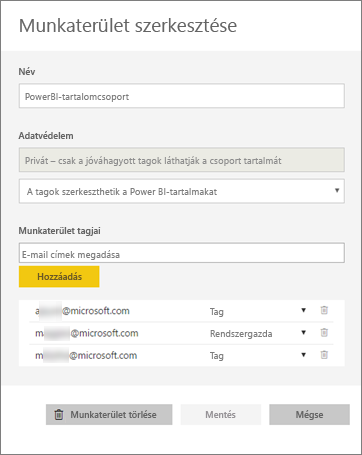
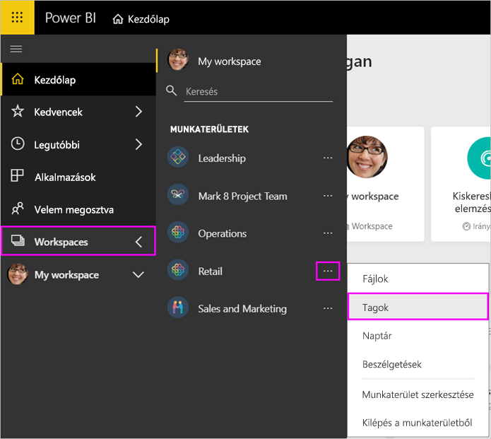
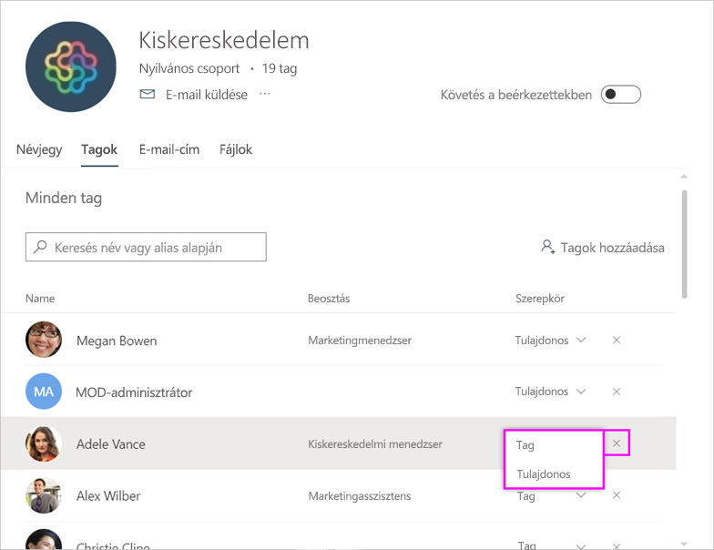
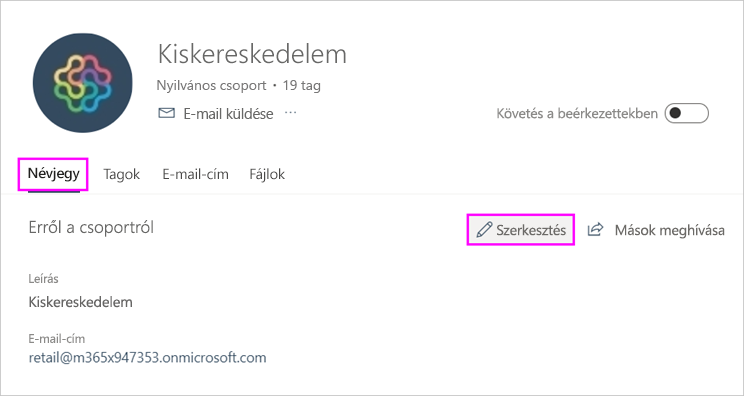
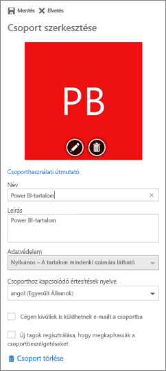

# Az alkalmazás-munkaterület kezelése a Power BI-ban és az Office 365-ben

Az Office 365-ben vagy a [Power BI-ban az alkalmazás-munkaterület](service-create-distribute-apps.md) létrehozójaként vagy rendszergazdájaként Ön kezeli a Power BI munkaterületének egyes funkcióit. Más funkciókat az Office 365-ben kezelhet.

> [!NOTE]
> Az új munkaterületi felhasználói felület előzetes verziójában megváltozik a Power BI-munkaterületek és az Office 365-csoportok közötti kapcsolat. A rendszer nem fog automatikusan létrehozni Office 365-csoportokat minden alkalommal, amikor egy új munkaterület jön létre. Tudnivalók [az új munkaterületek létrehozásáról](service-create-the-new-workspaces.md).

A **Power BI-ban** a következőket teheti:

* Alkalmazás-munkaterület tagjainak felvétele és eltávolítása, valamint a munkaterület egy tagjának rendszergazdává alakítását.
* Az alkalmazás-munkaterület nevének szerkesztése.
* Az alkalmazás-munkaterület törlése.

Az **Office 365-ben** a következőket teheti:

* Az alkalmazás-munkaterület csoporttagjainak felvétele és eltávolítása, valamint egy tag tulajdonossá tétele.
* A csoport nevének, képének, leírásának és más beállításoknak a szerkesztése.
* A csoport e-mail-címének megtekintése.
* A csoport törlése.

Ahhoz, hogy alkalmazás-munkaterület rendszergazdája vagy tagja lehessen, [Power BI Pro-licencre](service-features-license-type.md) van szüksége. Az alkalmazás felhasználóinak szintén Power BI Pro-licenccel kell rendelkezniük, kivéve, ha az alkalmazás-munkaterület Power BI Premium-kapacitásban található. Részletek: [Mi a Power BI Premium?](service-premium-what-is.md).

## Az alkalmazás-munkaterület szerkesztése a Power BI-ban

1. A Power BI szolgáltatásban válassza a **Munkaterületek** elem melletti nyilat, majd a munkaterület neve melletti három pontot, végül a **Munkaterület szerkesztése** menüpontot.

   

   > [!NOTE]
   > A **Munkaterület szerkesztése** csak akkor látható, ha Ön az alkalmazás-munkaterület rendszergazdája.

1. Itt átnevezheti a munkaterületet, hozzáadhat és eltávolíthat tagokat, vagy törölheti a munkaterületet.

   

1. Kattintson a **Mentés** vagy a **Mégse** gombra.

## A Power BI-beli alkalmazás-munkaterület tulajdonságainak szerkesztése az Office 365-ben

Egy alkalmazás-munkaterület jellemzőit közvetlenül az Office 365 Outlookban is szerkesztheti.

### Az alkalmazás-munkaterületi csoport tagjainak szerkesztése

1. A Power BI szolgáltatásban válassza a **Munkaterületek** elem melletti nyilat, majd a munkaterület neve melletti három pontot, végül a **Tagok** menüpontot.

   

   Ezzel megnyílik az alkalmazás-munkaterület Office 365 Outlook csoportnézete. Lehet, hogy be kell jelentkeznie a vállalati fiókjába.

1. A csapattársa neve melletti szerepkör kijelölésével teheti az illetőt **Taggá** vagy **Tulajdonossá**. A csoportból való eltávolításhoz válassza az **×** jelet.

   

### Kép felvétele és más munkaterület-tulajdonságok beállítása

Amikor az alkalmazást az alkalmazás-munkaterületről terjeszti, az itt hozzáadott kép lesz az alkalmazás képe. Olvassa el az **Új munkaterületek létrehozása** című cikk [Kép hozzáadása az Office 365 alkalmazás-munkaterülethez](service-create-workspaces.md#add-an-image-to-your-office-365-workspace-optional) szakaszát.

1. Az alkalmazás-munkaterület Office 365 Outlook nézetében nyissa meg a **Névjegy** lapot és válassza a **Szerkesztés** lehetőséget.

    
1. A csoporttal kapcsolatos értesítések neve, leírása és nyelve is beállítható. Ugyanitt képet is hozzáadhat, és további tulajdonságokat állíthat be.

   

1. Kattintson a **Mentés** vagy az **Elvetés** gombra.

## Következő lépések

* [Alkalmazás közzététele a Power BI-ban](service-create-distribute-apps.md)

* További kérdései vannak? [Kérdezze meg a Power BI közösségét](http://community.powerbi.com/)
