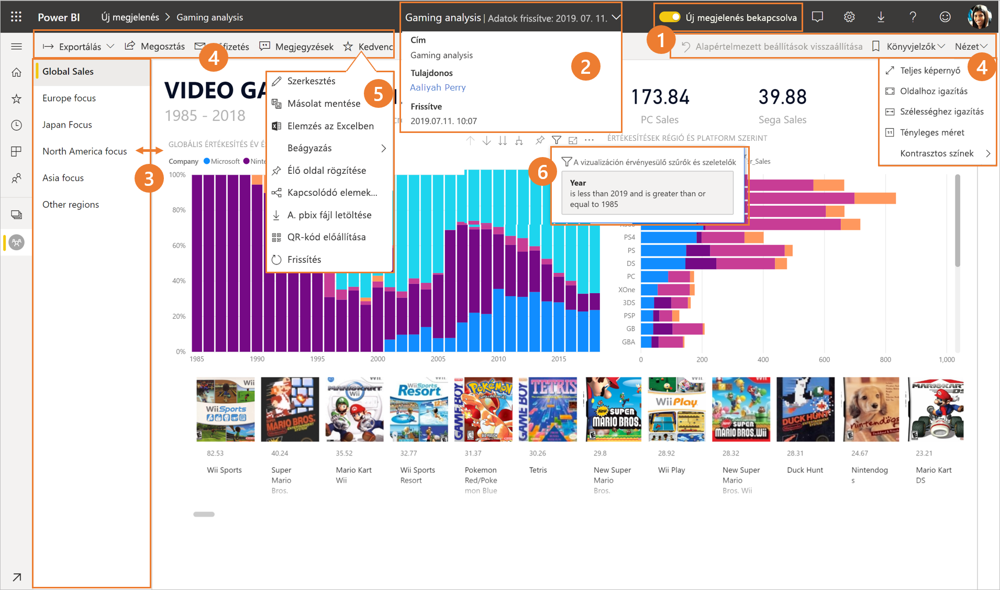
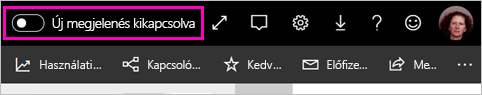
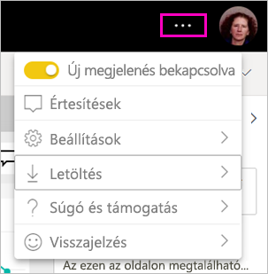
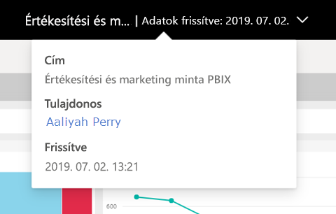
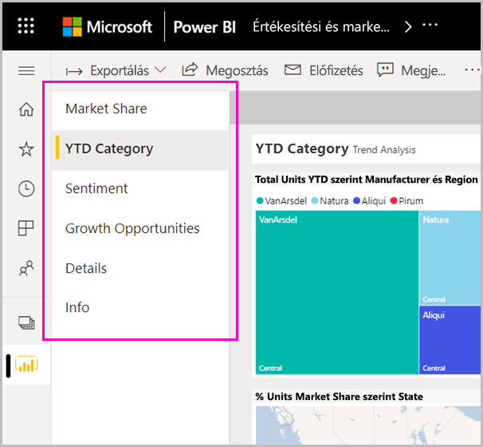
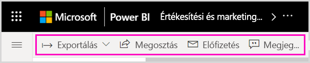
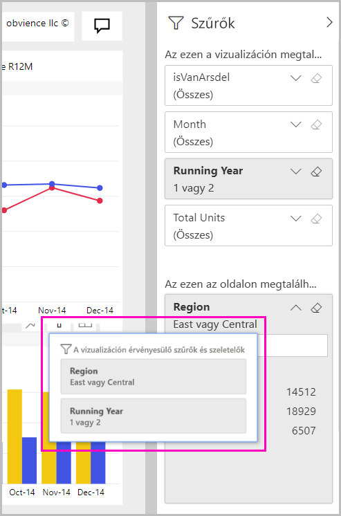

# Eligazodás a Power BI szolgáltatás új külsején

A Power BI szolgáltatás külseje megújult. Egyszerűbbé tettük a jelentések megtekintését. Az új arculat egy modern felületet nyújt, amely egyszerűbb, és a többi Microsoft-termékhez hasonlít. A Power BI szolgáltatás minden területén a jelentések tartalmát helyeztük a középpontba. Ehhez egy világosabb színtémát választottunk, és frissítettük az ikonokat. Íme az új külső áttekintése. Részletekért tekintse meg a számozott szakaszokat:

## A módosítások gyors bemutatása

Ez az animáció bemutatja a jelentések kinézetének változásait.

## 1. Az új megjelenés kipróbálása

Az új megjelenést bármelyik Power BI-felhasználó kipróbálhatja. Ehhez váltson az **Új megjelenés kikapcsolva** értékről **Új megjelenés bekapcsolva** értékre.

Ha vissza szeretne térni a régi külsőhöz, kattintson a jobb felső sarokban található három pontra.

## 2. Jelentésadatok megtekintése 

Olyan adatokat tekinthet meg gyorsan a felső szalagcímen, mint a legutóbbi frissítés dátuma, valamint a névjegyadatok.  A jelentés további adatainak megtekintéséhez nyissa meg a menüt. Akár e-mailt is küldhet a jelentés tulajdonosának.

## 3. Lapok függőleges listája 
A jelentésoldalak nevei mostantól egy listában, egy függőleges panelen jelennek meg. Könnyen észrevehetők, és hasonlítanak a Word és a PowerPoint navigációjához. A jelentés területének méretét a függőleges panel átméretezésével módosíthatja.

## 4. Leegyszerűsített műveletsáv 

A fent található frissített műveletsáv a legfontosabb parancsokat tartalmazza könnyen és jól elérhető helyen a jelentés felhasználói számára. Így könnyebb az exportálás, a feliratkozás, a másokkal való együttműködés, valamint a szűrők és könyvjelzők használata.

## 5. Hol találhatók a jelentések parancsai?

A régi kinézetben elérhető funkciókat nem távolítottuk el. A további parancsokat (szerkesztés, másolat mentése és hasonlók) a műveletsáv három pontjára (...) kattintva érheti el. Emellett a tartalomlistából a használati metrikákat is elérheti.

### Hol találhatók a Fájl menü műveletei?

A **Fájl** menü műveleteit keresi? A korábban a **Fájl** menüben található műveletek is a három ponttal elérhető menübe kerültek. 

## 6. Új szűrőfunkciók

Az új megjelenéssel alapértelmezés szerint elérhetők az új frissítések is (például az alkalmazott szűrők megtekintése és az új Szűrők panel). Az új Szűrők panel az új szűrőfrissítés nélkül is megjelenik a jelentéstervezőknek.

## Az új megjelelés irányítópultjai 

A jelentésekhez és az alkalmazásokhoz hasonlóan az irányítópultok műveletsávja is leegyszerűsödött, így jobban hasonlítanak egymásra, a funkcionális különbségek azonban megmaradtak. Íme egy útmutató az irányítópultok műveleteiről.
 

## A szerkesztési mód nem változott 

A szerzői műveletek a Desktophoz hasonlók maradtak. Az új nézet módosításai csak az olvasó nézetre érvényesek.

## Következő lépések

[Power BI felhasználók számára](consumer/end-user-consumer.md)
