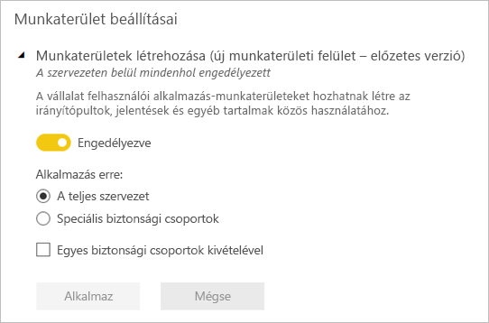
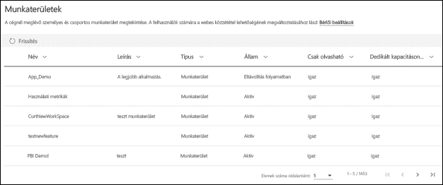

# Munka szervezése az új munkaterületeken a Power BI-ban

 A *munkaterületeken* együttműködhet munkatársaival irányítópult-, jelentés- és lapszámozott jelentésgyűjtemények létrehozásához. Az új munkaterületi felhasználói felület segítségével jobban kezelhető a tartalomhoz való hozzáférés. Ez a cikk bemutatja az új munkaterületeket, és hogy miben térnek el a klasszikus munkaterületektől.  Ahogyan a klasszikus munkaterületek, ezek is alkalmazások létrehozására és terjesztésére szolgálnak. Elolvashatja az [új munkaterületi felület létrehozását](service-create-the-new-workspaces.md) ismertető cikket.

Az új felületű munkaterület már általánosan elérhető, és mostantól ez az alapértelmezett munkaterület. Továbbra is hozhat létre és használhat [klasszikus munkaterületeket](service-create-workspaces.md) Office 365-csoportok alapján. 

> [!NOTE]
> A munkaterület tartalmát tallózó felhasználókra vonatkozó sorszintű biztonságot a Megtekintő szerepkör használatával érvényesítheti. Ha anélkül szeretné kikényszeríteni az RLS-t, hogy hozzáférést adna a munkaterülethez, tegyen közzé egy Power BI alkalmazást az adott felhasználók számára, vagy használja a megosztást a tartalom terjesztéséhez.

Az új munkaterületekkel a következőket végezheti el:

- Munkaterület-szerepköröket rendelhet felhasználói csoportokhoz: biztonsági csoportokhoz, terjesztési listákhoz, Office 365-csoportokhoz és egyéni felhasználókhoz.
- Office 365-csoport létrehozása nélkül hozhat létre egy Power BI-munkaterületet.
- Részletesebb munkaterület-szerepköröket használhat, amelyekkel rugalmasabb engedélykezelést érhet el a munkaterületeken.
- A Power BI-rendszergazda szabályozhatja, hogy ki hozhat létre munkaterületeket a Power BI-ban.

Amikor létrehoz egy új munkaterületet, nem hoz létre egy mögöttes, társított Office 365-csoportot is. A munkaterület felügyelete kizárólag a Power BI-ban zajlik. Az új munkaterületi felületen Office 365-csoportot is felvehet a munkaterület-hozzáférési listára, hogy a felhasználók tartalomhoz való hozzáférését továbbra is Office 365-csoportokkal szabályozhassa.

## Az új felületű munkaterületek felügyelete
Az új felületű munkaterületek felügyelete átkerült a Power BI-ba. A Power BI-rendszergazdák dönthetik el, hogy a vállalaton belül ki hozhat létre munkaterületeket. Ők kezelik és állítják helyre a munkaterületeket is a Power BI Felügyeleti portál vagy PowerShell-parancsmagok használatával. Az Office 365-csoportokon alapuló klasszikus munkaterületek felügyelete továbbra is az Office 365 felügyeleti portálján és az Azure Active Directoryban történik.

A felügyeleti portálon a **Munkaterület-beállítások** között a rendszergazdák a Munkaterületek létrehozása (új munkaterületi felület) beállítással a vállalatnál mindenki számára engedélyezhetik vagy tilthatják új felületű munkaterületek létrehozását. Korlátozhatják is meghatározott biztonsági csoportok tagjaira a létrehozást.

> [!NOTE]
> A Munkaterületek létrehozása (új munkaterületi felület) beállítás alapértelmezése, hogy csak az Office 365-csoportok létrehozására jogosult felhasználóknak engedélyezi új munkaterületek létrehozását a Power BI-ban. A Power BI felügyeleti portálján a megfelelő érték beállításával gondoskodnia kell arról, hogy csak a megfelelő felhasználók hozhassanak létre új felületű munkaterületeket.

A [munkaterületek listája elérhető](service-admin-portal.md#workspaces) a Power BI felügyeleti portálján. 

## Új munkaterületek a klasszikus munkaterületek mellett

Az új, továbbfejlesztett munkaterületek és a meglévő klasszikus munkaterületek egymás mellett is létezhetnek, és Ön bármelyiket létrehozhatja. Az alapértelmezett munkaterület-típus az új felületű. A Power BI továbbra is kilistázza az összes Office 365-csoportot, amelynek a felhasználó tagja, hogy elkerülhető legyen a meglévő munkafolyamatok módosítása. Az új munkaterületek létrehozását az [Új munkaterületek létrehozása](service-create-the-new-workspaces.md) című cikkből sajátíthatja el. A klasszikus munkaterületek létrehozását a [Klasszikus munkaterületek létrehozása](service-create-workspaces.md) című cikkből sajátíthatja el.

## Az új munkaterületek szerepkörei

Új munkaterülethez úgy adhat hozzáférést, hogy felhasználói csoportokat vagy személyeket vesz fel a munkaterületi szerepkörök (megtekintők, tagok, közreműködők vagy rendszergazdák) egyikébe. A meghatározott szerepkört a felhasználói csoport minden tagja megkapja. Ha egy felhasználó több csoport tagja, a hozzá tartozó szerepkörök által nyújtott legmagasabb szintű engedélyekkel fog rendelkezni.

A szerepkörökkel kezelheti, hogy mely felhasználók milyen műveleteket végezhetnek a munkaterületeken, így elősegítheti a csapatok együttműködését. Az új munkaterületekkel szerepköröket rendelhet egyénekhez és felhasználói csoportokhoz: biztonsági csoportokhoz, Office 365-csoportokhoz és terjesztési listákhoz. 

Szerepkörök felhasználói csoportokhoz való hozzárendelésekor a csoport felhasználói hozzáférnek a tartalomhoz. Ha beágyaz felhasználói csoportokat, minden tag jogosultságot kap.

A négy szerepkör (rendszergazdák, tagok, közreműködők és megtekintők) képességei a következők: Ezekhez a képességekhez az utolsó kivételével Power BI Pro-licenc szükséges.

|Képesség   | Rendszergazda  | Tag  | Közreműködő  | Megtekintő |
|---|---|---|---|---|
| Frissíthetik és törölhetik a munkaterületet.  | X  |   |   |   | 
| Hozzáadhatnak és eltávolíthatnak felhasználókat, így más rendszergazdákat is.  | X  |   |   |   |
| Tagokat vagy alacsonyabb jogosultsággal rendelkezőket adhatnak hozzá.  |  X | X  |   |   |
| Alkalmazást tehetnek közzé és frissíthetnek. |  X | X  |   |   |
| Elemeket vagy alkalmazásokat oszthatnak meg. |  X | X  |   |   |
| Engedélyezhetik másoknak az elemek újbóli megosztását. |  X | X  |   |   |
| Létrehozhatnak, szerkeszthetnek és törölhetnek tartalmakat a munkaterületen.  |  X | X  | X  |   |
| Közzétehetnek jelentéseket a munkaterületen, és törölhetnek tartalmakat.  |  X | X  | X  |   |
| Jelentést hozhatnak létre másik munkaterületen egy ezen a munkaterületen lévő adathalmaz alapján. |  X | X  | X  |   |
| Jelentés másolása. | X | X | X |  |
| Egy elem megtekintése és kezelése. |  X | X  | X  | X  |

> [!NOTE]
>Ha jelentést szeretne másolni, és ha egy másik munkaterületen szeretne jelentést létrehozni az ebben a munkaterületben található adatkészlet alapján, akkor a felhasználóknak további feltételeknek kell megfelelniük:
>- Power BI Pro-licenccel kell rendelkezniük. 
>- Az adatkészlethez összeállítási engedéllyel kell rendelkezniük. Az ebben a munkaterületben szereplő adatkészletek esetén a rendszergazda, tag és közreműködő szerepkörök rendelkeznek összeállítási engedéllyel a munkaterület-szerepkörük részeként.
 
## Licencelés
A megosztott kapacitásban a munkaterülethez felvett személyek mindegyikének Power BI Pro-licenccel kell rendelkeznie. A munkaterületen a felhasználók együttműködhetnek az irányítópultokon és jelentéseken, amelyeket a szélesebb közönség vagy akár a teljes vállalat elé szeretne tárni. 

Ha másokkal is megszeretné osztani a tartalmat a szervezeten belül, rendeljen hozzájuk Power BI Pro-licencet, vagy helyezze a munkaterületet egy Power BI Prémium szintű kapacitásba.

Ha a munkaterület Power BI Premium-kapacitásban van, a Megtekintő szerepkörrel rendelkező felhasználók akkor is hozzáférnek a munkaterülethez, ha nem rendelkeznek Power BI Pro-licenccel. Ha azonban magasabb, például rendszergazda, tag vagy közreműködő szerepkört rendel ezekhez a felhasználókhoz, a rendszer Pro-próbaidőszak indítására szólítja fel őket, amikor megkísérelnek hozzáférni a munkaterülethez. A Megtekintő képességet akkor használhatja ki a Pro-licenc nélküli felhasználóknál, ha a Megtekintő szerepkörben lévő felhasználók egyénileg és felhasználói csoporton keresztül sem rendelkeznek másik szerepkörrel. 

> [!NOTE]
> Az jelentések közzététele az új munkaterületi felületen a jelenlegi licencelési szabályok szigorúbb érvényesítésével történik. A Power BI Desktopból vagy más ügyféleszközből Pro-licenc nélkül közzétételt megkísérlő felhasználók a „Csak Power BI Pro-licenccel rendelkező felhasználók tehetnek közzé tartalmakat ezen a munkaterületen.” hibaüzenetet kapják.

## Az új munkaterületek eltérései

Az új munkaterületekkel újraterveztünk néhány funkciót. Az alábbi módosítások várhatóan véglegesek. 

* Ezeknek a munkaterületeknek a létrehozása nem hoz létre Office 365-csoportokat, ahogyan a klasszikus munkaterületek esetén történt. Egy Office 365-csoport viszont már felhasználható arra, hogy hozzáférést adjon a felhasználóknak a munkaterülethez, ha szerepkört rendel hozzá. 
* A klasszikus munkaterületeken csak egyéneket vehet fel a tagok és rendszergazdák listájára. Az új munkaterületeken több AD biztonsági csoportot, terjesztési listát vagy Office 365-csoportot vehet fel ezekre a listákra, így könnyebben kezelheti a felhasználókat. 
- A klasszikus munkaterületeken létrehozhat vállalati tartalomcsomagot. Az új munkaterületen ezt nem teheti meg.
- A klasszikus munkaterületeken használhat szervezeti tartalomcsomagot. Az új munkaterületen ezt nem teheti meg.

## Munkaterületi címlista
Az új **Címlista** funkcióval meghatározhatja, hogy mely felhasználók kapjanak értesítést a munkaterületen felmerülő problémákról. Alapértelmezés szerint minden munkaterület-rendszergazdaként megadott felhasználó vagy csoport értesítést kap, de Ön testre szabhatja a listát. A címlistában felsorolt felhasználók vagy csoportok a felhasználói felületen is fel vannak tüntetve, megkönnyítve a felhasználók számára a munkaterülettel kapcsolatos segítségkérést. 

Tovább tájékozódhat a [munkaterületi címlista beállításáról](service-create-the-new-workspaces.md#workspace-contact-list).

## Munkaterületi OneDrive
A munkaterületi OneDrive funkcióval olyan Office 365-csoportot konfigurálhat, amelynek SharePoint-dokumnetumtárbeli fájltárolója elérhető a munkaterület felhasználói számára. A csoportot a Power BI-on kívül kell létrehozni. 

A Power BI nem szinkronizálja azon felhasználók és csoportok jogosultságait, akik számára Office 365-csoporttagsággal van konfigurálva a munkaterülethez való hozzáférés. Ajánlott a munkaterülethez való hozzáférést ugyanazzal az Office 365-csoporttal kezelni, amelynek fájltárolóját ebben a beállításban konfigurálja. 

Tovább tájékozódhat a [munkaterületi OneDrive beállításáról és eléréséről](service-create-the-new-workspaces.md#workspace-onedrive).  
   
## Naplózás
A Power BI az alábbi tevékenységeket naplózza az új munkaterületi felületű munkaterületeken.

| Felhasználóbarát név |   Művelet neve |
|---|---|
| Power BI-mappa létrehozása | CreateFolder (Mappa létrehozása) |
| Power BI-mappa törlése | DeleteFolder (Mappa törlése) |
| Power BI-mappa frissítése | UpdateFolder (Mappa frissítése) |
| Power BI-mappahozzáférés frissítése| UpdateFolderAccess (Mappahozzáférés frissítése) |

További tudnivalók a [Power BI-beli naplózásról](service-admin-auditing.md#activities-audited-by-power-bi).

## Korlátozások és szempontok

Figyelembe veendő korlátozások:

- Egy munkaterület legfeljebb 1000 adathalmazt, vagy adathalmazonként 1000 jelentést tartalmazhat. 
- Power BI Pro-licenccel rendelkező személy legfeljebb 1 000 munkaterületnek lehet tagja.
- Az Excelhez készült Power BI Publisher nem támogatott.

## A munkaterületek másképp működő funkciói

A jelenlegi munkaterületek egyes funkciói másképp működnek, mint az új munkaterületeké. Ezek a különbségek szándékosak, és az ügyfelek visszajelzésein alapulnak, segítségükkel pedig rugalmasabban működhet együtt másokkal a munkaterületeken:

- A licencelés megkövetelése: A jelentések új munkaterületi felületen való közzététele érvényre juttatja azokat a meglévő licencelési szabályokat, amelyek megkövetelik, hogy a munkaterületeken közreműködő, vagy másokkal a Power BI szolgáltatásban tartalmat megosztó felhasználók Power BI Pro-licenccel rendelkezzenek. A Pro-licenccel nem rendelkező felhasználók a „Csak Power BI Pro-licenccel rendelkező felhasználók tehetnek közzé tartalmakat ezen a munkaterületen.” hibaüzenetet kapják.
- A tagok újbóli megosztási jogosultsága: ennek helyét a Közreműködő szerepkör vette át
- Csak olvasható munkaterületek: Ahelyett, hogy csak olvasási hozzáférést adna a felhasználóknak, hozzárendelheti őket a Megtekintő szerepkörhöz, amely hasonló, csak olvasási hozzáférést biztosít a munkaterületen lévő tartalomhoz.
- A Pro-licenccel nem rendelkező felhasználók akkor is hozzáférnek a Power BI Premium-kapacitásban lévő munkaterülethez, ha csak Megtekintő szerepkörrel rendelkeznek.
- A Megtekintő szerepkörrel rendelkező felhasználók számára úgy engedélyezheti az adatexportálást, hogy Összeállítási engedélyt ad nekik a munkaterületen lévő adathalmazokra. További információ az [adathalmazok összeállítási engedélyéről](service-datasets-build-permissions.md#build-permissions-for-shared-datasets).
- Nincs **Kilépés a munkaterületből** gomb.

## Gyakori kérdések

**Érinti az új munkaterületi felület általános elérhetősége a meglévő tartalomra mutató hivatkozásokat?**

Nem. A klasszikus munkaterületeken már meglévő elemeket az új munkaterületi felület nem befolyásolja. Az új munkaterületi felület általános elérhetőségével megváltozott a létrehozható munkaterületek alapértelmezése, de a meglévő munkaterületek nem módosulnak. 

**Együtt jár az általános elérhetőség a meglévő munkaterületek új felületre való frissítésével?**

Nem. Az új munkaterületi felület általános elérhetőségével csak a munkaterületek alapértelmezése módosul az új felületű munkaterületre. Az Office 365-csoportokon alapul meglévő klasszikus munkaterületek változatlanok maradnak.

**Továbbra is automatikusan létre vannak hozva munkaterületek az Office 365-csoportokhoz?**

Igen. Mivel a két munkaterület-típust párhuzamosan támogatjuk, a munkaterületek listájában továbbra is ki lesz listázva az összes Office 365-csoport, amelyhez a felhasználónak hozzáférése van.

## Következő lépések
* [Új munkaterületek létrehozása a Power BI-ban](service-create-the-new-workspaces.md)
* [A klasszikus munkaterületek létrehozása](service-create-workspaces.md)
* [Alkalmazások telepítése és használata a Power BI-ban](service-create-distribute-apps.md)
* Kérdése van? [Kérdezze meg a Power BI közösségét](http://community.powerbi.com/)
