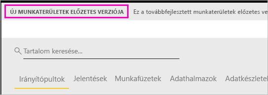

# Munka szervezése az új munkaterületeken (előzetes verzió) a Power BI-ban

A munkaterületeken együttműködhet munkatársaival irányítópult- és jelentésgyűjtemények létrehozásához. Ezeket a gyűjteményeket később *alkalmazásokba* csomagolhatja és terjesztheti a teljes szervezetben vagy meghatározott személyek és csoportok számára. A Power BI egy előzetes verziójú, új munkaterületi felhasználói felületet mutat be. 

Az előzetes verziójú munkaterületekkel a következőket végezheti el:

- Munkaterület-szerepköröket rendelhet felhasználói csoportokhoz: biztonsági csoportokhoz, terjesztési listákhoz, Office 365-csoportokhoz és egyéni felhasználókhoz.
- Office 365-csoport létrehozása nélkül hozhat létre egy Power BI-munkaterületet.
- Részletesebb munkaterület-szerepköröket használhat, amelyekkel rugalmasabb engedélykezelést érhet el a munkaterületeken.

Olvassa el, hogyan [hozhatja létre az egyik új munkaterületet](service-create-the-new-workspaces.md).
 
Amikor létrehoz egy új munkaterületet, nem hoz létre egy mögöttes, társított Office 365-csoportot is. A munkaterület felügyelete kizárólag a Power BI-ban zajlik. Továbbra is hozzáadhat egy Office 365-csoportot a munkaterülethez, ha a felhasználók tartalomhoz való hozzáférését Office 365-csoportokkal szeretné kezelni. Azonban emellett már biztonsági csoportokat és terjesztési listákat is használhat, valamint közvetlenül a Power BI-on belül hozzáadhat egyéni felhasználókat, így rugalmasan kezelheti a munkaterületek hozzáférését. Mivel a munkaterületek felügyelete most már a Power BI-ban történik, a Power BI rendszergazdái döntik el, hogy a cégen belül ki hozhat létre munkaterületet. A felügyeleti portálon a **Munkaterület beállításaiban** a rendszergazdák engedélyezhetik mindenki számára a szervezetben munkaterületek létrehozását, vagy megtilthatják azt mindenki számára. Korlátozhatják is meghatározott biztonsági csoportok tagjaira a létrehozást.

További tudnivalók a [Power BI felügyeleti portáljáról](service-admin-portal.md).

## Új munkaterületek bevezetése

Az előzetes verzió ideje alatt a régi és új típusú alkalmazás-munkaterületek megférnek egymás mellett, és bármelyiket létrehozhatja. A régi munkaterületek az előzetes verzió vége, és az új munkaterületek általános elérhetővé válása után is elérhetők maradnak egy ideig. Létrehozni azonban már nem tudja őket, és elő kell készítenie őket az új infrastruktúrába való migráláshoz. Ne aggódjon, több hónapja lesz a migrálás végrehajtására.

## Az új munkaterületek szerepkörei

Felhasználói csoportokat vagy egyéneket tagként, közreműködőként vagy rendszergazdaként adhat hozzá az új munkaterületekhez. A meghatározott szerepkört a felhasználói csoport minden tagja megkapja. Ha egy felhasználó több csoport tagja, a szerepkör által nyújtott legmagasabb szintű engedélyekkel fog rendelkezni.

A munkaterületekhez adott tagoknak Power BI Pro-licencre van szüksége. A munkaterületen a felhasználók együttműködhetnek az irányítópultokon és jelentéseken, amelyeket a szélesebb közönség vagy akár a teljes vállalat elé szeretne tárni. Ha másokkal is megszeretné osztani a tartalmat a szervezeten belül, rendeljen hozzájuk Power BI Pro-licencet, vagy helyezze a munkaterületet egy Power BI Prémium szintű kapacitásba.

A szerepkörökkel kezelheti, hogy mely felhasználók milyen műveleteket végezhetnek a munkaterületeken, így elősegítheti a csapatok együttműködését. Az új munkaterületekkel szerepköröket rendelhet egyénekhez és felhasználói csoportokhoz: biztonsági csoportokhoz, Office 365-csoportokhoz és terjesztési listákhoz. 

Szerepkörök felhasználói csoportokhoz való hozzárendelésekor a csoport felhasználói hozzáférnek a tartalomhoz. Ha beágyaz felhasználói csoportokat, minden tag jogosultságot kap. Azok a felhasználók, akik több, különböző szerepkörrel rendelkező felhasználói csoport tagjai is, a legmagasabb szintű jogosultságot kapják. 

Az új munkaterületek három szerepkört kínálnak: rendszergazdák, tagok és közreműködők.

**A rendszergazdák a következő műveleteket végezhetik el:**

- Frissíthetik és törölhetik a munkaterületet. 
- Hozzáadhatnak és eltávolíthatnak felhasználókat, így más rendszergazdákat is.
- Minden, a tagok számára elérhető műveletet elvégezhetnek.

**A tagok a következő műveleteket végezhetik el:** 

- Tagokat vagy alacsonyabb jogosultsággal rendelkezőket adhatnak hozzá.
- Alkalmazást tehetnek közzé és frissíthetnek.
- Elemeket vagy alkalmazásokat oszthatnak meg.
- Engedélyezhetik másoknak az elemek újbóli megosztását.
- Minden, a közreműködők számára elérhető műveletet elvégezhetnek.

**A közreműködők a következő műveleteket végezhetik el:** 

- Létrehozhatnak, szerkeszthetnek és törölhetnek tartalmakat a munkaterületen. 
- Közzétehetnek jelentéseket a munkaterületen, és törölhetnek tartalmakat.
- Nem biztosíthatnak új személyeknek hozzáférést a tartalomhoz. Nem oszthatnak meg új tartalmat, de megoszthatnak tartalmat olyan felhasználókkal, akikkel már meg van osztva a munkaterület, az elem vagy az alkalmazás. 
- Nem módosíthatják a csoport tagjait.
 
„Hozzáférés kérése” típusú munkafolyamatokkal azok a felhasználók is kérhetnek hozzáférést, akik ezzel nem rendelkeznek. A Hozzáférés kérése típusú munkafolyamatok jelenleg irányítópultok, jelentések és alkalmazások esetén érhetők el.

## Régi munkaterületek konvertálása új munkaterületekké

Az előzetes verzió időtartama alatt nem konvertálhat automatikusan régi típusú munkaterületeket új típusúakká. Létrehozhat azonban egy új munkaterületet, és közzéteheti rajta a tartalmait. 

Az új típusú munkaterületek általános elérhetővé válásakor igény szerint automatikusan migrálhatja a régi munkaterületeket. Az általános elérhetővé válás után egy idővel kötelező lesz a migrálás.

## Miben különböznek az új munkaterületek a jelenlegi munkaterületektől?

Az új munkaterületekkel újraterveztünk néhány funkciót. Íme a változások, amelyek várhatóan véglegesek lesznek és az előzetes verziójuk. 

* A munkaterületek létrehozása nem fog megfelelő entitásokat létrehozni az Office 365-ben, mint ahogy eddig a jelenlegi munkaterületek esetében történt. (Szerepkör hozzárendelésével továbbra is hozzáadhat egy Office 365-csoportot a munkaterülethez). 
* A jelenlegi munkaterületeken csak egyéneket vehet fel a tagok és rendszergazdák listájára. Az új munkaterületeken több AD biztonsági csoportot, terjesztési listát vagy Office 365-csoportot vehet fel ezekre a listákra, így könnyebben kezelheti a felhasználókat. 
- A jelenlegi munkaterületeken létrehozhat szervezeti tartalomcsomagot. Az új munkaterületen ezt nem teheti meg.
- A jelenlegi munkaterületeken használhat szervezeti tartalomcsomagot. Az új munkaterületen ezt nem teheti meg.
- Az előzetes verzió időtartama alatt az új munkaterületek egyes új funkciói még nem érhetők el. Részleteket a következő szakaszban ([Az új munkaterületek tervezett funkciói](service-new-workspaces.md#planned-new-workspace-preview-features)) találhat.

## Korlátozások és szempontok

Figyelembe veendő korlátozások:

- Egy munkaterület legfeljebb 1000 adathalmazt, vagy adathalmazonként 1000 jelentést tartalmazhat. 
- Power BI Pro-licenccel rendelkező személy legfeljebb 250 munkaterületnek lehet tagja.

## Az előzetes verziós, új munkaterületek tervezett funkciói

Az előzetes verzió kibocsátásakor az új, előzetes verziós munkaterületek egyes funkcióit még fejlesztjük, így ezek egyelőre nem érhetők el:

- Nincs **Kilépés a munkaterületből** gomb.
- A használati metrikák egyelőre nem támogatottak.
- A Prémium működése: Prémium szintű kapacitásban hozzárendelhet és létrehozhat munkaterületeket, azonban azok kapacitások közti áthelyezéséhez a munkaterület beállításaira kell lépnie.
- A SharePoint-kijelzők beágyazása egyelőre nem támogatott.
- Nincs **OneDrive** gomb az Office 365-csoportokhoz az Adatok lekérése/Fájlok lekérése területen.

## A munkaterületek másképp működő funkciói

A jelenlegi munkaterületek egyes funkciói másképp működnek, mint az új munkaterületeké. Ezek a különbségek szándékosak, és az ügyfelek visszajelzésein alapulnak, segítségükkel pedig rugalmasabban működhet együtt másokkal a munkaterületeken:

- A tagok újbóli megosztási jogosultsága: ennek helyét a Közreműködő szerepkör vette át
- Csak olvasható munkaterületek: Ahelyett, hogy csak olvasási hozzáférést adna a felhasználóknak, hozzárendelheti őket a soron következő megtekintő szerepkörhöz, amely hasonló, csak olvasási hozzáférést biztosít a munkaterületen lévő tartalomhoz.

## Ismert problémák

Mivel ez egy előzetes verziójú funkció, érdemes tudnia a korlátozásokról. A következő problémák ismertek, és már dolgozunk a megoldásukon:

- Az e-mailes feliratkozók címzettjeiként hozzáadott felhasználók vagy felhasználói csoportok nem kapják meg az e-maileket. Ez a probléma akkor merül fel, amikor az új munkaterületek egyike egy prémium szintű kapacitásban található, az előfizetést létrehozó felhasználó Saját munkaterülete azonban nem. Ha a Saját munkaterület egy Prémium szintű kapacitásban található, az ingyenes felhasználók és felhasználói csoportok is megkapják az e-maileket.
- Miután egy munkaterületet áthelyez egy Prémium szintű kapacitásból egy megosztott kapacitásba, az ingyenes felhasználók és felhasználói csoportok egyes esetekben továbbra is kapnak e-maileket, annak ellenére, hogy már nem szabadna. Ez a probléma akkor merül fel, az előfizetést létrehozó felhasználó Saját munkaterülete egy Prémium szintű kapacitásban található.

## Következő lépések
* [Új munkaterületek létrehozása a Power BI-ban (előzetes verzió)](service-create-the-new-workspaces.md)
* [Jelenlegi munkaterületek létrehozása](service-create-workspaces.md)
* [Alkalmazások telepítése és használata a Power BI-ban](service-create-distribute-apps.md)
* Kérdése van? [Kérdezze meg a Power BI közösségét](http://community.powerbi.com/)
