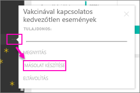

# Vállalati tartalomcsomagok: másolás, frissítés és hozzáférés kérése

Amikor közzétesz egy vállalati tartalomcsomagot, minden címzett ugyanazt az irányítópultot, jelentéseket, Excel-munkafüzeteket, adatkészleteket és adatokat látja (kivéve, ha SQL Server Analysis Services (SSAS) adatforrásról van szó).  A tartalomcsomagot csak a [tartalomcsomag létrehozója szerkesztheti és teheti újra közzé](service-organizational-content-pack-manage-update-delete.md).  Minden címzett menthet egy, az eredetivel párhuzamosan létező másolatot a tartalomcsomagról.

A tartalomcsomagok létrehozása nem azonos az irányítópultok megosztásával vagy az azokon való közös munkával. Az optimális megoldás kiválasztásához olvassa el az [Irányítópultok és jelentések közös használata és megosztása](service-how-to-collaborate-distribute-dashboards-reports.md) című cikket.

> [!NOTE]
> Az új munkaterületi felhasználói felületen nem lehet vállalati tartalomcsomagokat létrehozni vagy telepíteni. Ha még nem kezdte el, ideje frissítenie az alkalmazásokhoz tartozó tartalomcsomagokat. További információ az [új munkaterületi felhasználói felületről](service-create-the-new-workspaces.md).
>

## Másolat készítése egy vállalati tartalomcsomagról
Hozza létre a saját, mások által nem látható másolatát a tartalomcsomagról.

1. Válassza a tartalomcsomag irányítópultja melletti **További lehetőségek** (...) elemet, majd a Másolat készítése menüpontot.

    
2. Kattintson a **Mentés** gombra.  

Ezzel lett egy másolata, amelyet módosíthat. A módosításokat más nem fogja látni.

> [!NOTE]
> Korábban minden alkalommal, amikor telepített egy tartalomcsomagot vagy létrehozott egy másolatot, megjelent egy új adatkészlet a munkaterület tartalomlistájában. Egy közelmúltbeli frissítés leegyszerűsítette a folyamatot, így csak egy, a hivatkozott adatkészlet ikonját használó elem jelenik meg:
>
> 
>

## Segítség!  Már nem férek hozzá a tartalomcsomaghoz
Ennek több oka is lehet:

* **A tagságot érintő változások**:  A tartalomcsomagok közzététele e-mailes terjesztési listák, biztonsági csoportok és az [Office 365-ön alapuló Power BI-csoportok](https://support.office.com/article/Create-a-group-in-Office-365-7124dc4c-1de9-40d4-b096-e8add19209e9) számára történik.  Ha eltávolították a csoportból, nem lesz többé hozzáférése a tartalomcsomaghoz.
* **A terjesztést érintő változások**: A tartalomcsomag létrehozója módosítja a terjesztést. Ha például eredetileg az egész vállalat számára közzétették a tartalomcsomagot, de a létrehozó újból közzétette egy szűkebb közönség számára, lehet, hogy már nem tartozik a címzettek közé.
* **A biztonsági beállításokat érintő változások**: Ha az irányítópult és a jelentések helyszíni SSAS-adatforrásokhoz csatlakoznak, és módosítják a biztonsági beállításokat, előfordulhat, hogy visszavonták a kiszolgálóra vonatkozó engedélyeit.

## Hogyan frissülnek a vállalati tartalomcsomagok?
Amikor egy tartalomcsomag létrejön, a frissítési beállításokat örökli az adatkészlettől.  Amikor másolatot készít egy tartalomcsomagról, az új verzió megtartja az eredeti adatkészletre mutató hivatkozást és a frissítési ütemezését.

Lásd: [Vállalati tartalomcsomagok kezelése, frissítése és törlése](service-organizational-content-pack-manage-update-delete.md).

## További lépések
* [Szervezeti tartalomcsomagok: bevezetés](service-organizational-content-pack-introduction.md)
* [Csoportok létrehozása a Power BI-ban](service-create-distribute-apps.md)
* Több kérdése van? [Kérdezze meg a Power BI közösségét](https://community.powerbi.com/)
