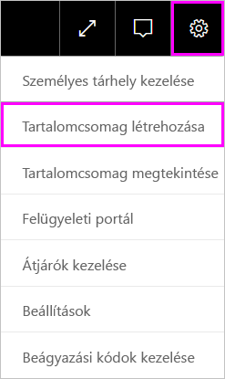
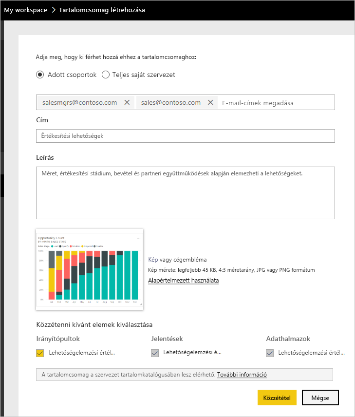
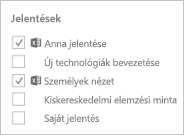
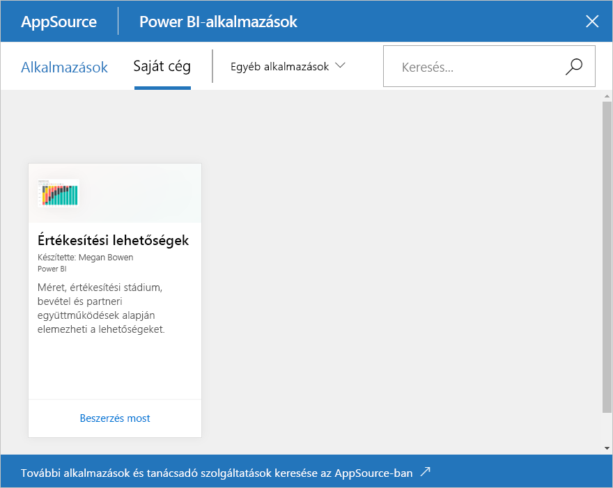

# Oktatóanyag: Power BI szervezeti tartalomcsomag létrehozása és közzététele

Ebben az oktatóanyagban egy szervezeti tartalomcsomagot hoz létre, hozzáférést ad hozzá egy adott csoport számára, és közzéteszi a cég tartalomcsomagtárában a Power BI-ban.

A tartalomcsomagok létrehozása nem azonos az irányítópultok megosztásával vagy az azokon való közös munkával. Az Ön számára ideális lehetőség meghatározásához olvassa el [A munka megosztásának módjai a Power BI-ban](service-how-to-collaborate-distribute-dashboards-reports.md) című anyagot.

A szervezeti tartalomcsomagok létrehozásához Önnek és kollégáinak [Power BI Pro-fiókkal](https://powerbi.microsoft.com/pricing) kell rendelkezniük.

> [!NOTE]
> Az új munkaterületi felhasználói felületen nem lehet vállalati tartalomcsomagokat létrehozni vagy telepíteni. Ha még nem kezdte el, ideje frissítenie az alkalmazásokhoz tartozó tartalomcsomagokat. További információ az [új munkaterületi felhasználói felületről](service-create-the-new-workspaces.md).

## Tartalomcsomag létrehozása és közzététele

Képzelje el, hogy Ön a Contoso kiadáskezelője, és épp egy új termék kiadásának előkészületeit végzi.  Létrehozott egy jelentéseket tartalmazó irányítópultot, amelyet meg szeretne osztani. Ez hasznos lehet a kiadást kezelő munkatársak számára. Szeretné összecsomagolni az irányítópultot és a jelentéseket egyetlen megoldásba, amelyet aztán a munkatársai használhatnak.

Ha érdekli a megoldás, tartson velünk. A [Power BI szolgáltatásban](https://powerbi.com) lépjen a **Saját munkaterületre**. Ezután az **Adatok lekérése** > **Minták** > **Lehetőségelemzési minta** > **Csatlakozás** pontban töltheti le a saját példányát.

1. A navigációs ablaktáblán válassza a **Munkaterületek** > **Saját munkaterületek** lehetőséget.

1. A felső navigációs ablaktáblán válassza a fogaskerék ikont  > **Tartalomcsomag létrehozása**.

   

1. A **Tartalomcsomag létrehozása** ablakban adja meg az alábbi adatokat.  

   Ne feledje, hogy a szervezete tartalomcsomagtára gyorsan megtelhet. A tár idővel a szervezet vagy a különböző csoportok számára létrehozott tartalomcsomagok százait is tartalmazhatja. Ezért szánjon időt arra, hogy egyértelmű nevet és jól átlátható leírást adjon a tartalomcsomagnak, illetve kiválassza a megfelelő közönséget.  Használjon olyan szavakat, amelyek alapján a tartalomcsomag könnyen megtalálható. Így könnyebben megtalálhatja a jövőben.

      

    1. Válassza az **Adott csoportok** lehetőséget.

    1. Írja be a személyek, [ Office 365-csoportok](https://support.office.com/article/Create-a-group-in-Office-365-7124dc4c-1de9-40d4-b096-e8add19209e9), terjesztési csoportok vagy biztonsági csoportok teljes e-mail-címét. Például: salesmgrs@contoso.com; sales@contoso.com

        Ebben az oktatóanyagban használja a csoportja e-mail-címét.

    1. Adja az *Értékesítési lehetőségek* nevet a csoportnak.

        > [!TIP]
        > Érdemes lehet az irányítópult nevét is belevenni a tartalomcsomag nevébe. Így munkatársai könnyebben megtalálják az irányítópultot a tartalomcsomag csatlakoztatását követően.

    1. Ajánlott: Adjon meg egy leírást. Így a munkatársai könnyebben találják meg a számukra szükséges tartalomcsomagokat. A leírás mellett kulcsszavakat is hozzáadhat, amelyekkel a munkatársai könnyebben találhatják meg a tartalomcsomagot. Adja meg a kapcsolattartási adatait is arra az esetre, ha a munkatársainak kérdése merülne fel vagy segítségre volna szüksége.

    1. Töltsön fel egy képet vagy emblémát is, hogy a csoport tagjai könnyebben találják meg a tartalomcsomagot.

        A képeket könnyebb gyorsan észrevenni, mint a leírásokat. Az alábbi képernyőképen a **Opportunity Count** (Lehetőségek száma ) oszlopdiagram csempéjének képe látható.

    1. Válassza ki a **Lehetőségelemzési minta** irányítópultot, és adja a tartalomcsomaghoz.

        A Power BI automatikusan hozzáadja a kapcsolódó jelentést és adatkészletet. Igény szerint továbbiakat is hozzáadhat.

       > [!NOTE]
       > A Power BI-ban csak azok az irányítópultok, jelentések, adatkészletek és munkafüzetek vannak felsorolva, amelyeket szerkeszthet. Így az Önnel megosztott elemek nem szerepelnek a listában.

   1. Az Excel-munkafüzetek a **Jelentések** között vannak felsorolva, és egy Excel ikon jelöli őket. Ezeket is hozzáadhatja a tartalomcsomaghoz.

      

      > [!NOTE]
      > Ha a csoport tagjai nem látják az Excel-munkafüzetet, esetleg [meg kell osztania azt velük a OneDrive Vállalati verziójában](https://support.office.com/article/Share-documents-or-folders-in-Office-365-1fe37332-0f9a-4719-970e-d2578da4941c).

1. A tartalomcsomagot a **Közzététel** gombra kattintva adhatja hozzá a csoport céges tartalomcsomagtárához.  

   A sikeres közzétételt egy üzenet nyugtázza.

1. Ha a csoport tagjai az **Adatok lekérése** > **Szervezeti tartalomcsomagok** területre lépnek, megtekinthetik a tartalomcsomagot.

   

   > [!TIP]
   > A böngészőben megjelenő URL-cím a tartalomcsomag egyedi címe.  Szeretné értesíteni a munkatársait az új tartalomcsomagról?  Illessze be az URL-címet egy e-mailbe.

1. Amikor a csoporttagok a **Kapcsolódás** lehetőséget választják, [megtekinthetik és használhatják a tartalomcsomagot](service-organizational-content-pack-copy-refresh-access.md).

## Következő lépések

* [Bevezetés a Power BI szervezeti tartalomcsomagjainak használatába](service-organizational-content-pack-introduction.md).

* [Céges tartalomcsomagok kezelése, frissítése és törlése](service-organizational-content-pack-manage-update-delete.md).

* [Alkalmazás közzététele a Power BI-ban](service-create-distribute-apps.md).

* [Mi a OneDrive Vállalati verziója?](https://support.office.com/article/What-is-OneDrive-for-Business-187f90af-056f-47c0-9656-cc0ddca7fdc2)

* További kérdései vannak? [Kérdezze meg a Power BI közösségét](https://community.powerbi.com/)
