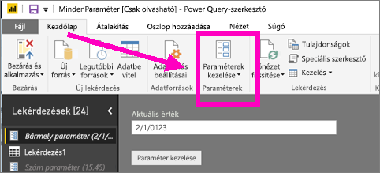
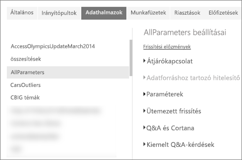
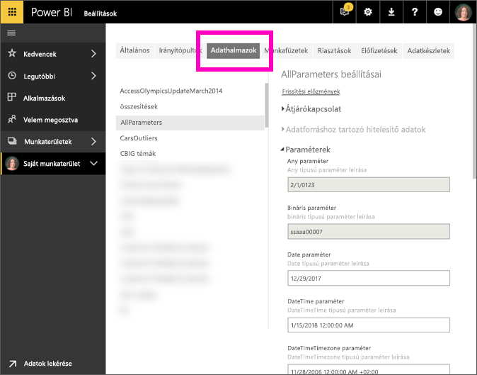

# Paraméterbeállítások módosítása a Power BI szolgáltatásban
A lekérdezési paramétereket a jelentéskészítők adják hozzá a Power BI Desktopban. A paraméterekkel a jelentések részeit *paraméterértékektől* függővé tehetik. Egy jelentéskészítő például létrehozhat egy olyan paramétert, amely egyetlen országra vagy régióra korlátozza az adatokat, vagy a mezők elfogadható formátumait határozza meg (például dátumok, idő és szöveg).

## Paraméterek áttekintése és szerkesztése a Power BI szolgáltatásban

Jelentéskészítőként Ön definiálja a paramétereket a Desktopban. Amikor a [jelentést közzéteszi a Power BI szolgáltatásban](desktop-upload-desktop-files.md), a paraméter beállításai és kijelölései a paraméterrel együtt haladnak. Egyes paraméterbeállítások áttekinthetők és szerkeszthetők a Power BI szolgáltatásban – nem azok, amelyek az elérhető adatokat korlátozzák, hanem azok, amelyek az elfogadható értékeket definiálják és határozzák meg.

1. A Power BI szolgáltatásban kattintson a fogaskerék ikonra  a **beállítások** megnyitásához.

2. Válassza az **Adatkészletek** lapot, majd jelöljön ki egy adatkészletet a listában. 
    
    

3. Bontsa ki a **Paraméterek** elemet.  Ha a kijelölt adatkészlethez nem tartozik paraméter, megjelenik egy üzenet, amely a lekérdezésparaméterek ismertetőjére hivatkozik. Azonban ha az adatkészlethez tartoznak paraméterek, azok megjelennek a **Paraméterek** fejléc kibontásakor. 

    

    Tekintse át a paraméter-beállításokat, és szükség esetén végezzen módosításokat. A kiszürkített mezők nem szerkeszthetők. 

## Következő lépések
Ha ad hoc módon szeretne egyszerű paramétereket hozzáadni, [módosíthatja az URL-címet](service-url-filters.md).