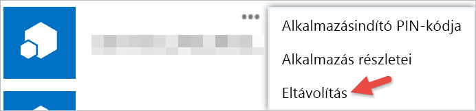

# Első lépések harmadik féltől származó alkalmazásokkal

A Power BI segítségével olyan alkalmazásokat is használhat, amelyeket Microsofton kívüli cégek vagy személyek hoztak létre. Használhatja például egy harmadik fél alkalmazásra, amely integrálható a Power BI-csempéket egy személyre szabott webes alkalmazás. Egy harmadik féltől származó alkalmazások használatakor meg kell adnia, hogy adjon az alkalmazásnak bizonyos engedélyeket a Power BI-fiókja és az erőforrások. Fontos, hogy csak olyan alkalmazásoknak adjon engedélyeket, amelyeket ismer, és amelyekben megbízik. Az alkalmazásnak adott engedély bármikor visszavonható. Lásd: [Harmadik féltől származó alkalmazások engedélyének visszavonása](#revoke).

Egy alkalmazás a következő hozzáférési típusokat kérheti.

## Power BI-alkalmazásengedélyek

* **Összes irányítópult megtekintése**
  
  * Ez az engedély lehetővé teszi az alkalmazásnak az Ön számára elérhető összes irányítópult megtekintését. Ide tartoznak a saját, a tartalomcsomagból származó, az Önnel megosztott, és az Ön csoportjában található irányítópultok. Az alkalmazás nem módosíthatja az irányítópultot. Az alkalmazás többek között arra használhatja ezt az engedélyt, hogy az irányítópult tartalmát beágyazza a saját felületébe.

* **Összes jelentés megtekintése**
  
  * Ez az engedély lehetővé teszi az alkalmazásnak az Ön számára elérhető összes jelentés megtekintését. Ide tartoznak a saját, a tartalomcsomagból származó, az Önnel megosztott, és az Ön csoportjában található jelentések. Az alkalmazás nem csupán a jelentést, hanem a benne foglalt adatokat is megtekintheti. Az alkalmazás magukat a jelentéseket nem módosíthatja. Az alkalmazás többek között arra használhatja az engedélyt, hogy a jelentés tartalmát beágyazza a saját felületébe.

* **Összes adatkészlet megtekintése**
  
  * Ez az engedély lehetővé teszi az alkalmazásnak az Ön számára elérhető összes adatkészlet listázását. Ide tartoznak a saját, a tartalomcsomagból származó, az Önnel megosztott, és az Ön csoportjában található adatkészletek. Az alkalmazás látja az adatkészleteket és azok szerkezetét, beleértve a táblázatok és az oszlopok nevét is. Ez az engedély jogosultságot ad az adatkészletben lévő adatok olvasásához. Az engedély nem ad jogosultságot az alkalmazásnak az adatkészlet kiegészítéséhez vagy módosításához.
* **Összes adatkészlet olvasása és írása**
  
  * Ez az engedély lehetővé teszi az alkalmazásnak az Ön számára elérhető összes adatkészlet listázását. Ide tartoznak a saját, a tartalomcsomagból származó, az Önnel megosztott, és az Ön csoportjában található adatkészletek. Az alkalmazás látja az adatkészleteket és azok szerkezetét, beleértve a táblázatok és az oszlopok nevét is. Ez az engedély jogosultságot ad az adatkészletben lévő adatok olvasásához és írásához. Az alkalmazás új adatkészleteket is létrehozhat, vagy módosíthatja a már meglévőket. Ezt általában a Power BI-nak történő közvetlen adatküldéshez használják az alkalmazások.

* **Felhasználói csoportok megtekintése**
  
  * Ez az engedély lehetővé teszi az alkalmazás számára az összes olyan csoport listázását, amelynek Ön a tagja. Ezt az engedélyt az alkalmazás egyes más, itt felsorolt engedélyekkel együtt, az adott csoporttartalom megtekintéséhez és frissítéséhez használhatja. Az alkalmazás nem módosíthatja magát a csoportot.

<a name="revoke"/>

## Harmadik féltől származó alkalmazások engedélyének visszavonása

Egy külső alkalmazás engedélyeit fogja az Office 365 saját alkalmazások oldalán vonhatja vissza.

Az a **Office 365 saját alkalmazások** helyet, a harmadik fél engedélyek visszavonása a következőképpen:

1. Nyissa meg az [Office 365 Saját alkalmazások](https://portal.office.com/myapps) oldalt.

2. Az a **saját alkalmazások** lapon, keresse meg a harmadik féltől származó alkalmazások.

3. Mutasson az alkalmazás csempéjére, és kattintson a **(...)** , majd az **Eltávolítás** elemre.

   