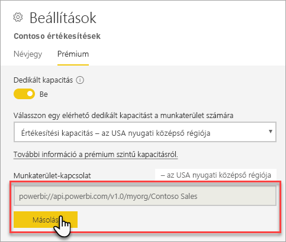
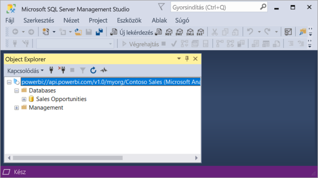

# Csatlakozás adathalmazokhoz ügyfélalkalmazásokkal és eszközökkel (előzetes verzió)

A Power BI Premium-munkahelyek és -adathalmazok *csak olvasási* kapcsolatokat támogatnak microsoftos és külső ügyfélalkalmazásoktól és eszközöktől. 

> [!NOTE]
> Ennek a cikknek csak az a célja, hogy bemutassa a csak olvasási kapcsolódást a Power BI Premium-munkahelyekhez és adathalmazokhoz. *Nem* célja részletes információt nyújtani a programozhatóságról, az egyes eszközökről és alkalmazásokról, az architektúráról és a munkaterület- és adathalmaz-kezelésről. Az itt ismertetett témák az Analysis Services táblázatos modellű adatbázis-architektúrájának és felügyeletének alapos ismeretét igénylik.

## Protokoll

A Power BI Premium az [XML for Analysis](https://docs.microsoft.com/bi-reference/xmla/xml-for-analysis-xmla-reference) (XMLA) protokoll használja az ügyfélalkalmazások és a munkaterületeket és adathalmazokat kezelő motor közötti kommunikációhoz. Ez a kommunikáció az úgynevezett XMLA-végpontok között zajlik. Az XMLA ugyanaz a kommunikációs protokoll, amelyet a Microsoft Analysis Services motorja használ, a háttérben pedig ez működteti a Power BI-beli szemantikai modellezést, irányítást, életciklusokat és adatkezelést. 

Az ügyféloldali alkalmazások és eszközök túlnyomó többsége nem célzottan kommunikál a motorral az XMLA-végpontok használatával. Ehelyett ügyféloldali (például MSOLAP, ADOMD és AMO) kódtárakat használnak közvetítőként az ügyfélalkalmazás és a kizárólag XMLA használatával kommunikáló motor között.

## Támogatott eszközök

A Power BI Premium-munkaterületekhez és -adathalmazokhoz való csak olvasási hozzáférést az alábbi eszközök támogatják:

**SQL Server Management Studio (SSMS)** – Támogatja a DAX-, MDX-, XMLA- és TraceEvent-lekérdezéseket. 18.0-ás verziót igényel. Letölthető [itt](https://docs.microsoft.com/sql/ssms/download-sql-server-management-studio-ssms). 

**SQL Server Profiler** – Ez az SSMS 18.0 (előzetes verzió) által tartalmazott eszköz a kiszolgálói események nyomkövetését és hibakeresését biztosítja. Minden esemény adatai rögzíthetők és fájlba vagy táblázatba menthetők a későbbi elemzéshez. Bár az SQL Serverhez hivatalosan kivontuk, a Profilert továbbra is tartalmazza az SSMS, a támogatása megmarad az Analysis Serviceshez, és most a Power BI Premiumhoz is. További információt az [SQL Server Profiler](https://docs.microsoft.com/sql/tools/sql-server-profiler/sql-server-profiler) című cikkben talál.

**DAX Studio** – Nyílt forráskódú, közösségi eszköz DAX-lekérdezések végrehajtásához és elemzéséhez az Analysis Servicesen. 2\.8.2-es vagy újabb verziót igényel. További információt a [daxstudio.org](https://daxstudio.org/) webhelyen talál.

**Excel kimutatások** – Az Office Kattintásra 16.0.11326.10000 vagy újabb verzióját igényli.

**Külső eszközök** – Ide tartoznak azok az adatvizualizációs alkalmazások és eszközök, amelyek képesek kapcsolódni, lekérdezéseket végezni és adatokat használni Power BI Premium-beli adathalmazokban. Az eszközök többsége az MSOLAP-ügyfélkönyvtárak legújabb verzióit igényli, néhány viszont az ADOMD-t használja.

## Ügyfélkódtárak

Ahhoz, hogy az ügyféloldali alkalmazások és eszközök csatlakozni tudjanak a Power BI Premium-munkaterületekhez, ügyfélkódtárakra van szükség. Az Analysis Serviceshez való kapcsolódáshoz használt ügyfélkódtárak a Power BI Premiumban is támogatva vannak. Az olyan Microsoft-ügyfélalkalmazások, mint az Excel, az SQL Server Management Studio (SSMS) és az SQL Server Data Tools (SSDT) mindhárom ügyfélkódtárat telepítik és a rendszeres alkalmazásfrissítésekkel együtt frissítik. Bizonyos esetekben a külső alkalmazásokhoz és eszközökhöz szükség lehet az ügyfélkódtárak újabb verzióinak telepítésére. Az ügyfélkódtárak havonta vannak frissítve. További információt az [Ügyfélkódtárak az Analysis Serviceshez való csatlakozáshoz](https://docs.microsoft.com/azure/analysis-services/analysis-services-data-providers) című cikkben talál.

## Csatlakozás Premium-munkaterülethez

Csatlakozhat a prémium szintű dedikált kapacitásokhoz rendelt munkaterületekhez. A dedikált kapacitáshoz rendelt munkaterületnek van egy URL-formátumú kapcsolati sztringje. 

A munkaterület kapcsolati sztringjét úgy kaphatja meg, hogy a Power BI-ban a **Prémium** lapon a **Munkaterület beállításai** alatt a **Munkaterület kapcsolata** mező **Másolás** lehetőségére kattint.

A munkaterület-kapcsolati sztringek a következő URL-formátumban úgy hivatkoznak a munkaterületre, mintha egy Analysis Services-kiszolgáló neve lenne:   
`powerbi://api.powerbi.com/v1.0/[tenant name]/[workspace name]` 

Például: `powerbi://api.powerbi.com/v1.0/contoso.com/Sales Workspace`

### Csatlakozás az SSMS-ben

A **Csatlakozás kiszolgálóhoz** > **Kiszolgáló típusa** beállításnál válassza az **Analysis Services** lehetőséget. A **Kiszolgálónév** mezőben adja meg az URL-címet. A **Hitelesítés** beállításnál válassza az **Active Directory – Univerzális, MFA-támogatással** lehetőséget, majd a **Felhasználónév** mezőben adja meg vállalati felhasználói azonosítóját. 

A csatlakoztatott munkaterület Analysis Services-kiszolgálóként jelenik meg, a munkaterületen belüli adathalmazok pedig adatbázisokként.  

### Kezdeti katalógus

Egyes eszközöknek, például az SQL Server Profilernek esetleg *kezdeti katalógust* kell megadnia. Adja meg a munkaterületen lévő adathalmazok (adatbázisok) egyikét. A **Csatlakozás kiszolgálóhoz** panelen kattintson a **Beállítások** lehetőségre. A **Csatlakozás kiszolgálóhoz** párbeszédpanel **Kapcsolat tulajdonságai** lapján adja meg az adatbázis nevét a **Csatlakozás adatbázishoz** mezőben.

### Kettős munkaterületnév

Ha egy munkaterülethez egy másik munkaterületével megegyező névvel próbál csatlakozni, a következő hibaüzenetet kaphatja: **Nem lehet csatlakozni a következőhöz: powerbi://api.powerbi.com/v1.0/[bérlőnév]/[munkaterületnév].**

A hiba kiküszöbölése érdekében az URL-címben a munkaterület neve mellett adja meg az ObjectIDGuid értékét is, amely az munkaterület ObjectID értékéből másolhat ki. Fűzze hozzá az objectID-t a kapcsolati URL-címhez. Például: „powerbi://api.powerbi.com/v1.0/myorg/Contoso Sales - 9d83d204-82a9-4b36-98f2-a40099093830”

### Kettős adathalmaznév

Ha egy adott munkaterületen belüli másik adathalmazéval megegyező nevű adathalmazhoz csatlakozik, az adathalmaz nevéhez fűzze hozzá annak GUID-azonosítóját. Az adathalmaz nevét *és* GUID-azonosítóját is megkaphatja, miután az SSMS-szel csatlakozik a munkaterülethez. 

### A megjelenített adathalmazok késése

Munkaterülethez csatlakozáskor az új, törölt és átnevezett adathalmazok módosításainak megjelenéséig akár 5 perc is eltelhet. 

### Nem támogatott adathalmazok

Az alábbi adathalmazok nem érhetők el XMLA-végpontok használatával. Ezek az adathalmazok *nem* jelennek meg a munkaterület alatt az SSMS-ben vagy más eszközben: 

- Analysis Services-modellekkel élő kapcsolatban lévő adathalmazok. 
- A REST API használatával leküldött adatokat tartalmazó adathalmazok.
- Excel-munkafüzet adathalmazok. 

Az alábbi adathalmazok nem támogatottak a Power BI szolgáltatásban:   

- Power BI-adathalmazzal élő kapcsolatban lévő adathalmazok.

### Szerepkörök és szerepkörtagságok

A modellszerepkörök és a szerepkörtagságok jelenleg nem fedezhetők fel és jeleníthetők meg XMLA-végpontokkal.

## Auditnaplók 

A munkaterülethez csatlakozó ügyfélalkalmazások és -eszközök XMLA-végponton keresztüli hozzáférése a Power BI auditnaplóiban a **GetWorkspaces** művelet alatt van naplózva. További információ: [Naplózás a Power BI-ban](service-admin-auditing.md).

## Lásd még:

[Analysis Services referenciák](https://docs.microsoft.com/bi-reference/#pivot=home&panel=home-all)   
[SQL Server Management Studio](https://docs.microsoft.com/sql/ssms/sql-server-management-studio-ssms)   
[SQL Server Analysis Services Tabular Protocol](https://docs.microsoft.com/openspecs/sql_server_protocols/ms-ssas-t/b98ed40e-c27a-4988-ab2d-c9c904fe13cf)   
[Dinamikus felügyeleti nézetek (DMV-k)](https://docs.microsoft.com/sql/analysis-services/instances/use-dynamic-management-views-dmvs-to-monitor-analysis-services)   

További kérdései vannak? [Kérdezze meg a Power BI közösségét](https://community.powerbi.com/)
