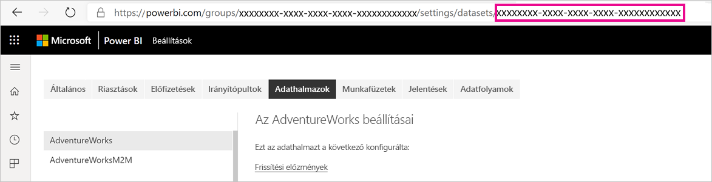
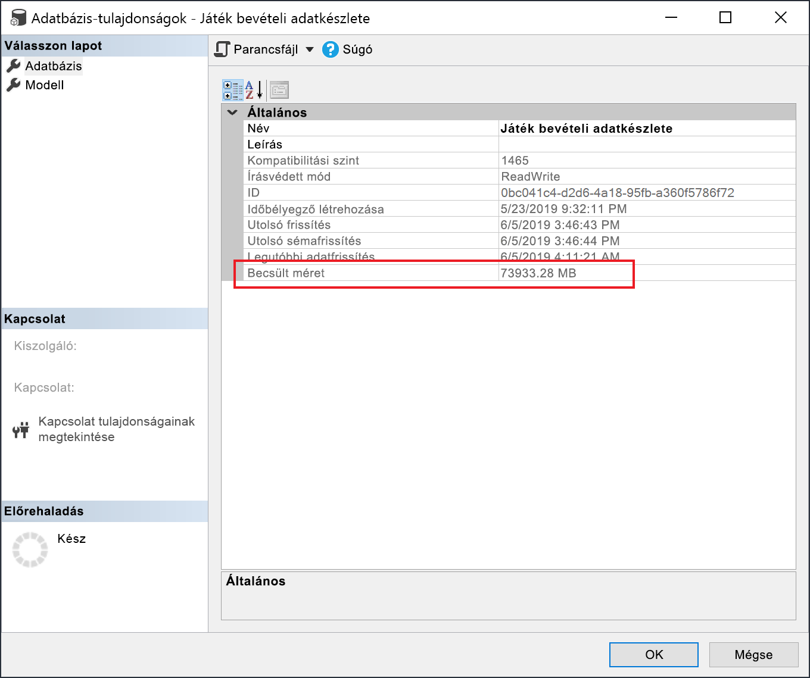

# <a name="large-models-in-power-bi-premium-preview"></a>Nagyméretű modellek a Power BI Premiumban (előzetes verzió)

A lekérdezések optimális teljesítménye végett a Power BI-adathalmazok nagymértékben tömörített és a memóriában gyorsítótárazott állapotban tudják tárolni az adatokat, hogy a nagy adathalmazokat is gyorsan kezelhessék a felhasználók. A nagyméretű modellek funkciója lehetővé teszi, hogy az adathalmazok mérete meghaladja a 10 GB-ot a Power BI Premiumban. Az adathalmazok méretét valójában a Power BI Premium kapacitásának mérete határozza meg ahhoz hasonlóan, ahogy az Azure Analysis Services korlátozza a modellek méretét. A Power BI Premium kapacitásméreteivel kapcsolatos további információkat a Kapacitás csomópontok alatt talál. A nagyméretű modellek beállíthatók az összes prémium P és beágyazott A termékváltozathoz, de csak az [új munkaterületeken](service-create-the-new-workspaces.md) működnek.

A nagyméretű modellek nem befolyásolják a feltöltési PBIX-méretet, amely továbbra is 10 GB-ra van korlátozva. Ehelyett az adathalmazok mérete frissítéskor nőhet 10 GB-nál nagyobbra. Az adathalmazok a növekményes frissítéssel konfigurálhatók úgy, hogy 10 GB-nál nagyobbra nőjenek.

## <a name="enable-large-models"></a>A nagyméretű modellek engedélyezése

Egy 10 GB-nál nagyobb adathalmaz létrehozásához kövesse az alábbi lépéseket:

1. Hozzon létre egy adathalmazt a Power BI-ban, és konfiguráljon [növekményes frissítést](service-premium-incremental-refresh.md).

1. Tegye közzé az adathalmazt a Power BI Premium szolgáltatásban.

1. Engedélyezze az adathalmazban a nagyméretű modelleket az alábbi PowerShell-parancsmagok futtatásával. Ezen parancsmagok miatt az Azure Premium Files szolgáltatásban tárolja a Power BI az adathalmazt, és nem érvényesíti a 10 GB-os méretkorlátot.

1. Kezdeményezzen egy frissítést az előzményadatok betöltéséhez a növekményes frissítési szabályzat alapján. Az első frissítés során hosszabb ideig is eltarthat az előzmények betöltése. A későbbi frissítések várhatóan már gyorsabbak lesznek, mivel növekményesek.

### <a name="powershell-cmdlets"></a>PowerShell-parancsmagok

A nagyméretű modellek jelenlegi verziójában az adathalmaz Premium Filesban való tárolása PowerShell-parancsmagokkal engedélyezhető. A PowerShell-parancsmagok futtatásához kapacitás-rendszergazdai és munkaterület-rendszergazdai jogosultságok szükségesek.

1. Keresse meg az adathalmaz azonosítóját (GUID). A GUID a munkaterület **Adathalmazok** lapján, az adathalmaz-beállítások alatt, az URL-címben található.

    

1. Egy PowerShell-rendszergazdai parancssorból telepítse a [MicrosoftPowerBIMgmt](/powershell/module/microsoftpowerbimgmt.data/) modult.

    ```powershell
    Install-Module -Name MicrosoftPowerBIMgmt
    ```

1. Futtassa a következő parancsmagokat a bejelentkezéshez és az adathalmaz tárolási módjának ellenőrzéséhez.

    ```powershell
    Login-PowerBIServiceAccount

    (Get-PowerBIDataset -Scope Organization -Id <Dataset ID> -Include actualStorage).ActualStorage
    ```

    A következő választ kell kapnia. A tárolási mód az ABF (Analysis Services biztonsági mentési fájl), ami az alapértelmezett mód.

    ```
    Id                   StorageMode

    --                   -----------

    <Dataset ID>         Abf
    ```

1. Futtassa a következő parancsmagokat a Premium Filesban való tárolás beállításához és ellenőrzéséhez. Az átállás a Premium Files használatára eltarthat néhány másodpercig.

    ```powershell
    Set-PowerBIDataset -Id <Dataset ID> -TargetStorageMode PremiumFiles

    (Get-PowerBIDataset -Scope Organization -Id <Dataset ID> -Include actualStorage).ActualStorage
    ```

    A következő választ kell kapnia. Az adathalaz tárolási helye mostantól a Premium Files.

    ```
    Id                   StorageMode
    
    --                   -----------
    
    <Dataset ID>         PremiumFiles
    ```

Az adathalmaz Premium Filesra (vagy onnan) való konvertálásának állapotát a [Get-PowerBIWorkspaceMigrationStatus](/powershell/module/microsoftpowerbimgmt.workspaces/get-powerbiworkspacemigrationstatus) parancsmaggal ellenőrizheti.

## <a name="dataset-eviction"></a>Adathalmazok kizárása

A Power BI dinamikus memóriakezelést használ, hogy az inaktív adathalmazokat kizárja a memóriából. Erre azért van szükség, hogy más adathalmazok is betölthetők legyenek a felhasználói lekérdezések megválaszolása érdekében. A dinamikus memóriakezelés lehetővé teszi, hogy az adathalmazok összesített mérete jelentősen nagyobb legyen, mint a kapacitásban rendelkezésre álló memória mennyisége, de az egyes adathalmazoknak külön-külön mindenképpen be kell férniük a memóriába. További információ a dinamikus memóriakezelésről: [A kapacitások működése](service-premium-what-is.md#how-capacities-function).

Érdemes átgondolni, milyen hatással jár a nagyméretű modellek kizárása. A viszonylag gyors adathalmaz-betöltési idők ellenére a felhasználók továbbra is észrevehető késést tapasztalhatnak, ha várniuk kell a kizárt adathalmazok újbóli betöltésére. Ezért ebben a formában főleg olyan kapacitásokhoz ajánlottak a nagy méretű modellek, amelyeket dedikáltan nagyvállalati BI-követelményekhez használnak, nem pedig önkiszolgáló BI-követelményekkel vegyesen alkalmazott kapacitásokhoz. A vállalati BI-követelményekhez dedikált kapacitások ritkábban váltanak ki kizárást, így ritkábban kell újra betölteni az adathalmazokat. Az önkiszolgáló BI-kapacitásokban azonban számos kisebb adathalmaz lehet, amelyeket gyakran kell a memóriába betölteni, majd onnan kizárni.

## <a name="checking-dataset-size"></a>Adathalmaz méretének ellenőrzése

Az előzményadatok betöltése után az [SSMS](https://docs.microsoft.com/sql/ssms/download-sql-server-management-studio-ssms) segítségével az [XMLA-végponton](service-premium-connect-tools.md) keresztül ellenőrizhető az adathalmaz becsült mérete a modell tulajdonságainak ablakában.



Az adathalmaz mérete a következő DMV-lekérdezésekkel is ellenőrizhető az SSMS-ből. Adja össze a kimenet DICTIONARY\_SIZE és USED\_SIZE oszlopainak értékeit, hogy megkapja az adathalmaz méretét bájtban.

```sql
SELECT * FROM SYSTEMRESTRICTSCHEMA
($System.DISCOVER_STORAGE_TABLE_COLUMNS,
 [DATABASE_NAME] = '<Dataset Name>') //Sum DICTIONARY_SIZE (bytes)

SELECT * FROM SYSTEMRESTRICTSCHEMA
($System.DISCOVER_STORAGE_TABLE_COLUMN_SEGMENTS,
 [DATABASE_NAME] = '<Dataset Name>') //Sum USED_SIZE (bytes)
```

## <a name="limitations-and-considerations"></a>Korlátozások és szempontok

Vegye figyelembe az alábbi korlátozásokat a nagyméretű modellek használatakor:

- **Bring Your Own Key (BYOK, saját kulcsos) titkosítás**: A Premium Filesban tárolható adathalmazoknál nincs [BYOK](service-encryption-byok.md)-titkosítás.
- **Több földrajzi hely (Multi-Geo) támogatása**: A Premium Filesban tárolt adathalmazok nem használhatók olyan kapacitások esetében, amelyeknél a [Multi-Geo](service-admin-premium-multi-geo.md) is engedélyezve van.

- **Letöltés a Power BI Desktopba**: A Premium Filesban tárolt adathalmazokat nem lehet [.pbix-fájlként letölteni](service-export-to-pbix.md).
- **Támogatott régiók**: A nagyméretű modellek használata az összes olyan Azure-régióban támogatott, amely támogatja a Premium Files-tárolást. További információért tanulmányozza az [Elérhető termékek régiók szerint](https://azure.microsoft.com/global-infrastructure/services/?products=storage) című témakört, és nézze meg a következő szakaszban található táblázatot.


## <a name="availability-in-regions"></a>Elérhetőség az egyes régiókban

A Power BI nagy méretű modelljei csak az [Azure Premium Files](https://docs.microsoft.com/azure/storage/files/storage-files-planning#storage-tiers) tárterület-szolgáltatást is támogató egyes Azure-régiókban használhatók.

Az alábbi lista azokat a régiókat tartalmazza, amelyekben használhatók a Power BI nagy méretű modelljei. A listán nem szereplő régiókban nem használhatók nagy méretű modellek:


|Azure-régió  |Azure-régió rövidítése  |
|---------|---------|
|Kelet-Ausztrália     | australiaeast        |
|Délkelet-Ausztrália     | australiasoutheast        |
|USA középső régiója     | centralus        |
|Kelet-Ázsia     | eastasia        |
|USA keleti régiója     | eastus        |
|USA 2. keleti régiója     | eastus2        |
|Kelet-Japán     | japaneast        |
|Nyugat-Japán     | japanwest        |
|Dél-Korea középső régiója     | koreacentral        |
|Dél-Korea déli régiója     | koreasouth        |
|USA északi középső régiója     | northcentralus        |
|Észak-Európa     | northeurope        |
|USA déli középső régiója     | southcentralus        |
|Délkelet-Ázsia     | southeastasia        |
|Egyesült Királyság déli régiója     | uksouth        |
|Egyesült Királyság nyugati régiója     | ukwest        |
|Nyugat-Európa     | westeurope        |
|USA nyugati régiója     | westus        |
|USA 2. nyugati régiója     | westus2        |


## <a name="next-steps"></a>Következő lépések

Az alábbi hivatkozásokra kattintva hasznos információkat kaphat a nagy méretű modellek használatához:

* [Azure Premium Files](https://docs.microsoft.com/azure/storage/files/storage-files-planning#storage-tiers)
* [Multi-Geo-támogatás konfigurálása a Power BI Premiumhoz](service-admin-premium-multi-geo.md)
* [Saját titkosítási kulcsok használata a Power BI-hoz](service-encryption-byok.md)
* [A kapacitások működése](service-premium-what-is.md#how-capacities-function)
* [Növekményes frissítés](service-premium-incremental-refresh.md)