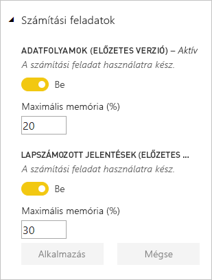
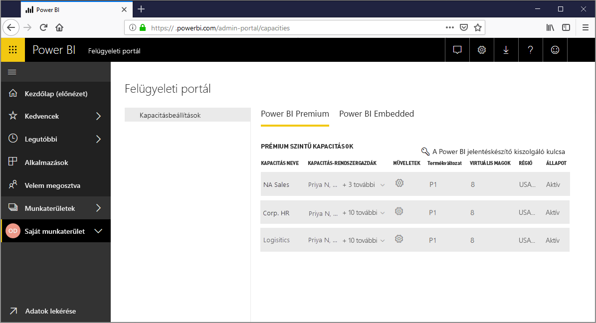
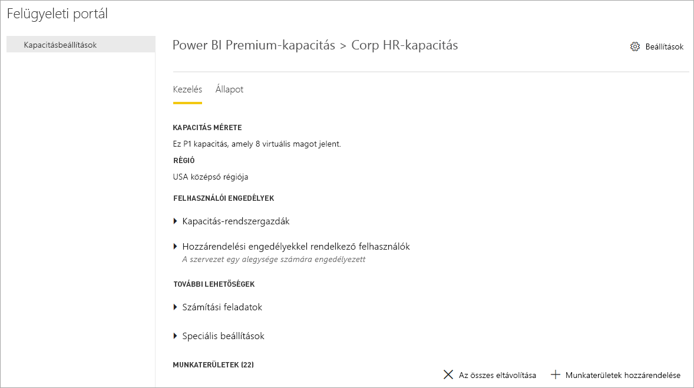
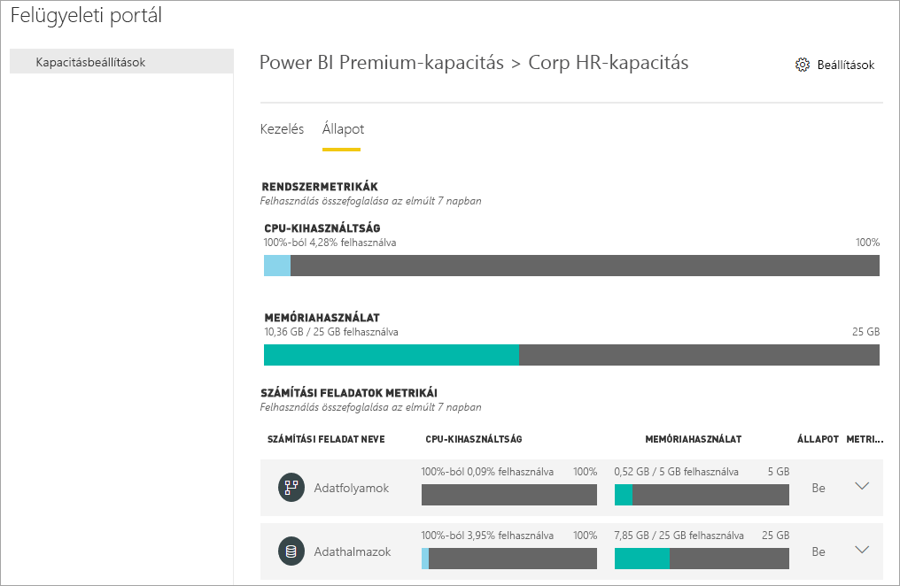
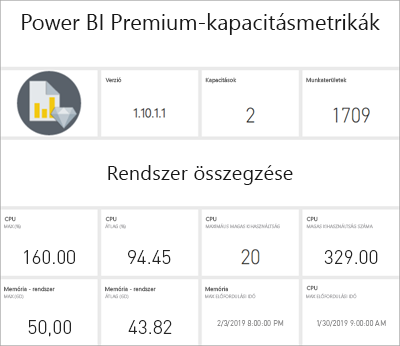
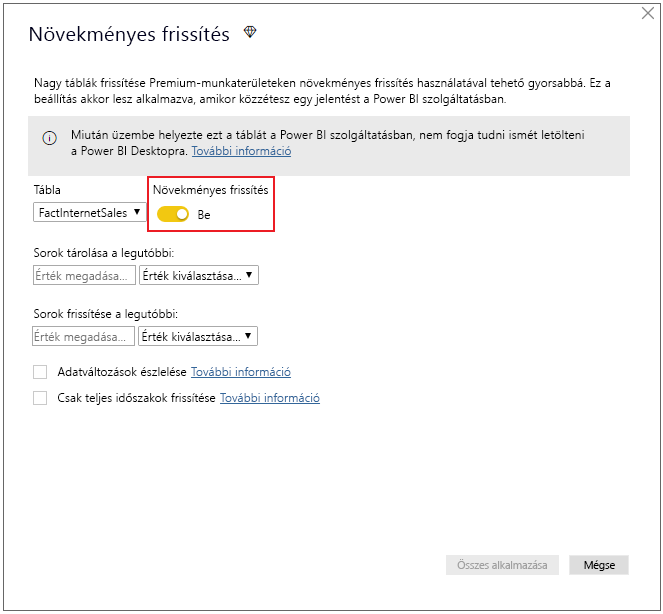
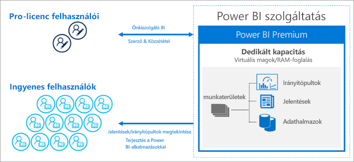
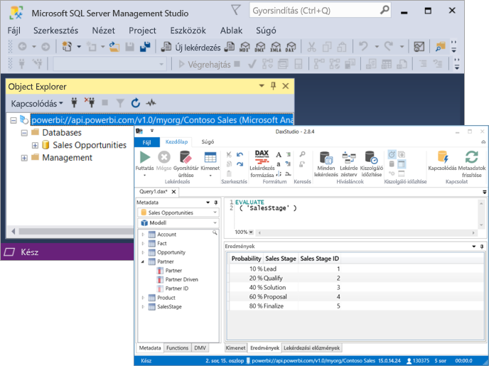

# Mi az a Power BI Premium?

A Power BI Premium dedikált és továbbfejlesztett erőforrásokat biztosít vállalata számára a Power BI szolgáltatás futtatásához. Például:

> [!div class="checklist"]
> * Nagyobb méretek és teljesítmény
> * A kapacitás szerinti licencelés rugalmassága
> * Az önkiszolgáló és a nagyvállalati üzleti intelligencia egységesítése
> * A helyszíni jelentéskészítés kiterjesztése a Power BI jelentéskészítő kiszolgálóval
> * Régiónkénti adattárolás (Multi-Geo) támogatása
> * Adatok megosztása bárkivel, felhasználónkénti licencek vásárlása nélkül

Ez a cikk a Power BI Premium fő funkcióit ismerteti. Ahol szükséges, megadjuk a részletesebb információkat nyújtó cikkekre mutató hivatkozásokat.

## Előfizetések és licencelés

A Power BI Premium bérlői szintű Office 365-előfizetés, amely két SKU- (termékváltozat-) családban érhető el:

- **EM** termékváltozatok (EM1-EM3) beágyazáshoz, éves kötelezettségvállalással, havi számlázással. Az EM1 és az EM2 SKU csak mennyiségi licenccsomagban érhető el. Ezek közvetlenül nem megvásárolhatók.
- **P** termékváltozatok (P1-P3) beágyazáshoz és nagyvállalati funkciókhoz, havi vagy éves kötelezettségvállalással, havi számlázással. Ezek tartalmaznak egy licencet a Power BI jelentéskészítő kiszolgáló helyszíni telepítéséhez.

Egy másik megoldás egy **Azure Power BI Embedded**-előfizetés megvásárlása, amely egyetlen **A**-családbeli (A1-A6) SKU-t tartalmaz, kizárólag beágyazási és kapacitástesztelési célra. Minden SKU biztosít virtuális magokat kapacitások létrehozásához, de az EM termékváltozatok kisebb méretű beágyazásra vannak korlátozva. A négynél kevesebb virtuális magot biztosító EM1, EM2, A1 és A2 termékváltozat nem dedikált infrastruktúrán fut.

Bár ez a cikk elsősorban a P termékváltozatokkal foglalkozik, a leírtak nagy része az A termékváltozatokra is vonatkozik. A Premium-előfizetések termékváltozataival szemben az Azure-termékváltozatok nem igényelnek időbeli kötelezettségvállalást, és óránként vannak számlázva. Biztosítják a vertikális fel- és leskálázás, a szüneteltetés, a folytatás és a törlés teljes rugalmasságát. 

Az Azure Power BI Embedded többnyire túlmutat ennek a cikknek a témakörén, de a Prémium szintű kapacitások optimalizálása című cikk [Tesztelési módszerek](service-premium-capacity-optimize.md#testing-approaches) szakaszában leírtak szerint praktikus és gazdaságos megoldást kínál a számítási folyamatok tesztelésére és mérésére. Az Azure-termékváltozatokról az [Azure Power BI Embedded dokumentációjában](https://azure.microsoft.com/services/power-bi-embedded/) tájékozódhat.

### Beszerzés

Power BI Premium-előfizetéseket rendszergazdák szerezhetnek be a Microsoft 365 Felügyeleti központban. Termékváltozatokat csak Office 365 globális rendszergazdák vagy számlázási rendszergazdák vásárolhatnak. Beszerzéskor a bérlő megkapja a megfelelő számú virtuális magot, amelyeket kapacitásokat rendelhet a *virtuális magok készletezésével*. Egy P3 termékváltozat megvásárlása például 32 virtuális magot biztosít a bérlőnek. További tudnivalók: [A Power BI Premium megvásárlása](service-admin-premium-purchase.md).

## Dedikált kapacitások

A Power BI Premiummal *dedikált kapacitások* járnak. Ellentétben a megosztott kapacitásokkal, ahol a számítási feladatok más ügyfelekkel megosztott erőforrásokon futnak, egy dedikált kapacitást kizárólag a vállalat használhat. El van különítve, és dedikált számítási erőforrásokkal nyújt megbízható és állandó teljesítményt az üzemeltetett tartalomhoz. 

A munkaterületek a kapacitásokon belül helyezkednek el. Minden Power BI-felhasználó rendelkezik **Saját munkaterülettel**. Az együttműködéshez további úgynevezett **munkaterületek** is létrehozhatók. Alapértelmezés szerint a munkaterületek, így a személyes munkaterületek is a megosztott kapacitásban lesznek létrehozva. Prémium szintű kapacitások esetén a saját munkaterületek és más munkaterületek is prémium szintű kapacitásokhoz rendelhetők.

### Kapacitás-csomópontok

Az [Előfizetések és licencelés](#subscriptions-and-licensing) című szakaszban leírtak szerint két Power BI Premium termékváltozat-család létezik: **EM** és **P**. Minden Power BI Premium termékváltozat elérhető kapacitás-*csomópontokként*, amelyek mindegyike egy adott mennyiségű, processzort, memóriát és tárhelyet tartalmazó erőforrásnak felel meg. Az erőforrásokon kívül minden termékváltozatra érvényesek a másodpercenkénti DirectQuery- és élő kapcsolatok számára, valamint a párhozamos modellfrissítések számára vonatkozó üzemeltetési korlátok.

A feldolgozást a háttér- és az előtérrendszer között egyenlően elosztott, adott számú virtuális mag valósítja meg.

A **háttérrendszeri virtuális magok** a Power BI alapfunkcióit, például a lekérdezések feldolgozását, a gyorsítótár kezelését, R-szolgáltatások futtatását, modellfrissítést, természetes nyelvi feldolgozást (Q&A) valamint a jelentések és képek megjelenítését végzik el. A háttérbeli virtuális magokhoz rögzített méretű memória van rendelve, amelyet elsősorban az aktív adatkészletnek is nevezett modellek kezelésére használnak.

Az **előtérrendszeri virtuális magokat** használja a rendszer webes szolgáltatásokhoz, az irányítópultokhoz, a jelentés- és dokumentumkezeléshez, a hozzáférések kezeléséhez, az ütemezéshez, az API-khoz, a feltöltésekhez, és letöltésekhez és többnyire mindenhez, ami a felhasználói élmény részét képezi.

A tárhely beállítása **kapacitás-csomópontonként 100 TB**.

Az egyes Premium termékváltozatok (és a megfelelően méretezett A termékváltozat) erőforrásait és korlátozásait az alábbi táblázat foglalja össze:

| Kapacitás-csomópontok | Összes virtuális mag | Háttérrendszeri virtuális magok | Memória (GB) | Előtérrendszeri virtuális magok | DirectQuery-/élő kapcsolatok (másodpercenként) | Párhuzamosan végrehajtható modellfrissítések |
| --- | --- | --- | --- | --- | --- | --- |
| EM1/A1 | 1 | 0,5 | 3 | 0,5 | 3,75 | 1 |
| EM2/A2 | 2 | 1 | 5 | 1 | 7,5 | 2 |
| EM3/A3 | 4 | 2 | 10 | 2 | 15 | 3 |
| P1/A4 | 8 | 4 | 25 | 4 | 30 | 6 |
| P2/A5 | 16 | 8 | 50 | 8 | 60 | 12 |
| P3/A6 | 32 | 16 | 100 | 16 | 120 | 24 |
| | | | | | | |

### Kapacitás-munkaterületek

A kapacitás-munkaterületek a felhasználók számára elérhetővé tett szolgáltatások. A Premium- és Azure-kapacitások alapértelmezés szerint csak egy Power BI-lekérdezések futtatásával társított adathalmazbeli számítási feladatot támogatnak. Az adathalmazbeli számítási feladat nem tiltható le. További számítási feladatok engedélyezhetők [mesterséges intelligenciához (Cognitive Services)](https://powerbi.microsoft.com/blog/easy-access-to-ai-in-power-bi-preview/), [adatfolyamokhoz](service-dataflows-overview.md#dataflow-capabilities-on-power-bi-premium) és [lapszámozott jelentésekhez](paginated-reports-save-to-power-bi-service.md). Ezek a számítási feladatok csak Premium-előfizetésben vannak támogatva. 

Minden újabb számítási feladat lehetővé teszi a számítási feladat által felhasználható maximális memória konfigurálását (a teljes rendelkezésre álló memória arányában). A maximális memória alapértelmezett beállításait a termékváltozat határozza meg. Egy kapacitás rendelkezésre álló erőforrásainak legjobb kihasználása érdekében ilyen további számítási feladatokat csak akkor érdemes engedélyezni, amikor használatban vannak. A memóriabeállításokat csak akkor módosíthatja, ha úgy értékelte, hogy az alapértelmezett beállítások nem felelnek meg az Ön erőforrásai kapacitásigényeinek. Egy kapacitáshoz a kapacitás rendszergazdái engedélyezhetnek és konfigurálhatnak számítási feladatokat a [Felügyeleti portálon](service-admin-portal.md) megtalálható **Kapacitásbeállítások**, vagy a [kapacitás REST API-k](https://docs.microsoft.com/rest/api/power-bi/capacities) használatával.  

További információ: [Számítási feladatok konfigurálása Premium-kapacitásban](service-admin-premium-workloads.md). 

### A kapacitások működése

A Power BI szolgáltatás mindig a lehető legjobban kihasználja a kapacitásbeli erőforrásokat, ugyanakkor nem lépi át a kapacitásra vonatkozó korlátozásokat.

A kapacitásbeli műveletek besorolása lehet *interaktív* vagy *háttérbeli*. Az interaktív műveletekhez tartoznak a képmegjelenítési kérések és a felhasználói beavatkozásra való reagálás (szűrés, Q&A-lekérdezés stb.). Az importált modellek lekérdezése általában sok memória-erőforrást használ, a DirectQuery- és élő kapcsolatú modellek lekérdezése viszont inkább CPU-igényes. A háttérbeli műveletekhez tartoznak az adatfolyamok és az importált modellek frissítései, valamint az irányítópult-lekérdezések gyorsítótárazása.

Fontos tisztában lenni azzal, hogy az interaktív műveletek mindig elsőbbséget élveznek a háttérbeliekkel szemben, hogy a lehető legjobb felhasználói élményt nyújtsák. Ha nem áll rendelkezésre elégséges erőforrás, akkor a háttérbeli műveletek egy várakozási sorhoz lesznek adva, és csak erőforrások felszabadulása esetén lesznek feldolgozva. Az olyan háttérbeli műveleteket, mint az adathalmazok frissítése, a Power BI szolgáltatás menet közben is megállíthatja, és várakozási sorhoz adhatja.

Az importált modelleket teljesen be kell tölteni a memóriába ahhoz, hogy lekérdezhetők vagy frissíthetők legyenek. A Power BI szolgáltatás a rendelkezésre álló memória legjobb kihasználása érdekében fejlett algoritmusokkal felügyeli a memóriahasználatot, és a kapacitás túlfoglalását okozhatja: Bár egy kapacitásban sok importált modell tárolható (prémium szintű kapacitásonként 100 TB-ig), ha ezek együttes tárterülete meghaladja a memória támogatott méretét (és további memória szükséges a lekérdezéshez és frissítéshez), akkor ezek nem tölthetők be egyszerre a memóriába.

Az importált modellek ezért a használatnak megfelelően vannak betöltve a memóriába és törölve onnan. Egy importált modell akkor lesz betöltve, ha lekérdezik (interaktív művelet) és még nincs a memóriában, vagy ha frissítik (háttérbeli művelet).

A modell memóriából való eltávolítását *kiürítésnek* nevezzük. Ezt a műveletet a Power BI gyorsan el tudja végezni, a modellek méretétől függően. Ha a kapacitásban nem lép fel memóriahiány, akkor a modellek egyszerűen be lesznek töltve a memóriába, és ott maradnak. Ha azonban nem áll rendelkezésre elég memória egy modell betöltéséhez, a Power BI szolgáltatásnak először memóriát kell felszabadítania. A memória felszabadításához az inaktívvá vált modelleket észleli olyan modellek keresésével, amelyek az utolsó három percben \[[1](#endnote-1)\] nem voltak használatban, majd kiüríti ezeket. Ha nincsenek kiüríthető inaktív modellek, akkor a Power BI szolgáltatás a háttérbeli műveletekhez betöltött modellek kiürítésére törekszik. Végső megoldásként, 30 másodperc sikertelen próbálkozás után \[[1](#endnote-1)\] az interaktív művelet sikertelenül zárul. Ilyen esetben a jelentés felhasználója értesítést kap a hibáról azzal a javaslattal, hogy rövid idő múlva próbálkozzon újra. Egyes esetekben a modellek szolgáltatási műveletek miatt lehetnek eltávolítva a memóriából.

Hangsúlyozandó, hogy az adathalmazok kiürítése normális és elvárt viselkedés. A célja a memória maximális kihasználása olyan modellek betöltésével és eltávolításával, amelyek együttes mérete meghaladja a rendelkezésre álló memóriáét. Ez szándékos, és átlátható a jelentésfelhasználók számára. A kiürítések magas számából nem feltétlenül következik, hogy a kapacitás nem rendelkezik elegendő erőforrással. Azonban aggodalomra adhat okot akkor, ha a lekérdezések vagy a frissítések válaszkészsége csökken a sok kiürítés miatt.

Az importált modellek frissítésének mindig nagy a memóriaigénye, mivel a modelleket be kell tölteni a memóriába. A feldolgozáshoz további memóriára van szükség. Egy teljes frissítés a modell számára szükséges memória mintegy kétszeresét is felhasználhatja. Ez biztosítja, hogy a modell a feldolgozás ideje alatt is lekérdezhető legyen, a lekérdezések ugyanis a meglévő modellhez lesznek küldve a frissítés befejezéséig, amikor az új modell adatai elérhetővé válnak. A növekményes frissítés kevesebb memóriát igényel, és gyorsabban befejeződhet, így jelentősen csökkenheti a kapacitás erőforrásainak terhelését. A modellek frissítése CPU-igényes is lehet, különösen azoknál, amelyek összetett Power Query-transzformációkat vagy olyan számított táblákat/oszlopokat tartalmaznak, amelyek összetettek vagy nagy táblákon alapulnak.

A frissítésekhez, ahogyan a lekérdezésekhez is, a modellnek a memóriába betöltve kell lennie. Ha nincs elég memória, a Power BI szolgáltatás megkísérli a nem aktív modellek kiürítését, és ha ez nem lehetséges (mert minden modell aktív), a frissítési feladat várakozási sorba kerül. A frissítések általában még a lekérdezéseknél is nagyobb processzorteljesítményt igényelnek. Emiatt kapacitáskorlát van érvényben az egyidejű frissítések számára. Ez a háttérbeli virtuális magok számának másfélszerese, felfelé kerekítve. Túl sok egyidejű frissítés esetén egy ütemezett frissítés várakozási sorba lesz helyezve. Ilyen helyzetben a frissítés hosszabb idő alatt fejeződik be. A felhasználói kérésre vagy API-hívással kezdeményezett igény szerinti frissítések három alkalommal lesznek ismét megkísérelve \[[1](#endnote-1)\]. Ha ekkor sincs elég erőforrás, akkor a frissítés sikertelenül ér véget.

Megjegyzések a szakaszhoz:   
\[1\] Változhat.

### Regionális támogatás

Új kapacitás létrehozásakor az Office 365 globális rendszergazdái vagy a Power BI-szolgáltatásgazdák megadhatnak egy régiót, ahol a kapacitáshoz rendelt munkaterületek el lesznek helyezve. Ez az úgynevezett **Multi-Geo**. Multi-Geo használatával a vállalatok úgy tehetnek eleget az adatelhelyezési követelményeknek, hogy egy megadott régióban lévő adatközpontokban helyezik el a tartalmat még akkor is, ha az eltér az Office 365-előfizetés régiójától. További információk: [Multi-Geo-támogatás a Power BI Premiumhoz](service-admin-premium-multi-geo.md).

### Kapacitáskezelés

A prémium szintű kapacitások kezeléséhez tartozik a kapacitások létrehozása vagy törlése, a rendszergazdák kijelölése, a munkaterületek hozzárendelése, a számítási feladatok konfigurálása és figyelése, valamint a kapacitás teljesítményét optimalizáló beállítások. 

Az Office 365 globális rendszergazdák és a Power BI-szolgáltatásgazdák Premium-kapacitásokat hozhatnak létre a rendelkezésre álló virtuális magokból, vagy módosíthatják a meglévő Premium-kapacitásokat. Kapacitás létrehozásakor annak mérete és földrajzi helye is meg van adva, és legalább egy kapacitás-rendszergazda hozzá van rendelve. 

Kapacitások létrehozásakor a felügyeleti feladatok többsége a [Felügyeleti portálon](service-admin-portal.md) végezhető el.

A kapacitás-rendszergazdák munkaterületeket rendelhetnek a kapacitáshoz, kezelhetik a felhasználói jogosultságokat, és más rendszergazdákat jelölhetnek ki. A kapacitás-rendszergazdák ezen kívül konfigurálhatják a számítási feladatokat, beállíthatják a memóriafoglalásokat, és szükség esetén újraindíthatják a kapacitásokat, alaphelyzetbe állítva a műveleteket egy kapacitás túlterhelése esetén.

A kapacitás-rendszergazdák a kapacitás zökkenőmentes működéséről is gondoskodhatnak. A kapacitás állapotát a Felügyeleti portálon, vagy a Premium kapacitásmetrikák alkalmazás használatával figyelhetik.

A kapacitások létrehozásáról, a rendszergazdák kijelöléséről és a munkaterületek hozzárendeléséről a [Prémium szintű kapacitások kezelése](service-premium-capacity-manage.md) című cikkből tájékozódhat bővebben. A szerepkörökről [A Power BI-jal kapcsolatos rendszergazdai szerepkörök](service-admin-administering-power-bi-in-your-organization.md#administrator-roles-related-to-power-bi) című cikk kínál további információt.

### Figyelés

A prémium szintű kapacitások figyelésével a rendszergazdák képet kaphatnak a kapacitások teljesítményéről. Kapacitások a Felügyeleti portál és a [Power BI Premium kapacitásmetrikák alkalmazás](https://app.powerbi.com/groups/me/getapps/services/capacitymetrics) használatával figyelhetők.

A portálon végezhető figyeléssel gyorsan áttekinthetők a kapacitás által elhelyezett terheléseket és a felhasznált erőforrásokat jelző magas szintű metrikák az utolsó hét napra átlagolva. 

A kapacitások teljesítményéről a **Power BI Premium kapacitásmetrikák** alkalmazás nyújtja a legrészletesebb információkat. Az alkalmazás egy magas szintű irányítópultot és részletesebb jelentéseket nyújt.

Az alkalmazás irányítópultján egy metrika cellájába kattintva nyitható meg a részletes jelentés. A jelentések részletes metrikákat és szűrési képességeket kínálnak, hogy részletesen elemezhesse a kapacitások zökkenőmentes működtetése szempontjából fontos információkat.

A kapacitások figyeléséről a [Figyelés a Power BI Felügyeleti portálon](service-admin-premium-monitor-portal.md) és a [Figyelés a Power BI Premium kapacitásmetrika alkalmazással](service-admin-premium-monitor-capacity.md) című cikkekből tájékozódhat.

### Kapacitások optimalizálása

A kapacitások lehető legjobb kihasználása elengedhetetlen annak biztosításához, hogy a felhasználók a megfelelő teljesítményt tapasztalják, az Ön Premium-befektetése pedig minél jobban megtérüljön. A rendszergazdák az alapvető metrikák figyelésével megállapíthatják, hogyan érdemes kiküszöbölni a szűk keresztmetszeteket és megtenni a kellő lépéseket. További információt a [Prémium szintű kapacitások optimalizálása](service-premium-capacity-optimize.md) és a [Prémium szintű kapacitások felhasználási helyzetei](service-premium-capacity-scenarios.md) című cikkekben talál.

### Kapacitás REST API-k

A Power BI REST API-k között [kapacitás REST API-k](https://docs.microsoft.com/rest/api/power-bi/capacities) gyűjteménye is megtalálható. Az API-kkal a rendszergazdák programozottan kezelhetik a prémium szintű kapacitások számos jellemzőjét, sok más mellett például engedélyezhetnek és letilthatnak számítási feladatokat, munkaterületeket rendelhetnek egy kapacitáshoz.

## Nagy adathalmazok

A termékváltozattól függően a Power BI Premium támogatja a legfeljebb **10 GB** méretű Power BI Desktop (.pbix) modellfájlok feltöltését. A feltöltött modell aztán közzétehető egy prémium szintű kapacitáshoz rendelt munkaterületen. Az adathalmaz ez után legfeljebb **12 GB** méretig frissíthető.

### Mérettel kapcsolatos szempontok

A nagy méretű adathalmazoknak az erőforrásigénye is nagy lehet. Érdemes legalább a P1 termékváltozatot alkalmazni minden 1 GB-nál nagyobb adathalmaz esetén. Bár a nagy adathalmazok közzététele egy A kategóriájú, legfeljebb A3-as termékváltozatokra épülő munkaterületen sikeres lehet, az adathalmazok frissítése biztosan nem.

A következő táblázat azt ismerteti, hogy milyen termékváltozatok használata ajánlott a .pbix-fájlok feltöltéséhez és közzétételéhez a Power BI szolgáltatásban:

   |Termékváltozat  |A .pbix-fájl mérete   |
   |---------|---------|
   |P1    | < 3 GB        |
   |P2    | < 6 GB        |
   |P3, P4, P5    | legfeljebb 10 GB   |

A Power BI Embedded A4 termékváltozata a P1 SKU-val, az A5 a P2-vel, az A6 pedig a P3-mal egyezik meg. A nagy adathalmazok A és EM termékváltozatban való közzététele olyan hibákat eredményezhet, amelyek nem a megosztott kapacitásbeli modellméret-korlátozási hibával függenek össze. Az adathalmazok frissítési hibái az A és EM termékváltozatokban feltehetően időtúllépésre utalnak.

Ha engedélyezi a [nagy méretű modelleket](service-premium-large-models.md) egy adathalmazban, attól még továbbra is érvényesek a .pbix-fájlok méretére vonatkozó korlátozások a fájlok feltöltésekor vagy közzétételekor. Azonban a növekményes frissítés és a nagy méretű modellek együttes használata esetén az adathalmazok e határértékeknél jóval nagyobbra nőhetnek. A nagy méretű modellek esetén az adathalmazok méretét csak a Power BI Premium kapacitásmérete korlátozza.

A .pbix-fájlok *nagy mértékben tömörített állapotban* tartalmazzák az adatokat. Az adatok mérete valószínűleg nőni fog a memóriába való betöltéskor, és ehhez képest is a többszörösére nőhet az adatok frissítése során.

A nagyméretű adathalmazok ütemezett frissítése hosszú időt vehet igénybe, és erőforrás-igényes lehet. Lényeges, hogy ne ütemezzen túl sok egymással átfedő frissítést. Ajánlott [növekményes frissítést](service-premium-incremental-refresh.md) konfigurálni, mert gyorsabb, megbízhatóbb, és kevesebb erőforrást használ fel.

A jelentés kezdeti betöltése a nagyméretű adathalmazok esetében hosszú időt vehet igénybe, ha már eltelt némi idő az adathalmaz utolsó használata óta. A hosszabb ideig töltődő jelentések esetében egy betöltési folyamatjelző mutatja a betöltés előrehaladását.

Bár a lekérdezésenkénti memória- és időkorlátozások a prémium szintű kapacitás esetében jóval magasabbak, ajánlott a látványelemeket szűrőkkel és szeletelőkkel kizárólag a szükséges elemek megjelenítésére korlátozni.

## Növekményes frissítés

A növekményes frissítés kulcsszerepet játszik a nagy adathalmazok Power BI Premiumbeli tárolásában és karbantartásában. A növekményes frissítés számos előnnyel jár, például azzal, hogy a frissítések gyorsabbak lesznek, mert csak a módosított adatokat kell frissíteni. A frissítések megbízhatóbbak, mert nem szükséges hosszú futású kapcsolatokat fenntartani alacsony megbízhatóságú adatforrásokkal. Csökken az erőforrás-felhasználás, mert kevesebb frissítendő adat csökkenti a frissítési művelet által igényelt memóriamennyiséget és más erőforrásokat. A növekményes frissítési szabályzatok a **Power BI Desktopban** definiálhatók, majd az alkalmazásukhoz közzé kell tenni azokat egy prémium szintű kapacitásban. 

További információ: [Növekményes frissítés a Power BI Premium szolgáltatásban](service-premium-incremental-refresh.md).

## Oldalakra osztott jelentések

A P1-P3 és A4-A6 termékváltozatokban támogatott többoldalas jelentések a Report Definition Language (RDL) technológián alapulnak az SQL Server Reporting Servicesben. Bár ennek alapja az RDL, nem azonos a Power BI jelentéskészítő kiszolgálóval, amely egy letölthető és helyszínen telepíthető jelentéskészítő platform, amelyet szintén tartalmaz a Power BI Premium. A többoldalas jelentések úgy vannak formázva, hogy jól elférjenek a kinyomtatható vagy megosztható oldalakon. Az adatok egy táblázatban jelennek meg még akkor is, ha a táblázat több oldalra terjed ki. Az ingyenes [**Power BI Jelentéskészítő**](https://go.microsoft.com/fwlink/?linkid=2086513) Windows-asztali alkalmazással a felhasználók többoldalas jelentéseket készíthetnek és tehenek közzé a szolgáltatásban.

A Power BI Premiumban a többoldalas jelentés számítási feladat, amelyet a Felügyeleti portál használatával kell engedélyezni a kapacitáson. A kapacitás-rendszergazdák engedélyezhetik, és megadhatják a felhasználható memória mennyiségét a kapacitás összes memória-erőforrásának százalékában. Más számításifeladat-típusoktól eltérően a Premium a többoldalas jelentéseket egy zárt területen futtatja a kapacitáson belül. Ehhez a területhez a megadott maximális memóriát használja, akár aktív a számítási feladat, akár nem. Az alapértelmezett érték 20%. 

További információ: [Többoldalas jelentések a Power BI Premium szolgáltatásban](paginated-reports-report-builder-power-bi.md). A többoldalas jelentések számítási feladat engedélyezéséről a [Számítási feladatok konfigurálása](service-admin-premium-workloads.md) című cikkből tájékozódhat bővebben.

## Power BI jelentéskészítő kiszolgáló
 
A Power BI Premium által tartalmazott Power BI jelentéskészítő kiszolgáló egy webportállal rendelkező *helyszíni* jelentéskészítő kiszolgáló. A helyszínen építheti ki BI-környezetét, és vállalata tűzfala mögött terjesztheti jelentéseit. A jelentéskészítő kiszolgáló az SQL Server Reporting Services részletgazdag, interaktív, nagyvállalati szintű jelentéskészítési képességeit nyújtja a felhasználóknak. A felhasználók a vizuálisan megjelenített adatok vizsgálatával gyorsan fedezhetnek fel mintázatokat, és jobb, gyorsabb döntéseket hozhatnak. A jelentéskészítő kiszolgáló saját igényeinek megfelelő irányítást biztosít. Amennyiben arra kerül sor, a Power BI jelentéskészítő kiszolgáló egyszerűbbé teszi a felhőbe migrálást, ahol vállalata teljes mértékben kihasználhatja a Power BI Premium funkcióit.

További információ: [Power BI jelentéskészítő kiszolgáló](report-server/get-started.md).

## Korlátlan tartalommegosztás

A Premium használata esetén munkahelyén belül és kívül is bárki saját licenc vásárlása nélkül megtekintheti az összes Power BI-tartalmat, többek között a lapszámozott és az interaktív jelentéseket. 

A Premium lehetővé teszi, hogy a Pro-felhasználók széles körben megoszthassák a tartalmakat anélkül, hogy a tartalmak címzettjei Pro-licencekkel rendelkeznének. A tartalomkészítőknek Pro-licencekkel kell rendelkezniük. A készítők adatforrásokhoz csatlakozhatnak, adatokat modellezhetnek, és munkaterületi alkalmazásokként csomagolt jelentéseket és irányítópultokat készíthetnek. 

További információ: [Power BI-licencelés](service-admin-licensing-organization.md).

## Eszközök összekapcsolhatósága (előzetes verzió)

A háttérben a nagyvállalatoknál már bizonyított Microsoft **Analysis Services Veripaq motor** működteti a Power BI-adathalmazokat. Az Analysis Services ügyfélkódtárakkal és a nyílt szabványú XMLA protokollt támogató API-kkal biztosítja a programozhatóságot és az ügyfélalkalmazások és -eszközök támogatását. A Power BI Premium-adathalmazok jelenleg *csak olvasási* műveleteket támogatnak Microsoftos és külső ügyfélalkalmazásoktól és eszközöktől, **XMLA-végpontokon** keresztül. 

Az olyan Microsoft-eszközök, mint az SQL Server Management Studio és az SQL Server Profiler, valamint az olyan külső eszközök, mint a DAX Studio és az adatvizualizációs alkalmazások XMLA, DAX, MDX, DMV-k és TraceEventek használatával csatlakozhatnak a Premium-adathalmazokhoz és kérdezhetik le azokat. 

További információ: [Csatlakozás adathalmazokhoz ügyfélalkalmazásokkal és -eszközökkel](service-premium-connect-tools.md).

## Következő lépések

> [!div class="nextstepaction"]
> [Prémium szintű kapacitások kezelése](service-premium-capacity-manage.md)

További kérdései vannak? [Kérdezze meg a Power BI közösségét](https://community.powerbi.com/)

||||||
