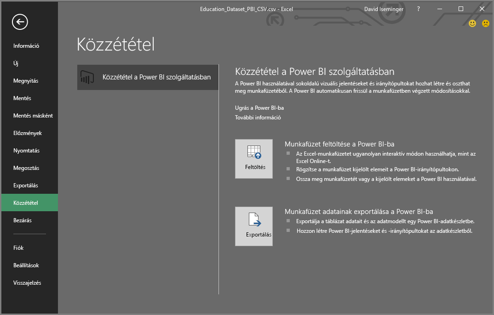
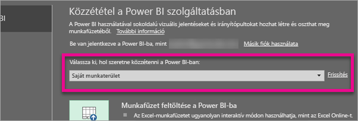
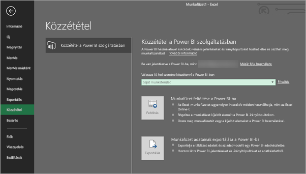
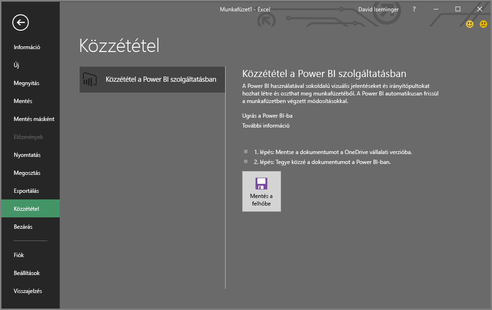

# Közzététel a Microsoft Excel-ből a Power BI-ba
A Microsoft Excel 2016-tal és újabb verzióival közvetlenül [Power BI](https://powerbi.microsoft.com)-munkaterületen teheti közzé Excel-munkafüzeteit, ahol könnyen használható jelentéseket és irányítópultokat készíthet a munkafüzet adatai alapján. Az elemzés eredményeit aztán megoszthatja másokkal is a cégén belül.

A munkafüzetek Power BI-beli közzétételekor néhány szempontot szem előtt kell tartani:

* Az Office-ba, a OneDrive Vállalati verziójába (ha oda mentett munkafüzeteket használ) és a Power BI-ba ugyanazzal a fiókkal kell bejelentkeznie.
* Nem tehet közzé üres munkafüzetet vagy olyat, amelyben nincs a Power BI által támogatott tartalom.
* Nem tehet közzé titkosított vagy jelszóval védett, vagy az Information Protection felügyelete alatt álló munkafüzeteket.
* A Power BI-ba való közzététel feltétele a modern hitelesítés engedélyezése (alapértelmezés). Ha le van tiltva, akkor a Közzététel lehetőség nem érhető el a Fájl menüben.

## Az Excel-munkafüzet közzététele
Az Excel-munkafüzet közzétételéhez válassza az Excelben a **Fájl** > **Közzététel** menüpontot, majd a **Feltöltés** vagy az **Exportálás** lehetőséget.

Ha **Feltölti** a munkafüzetet a Power BI-ba, ugyanúgy kezelheti azt, ahogyan az Excel Online használatával kezelné. A munkafüzetet kijelölt részeit Power BI-irányítópultokra is kitűzheti, a munkafüzetet vagy annak kijelölt elemeit pedig meg is oszthatja a Power BI-on keresztül.

Ha az **Exportálás** lehetőséget választja, a táblázat adatait és az adatmodellt exportálhatja egy Power BI-adathalmazba, amelyet aztán felhasználhat Power BI-jelentések és irányítópultok létrehozásához.

### Helyi fájl közzététele
Az Excel támogatja a helyi Excel-fájlok közzétételét. Nem kell feltétlenül a OneDrive Vállalati verziójára vagy a SharePoint Online-ba menteni őket.

> [!IMPORTANT]
> Helyi fájlokat csak akkor tehet közzé, ha az Excel 2016 (vagy újabb) verzióját használja Office 365-előfizetéssel. Az Excel 2016 önálló telepítései alkalmasak a Power BI-be való közzétételre, de csak akkor, ha a munkafüzet a OneDrive Vállalati verziójába vagy a SharePoint Online-ba van mentve.
> 

A **Közzététel** lehetőség választásakor megadhatja a közzététel céljául kiválasztott munkaterületet. Ez lehet személyes munkaterület vagy olyan csoport-munkaterület, amelyhez hozzáférése van, ahogyan az alábbi ábrán látható.

Két módszer a munkafüzet tartalmának Power BI-ba juttatására.

A közzététel után a munkafüzet közzétett tartalma a Power BI-ba lesz importálva, a helyi fájltól elkülönítve. Ha frissíteni szeretné a Power BI-beli fájlt, újra közzé kell tennie a friss verziót, de az adatokat úgy is frissítheti, hogy ütemezett frissítést állít be a munkafüzeten vagy az Power BI-beli adathalmazon.

### Közzététel önállóan telepített Excelből
Ha önálló Excel-telepítésből teszi közzé a munkafüzetet, annak a OneDrive Vállalati verziójában kell mentve lennie. Válassza a **Mentés a felhőbe** lehetőséget, és jelöljön ki egy helyet a OneDrive Vállalati verzióján.

Miután kimentette a munkafüzetet a OneDrive Vállalati verziójára, a **Közzététel** során két lehetősége van a munkafüzet Power BI-ba juttatására: **Feltöltés** vagy **Exportálás**:

#### Munkafüzet feltöltése a Power BI-ba
A **Feltöltés** lehetőséget választva a munkafüzet ugyanúgy jelenik meg a Power BI felületén, ahogyan az Excel Online-ban jelenne meg. Az Excel Online-tól eltérően azonban itt többféle lehetősége van a munkalap elemeinek az irányítópultokra való kitűzésére.

A Power BI-ban nincs lehetőség a munkafüzet szerkesztésére. Ha módosításokat kell végeznie az adatokon, a **Szerkesztés** elemet választva kiválaszthatja, hogy az Excel Online-ban szeretné szerkeszteni a munkafüzetet, vagy megnyitja azt a számítógépen, az Excelben. A rendszer az összes módosítást a OneDrive Vállalati verzióján található munkafüzetbe menti.

**Feltöltéskor** nem jön létre adathalmaz a Power BI-ban. A munkafüzet a Jelentések területen jelenik meg a munkaterület navigációs paneljén. A Power BI-ba feltöltött munkafüzetekhez különleges Excel-ikon tartozik, amelyről felismerhető, hogy feltöltött Excel-munkafüzetek.

Akkor válassza a **Feltöltés** lehetőséget, ha az adatai csak munkalapokon helyezkednek el, vagy kimutatásai és diagramjai vannak, amelyeket látni szeretne a Power BI-ban.

Az Excelből Power BI-ba való közzététel Feltöltés változatának használata sokban hasonlít a böngészőben használt Power BI **Adatok beolvasása > Fájl > OneDrive Vállalati verzió > Excel-adatok elérése, kezelése és megtekintése a Power BI-ban** lehetőségével.

#### Munkafüzet adatainak exportálása a Power BI-ba
Az **Exportálás** lehetőséget választva a táblázatokban és/vagy adatmodellekben lévő valamennyi támogatott adat új Power BI-adathalmazba lesz exportálva. A munkafüzetben lévő összes Power View-munkalap jelentésként lesz újra létrehozva a Power BI-ban.

Tovább szerkesztheti a munkafüzetet. A módosítások mentése után a rendszer általában egy órán belül szinkronizálja ezeket a Power BI-adathalmazzal. Ha azonnali frissítésre van szükség, válassza ismét a **Közzététel** lehetőséget az Excelben, és a módosítások azonnal exportálva lesznek. A jelentésekben és irányítópultokon lévő vizualizációk is frissülnek.

Akkor válassza a **Közzététel** lehetőséget, ha az Adatok beolvasása és átalakítása lehetőséggel vagy a Power Pivot funkcióival adatokat töltött be egy adatmodellbe, vagy ha a munkafüzet olyan vizualizációkkal rendelkező Power View-lapokat tartalmaz, amelyeket a Power BI-ban is látni szeretne.

Az **Exportálás** használata sokban hasonlít a böngészőben használt Power BI **Adatok beolvasása > Fájl > OneDrive Vállalati verzió > Excel-adatok exportálása a Power BI-ba** lehetőségével.

## Közzététel
Bármelyik utat is választja, az Excel bejelentkezik a Power BI-ba az Ön aktuális fiókjával, majd közzéteszi a munkafüzetet a Power BI-munkaterületen. Az Excel állapotsávján figyelemmel kísérheti a közzétételi folyamat előrehaladását.

Amikor elkészült, az Excelből közvetlenül átléphet a Power BI-ba.

## Következő lépések
[Excel-adatok a Power BI-ban](service-excel-workbook-files.md)  
További kérdései vannak? [Kérdezze meg a Power BI közösségét](https://community.powerbi.com/)

