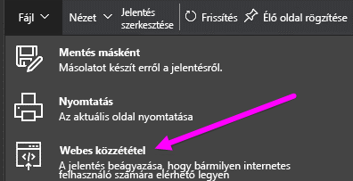

# Webes közzététel a Power BI-ból

A Power BI **Webes közzététel** lehetőségével egyszerűen ágyazhat be interaktív Power BI-vizualizációkat online, például blogbejegyzésekbe, weboldalakba, e-mailen vagy közösségi médián keresztül, bármilyen eszközről. A közzétett vizualizációkat egyszerűen szerkesztheti, frissítheti, vagy akár vissza is vonhatja a megosztásukat.

> [!WARNING]
> A **Webes közzététel** használatával közzétett jelentést vagy vizualizációt bárki megtekintheti az Interneten. Ez nem igényel hitelesítést, és a jelentés által összesített adatok részletes megtekintését is magában foglalja. Jelentés közzététele előtt gondolja át, hogy megfelel-e Önnek az adatok és a vizualizációk nyilvános megosztása. Bizalmas vagy szellemi tulajdont képező információt ne tegyen közzé. Ha bizonytalan, akkor a közzététel előtt ellenőrizze a cég szabályzatait.

>[!Note]
>Ha biztonságosan be szeretné ágyazni a tartalmat egy belső portálon vagy webhelyen, használja a [Beágyazás](service-embed-secure.md) vagy a [Beágyazás a SharePoint online-ban](service-embed-report-spo.md) lehetőséget. Ez biztosítja, hogy minden engedély és adatbiztonság kényszerítve legyen, amikor a felhasználók megtekintik a belső adatokat.

## A Webes közzététel használata

A **Webes közzététel** a személyes vagy csoport-munkaterületein Ön által szerkeszthető jelentésekhez érhető el.  Nem érhető el Önnel megosztott, valamint az adatokat sorszintű biztonsággal védő jelentésekhez. A lenti [**Korlátozások**](#limitations) szakasz tartalmazza azoknak az eseteknek a teljes listáját, amelyeknél a **Webes közzététel** nem támogatott. A **Webes közzététel** használata előtt olvassa el figyelmesen a **Figyelmeztetést** a cikk elején.

Az alábbi rövid videó a funkció működését mutatja be. Ez után Ön is kipróbálhatja az alábbi lépésekben.

<iframe width="560" height="315" src="https://www.youtube.com/embed/UF9QtqE7s4Y" frameborder="0" allowfullscreen></iframe>

A következő útmutató a **Webes közzététel** használatát ismerteti.

1. Nyisson meg egy Ön által szerkeszthető jelentést a munkaterületén, majd válassza a **Fájl > Webes közzététel** lehetőséget.

   

2. Olvassa el a párbeszédpanel tartalmát, majd válassza a **Beágyazási kód létrehozása** lehetőséget.

   

3. Olvassa el az itt megjelenő figyelmeztetést, és ellenőrizze, hogy az adatok szabadon beágyazhatók-e egy nyilvános weboldalba. Ha így van, válassza a **Közzététel** lehetőséget.

   

4. Megjelenik egy hivatkozást tartalmazó párbeszédpanel. Ezt a hivatkozást elküldheti e-mailben, kódba (például iFrame-be) ágyazhatja, vagy közvetlenül beillesztheti egy weboldalra vagy blogba.

   

5. Ha egy jelentéshez korábban már létrehozott beágyazási kódot, akkor a **Webes közzététel** választásakor nem jelennek meg a 2-4. lépésben ismertetett párbeszédpanelek. Helyettük a **Beágyazási kód** párbeszédpanel nyílik meg:

   

   Jelentésenként csak egy beágyazási kód hozható létre.

## Tippek és trükkök különböző Megtekintési módokhoz

Amikor egy blogbejegyzésbe ágyaz be tartalmat, akkor azt általában egy adott képernyőmérethez kell igazítania.  A magasságot és a szélességet az iFrame-címkében igény szerint beállíthatja. Ugyanakkor arról is gondoskodnia kell, hogy a jelentés elférjen az adott iFrame területén, ezért a jelentés szerkesztésekor a megfelelő Megtekintési módot is be kell állítania.

A következő táblázat a Megtekintési módokat és azok beágyazott megjelenését ismerteti.

| Megtekintési mód | Beágyazott megjelenés |
| --- | --- |
|  |A **Laphoz igazítás** figyelembe veszi a jelentésoldal magasságát és szélességét. Ha az oldalt *Dinamikus*, például 16:9 vagy 4:3 képarányúra állította be, akkor a tartalom úgy lesz átméretezve, hogy illeszkedjen az iFrame-keretbe. iFrame-keretbe ágyazva a **Laphoz igazítás** eredményeként *üres sávok*, szürke hátterű területek jelenhetnek meg az iFrame-ben a tartalom kerethez illeszkedő átméretezése után. Az üres sávok eltüntetéséhez állítsa át az iFrame-keret magasságát és szélességét a megfelelő értékre. |
|  |A **tényleges méret** módban a jelentés megtartja a jelentésoldalon megadott méretét. Emiatt az iFrame-keretben görgetősávok jelenhetnek meg. Görgetősávok megjelenése az iFrame-keret magasságának és szélességének beállításával kerülhető el. |
|  |A **szélességhez igazítás** beállítás biztosítja, hogy a tartalom vízszintesen kitöltse az iFrame-keretet. A szegély látható marad, de a tartalom úgy lesz átméretezve, hogy vízszintesen kitöltse a rendelkezésre álló területet. |

## Tippek és trükkök az iFrame magasság- és szélesség-beállításaihoz

Egy **webes közzétételi** beágyazási kód az alábbihoz hasonló:

 
A szélességét és magasságát manuálisan is módosíthatja, hogy pontosan a kívánt módon illeszkedjen az oldalba, ahol beágyazza.

Tökéletesebb illeszkedés érdekében megpróbálhatja 56 képponttal megnövelni az iFrame magasságát, hogy helyet adjon az aktuális méretű alsó sávnak. Ha a jelentésoldala dinamikus méretezést használ, akkor az alábbi táblázatban talál néhány üres sávok nélküli illeszkedést biztosító méretet.

| Képarány | Nagyság | Méret (szélesség × magasság) |
| --- | --- | --- |
| 16:9 |Kicsi |640 × 416 képpont |
| 16:9 |Közepes |800 × 506 képpont |
| 16:9 |Nagy |960 × 596 képpont |
| 4:3 |Kicsi |640 × 536 képpont |
| 4:3 |Közepes |800 × 656 képpont |
| 4:3 |Nagy |960 × 776 képpont |

## Beágyazási kódok kezelése

Miután létrehozott egy **webes közzétételi** beágyazási kódot, a kódokat a Power BI szolgáltatás **Beállítások** menüjében tudja kezelni. A beágyazási kódok kezeléséhez tartozik a kód által hivatkozott vizualizáció vagy jelentés eltávolítása (ez használhatatlanná teszi a beágyazási kódot), vagy a beágyazási kód lekérése.

1. A **Webes közzétételi** beágyazási kódok kezeléséhez nyissa meg a **Beállítások** fogaskerék-ikont, és válassza a **Beágyazási kódok kezelése** lehetőséget.

   

2. Megjelennek a beágyazási kódok.

   

3. A beágyazási kódokat lekérheti vagy törölheti. A törléssel a jelentésre vagy vizualizációra mutató összes hivatkozást használhatatlanná teszi.

   

4. Ha a **Törlés** műveletet választja, a rendszer megerősítést kér.

   

## Jelentések és adatok frissítése

A **webes közzétételi** beágyazási kód létrehozása és megosztása után a jelentésben minden Ön által végzett változtatás frissülni fog, és a beágyazási kód hivatkozása azonnal aktívvá válik. Bárki megtekintheti, ha megnyitja a hivatkozást. Ez után az első művelet után azonban a jelentések vagy vizualizációk módosításai csak körülbelül egy órával később válnak láthatóvá a felhasználók számára. További tudnivalókat ennek a cikknek a [**Hogyan működik?** ](#howitworks) című szakaszában talál. 

## Adatfrissítés

Az adatfrissítések automatikusan megjelennek a beágyazott jelentésben vagy vizualizációban. A frissített adatok körülbelül egy óra elteltével lesznek láthatók a beágyazási kódokon keresztül. Az automatikus frissítés letiltásához válassza a **ne frissüljön** lehetőséget a jelentés által használt adathalmaz ütemezésénél.  

## Egyéni vizualizációk

A **Webes közzététel** az egyéni vizualizációkat is támogatja. A **Webes közzététel** használatakor azoknak a felhasználóknak, akik megosztják az Ön által közzétett vizualizációt, nem kell engedélyezniük az egyéni vizualizációkat a jelentés megtekintéséhez.

## Korlátozások

A Power BI szolgáltatás adatforrásainak és jelentéseinek túlnyomó többsége esetén támogatott a **Webes közzététel**, a következők azonban jelenleg nem támogatottak és nem érhetők el **Webes közzététellel**:

- Sorszintű biztonságot használó jelentések.
- Az élő kapcsolatos adatforrásokat (például a helyszíni Analysis Services táblázatost, az Analysis Service Multidimensionalt és az Azure Analysis Servicest) használó jelentések.
- Közvetlenül Önnel vagy céges tartalomcsomagon keresztül megosztott jelentések.
- Olyan csoporthoz tartozó jelentések, amelynek ön nem szerkesztési joggal bíró tagja.
- Az "R" vizualizációk **webes közzétételű** jelentésekben jelenleg nem támogatottak.
- Adatok exportálása weben közzétett jelentésben szereplő vizualizációkból.
- ArcGIS Maps for Power BI-vizualizációk.
- Jelentésszintű DAX-mértékeket tartalmazó jelentések.
- Egyszeri bejelentkezési adatlekérdezési modellek.
- [Védett bizalmas vagy szellemi tulajdont képező információk](#publish-to-web-from-power-bi).
- A **Beágyazás** lehetőség automatikus hitelesítés funkciója nem működik a Power BI JavaScript API-jával. A Power BI JavaScript API-hoz a [felhasználó az adatok tulajdonosa](developer/embed-sample-for-your-organization.md) módszert kell használnia.

## Bérlőbeállítások

A Power BI-rendszergazdák engedélyezhetik vagy letilthatják a **Webes közzététel** funkciót. A hozzáférést adott csoportokra is korlátozhatják, amely befolyásolhatja az Ön lehetőségeit beágyazási kód létrehozására.

|Funkció |A teljes cég számára engedélyezve |A teljes cég számára letiltva |Speciális biztonsági csoportok   |
|---------|---------|---------|---------|
|A **Webes közzététel** parancs egy jelentés **Fájl** menüjében|Mindenki számára engedélyezve|Nem mindenki számára látható|Csak az arra jogosult felhasználók vagy csoportok láthatják.|
|A **Beágyazási kódok kezelése** funkció a **Beállítások** közt|Mindenki számára engedélyezve|Mindenki számára engedélyezve|Mindenki számára engedélyezve.  * A **Törlés** parancsot csak az arra jogosult felhasználók vagy csoportok érik el. * A **Kód lekérése** mindenki számára engedélyezve van.|
|**Beágyazási kódok** a felügyeleti portálon|Az állapot a következő értékeket jelenítheti meg: * Aktív * Nem támogatott * Blokkolva|Az állapot **Letiltva** lesz|Az állapot a következő értékeket jelenítheti meg: * Aktív * Nem támogatott * Blokkolva  Ha egy felhasználónak nincs megfelelő jogosultsága a bérlői beállítások alapján, akkor az állapot **Megsértve** lesz.|
|Meglévő közzétett jelentések|Minden engedélyezve|Minden letiltva|A jelentések továbbra is megjelennek mindenki számára.|

## A beágyazási kód állapota oszlop ismertetése

A **Beágyazási kódok kezelése** oldal tartalmaz egy állapotoszlopot. A beágyazási kódok alapértelmezés szerint **aktívak**, de az alább felsorolt állapotok valamelyikében is lehetnek.

| Állapot | Leírás |
| --- | --- |
| **Aktív** |A jelentés elérhető, megtekinthető és használható a felhasználók számára az Interneten. |
| **Blokkolva** |A jelentés tartalma sérti a [Power BI szolgáltatási feltételeit](https://powerbi.microsoft.com/terms-of-service). A Microsoft blokkolta azt. Ha úgy véli, hogy a tartalom blokkolása indokolatlan, akkor lépjen kapcsolatba a támogatási szolgálattal. |
| **Nem támogatott** |A jelentés adatkészlete sorszintű biztonságot vagy más nem támogatott konfigurációt használ. A teljes listát a [**Korlátozások**](#limitations) című szakaszban találja. |
| **Megsértve** |Ez a beágyazási kód a bérlői házirend hatókörén kívül esik. Ez jellemzően akkor fordul elő, ha egy beágyazási kód létrehozása után a bérlőben úgy módosítják a **Webes közzététel** beállítást, hogy a beágyazási kód tulajdonosa ki legyen zárva. Ha a bérlői beállítás Letiltva, vagy ha a felhasználó már nem jogosult beágyazási kódok létrehozására, akkor a meglévő beágyazási kódok állapota **Megsértve** lesz. |

## Webes közzététel tartalmával kapcsolatos észrevétel jelentése

Egy **Webes közzététel** útján egy weboldalba vagy blogba beágyazott tartalommal kapcsolatos észrevételét úgy jelentheti be, hogy az alsó sávnak az ábrán jelölt **zászló** ikonjára kattint. A rendszer felkéri, hogy küldjön az észrevételét leíró e-mailt a Microsoftnak. A Microsoft a Power BI szolgáltatási feltételei alapján értékeli a tartalmat, és megteszi a megfelelő lépéseket.

Észrevétel bejelentéséhez használja a megtekintett **webes közzétételű** jelentés alsó sávján lévő **zászló** ikont.

## Licencelés és Díjszabás

A **Webes közzétételt** csak Microsoft Power BI-felhasználók használhatják. Jelentése megtekintőinek nem kell Power BI-felhasználóknak lenniük.

## Hogyan működik? (technikai részletek)

Amikor a **Webes közzététel** használatával beágyazott kódot állít elő, akkor a jelentés láthatóvá válik az internetes felhasználók számára. Nyilvánosan elérhető, tehát számítani lehet rá, hogy a megtekintői egyszerűen meg tudják majd osztani a jelentést a közösségi médiában. Amikor a felhasználók a közvetlen nyilvános URL-cím megnyitásával vagy egy weboldalba vagy blogba beágyazottan megtekintik a jelentést, akkor a Power BI gyorsítótárazza a jelentés definícióját és a jelentés megtekintéséhez szükséges lekérdezések eredményeit. Ez biztosítja, hogy egyidejűleg felhasználók ezrei tekinthessék meg a jelentést a teljesítmény romlása nélkül.

A gyorsítótár hosszú ideig megőrzi a tartalmát, ezért ha Ön módosítja a jelentés definícióját (ha például megváltoztatja a megtekintési módját), akkor a módosítások körülbelül egy óra elteltével lesznek láthatók a jelentésnek a felhasználók által megtekintett verziójában. Éppen ezért ajánlott előre elkészíteni a munkáját, és a **Webes közzétételi** beágyazási kódot csak akkor létrehozni, amikor már elégedett a beállításokkal.

## Következő lépések

- [SharePoint Online jelentéskijelző](service-embed-report-spo.md) 

- [Jelentés beágyazása egy biztonságos portálon vagy webhelyen](service-embed-secure.md)

További kérdései vannak? [Kérdezze meg a Power BI közösségét](http://community.powerbi.com/)
