# Hozzon létre egy jelentést a Power BI szolgáltatásban adatkészlet importálásával
Már elolvasta a [Jelentések a Power BI-ban](consumer/end-user-reports.md) című cikket, és szeretne létrehozni egy saját jelentést. Különböző módon hozhat létre egy jelentést. Ebben a cikkben fogja először létrehozunk egy alapszintű jelentést egy Excel-adatkészletből a Power BI szolgáltatásban. Ha már megismerte a jelentés létrehozásának alapjait, tekintse meg a [további lépések](#next-steps) további végén speciális jelentés témaköröket.  

## Előfeltételek
- [Regisztráció a Power BI szolgáltatásra](service-self-service-signup-for-power-bi.md). A jelentések készítéséhez a Power BI Desktop használatával, lásd: [Desktop jelentés nézet](desktop-report-view.md). 
- [Töltse le a kiskereskedelmi elemzési minta Excel-adatkészletét](http://go.microsoft.com/fwlink/?LinkId=529778) , és mentse helyileg vagy a vállalati OneDrive-bA.

## Adatkészlet importálása
Ha ezzel a módszerrel hoz létre egy jelentést, akkor annak kiindulópontja egy adatkészlet és egy üres jelentésvászon lesz. A kiskereskedelmi elemzési minta Excel-adatkészletét a tudja követni.

1. Azt fogjuk a jelentés létrehozása egy Power BI szolgáltatás munkaterületén, ezért válasszon ki egy meglévő munkaterületet vagy hozzon létre egy egyet.
   
   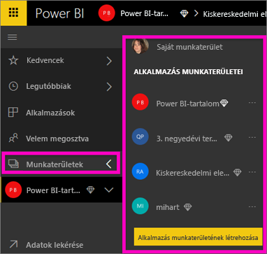
2. A bal oldali navigációs ablaktábla alján válassza **adatok**.
   
   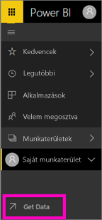
3. Válassza a **Fájlok** lehetőséget, majd navigáljon arra a helyre, ahova a Kiskereskedelmi elemzési mintát mentette.
   
    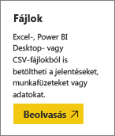
4. Ehhez a gyakorlathoz válassza az **Importálás** lehetőséget.
   
   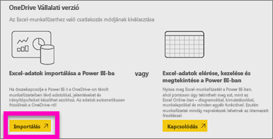
5. Ha megtörtént az adatkészlet importálása, válassza az **Adatkészlet megtekintése** lehetőséget.
   
   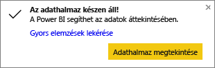
6. Ha megtekint egy adatkészletet, azzal tulajdonképpen a jelentésszerkesztőt nyitja meg.  Egy üres vásznat fog látni, és a jelentések készítéséhez szükséges eszközöket.
   
   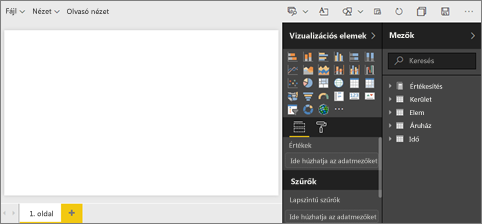

> [!TIP]
> Ha ismeri a Jelentésszerkesztő vásznat, vagy felfrissíteni ismereteit, [a Jelentésszerkesztő bemutatása](service-the-report-editor-take-a-tour.md) a folytatás előtt. > 
> 

## Mérőműszer felvétele jelentésbe
Most hogy már importáltuk az adatkészletünket, kezdjük el megválaszolni a kérdéseket.  A marketingigazgató tudni szeretné, hogy mennyire állunk közel ahhoz, hogy elérjük az idei év értékesítési célkitűzéseit. A mérőműszer [vizualizáció egy jó választás](visuals/power-bi-report-visualizations.md), ha ilyen típusú adatokat szeretnénk megjeleníteni.

1. A Mezők ablaktáblán válassza a **Sales** > **This Year Sales** > **Érték** elemet.
   
    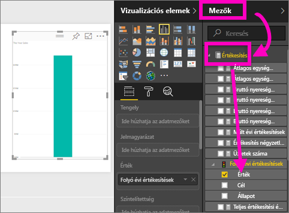
2. Konvertálja a vizualizációt mérőműszerré. Ehhez válassza a **Vizualizációk** ablaktáblán a Mérőműszer  sablont.
   
    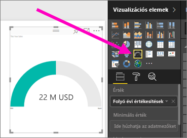
3. Húzza a **Sales** > **This Year Sales** > **Cél** elemet a **Célérték** gyűjtőbe. Úgy látszik, nagyon közel vagyunk a célkitűzésünk eléréséhez.
   
    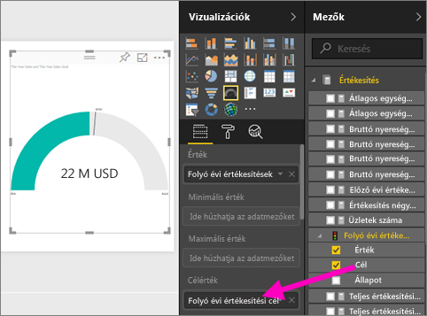
4. Most már lehet egy időben, a jelentés mentéséhez.
   
   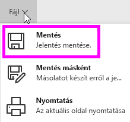

## Területdiagram és szeletelő felvétele a jelentésbe
Meg kell válaszolnunk a marketingigazgató újabb kérdéseit. Szeretné tudni, hogy milyenek az idei év értékesítési mutatói a tavalyi évhez képest. És ezt az egyes körzetekre lebontva szeretné látni.

1. Először is csináljunk egy kis helyet a vásznunkon. Válassza ki a Mérőműszert és helyezze a jobb felső sarokba. Ezután fogja meg az egyik sarkát és kicsinyítse le.
2. Szüntesse meg a mérőműszer kijelölt állapotát. A Mezők ablaktáblán válassza a **Sales** > **This Year Sales** > **Érték**, majd a **Sales** > **Last Year Sales** elemeket.
   
    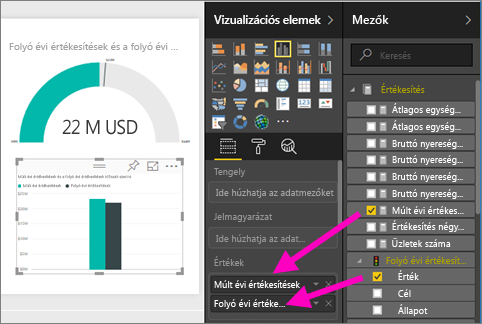
3. Konvertálja a vizualizációt területdiagrammá. Ehhez válassza a **Vizualizációk** ablaktáblán a Területdiagram  sablont.
4. Adja hozzá a **Time** > **Period** elemet a **Tengely** gyűjtőhöz.
   
    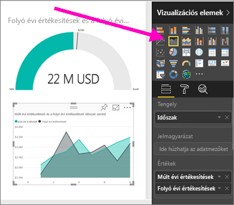
5. A vizualizáció időszakok szerinti rendezéséhez válassza a három pontot (...), majd a **Rendezés szempontja: Időszak** lehetőséget.
6. És most vegyük fel a szeletelőt. Válassza ki a vászon egy üres területét, majd a Szeletelő  sablont. A vászon egy üres szeletelő most már van.
   
        
7. A Mezők ablaktáblán válassza a **District** > **District** elemet. Helyezze át és méretezze át a szeletelőt.
   
    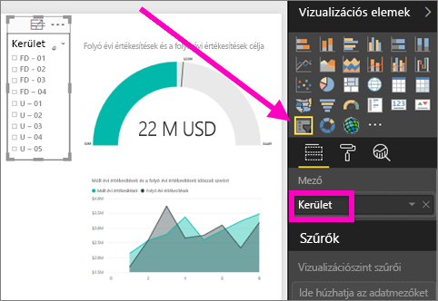  
8. A szeletelő használatával mintákat és összefüggéseket kereshet az egyes körzetek szerint.
   
     

Az adatokat tovább vizsgálhatja, és vizualizációkat is adhat hozzá. Ha különösen érdekes információt talál, azt [rögzítheti egy irányítópultra](service-dashboard-pin-tile-from-report.md).

## Következő lépések

* Tudnivalók arról, hogyan történik a [vizualizációk rögzítése egy irányítópulton](service-dashboard-pin-tile-from-report.md)   
* További kérdései vannak? [Kérdezze meg a Power BI közösségét](http://community.powerbi.com/)

