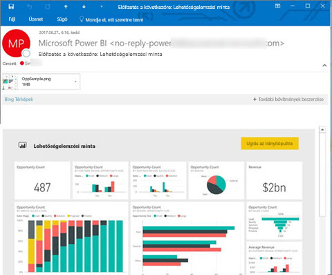
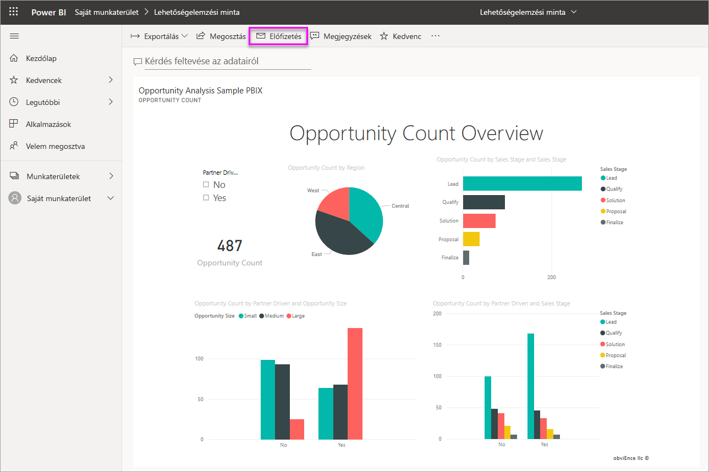
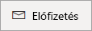
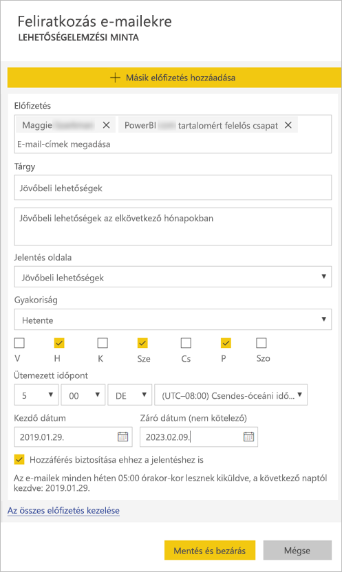
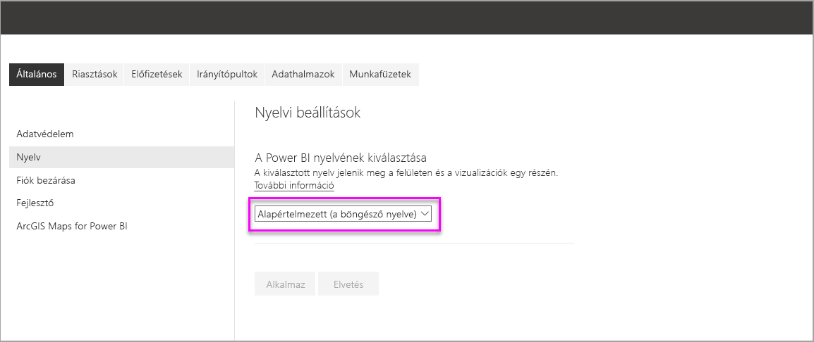
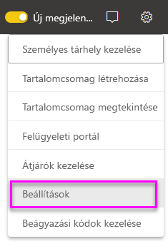
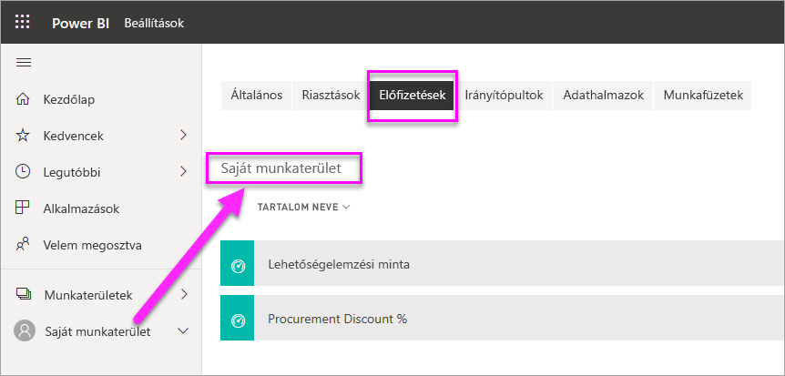

# Feliratkozás és mások feliratkoztatása jelentésekre és irányítópultokra a Power BI szolgáltatásban

Feliratkoztathatja önmagát és munkatársait a legfontosabbnak ítélt jelentésoldalakra, irányítópultokra és lapszámozott jelentésekre. A Power BI e-mailben küld pillanatképeket. Megadhatja a Power BI-nak, hogy milyen gyakran szeretne ilyen e-mailt kapni: naponta, hetente vagy naponta egyszer, az adatok első frissítése után.  Napi vagy heti gyakoriság esetén megadhatja a feliratkozás futásának időpontját.  Egy napra legfeljebb 24 különböző feliratkozást állíthat be az összes jelentésoldalhoz és irányítópulthoz.

 

Feliratkozásokat csak a Power BI szolgáltatásban hozhat létre. E-mailt kap a jelentésoldal vagy irányítópult pillanatképével és a jelentést vagy irányítópultot megnyitó hivatkozással. Olyan mobileszközökön, melyeken telepítve van a Power BI alkalmazás, a hivatkozás választásakor a Power BI alkalmazás indul el a jelentésnek vagy az irányítópultnak a Power BI webhelyén való megnyitása helyett.

## Követelmények

Feliratkozás a következőképp **hozható létre**:

- Power BI Pro-licenccel rendelkező felhasználók által
- A Premium-munkaterületeken vagy -alkalmazásokban található tartalmat megtekintő felhasználók is feliratkozhatnak a tartalomra, akár Power BI Pro-licenc nélkül is.

A tartalomra (irányítópultra vagy jelentésre) nem kell szerkesztési jogosultsággal rendelkeznie ahhoz, hogy önmagának hozzon létre feliratkozást, másnak viszont csak akkor tud létrehozni egyet, ha szerkesztési jogosultsággal rendelkezik. 

## Feliratkozás irányítópultra, jelentésoldalra vagy lapszámozott jelentésre

Függetlenül attól, hogy irányítópultra, jelentésre vagy lapszámozott jelentésre iratkozik fel, a folyamat hasonló. Ugyanazzal a gombbal iratkozhat fel a Power BI szolgáltatás irányítópultjaira és jelentéseire.

A lapszámozott jelentésekre való feliratkozás egy kissé eltér ettől. A részletekről a [Feliratkozás és mások feliratkoztatása egy lapszámozott jelentésre a Power BI szolgáltatásban](paginated-reports-subscriptions.md) című cikkből tájékozódhat.
 
.

1. Nyissa meg az irányítópultot vagy a jelentést.
2. A felső menüsávon válassza a **Feliratkozás** lehetőséget vagy a boríték ikont .
   
   

3. A feliratkozást a sárga csúszkával kapcsolhatja be és ki.  A csúszkával történő **kikapcsolás** nem törli a feliratkozást. A feliratkozás törléséhez válassza a kuka ikont.

4. E-mail-címe már szerepel a **Feliratkozás** mezőben. A feliratkozáshoz is megadhat egy további e-mail-címet, de csak azonos tartományban. Ha a jelentést és az irányítópultot [prémium szintű kapacitásban](service-premium-what-is.md) üzemelteti, akkor más egyéni e-mail-címeket és csoportos aliasokat is felírathat. Ha a jelentést és az irányítópultot nem prémium szintű kapacitásban üzemelteti, akkor is feliratkoztathat másokat, de nekik is Power BI Pro-licenccel kell rendelkezniük. További részleteket az alábbi, [Megfontolandó szempontok és hibaelhárítás](#considerations-and-troubleshooting) című részben olvashat. 

5. Töltse ki az e-mail **Tárgy7** és **Üzenet** adatait. 

5. Válasszon **Gyakoriságot** feliratkozásához: **Napi**, **Óránkénti**, **Heti**, vagy **Adatfrissítések utáni (Napi)** .  Ha az e-mailt, amelyre feliratkozott, csak bizonyos napokon szeretné megkapni, válassza az **Óránkénti** vagy **Heti** értéket, majd jelölje ki a napokat.  Ha például az e-mailt csak hétköznapokon szeretné megkapni, válassza a **Heti** gyakoriságot, majd távolítsa el a jelölést a **szombat** és a **vasárnap** jelölőnégyzetéből.  

6. Ha **Napi** vagy **Heti** gyakoriságot választ, akkor **Ütemezett időpontot** is megadhat a feliratkozáshoz.  Futtathatja egész órakor, vagy 15, 30, 45 perccel az után.  Választhat délelőtti (AM) vagy délutáni (PM) időpontot. Az időzónát is megadhatja.  Ha az **Óránkénti** beállítást választotta, válassza ki az **Ütemezett időpontot**, amikorra a feliratkozás indítását szeretné beállítani, és azt követően óránként érkezik majd.

7. A feliratkozás kezdő dátuma alapértelmezés szerint az a nap, amelyen létrehozta. Lehetősége van a záró dátum beállítására. Ha nem állít be záró dátumot, az automatikusan az egy évvel a kezdő dátum utáni napra lesz beállítva. Ezt a feliratkozás lejárta előtt bármikor módosíthatja bármely jövőbeli dátumra (a 9999-es évig). Amikor egy feliratkozás záró dátuma elérkezik, a küldés leáll, amíg újra nem engedélyezi. Az ütemezett záró dátum előtt értesítés(eke)t kap, amelyek rákérdeznek a kiterjesztésére.    

    Figyelje meg az alábbi képernyőfelvételen, hogy amikor feliratkozik egy jelentésre, akkor valójában egy jelentés*oldalra* iratkozik fel.  Ha egy jelentésben több oldalra is fel szeretne iratkozni, válassza a **Másik előfizetés hozzáadása** lehetőséget, és válasszon ki egy másik oldalt. 
      
     

7. Válassza a **Mentés és bezárás** lehetőséget. A feliratkozott személyek a választott gyakorisággal és időpontban e-mailt kapnak, és az irányítópult vagy jelentésoldal pillanatképét. Összesen legfeljebb 24 feliratkozást hozhat létre egy jelentéshez vagy irányítópulthoz, és mindegyikhez egyedi címzetteket, időpontokat és gyakoriságokat adhat meg.  Minden olyan, irányítópultra vagy jelentésre való feliratkozás, amelynek gyakorisága **Adatfrissítések utáni**, csak az első ütemezett frissítés után küld e-mailt.   
      
   > [!TIP]
   > Szeretné azonnal elküldeni az előfizetésből az e-mailt, vagy igény szerint küldeni azt bármely időpontban? Válassza ki a **Futtatás most** lehetőséget az előfizetésekhez a küldeni kívánt irányítópulthoz vagy jelentéshez. Megjelenik egy értesítés arról, hogy az e-mail úton van mindenkihez az adott előfizetésben.  Ezt tetszés szerinti gyakorisággal megteheti. Ez nem számít bele az jelentésenkénti vagy irányítópultonkénti napi 24 ütemezett előfizetés-futtatási korlátba. Ez NEM vált ki adatfrissítést a mögöttes adathalmazban. 
   > 
   > 
   
## E-mail-nyelvek

Az e-mail és a pillanatkép a Power BI beállításaiban szereplő nyelvet használja (lásd [A Power BI által támogatott nyelvek és országok/régiók](supported-languages-countries-regions.md) témakört). Ha nincs megadva nyelv, a Power BI a böngésző területi beállításait használja. A nyelvi beállításokat megtekintheti vagy módosíthatja a fogaskerék ikon  > **Beállítások > Általános > Nyelv** lehetőség választásával. 

## Feliratkozások kezelése
Csak az a személy kezelheti a feliratkozást, aki létrehozta.  A feliratkozások kezelésére szolgáló képernyő két úton érhető el.  Az első **Az összes előfizetés kezelése** lehetőség választása a **Feliratkozás e-mailekre** párbeszédpanelen (lásd a fenti 4. lépés alatti képernyőképet). A második a Power BI a felső menüsávon lévő fogaskerék ikonjának , majd a **Beállítások** lehetőség választása.

Hogy mely feliratkozások jelennek meg, az attól függ, hogy éppen melyik munkaterület aktív.  Ha az összes munkaterülethez tartozó feliratkozásokat szeretné megjeleníteni, győződjön meg arról, hogy a **Saját munkaterület** aktív. A munkaterületek működéséről a [Munkaterületek a Power BI-ban](service-create-workspaces.md) című cikkben olvashat bővebben.

A feliratkozás megszűnik, ha lejár a Pro-licence, ha az irányítópultot vagy jelentést törli a tulajdonosa, vagy ha törlik a feliratkozás létrehozásához használt felhasználói fiókot.

## Megfontolandó szempontok és hibaelhárítás

* Előfordulhat, hogy a felhasználóknak küldött előfizetési e-mailekben a több mint 25 kitűzött csempével vagy négy kitűzött élő jelentésoldallal rendelkező irányítópultok nem jelennek meg teljes egészében.  Az ennél több csempét tartalmazó irányítópultokra való feliratkozás nincs blokkolva. Ha azonban problémát tapasztal, nem támogatottnak minősülnek. Ajánlott ezeket úgy módosítani, hogy a támogatott tartományba essenek.
* Ritkán előfordulhat, hogy az e-mail-feliratkozások kézbesítése 15 percnél többet is igénybe vesz. Ilyen esetben a megfelelő kézbesítési idő érdekében ajánlott más időpontokban futtatni az adatfrissítést és az e-mail-feliratkozását. Ha a probléma továbbra is fennáll, forduljon a Power BI-ügyfélszolgálathoz.
* Az irányítópultok e-mail-feliratkozásai esetén, ha bármely csempe sorszintű biztonsággal (RLS) rendelkezik, ezek a csempék nem jelennek meg.  
* A jelentésekhez kapcsolódó e-mail-feliratkozások esetén, ha az adatkészlet sorszintű biztonságot használ, nem hozhat létre feliratkozást saját magának. Olyan jelentésre, amelyen sorszintű biztonság (RLS) van érvényben, csak akkor iratkoztathat fel másokat, ha többoldalas jelentést használ, amely lehetővé teszi, hogy a feliratkozást a biztonsági környezet használatával küldje el másoknak. 
* A jelentésoldalakra való feliratkozás a jelentésoldal nevéhez kapcsolódik. Ha feliratkozik egy jelentésoldalra, majd átnevezi azt, akkor újra létre kell hoznia a feliratkozást.
* Előfordulhat, hogy a szervezet konfigurált néhány beállítást az Azure Active Directory-ban, amelyek korlátozhatják a Power BI-ban az e-mail-előfizetések használatát.  A korlátozások körébe a teljesség igénye nélkül beletartoznak az erőforrások elérésekor a többtényezős hitelesítés és az IP-címtartomány korlátozásai.
* Másoknak az élő kapcsolatot használó jelentésekre/irányítópultokra való e-mail-feliratkoztatása jelenleg csak akkor támogatott, ha többoldalas jelentést használ, amely lehetővé teszi, hogy a feliratkozást a biztonsági környezet használatával küldje el másoknak. 
* Az e-mailekre való feliratkozások az [egyéni vizualizációk](power-bi-custom-visuals.md) többségét nem támogatják.  Az egyetlen kivétel a [minősített](power-bi-custom-visuals-certified.md) egyéni vizualizációk esete.  
* Az e-mailekre való feliratkozások jelenleg nem támogatják az R-alapú egyéni vizualizációkat.  
* Az e-mail-értesítések a jelentés szűrőinek és szeletelőinek alapértelmezett állapotait alkalmazva lesznek elküldve. Az alapértelmezéseknek a feliratkozás után végzett módosításai nem jelennek meg az e-mailben.  A többoldalas jelentések viszont támogatják ezt a képességet, és lehetővé teszik a specifikus paraméterértékek feliratkozásonkénti beállítását.   
* Kifejezetten az irányítópultokra való feliratkozások esetében bizonyos csempetípusok még nem támogatottak.  Ilyenek többek között a streamelési csempék, a videócsempék és az egyéni webes tartalomcsempék.     
* Ha a bérlőn kívüli munkatársával oszt meg egy irányítópultot, akkor ezen munkatársa számára nem tud feliratkozást is létrehozni. Ha tehát Ön aaron@xyz.com, akkor megoszthat irányítópultot a(z) anyone@ABC.com címmel, de nem hozhat létre feliratkozást anyone@ABC.com részére, és ő sem iratkozhat fel megosztott tartalomra.      
* A Power BI automatikusan felfüggeszti a több mint két hónapja nem látogatott irányítópultokhoz vagy jelentésekhez társított adathalmazok frissítését.  Ha azonban feliratkozik egy irányítópultra vagy jelentésre, az nem szünetel akkor sem, ha nem látogatják.    
* Ha nem kapja meg az e-mail-értesítéseket, akkor ellenőrizze, hogy tud-e e-maileket fogadni az egyszerű felhasználónevével (UPN). [A Power BI csapata dolgozik ennek a követelménynek az enyhítésén](https://community.powerbi.com/t5/Issues/No-Mail-from-Cloud-Service/idc-p/205918#M10163); figyelje az értesítéseket. 
* Ha az irányítópultja vagy jelentése prémium szintű kapacitásban van, akkor használhat csoportos e-mail-aliasokat a feliratkozásokhoz, és nem kell a munkatársai számára e-mail-címenként elvégezni azt. Az aliasok a jelenlegi Active Directoryn alapulnak. 

## Következő lépések

- [Feliratkozás és mások feliratkoztatása egy lapszámozott jelentésre a Power BI szolgáltatásban](paginated-reports-subscriptions.md)
- További kérdései vannak? [Kérdezze a Power BI-közösséget](http://community.powerbi.com/)    
- [Olvassa el a blogbejegyzést](https://powerbi.microsoft.com/blog/introducing-dashboard-email-subscriptions-a-360-degree-view-of-your-business-in-your-inbox-every-day/)
