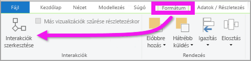
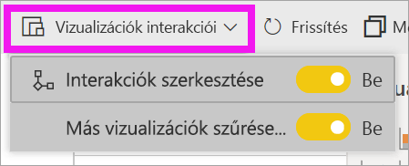
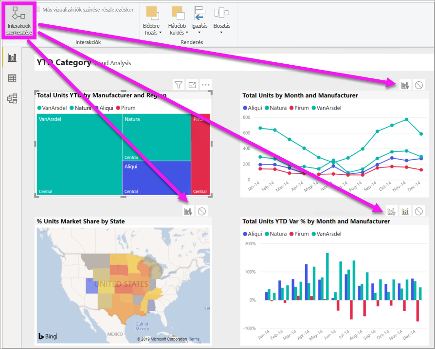
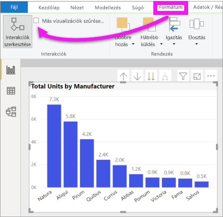

# Vizualizációk Power BI-jelentésen belüli működésének módosítása
Ha rendelkezik szerkesztési engedéllyel a jelentéshez, akkor a **Vizualizáció-interakciókkal** határozhatja meg, hogy a jelentésoldal vizualizációi milyen hatással legyenek egymásra. 

## A vizualizációk működésének bemutatása
Alapértelmezés szerint egy jelentésoldal vizualizációi az oldal további vizualizációinak keresztszűréséhez és keresztkijelöléséhez használhatók.
Például egy állam kijelölése egy térkép vizualizációján kiemeli az oszlopdiagramot, és úgy szűri a vonaldiagramot, hogy az csak az adott államra vonatkozó adatokat jelenítse meg.
Lásd: [Szűrés és kiemelés](power-bi-reports-filters-and-highlighting.md). Ha pedig olyan vizualizációkkal is rendelkezik, amelyek támogatják a [részletes vizsgálatot](consumer/end-user-drill.md), akkor alapbeállítás szerint egy adott vizualizáció részletező elemzése nem lesz hatással a jelentésoldal többi vizualizációjára. Mindkét alapértelmezett viselkedés módosítható azonban, és az interakciók az egyes vizualizációkra vonatkozóan beállíthatóak.

Ez a cikk azt mutatja be, hogyan használhatók a **vizualizáció-interakciók** a Power BI Desktopban. Az eljárás ugyanez a Power BI szolgáltatás [Szerkesztő nézetében](service-interact-with-a-report-in-editing-view.md). Ha csak Olvasási hozzáféréssel rendelkezik, vagy egy jelentés meg van osztva Önnel, a vizualizációk interakcióinak beállítását nem módosíthatja.

A *keresztszűrés* és *keresztkijelölés* kifejezésekkel az itt ismertetett viselkedéseket a **Szűrők** ablaktábla *szűrés* és *kiemelés* funkciójától különböztetjük meg.  

> [!NOTE]
> Ez a videó a Power BI Desktop és a Power BI szolgáltatás régi verzióit használja. 
>
>

<iframe width="560" height="315" src="https://www.youtube.com/embed/N_xYsCbyHPw?list=PL1N57mwBHtN0JFoKSR0n-tBkUJHeMP2cP" frameborder="0" allowfullscreen></iframe>

## A vizualizáció-interakciók vezérlőinek engedélyezése
Ha szerkesztési engedélyekkel rendelkezik egy jelentéshez, bekapcsolhatja a vizualizáció-interakciók vezérlőit, majd testreszabhatja, hogy hogyan szűrik és emelik ki egymást a jelentésoldal vizualizációi. 

1. Aktiváljon egy vizualizációt annak kijelölésével.  
2. Jelenítse meg a **Vizualizáció-interakciók** beállításait.
    

    - A Desktopban válassza a **Formázás > Interakciók** lehetőséget.

        

    - A Power BI szolgáltatásban nyissa meg a jelentést Szerkesztő nézetben, majd válassza a jelentés menüsávjának legördülő listáját.

        

3. Ha meg szeretné jeleníteni a vizualizáció-interakciók vezérlőit, válassza az **Interakciók szerkesztése** lehetőséget. A Power BI a jelentésoldal összes többi vizualizációjához szűrési és kiemelési ikonokat ad hozzá. Most már módosíthatja, hogyan hasson kölcsön a kijelölt vizualizáció a jelentésoldal többi vizualizációjával.
   
    

## Az interakció viselkedésének módosítása
A vizualizációk közötti interakciók megismeréséhez egyesével kijelölheti a vizualizációkat a jelentésoldalon.  Jelöljön ki egy adatpontot, sávot vagy alakzatot, és figyelje meg ennek a többi vizualizációra gyakorolt hatását. Ha a megfigyelt viselkedés nem az, amit Ön szeretne, módosíthatja az interakciókat. Ezek a módosítások mentve lesznek a jelentéssel, így Ön és a jelentés felhasználói a vizualizációk azonos interakcióit tapasztalhatják.

Adja meg, hogy a **kijelölt vizualizáció** milyen hatással legyen a többire.  Ha szeretné, ezt megismételheti a jelentés oldalának minden vizualizációjával.
   
   * Ha keresztszűrést szeretne megadni, kattintson a **szűrő** ikonra .
   * Ha keresztkiemelést szeretne megadni, kattintson a **kiemelés** ikonra .
   * Ha nem szeretne hatást megadni, kattintson a **nincs hatás** ikonra .

## Lefúrásra alkalmas vizualizációk interakcióinak módosítása
[Bizonyos Power BI-vizualizációkon lefúrás végezhető](consumer/end-user-drill.md). Egy vizualizáción végzett lefúrás alapértelmezés szerint nem befolyásolja a jelentésoldalon lévő többi vizualizációt. Ez a viselkedés azonban módosítható. 

1. A lefúrásra alkalmas vizualizáció aktiválásához jelölje ki azt. 

> [!TIP]
> Próbálja ki Ön is az [Emberi erőforrások minta PBIX-fájl](https://download.microsoft.com/download/6/9/5/69503155-05A5-483E-829A-F7B5F3DD5D27/Human%20Resources%20Sample%20PBIX.pbix) használatával. Ebben van egy lefúrást tartalmazó oszlopdiagram az **Újonnan felvett alkalmazottak** lapon.
>

2. A menüsávon válassza a **Formázás** > **A lefúrás szűri a többi vizualizációt** menüpontot.  Ha most egy vizualizációt részletesen elemez, akkor a jelentésoldal többi vizualizációja is változik majd, és tükrözi az aktuális elemzési kiválasztást. 

    .
    
## Következő lépések
[Szűrés és kiemelés Power BI-jelentésekben](power-bi-reports-filters-and-highlighting.md)