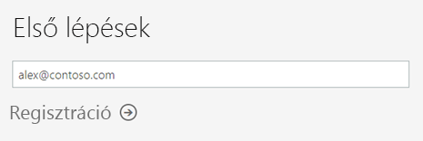
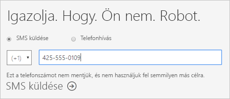
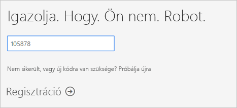
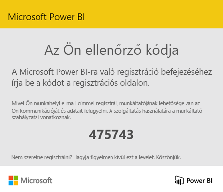
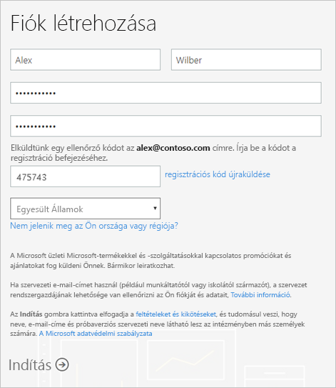
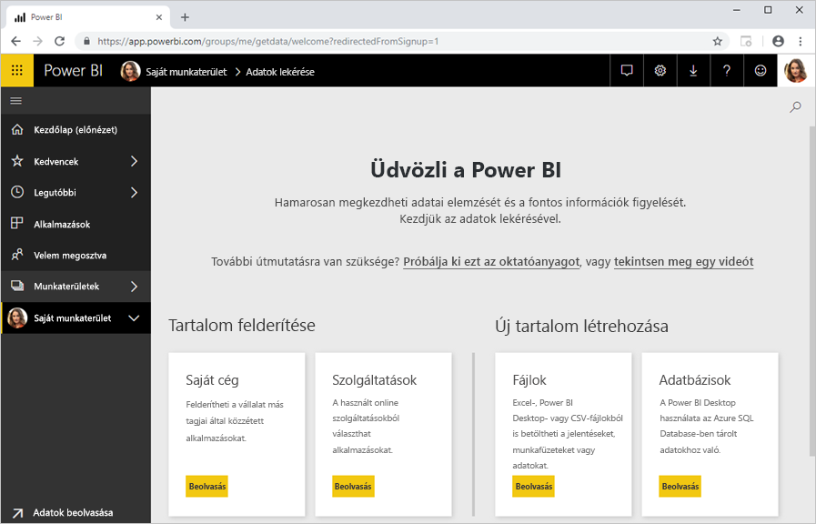

# Egyéni Power BI-regisztráció

A Power BI szolgálhat mind az Ön személyes adatelemzési és vizualizációs eszközeként, mind pedig projektek, részlegek vagy teljes nagyvállalatok analitikai és döntéshozatali motorjaként. Ez a cikk azt mutatja be, hogyan regisztrálhat a Power BI-ra egyéni felhasználóként. Ha Ön Power BI-rendszergazda, tekintse meg a [Szervezeti Power BI-licencelés](service-admin-licensing-organization.md) című cikket.

## Támogatott e-mail-címek

A regisztráció megkezdése előtt fontos, hogy tisztában legyen a Power BI-ban való regisztráláshoz használható e-mail-címek típusaival:

* A Power BI-regisztrációhoz munkahelyi vagy iskolai e-mail-címre van szüksége. A regisztrációhoz nem használhat fogyasztói e-mail-szolgáltatók vagy távközlési szolgáltatók által biztosított e-mail-címeket, így az outlook.com, a hotmail.com, a gmail.com és más szolgáltatók által nyújtott címeket sem.

* Miután regisztrált, [meghívhat vendégfelhasználókat](https://docs.microsoft.com/azure/active-directory/active-directory-b2b-what-is-azure-ad-b2b), hogy bármilyen e-mail-címmel, közöttük személyes fiókokkal is meg lehessen tekinteni a Power BI-ban található tartalmakat.

* A Power BI-regisztrációhoz használhatók .gov vagy .mil végződésű címek, ehhez azonban egy másik folyamatot kell elvégeznie. További információ: [USA-beli kormányzati szerv regisztrálása a Power BI szolgáltatásban](service-govus-signup.md).

## Power BI-fiók regisztrálása

A következő lépésekkel regisztrálhat Power BI-fiókot. A folyamat végrehajtása után egy (ingyenes) Power BI-licenccel fog rendelkezni, amellyel önállóan próbálhatja ki a Power BI-t a Saját munkaterületen, egy Power BI Premium-kapacitáshoz rendelt Power BI-munkaterületen lévő tartalmakat használat fel, vagy egyéni Power BI Pro-próbaverziót kezdeményezhet. További információ: [Power BI-szolgáltatások licenctípus szerint](service-features-license-type.md). 

1. Lépjen a [regisztrációs oldalra](https://signup.microsoft.com/signup?sku=a403ebcc-fae0-4ca2-8c8c-7a907fd6c235).

1. Adja meg az e-mail-címét, majd válassza a **Regisztráció** lehetőséget.

    

1. Ha ehhez hasonló üzenetet kap, válassza az ellenőrzőkód küldésének lehetőséget, majd lépjen a folyamat következő lépésére.

    

    Ha ehhez hasonló üzenetet kap, végezze el a Power BI bejelentkezési és használatba vételi lépéseit.

    

1. Adja meg a kapott kódot, majd válassza a **Regisztráció** lehetőséget.

    

1. Keresse meg az ehhez hasonló üzenetet a bejövő e-mailjei között.

    

1. A következő képernyőn adja meg az adatait és az e-mailben kapott ellenőrzőkódot. Válassza ki a régiót, tekintse át a képernyőről hivatkozott szabályzatokat, majd válassza az **Indítás** lehetőséget.

    

1. Ekkor megnyílik a [Power BI bejelentkezési lapja](https://powerbi.microsoft.com/landing/signin/), és használatba veheti a Power BI-t.

    

## Próbaverzió lejárata

Miután elvégezte a regisztrációs folyamatot, regisztrálhat egy Power BI Pro-próbaverzióra a Power BI szolgáltatásban. Ha a próbaidőszak lejár, a licenc (ingyenes) Power BI-licencre vált vissza. Innentől kezdve nem férhet hozzá a Power BI Pro-licencet igénylő funkciókhoz. További információ: [Funkciók a licenc típusa alapján](service-features-license-type.md).

Ha egy (ingyenes) Power BI-licenc elegendő, nincs más teendője. Ha ki szeretné használni a Power BI Pro funkcióit, forduljon a rendszergazdához egy Power BI Pro-licenc vásárlása érdekében.

## A regisztrációs folyamat hibaelhárítása

A legtöbb esetben az ismertetett folyamat elegendő a Power BI-regisztrációhoz. A következő táblázat ismertet néhányat azon problémák közül, amelyek megakadályozhatják a regisztrációt, a lehetséges megkerülő megoldásokkal együtt.

| Tünet / hibaüzenet | Ok és megkerülő megoldás |
| ----------------------- | -------------------- |
| <strong>Személyes e-mail-címek (példa: nancy@gmail.com)</strong> A regisztráció során a következőhöz hasonló üzenet jelenik meg:    *Személyes e-mail-címet adott meg: Adja meg a munkahelyi vagy az iskolai e-mail-címét a céges adatainak biztonságos tárolása érdekében.*    vagy    *Ez egy személyes e-mail-címnek tűnik. Adja meg a munkahelyi e-mail-címét, így össze tudjuk kapcsolni Önt a cége többi tagjával. Ne aggódjon. A címét nem osztjuk meg senkivel.* | A Power BI nem támogatja a fogyasztói e-mail-szolgáltatók vagy távközlési szolgáltatók által biztosított e-mail-címeket.    A regisztráció befejezéséhez próbálkozzon újra egy Önhöz hozzárendelt munkahelyi vagy iskolai e-mail-címmel.    Ha továbbra sem tud regisztrálni, és hajlandó egy bonyolultabb telepítési folyamatot elvégezni, [regisztráljon egy új Office 365-próbaverziós előfizetésre, és használja az ahhoz megadott e-mail-címet a regisztrációhoz](service-admin-signing-up-for-power-bi-with-a-new-office-365-trial.md).    Emellett [meghívhatja Önt vendégként](service-admin-azure-ad-b2b.md) egy meglévő felhasználó. |
| **Az önkiszolgáló regisztráció le van tiltva**: A regisztráció során ehhez hasonló üzenet jelenik meg:    *Nem tudjuk befejezni a regisztrációt. Az informatikai részleg kikapcsolta a Microsoft Power BI-regisztráció lehetőségét. A regisztráció befejezéséhez forduljon hozzájuk.*    vagy    *Ez egy személyes e-mail-címnek tűnik. Adja meg a munkahelyi e-mail-címét, így össze tudjuk kapcsolni Önt a cége többi tagjával. Ne aggódjon. A címét nem osztjuk meg senkivel.* | A szervezet rendszergazdája letiltotta a Power BI szolgáltatásban való önkiszolgáló regisztrációt.    A regisztráció befejezéséhez kérje a rendszergazdát, hogy [kövesse az utasításokat a regisztráció engedélyezéséhez](service-admin-licensing-organization.md#enable-or-disable-individual-user-sign-up-in-azure-active-directory).    Ez a probléma akkor is felmerülhet, ha egy [partneren keresztül regisztrált az Office 365-be](service-admin-syndication-partner.md). |
| **Az e-mail-cím nem Office 365-azonosító** A regisztráció során ehhez hasonló üzenet jelenik meg:    *Ön nem rendelkezik fiókkal a contoso.com oldalon.  A munkahelyén vagy az iskolában másik azonosítót használ?    Próbáljon meg bejelentkezni azzal, és ha nem jár sikerrel, kérje az informatikai részleg segítségét.* | A szervezet nem az e-mail-címet használja azonosítóként az Office 365-ba és más Microsoft-szolgáltatásokba való bejelentkezéshez.  Előfordulhat például, hogy az e-mail-címe Nancy.Smith@contoso.com, míg az azonosítója nancys@contoso.com.    A regisztráció befejezéséhez használja a szervezettől kapott, az Office 365-be és más Microsoft-szolgáltatásokba való bejelentkezéshez szükséges azonosítóját.  Ha ezt nem tudja, forduljon a rendszergazdához.    Ha továbbra sem tud regisztrálni, és hajlandó egy bonyolultabb telepítési folyamatot elvégezni, [regisztráljon egy új Office 365-próbaverziós előfizetésre, és használja az ahhoz megadott e-mail-címet a regisztrációhoz](service-admin-signing-up-for-power-bi-with-a-new-office-365-trial.md). |

## Következő lépések

[A Power BI Pro megvásárlása](service-admin-purchasing-power-bi-pro.md)  
[A Power BI szolgáltatási szerződése egyéni felhasználók számára](https://powerbi.microsoft.com/terms-of-service/)  

További kérdései vannak? [Kérdezze meg a Power BI közösségét](https://community.powerbi.com/)
