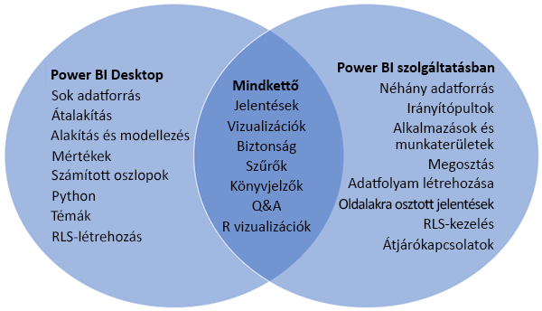
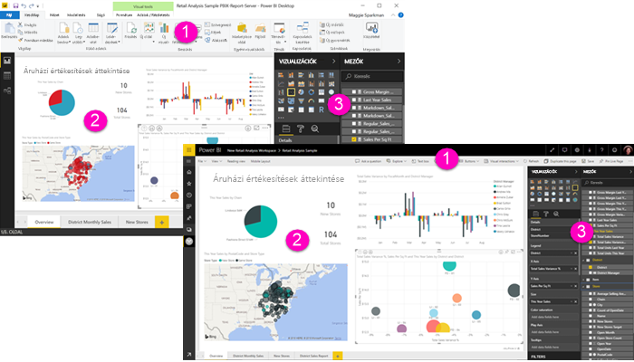

# A Power BI Desktop és a Power BI szolgáltatás összehasonlítása

A Power BI Desktopot és a Power BI szolgáltatást összehasonlító Venn-diagramban a középső terület mutatja a kettő átfedését. Néhány feladatot a Power BI Desktopban vagy a szolgáltatásban is elvégezhet. De a Venn-diagram két oldalán, az alkalmazás és a szolgáltatás egyedi funkciókkal rendelkezik.  

A **Power BI Desktop** egy teljes körű adatelemzési és jelentéskészítő eszköz. Ha telepíti az ingyenes alkalmazást a helyi számítógépre, több különböző adatforráshoz csatlakozhat, és adatmodellé kombinálhatja ezeket (ezt gyakran modellezésnek nevezik). A [Power BI Desktop Első lépések útmutatója](desktop-getting-started.md) végigvezeti a lépéseken.

A **Power BI szolgáltatás** egy felhőalapú, online szolgáltatás egyszerűbb jelentésszerkesztésekhez, valamint a csapatok és vállalatok közötti együttműködéshez. A Power BI szolgáltatásban is csatlakozhat adatforrásokhoz, de a modellezés korlátozott. 

Az üzleti intelligenciát alkalmazó projekteken dolgozó legtöbb jelentéstervező a **Power BI Desktop** használatával hoz létre jelentéseket, amelyeket a **Power BI szolgáltatással** oszt meg másokkal.

## Jelentésszerkesztés

Az alkalmazásban és a szolgáltatásban is létrehozhat és szerkeszthet *jelentéseket*. A jelentés állhat egy vagy több oldalból vizualizációkkal vagy vizualizációk gyűjteményeivel. Felvehet könyvjelzőket, gombokat, szűrőket és részletezést a jelentésekben a navigáció javításához.

A Power BI Desktopban és a szolgáltatásban a jelentésszerkesztők hasonlóak. Három szakaszból állnak:  

1. A felső navigációs sávok eltérőek a Power BI Desktopba és a szolgáltatásban    
2. A jelentésvászon     
3. A **Mezők**, a **Megjelenítések** és a **Szűrők** panel

Ez a videó bemutatja a jelentésszerkesztőt a Power BI Desktopban. 

<iframe width="560" height="315" src="https://www.youtube.com/embed/IkJda4O7oGs" frameborder="0" allowfullscreen></iframe>

## Együttműködés a Power BI szolgáltatásban

Miután létrehozta a jelentéseket, mentheti őket egy *munkaterületre* a **Power BI szolgáltatásban**, ahol együttműködhet a munkatársaival. Ezekhez a jelentésekhez létrehozhat *irányítópultokat*. Majd ezeket az irányítópultokat és jelentések megoszthatja a szervezeten belüli és kívüli jelentésfogyasztókkal. A jelentésfogyasztók a Power BI szolgáltatásban [Olvasó nézetben](consumer/end-user-reading-view.md), tekinthetik meg ezeket, nem Szerkesztési nézetben. Ezek nem férnek hozzá a jelentés létrehozói számára elérhető összes funkciót. 

## Következő lépések

[Mi az a Power BI Desktop?](desktop-what-is-desktop.md)

[Jelentés létrehozása](service-report-create-new.md) a Power BI szolgáltatásban

[Alapfogalmak jelentéstervezőknek](service-basic-concepts.md)

További kérdései vannak? [Kérdezze meg a Power BI közösségét](http://community.powerbi.com/)

