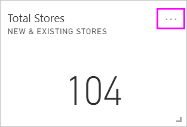
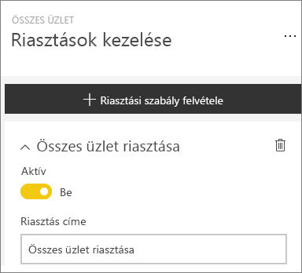
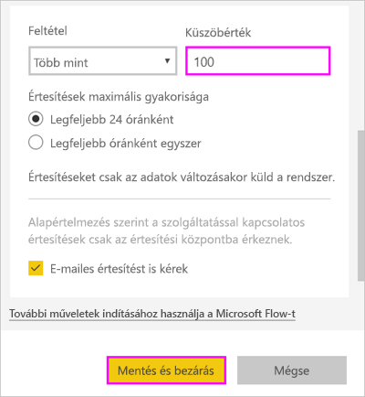
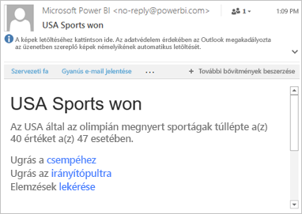
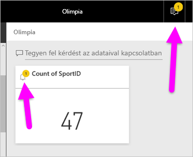
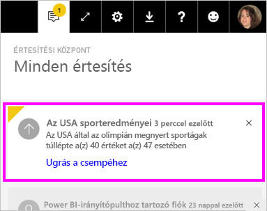
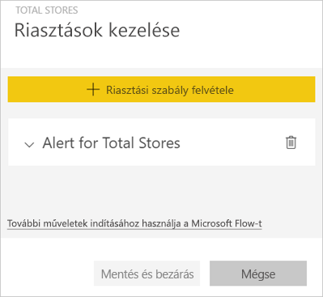
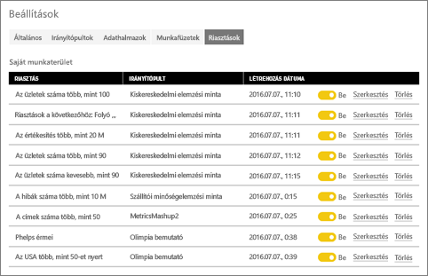

# Adatriasztások a Power BI szolgáltatásban

Riasztásokat állíthat be, amelyek figyelmeztetik, ha az irányítópultjain lévő adatok változásai meghaladják a beállított korlátokat.

Ha Power BI Pro-licenccel rendelkezik, beállíthat riasztásokat csempékhez. Akkor is beállíthat riasztásokat, ha valaki megoszt egy [Premium-kapacitású](service-premium-what-is.md) irányítópultot. Csak a jelentések vizualizációiról rögzített csempéken, és kizárólag mérőműszerekhez, KPI-khez és kártyákhoz állíthatók be riasztások. A riasztások olyan vizualizációkon állíthatók be, amelyeket egy jelentésből egy irányítópulton rögzített streamelési adatkészletekből hozott létre. Nem állíthatók be riasztások a közvetlenül az irányítópulton, a **Csempe hozzáadása** > **Egyéni streamelési adatok** funkcióval létrehozott csempéken.

Mindenki csak a saját riasztásait látja, még az irányítópult megosztása esetén is. Az irányítópult saját nézetén beállított riasztásokat még az irányítópult tulajdonosa sem láthatja. A rendszer teljes mértékben szinkronizálja az adatriasztásokat a platformok között, így [a Power BI mobilalkalmazásokban](consumer/mobile/mobile-set-data-alerts-in-the-mobile-apps.md) és a Power BI szolgáltatásban is beállíthatja és megtekintheti őket. A Power BI Desktopban azonban nem érhetők el. A riasztások automatizálhatók és integrálhatók a Microsoft Flow-val is. Ezt a funkciót kipróbálhatja a [Microsoft Flow-t és a Power BI-t ismertető](service-flow-integration.md) cikkben.

> [!WARNING]
> Az adatalapú riasztások értesítései az adatokkal kapcsolatos információkat tartalmaznak. Ha Power BI-adatait egy mobileszközön követi, és az adott eszközt ellopják, javasoljuk, hogy a Power BI szolgáltatásban tiltsa le az összes adatalapú riasztási szabályt.

## Adatriasztások beállítása a Power BI szolgáltatásban

Tekintse meg, ahogy Amanda riasztásokat ad hozzá egyes csempékhez az irányítópultján. Ezután a videó alatt látható részletes utasításokat követve próbálkozzon meg a feladat elvégzésével.

<iframe width="560" height="315" src="https://www.youtube.com/embed/JbL2-HJ8clE" frameborder="0" allowfullscreen></iframe>

A példában Amanda a Retail Analysis (Kiskereskedelmi elemzés) minta-irányítópultról származó kártyacsempét használ. A leírás követéséhez nyissa meg a [Kiskereskedelmi elemzési mintát](sample-retail-analysis.md#get-the-content-pack-for-this-sample).

1. Kezdje a műveletet egy irányítópulttal. Az **Összes üzlet** csempén válassza a három pontot.

   

1. A harang ikon  kiválasztásával adjon hozzá egy vagy több riasztást a **Összes üzlet** csempéhez.

1. Először válassza a **+ Riasztási szabály hozzáadása** lehetőséget, győződjön meg arról, hogy az **Aktív** csúszka a **Be** állásba van kapcsolva, majd adjon címet a riasztásnak. A címek segítségével könnyebben felismerheti a riasztásokat.

   

1. Görgessen le, és adja meg a riasztás adatait.  Ebben a példában most egy olyan riasztást állít be, amely napi küld értesítést, ha az üzletek száma 100 fölé emelkedik.

   

    A riasztások az **Értesítési központban** jelennek meg. A Power BI e-mailt is küld a riasztásról, ha Ön bejelölte az ennek megfelelő jelölőnégyzetet.

1. Válassza a **Mentés és bezárás** lehetőséget.

## Riasztások fogadása

Ha a követett adatok elérik valamelyik beállított küszöböt, több dolog történik. Először is a Power BI ellenőrzi, hogy eltelt-e már több mint egy óra vagy 24 óra (a választott beállítástól függően) az utolsó riasztás óta. Ha az adat meghaladja a küszöböt, a rendszer riasztást küld.

Ezután a Power BI egy riasztást küld az **Értesítési központba**, valamint választhatóan az e-mail-fiókjába is. Az egyes riasztásokban közvetlen hivatkozás mutat az adatokra. A hivatkozásra megnyitásával megtekintheti a vonatkozó csempét, ahol részletesebb információkat találhat, valamint megoszthatja az információkat.  

* Ha úgy konfigurálta a riasztást, hogy az e-mailben is értesítse, valami ilyesmit talál majd a bejövő levelei közt.

   

* A Power BI egy üzenetet küld az **Értesítési központba**, és egy új riasztás ikont jelenít meg az érintett csempén.

   

* A riasztás részletei az **Értesítési központban** jelennek meg.

    

   > [!NOTE]
   > A riasztások kizárólag a frissített adatokon működnek. Az egyes adatok frissítésekor a Power BI ellenőrzi, hogy az adott adathoz van-e beállítva riasztás. Ha az adatok elérték a riasztási küszöböt, a riasztás aktiválódik a Power BI-ban.

## Riasztások kezelése

A riasztásokat többféle módon is kezelheti:

* Az irányítópult csempéjéről.

* A Power BI Beállítások menüjéből.

* A [Power BI-mobilalkalmazásokban](consumer/mobile/mobile-set-data-alerts-in-the-mobile-apps.md), egy csempén.

### Az irányítópult csempéjéről

1. Ha módosítani vagy törölni szeretné egy adott csempe valamelyik riasztását, nyissa meg újra a **Riasztások kezelése** ablakot a harang ikon  kiválasztásával.

    Az adott csempéhez beállított összes riasztás megjelenik.

    

1. A riasztás módosításához válassza a neve mellett balra található nyilat.

    

1. A riasztás módosításához válassza a neve mellett jobbra található kukát.

      

### A Power BI Beállítások menüjéből

1. Kattintson a fogaskerék ikonra a Power BI menüsorán, majd válassza a **Beállítások** lehetőséget.

    .

1. A **Beállítások** alatt válassza a **Riasztások** elemet.

    

1. Erről a felületről be- és kikapcsolhatja a riasztásokat, megnyithatja a **Riasztások kezelése** ablakot a riasztás módosításához, vagy akár törölheti is a riasztást.

## Megfontolandó szempontok és hibaelhárítás

* A riasztásokat a dátum/idő mértékekkel rendelkező kártyacsempék nem támogatják.
* A riasztások kizárólag numerikus adattípusokkal működnek.
* A riasztások kizárólag a frissített adatokon működnek. Statikus adatokon nem.
* A riasztások a streamelési adatkészleteken csak akkor működnek, ha felépít egy KPI-/kártya-/mérőműszer-jelentési vizualizációt, majd rögzíti az irányítópulton.

## Következő lépések

* [Adatriasztást tartalmazó Microsoft Flow létrehozása](service-flow-integration.md).

* [Adatriasztások beállítása mobileszközökön](consumer/mobile/mobile-set-data-alerts-in-the-mobile-apps.md).

* [Mi az a Power BI?](fundamentals/power-bi-overview.md)

További kérdései vannak? [Kérdezze meg a Power BI közösségét](https://community.powerbi.com/)
