# Power BI-irányítópult és -jelentés megosztása munkatársakkal és másokkal
A *Megosztással* egyszerűen biztosíthatja néhány személy hozzáférését az irányítópultjaihoz és jelentéseihez. A Power BI-ban [többféle módon valósítható meg az irányítópultok és jelentések közös használata és terjesztése](service-how-to-collaborate-distribute-dashboards-reports.md).

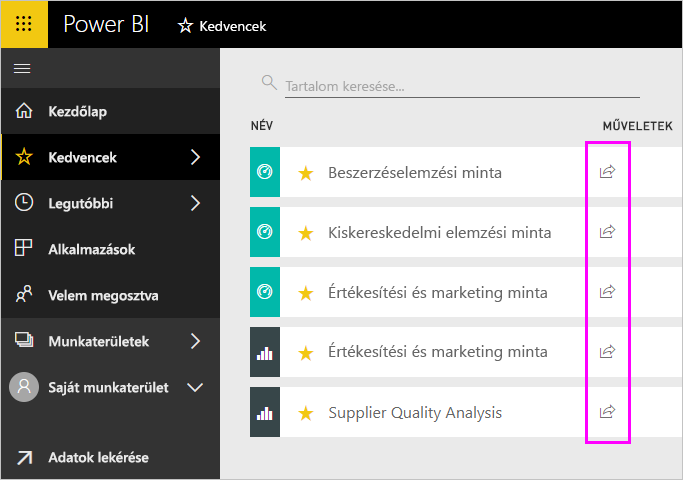

Akár a cégen belül, akár a cégen kívül oszt meg tartalmat, a megosztáshoz [Power BI Pro](service-features-license-type.md)-licencre van szükség. A megosztás címzettjeinek is Power BI Pro-licenc, kivéve, ha a tartalom egy [prémium szintű kapacitás](service-premium-what-is.md). 

Megoszthatja az irányítópultokat és jelentéseket a Power BI szolgáltatás legtöbb helyén elvégezhető: Kedvencek, legutóbbi, a velem megosztva (Ha a tulajdonos engedélyezte a megosztást), a saját munkaterület vagy a többi munkaterületet. A megosztott irányítópultot vagy jelentést a címzettjei megtekinthetik és használhatják, de nem szerkeszthetik. Az irányítópultok és a jelentések adatait ugyanúgy látják, ahogyan Ön is, hacsak nem alkalmaz [sorszintű biztonságot (RLS-t)](service-admin-rls.md). A munkatársai, akikkel megosztotta a tartalmat, továbboszthatják azt másokkal, ha engedélyezi. Az is kívüli személyek is megtekinthetik és az irányítópult vagy jelentés használhatják, de nem oszthatja meg. 

[Irányítópultot megoszthat bármely Power BI mobilalkalmazásból is](consumer/mobile/mobile-share-dashboard-from-the-mobile-apps.md). Azonban nem oszthat meg irányítópultokat a Power BI Desktopból.

## Videó: Irányítópult megosztása
Nézze meg, hogyan osztja meg Amanda az irányítópultját cégen belüli és azon kívüli munkatársaival. Ezután a videó alatt látható részletes utasításokat követve próbálkozzon meg a feladat elvégzésével.

<iframe width="560" height="315" src="https://www.youtube.com/embed/0tUwn8DHo3s?list=PL1N57mwBHtN0JFoKSR0n-tBkUJHeMP2cP" frameborder="0" allowfullscreen></iframe>

## Irányítópult vagy jelentés megosztása

1. Irányítópultok vagy jelentések listájában, vagy megnyitott irányítópulton vagy jelentésben válassza a **Megosztás**  lehetőséget.

2. A felső mezőbe írja be a személyek, terjesztési csoportok vagy biztonsági csoportok teljes e-mail-címét. Dinamikus terjesztési listákkal nem oszthat meg irányítópultot. 
   
   A megosztás címzettjei lehetnek a cégen kívüli címmel rendelkező személyek is, de ilyenkor figyelmeztetés jelenik meg.
   
   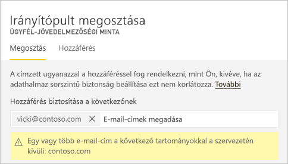 
 
   >[!NOTE]
   >A beviteli mezőbe támogatja, egyszerre legfeljebb 100 felhasználó vagy csoport. Ha megoszthatja a nagyszámú felhasználó van szüksége, fontolja meg, az irányítópult létrehozásakor egy adott munkaterület és [szétosztása egy](service-create-distribute-apps.md).
   > 
   > 

3. Ha kívánja, hozzáfűzhet egy üzenetet. Ez nem kötelező.
4. Ellenőrizze, hogy a munkatársai számára a tartalmak másokkal, **címzettek megoszthatják az irányítópultot (vagy a jelentés)** .
   
   A mások általi megosztás neve *újraosztás*. Akiknek engedélyezi, azok újraoszthatják az irányítópultot a Power BI szolgáltatásból vagy mobilalkalmazásokból, vagy továbbíthatják a meghívó e-mailt a cégen belüli más személyeknek. A meghívó egy hónap után lejár. A cégen kívüli személyek nem tudnak újraosztani. A tartalom tulajdonosaként kikapcsolhatja az újraosztás engedélyezését, és egyedi esetekre lebontva is engedélyezheti az újraosztást. Lásd: [megosztásának megszüntetése vagy mások általi megosztás](#stop-sharing-or-stop-others-from-sharing).

5. Válassza a **Megosztás** lehetőséget.
   
   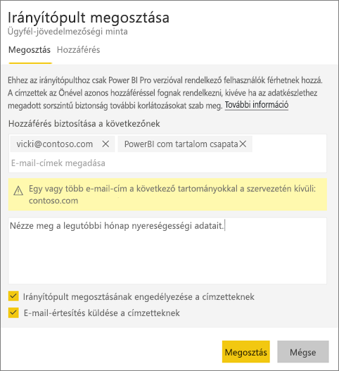  
   
   A Power BI e-mailt küld az egyéni felhasználók számára, de nem csoportok, a megosztott tartalomra mutató hivatkozást. Ilyenkor üzenet jelenik meg a **sikeres** végrehajtásról. 
   
   Amikor egy cégen belüli címzett a hivatkozásra kattint, a Power BI hozzáadja az irányítópultot vagy a jelentést a az ő **Velem megosztva** listázó oldalához. A címzett az Ön nevét kijelölve megtekintheti az összes Ön által vele megosztott tartalmat. 
   
   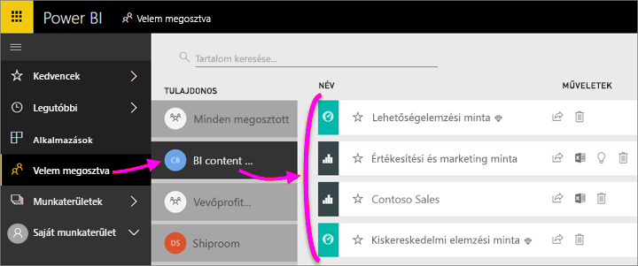
   
   Amikor egy cégen kívüli címzett a hivatkozásra kattint, akkor látni fogja az irányítópultot vagy a jelentést, de nem a szokásos Power BI-portálon. További információkért lásd: [irányítópult vagy jelentés megosztása cégen kívüli személyekkel](#share-a-dashboard-or-report-with-people-outside-your-organization).

## Ki férhet hozzá a megosztott irányítópulthoz vagy jelentéshez?
Néha szeretne látni a személyek, akikkel megosztotta, és tekintse meg, hogy ők kivel osztották azt:

1. Az irányítópultok vagy jelentések listájában vagy magán az irányítópulton vagy jelentésen válassza a **Megosztás** lehetőséget . 
2. Az a **irányítópult megosztása** vagy **jelentés megosztása** párbeszédpanelen jelölje ki **hozzáférés**.
   
    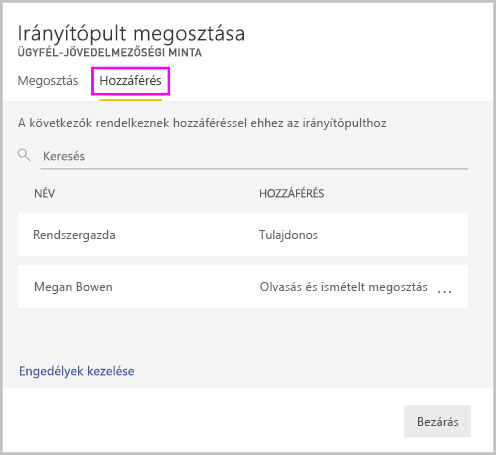

    A cégen kívüli személyek **Vendég** hozzáféréssel jelennek meg.

## Megosztás letiltása vagy mások általi megosztás engedélyezésének megszüntetése
Az újraosztást csak az irányítópult vagy jelentés tulajdonosa kapcsolhatja be és ki.

### Ha még nem küldte el a megosztási meghívót
* Törölje a **címzettek megoszthatják az irányítópultot (vagy a jelentés)** jelölőnégyzetet, mielőtt elküldené a meghívó alján.

### Ha már megosztotta az irányítópultot vagy jelentést
1. Az irányítópultok vagy jelentések listájában vagy magán az irányítópulton vagy jelentésen válassza a **Megosztás** lehetőséget . 
2. Az a **irányítópult megosztása** vagy **jelentés megosztása** párbeszédpanelen jelölje ki **hozzáférés**.
   
    
3. Válassza az **Olvasás és újraosztás** lehetőség melletti három pontot ( **...** ), majd a következőt:
   
   
   
   * **Olvasás**, hogy a címzett ne oszthassa meg az irányítópultot másokkal.
   * **Hozzáférés letiltása**, hogy az adott személy ne is tekinthesse meg a megosztott tartalmat.

4. Az a **hozzáférés eltávolítása** párbeszédpanelen van, ha is el kívánja távolítani, például a jelentések és adatkészletek kapcsolódó tartalmak hozzáférését. Ha egy figyelmeztető ikon rendelkező elemet távolít el , legjobb kapcsolódó tartalmat is eltávolítani, mert a problémamentes megjelenítés érdekében.

    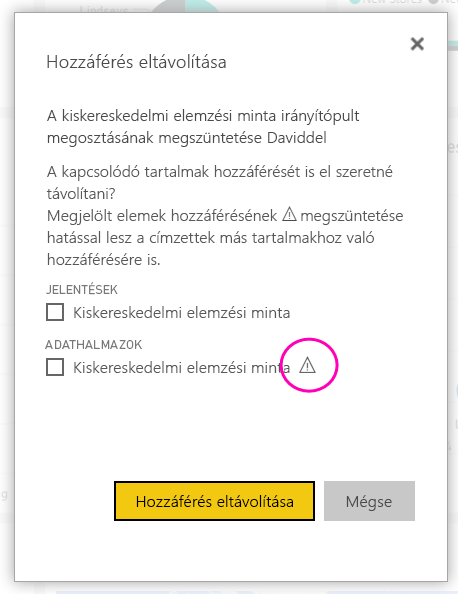

## Irányítópult vagy jelentés megosztása cégen kívüli személyekkel
Ha a szervezeten kívüli személyekkel való megosztása, kapnak egy e-mailt a megosztott irányítópultot vagy jelentést, amely, jelentkezzen be a Power bi-bA megtekintéséhez mutató hivatkozást. Ha nem rendelkeznek Power BI Pro-licenccel, akkor igényelhetnek egyet, miután a hivatkozásra kattintottak.

Bejelentkezés, után megjelenik a megosztott irányítópultot vagy jelentést, a saját böngészőjükben, nem pedig a szokásos Power BI portálon. Később eléréséhez ezt az irányítópultot vagy jelentést, akkor könyvjelzőzze a hivatkozást.

Ennek az irányítópultnak vagy jelentésnek a tartalmát egyáltalán nem módosíthatják. Bár ezek a diagramok használhatnak, és módosítsa a szűrőket vagy a szeletelőket, azokat a változásokat nem menthetik. 

A megosztott irányítópultot vagy jelentést csak a közvetlen címzettek láthatják. Ha az e-mailt például a Vicki@contoso.com címre küldte, akkor az irányítópultot csak Vicki tekintheti meg. Az irányítópultot senki más nem látható, akkor is, ha még a hivatkozás. Vicki ugyanazt az e-mail címet kell használnia hozzá; Ha jelentkezik be más e-mail-címmel rendelkező, ő kell hozzáférni az irányítópulthoz.

A szervezeten kívüli személyek nem jelennek meg adatok, ha a szerepkör - vagy sorszintű biztonság van alkalmazva a helyszíni Analysis Services rendszerbeli táblázatos modellek.

Küldünk egy hivatkozást a Power BI mobilalkalmazásokból személyek a szervezeten kívüli, ha a hivatkozásra kattintva megnyitja az irányítópultot egy böngészőben, nem pedig a a Power BI mobilalkalmazásban.

Ha Ön [külső vendégfelhasználóknak szerkeszthetik és kezelhetik a szervezeten belüli tartalom engedélyezése](service-admin-portal.md#export-and-sharing-settings), az alapértelmezett csak fogyasztás felület nem vonatkozik rájuk. [További információ](service-admin-azure-ad-b2b.md).

## Korlátozások és szempontok
Irányítópultok vagy jelentések megosztásakor vegye figyelembe a következőket:

* Ön és a munkatársai általában ugyanazokat az adatokat látják az irányítópulton vagy jelentésen. Ha tehát Ön több adathoz jogosult hozzáférni mint ők, akkor az irányítópultján vagy jelentésén ők is látni fogják az összes adatát. Ha azonban [sorszintű biztonság (RLS)](service-admin-rls.md) van érvényben egy irányítópult agy jelentés alapjául szolgáló adatkészletben, akkor a hozzáférhető adatok köre az egyes személyek hitelesítő adatai alapján lesz meghatározva.
* Mindenki Ön megosztotta az irányítópultot, megtekintheti és használhatja a kapcsolódó jelentéseket az [olvasó nézetben](consumer/end-user-reading-view.md#reading-view). Nem hozhatnak létre jelentéseket és nem menthetik a meglévő jelentések módosításait.
* Bár senki nem talál, vagy töltse le az adatkészlet, az adatkészlet segítségével közvetlenül az elemzés az Excelben funkció eléréséhez. Egy rendszergazda korlátozhatja az elemzés az Excelben használata egy csoport minden tagja számára lehetővé teszi. A korlátozás azonban a csoport minden tagjára vonatkozik, és minden olyan munkaterületre kiterjed, amelyhez a csoport tartozik.
* Manuálisan mindenki [frissítheti az adatokat](refresh-data.md).
* Ha a levelezéshez az Office 365-öt használja, akkor a megosztás címzettjeként egy terjesztési csoportot is megadhat a csoporthoz tartozó e-mail-cím beírásával.
* Aki az e-mail-tartománya megosztása munkatársakkal és a munkatársai, amelyek tartománya a különböző, de ugyanazon a bérlőn belül regisztrált másokkal is megoszthatják az irányítópultot. Ha például a contoso.com tartomány és a contoso2.com ugyanabban a bérlőben, és az e-mail-címét az regisztrált-e konrads@contoso.com, majd mindkét ravali@contoso.com és gustav@contoso2.com is megoszthatja, mindaddig, amíg meg neki megosztásához engedéllyel.
* Ha munkatársai már hozzáférnek egy adott irányítópult vagy jelentés, a nekik az irányítópultból vagy jelentésből kimásolt is küldhet közvetlen hivatkozást. Példa: `https://powerbi.com/dashboards/g12466b5-a452-4e55-8634-xxxxxxxxxxxx`
* Hasonlóképpen, ha munkatársai már hozzáférnek egy adott irányítópulthoz, akkor [mutató közvetlen hivatkozást küld az alapul szolgáló jelentéshez](service-share-reports.md). 
* Megoszthatja, legfeljebb 100 felhasználók vagy csoportok egy egyetlen megosztás művelet. Egy elemhez azonban több mint 500 felhasználónak adhat hozzáférést. Ehhez többször ossza külön-külön megadja a felhasználókat, vagy egy felhasználói csoportot, amely tartalmazza az összes felhasználó megosztja.

## A megosztás hibaelhárítása

### Az irányítópult címzettjeinek lakat ikon vagy „Engedély szükséges” szöveg jelenik meg a címben

Előfordulhat, hogy a megosztás címzettjeinek lakat ikon vagy „Engedély szükséges” szöveg jelenik meg a címben, amikor meg akarják nézni a jelentést.

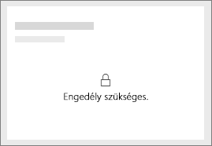

Ha igen, meg kell adnia nekik az alapul szolgáló adatkészlethez engedéllyel:

1. A tartalomlistában nyissa meg az **Adatkészlet** lapot.

1. Kattintson a három pontra ( **...** ) mellett az adatkészletet, majd válassza ki **kezelheti az engedélyeiket**.

    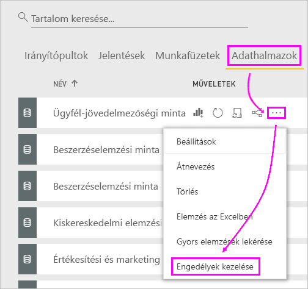

1. Válassza a **Felhasználó hozzáadása** elemet.

    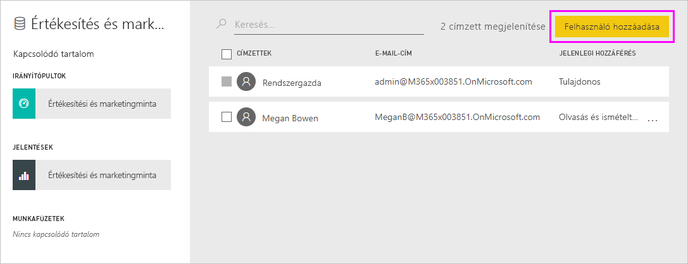

1. Írja be a személyek, terjesztési csoportok vagy biztonsági csoportok teljes e-mail-címét. Dinamikus terjesztési listákkal nem oszthat meg irányítópultot.

    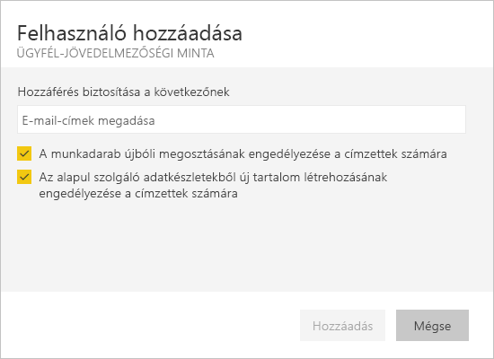

1. Válassza a **Hozzáadás** elemet.

### Nem tudok irányítópultot vagy jelentést megosztani

Irányítópult vagy jelentés megosztásához, újraosztásához szükséges a mögöttes tartalmak; Ez azt jelenti, hogy minden kapcsolódó jelentés és adatkészlet. Ha megjelenik egy üzenet közli, hogy nem oszthat meg, kérje meg a jelentés készítője, hogy ezek a jelentések és adatkészletek engedély újra megoszthatja.

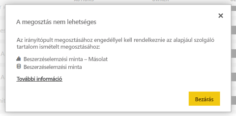

## Következő lépések
* Visszajelzés küldene? Mondja el javaslatait a [Power BI-közösség webhelyén](https://community.powerbi.com/).
* [Irányítópultok és jelentések közös használata és megosztása](service-how-to-collaborate-distribute-dashboards-reports.md)
* [Szűrt Power BI-jelentés megosztása](service-share-reports.md).
* Kérdése van? [Kérdezze meg a Power BI közösségét](http://community.powerbi.com/).

