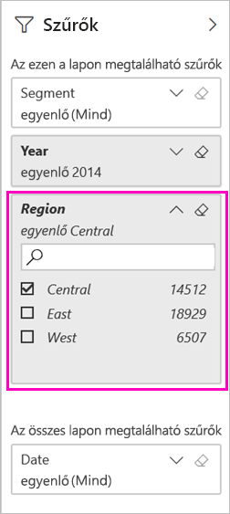
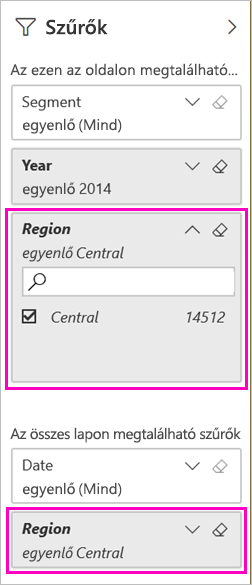

# Két mód egy szűrt Power BI-jelentés megosztására
A *Megosztással* egyszerűen biztosíthatja néhány személy hozzáférését az irányítópultjaihoz és jelentéseihez. Mi történik olyankor, ha egy jelentésnek egy szűrt verzióját szeretné megosztani? Például egy olyan jelentést, amely csak egy adott város, év vagy értékesítő adatait jeleníti meg. Próbáljon meg szűrni egy jelentést, majd ossza meg azt, vagy hozzon létre egyéni URL-címet. A jelentés már szűrve van, amikor a címzettek először megnyitják. Eltávolíthatják a szűrőt az URL-cím módosításával. 

A Power BI-ban [több más módon is megvalósítható a jelentések közös használata és terjesztése](service-how-to-collaborate-distribute-dashboards-reports.md). A megosztáshoz Önnek és az összes címzetteknek is [Power BI Pro-licencre](service-features-license-type.md) van szüksége, vagy pedig a tartalomnak kell egy [Prémium-kapacitásban](service-premium-what-is.md) lennie. 

## Két módszer jelentés szűrésére

Mindkét szűrési technikához az Értékesítési és marketing minta alkalmazássablont használjuk. Szeretné kipróbálni? Ön is telepítheti az [Értékesítési és marketing minta alkalmazássablont](https://appsource.microsoft.com/product/power-bi/microsoft-retail-analysis-sample.salesandmarketingsample?tab=Overview).

### Szűrő beállítása

Nyisson meg egy jelentést [Szerkesztés nézetben](consumer/end-user-reading-view.md), és alkalmazzon egy szűrőt.

Ebben a példában az Értékesítési és marketing minta alkalmazássablon Folyó évi kategória oldalát fogjuk szűrni, hogy csak azokat az értékeket mutassa, ahol a **Régió** értéke **Central** (Középső). 
 

Mentse a jelentést.

### Szűrő létrehozása az URL-címben

Ha a szűrőt a jelentésoldal URL-címének végéhez fűzi hozzá, a viselkedése kissé eltérő. A szűrt oldal ugyanúgy jelenik meg. A Power BI azonban a teljes jelentéshez hozzáadja a szűrőt, és eltávolítja a többi értéket a szűrőpanelről.  

Adja hozzá a jelentésoldal URL-címéhez a következőt:
   
    ?filter=*tablename*/*fieldname* eq *value*
   
A mezőnem szám, dátum és idő vagy sztring típusúnak kell lennie. A *táblanév* vagy *mezőnév* értékei nem tartalmazhatnak szóközt.
   
A példánkban **Geo** (földrajzi hely) a tábla neve, **Region** (Régió) a mező neve, és **Central** (Középső) az érték, amelyre szűrni szeretnénk:
   
    ?filter=Geo/Region eq 'Central'

A böngésző ehhez még hozzáad néhány speciális karaktert a perjelek, szóközök és aposztrófok helyettesítésére, így az eredmény a következőhöz hasonló lesz:
   
    app.powerbi.com/groups/xxxx/reports/xxxx/ReportSection4d00c3887644123e310e?filter=Geo~2FRegion%20eq%20'Central'

Mentse a jelentést.

A [Jelentés szűrése lekérdezésisztring-paraméterek URL-címben való használatával](service-url-filters.md) című cikk ezt sokkal részletesebben ismerteti.

## A szűrt jelentés megosztása

1. Amikor [megosztja a jelentést](service-share-dashboards.md), törölje az **Értesítés küldése a címzetteknek e-mailben** jelölőnégyzetet.

    

4. Küldje el a hivatkozást a korábban létrehozott szűrővel.

## Következő lépések
* [A munka megosztásának módjai a Power BI-ban](service-how-to-collaborate-distribute-dashboards-reports.md)
* [Irányítópult megosztása](service-share-dashboards.md)
* További kérdései vannak? [Kérdezze meg a Power BI közösségét](https://community.powerbi.com/).
* Visszajelzés küldene? Mondja el javaslatait a [Power BI-közösség webhelyén](https://community.powerbi.com/).

