# Sablonalkalmazás létrehozása a Power BI-ban

A Power BI új *sablonalkalmazásai* lehetővé teszik a Power BI-partnerek részére, hogy kevés kódolással vagy anélkül hozzanak létre Power BI-alkalmazásokat, és helyezzék azokat üzembe a Power BI bármely ügyfele számára.  Ez a cikk lépésekre bontott utasításokat tartalmaz Power BI-sablonalkalmazás létrehozásához.

Ha létre tud hozni Power BI-jelentéseket és -irányítópultokat, akkor *sablonalkalmazás-létrehozóvá* válhat, aki elemzési tartalmat hozhat létre és csomagolhat egy *alkalmazásba*. Ezt követően üzembe helyezheti az alkalmazást más Power BI-bérlőkben bármely elérhető platformon, például az AppSource-on keresztül, vagy úgy, hogy a saját webszolgáltatásában használja. Készítőként létrehozhat védett elemzési csomagokat terjesztéshez.

A Power BI bérlői rendszergazdái szabályozzák, hogy a vállalatuknál ki hozhat létre sablonalkalmazásokat, és ki telepítheti azokat. Azok a felhasználók, akik számára ez engedélyezett telepíthetik a sablonalkalmazást, majd módosíthatják és terjeszthetik azt a vállalatuk Power BI-felhasználói számára.

## Előfeltételek

A sablonalkalmazások létrehozásának követelményei az alábbiak:  

- Egy [Power BI Pro-licenc](service-self-service-signup-for-power-bi.md)
- A [Power BI Desktop telepítése](desktop-get-the-desktop.md) (nem kötelező)
- A [Power BI alapvető fogalmainak](service-basic-concepts.md) ismerete
- Sablonalkalmazás nyilvános megosztásához szükséges engedélyek. Részletekért tekintse meg a Power BI [felügyeleti portálján a sablonalkalmazás beállításait](service-admin-portal.md#template-apps-settings).

## A sablon-munkaterület létrehozása

Ha más Power BI-bérlőkbe terjeszthető sablonalkalmazást szeretne létrehozni, akkor azt az egyik új munkaterületen kell létrehoznia.

1. A Power BI szolgáltatásban válassza a **Munkaterületek** > **Munkaterület létrehozása** lehetőséget.

    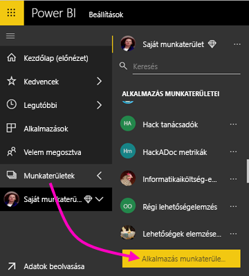

2. Az **Munkaterület létrehozása** területen válassza a **Frissítés az újra** lehetőséget.

    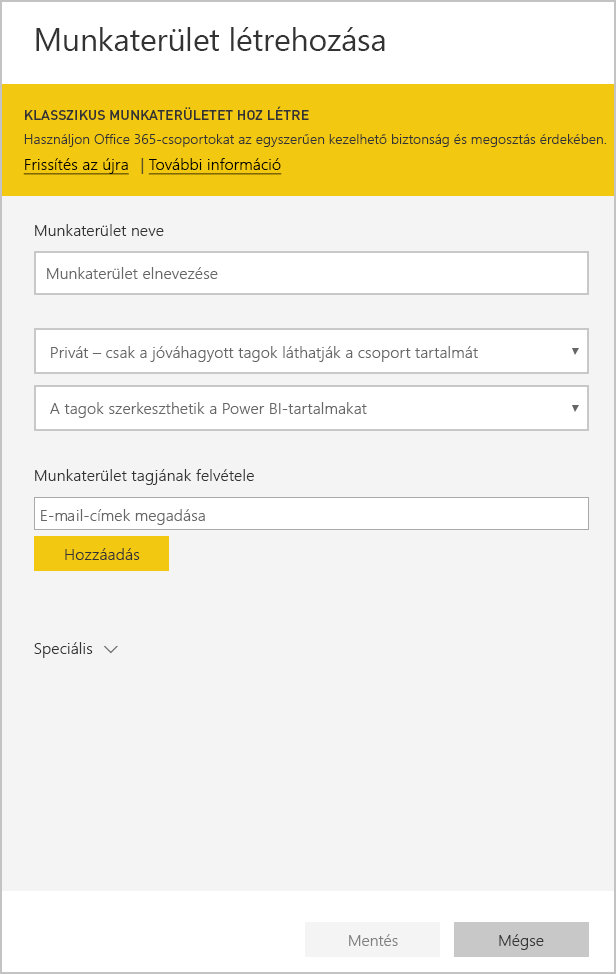

3. Adjon meg egy nevet, leírást (nem kötelező) és egy embléma képét (nem kötelező) a munkaterülethez.

4. Bontsa ki a **Speciális** szakaszt, és válassza a **Sablonalkalmazás kifejlesztése** lehetőséget.

    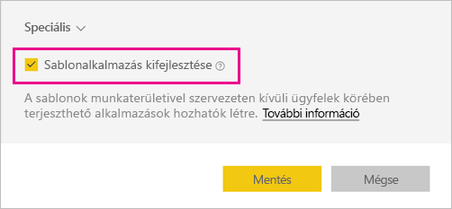

5. Kattintson a **Mentés** gombra.
>[!NOTE]
>A sablonalkalmazások előléptetéséhez engedélyre van szüksége a Power BI rendszergazdájától.

## Tartalom létrehozása a sablonalkalmazásban

Csakúgy, mint a szokásos Power BI-munkaterületeknél, a következő lépés a tartalmak létrehozása a munkaterületen.  

- [Power BI-tartalom létrehozása](power-bi-creator-landing.md) a munkaterületen.

Ha paramétereket használ a Power Queryben, győződjön meg róla, hogy jól meghatározott típussal (például szöveg) rendelkeznek-e. A bármely és a bináris típusok nem támogatottak.

A [Tippek sablonalkalmazások készítéséhez a Power BI-ban](service-template-apps-tips.md) szakasz javaslatokat tartalmaz, amelyeket megfontolhat, amikor jelentéseket és irányítópultokat hoz létre a sablonalkalmazásához.

## Tesztcélú sablonalkalmazás létrehozása

Most, hogy van tartalom a munkaterületen, készen áll, hogy becsomagolja azt egy sablonalkalmazásba. Az első lépés egy tesztcélú sablonalkalmazás létrehozása, amely csak a szervezeten belülről érhető el a bérlőjében.

1. A sablon munkaterületén válassza az **Alkalmazás létrehozása** lehetőséget.

    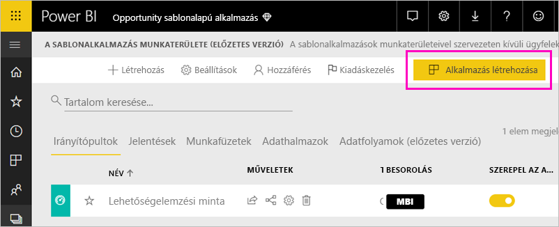

    Itt további buildelési beállításokat adhat meg a sablonalkalmazáshoz öt kategóriában:

    **Védjegyezés**

    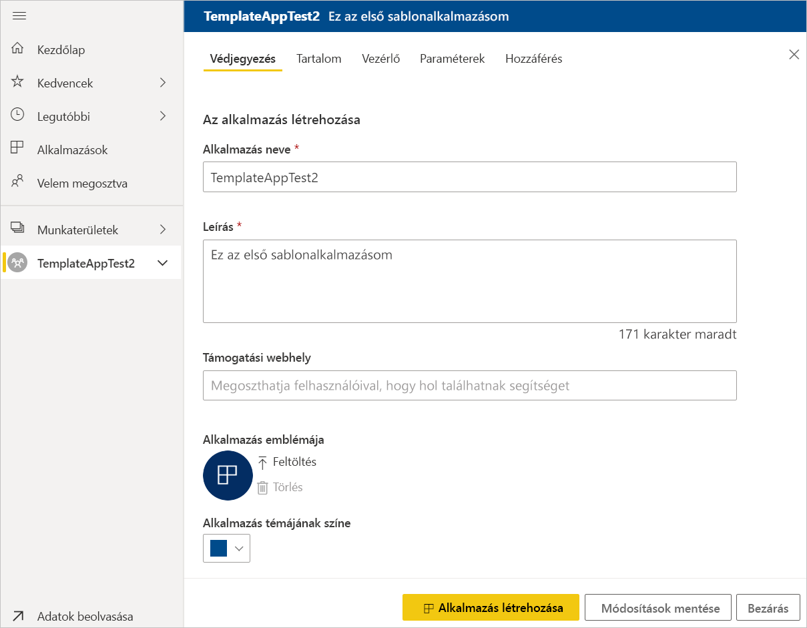
    - Alkalmazás neve
    - Leírás
    - Támogatási webhely (a hivatkozás az alkalmazásadatok alatt, a sablonalkalmazás szervezeti alkalmazásként való újraelosztása után jelenik meg)
    - Alkalmazásembléma (45K fájlméretkorlát, 1:1 oldalarány, .png .jpg .jpeg formátum)
    - Alkalmazás témájának színe

    **Navigáció**

    Aktiválja az **Új navigációszerkesztőt**, amellyel definiálhatja az alkalmazás bal oldali navigációs panelét (további információt a cikk [A navigációs felület megtervezése](service-create-distribute-apps.md#design-the-navigation-experience) című szakaszában találhat).

   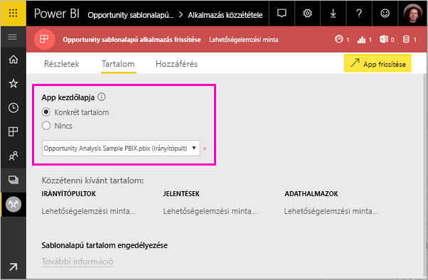
    
    **Alkalmazás kezdőlapja:** Ha úgy dönt, hogy nem használja a navigációs szerkesztőt, lehetősége van az alkalmazás kezdőlapjának kiválasztására. Egy jelentés vagy irányítópult meghatározása, amely az alkalmazás kezdőlapja lesz. Olyan kezdőlapot adjon meg, amely megfelelő benyomást kelt.

    **Vezérlő**

    Beállíthat az alkalmazás felhasználói számára érvényes korlátozásokat az alkalmazás tartalmára vonatkozóan. Ezzel a vezérlővel védelmet biztosíthat az alkalmazásban található szellemi tulajdonokhoz.

    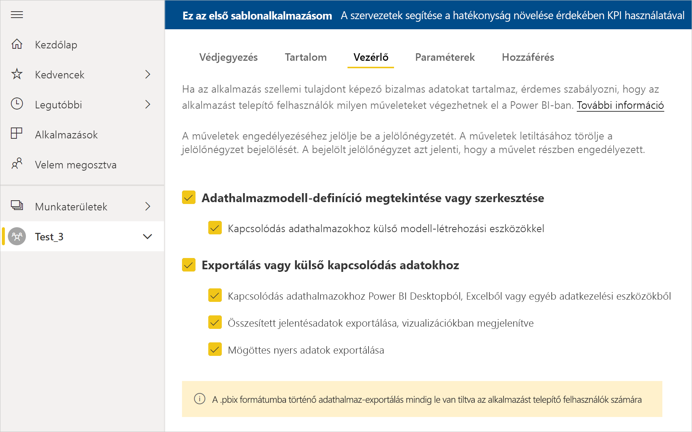

    >[!NOTE]
    >A .pbix formátumba való exportálás mindig le van tiltva az alkalmazást telepítő felhasználók számára.

    **Paraméterek**

    Ezzel a kategóriával kezelhető a paraméterek viselkedése az adatforrásokhoz való csatlakozáskor. További információ a [lekérdezési paraméterek létrehozásáról](https://powerbi.microsoft.com/blog/deep-dive-into-query-parameters-and-power-bi-templates/).

    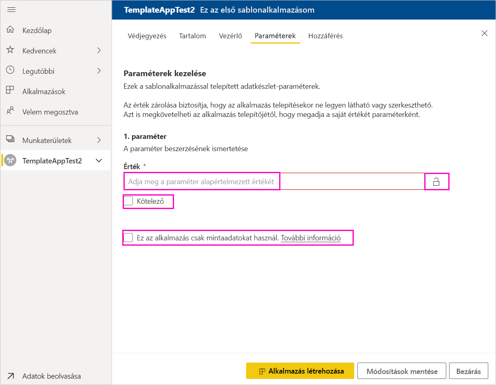
    - **Value** (Érték): az alapértelmezett paraméterérték.
    - **Required** (Kötelező): ezzel megkövetelheti a telepítőtől, hogy egy felhasználóspecifikus paramétert adjon meg.
    - **Lock** (Zárolás): A zárolás megakadályozza, hogy a telepítő frissítsen egy paramétert.

    **Access** (Hozzáférés): A tesztelési fázisban eldöntheti, hogy kik azok a szervezetnél, akik telepíthetik és tesztelhetik az alkalmazását. Ne aggódjon, később is visszatérhet, és megváltoztathatja ezeket a beállításokat (a beállítás nem vonatkozik az elosztott sablonalkalmazáshoz való hozzáférésre).

2. Válassza az **Alkalmazás létrehozása** lehetőséget.

    Egy üzenet foga tájékoztatni a tesztalkalmazás elkészültéről, amely tartalmazni fog egy hivatkozást, amelyet lemásolhat és megoszthat az alkalmazástesztelőkkel.

    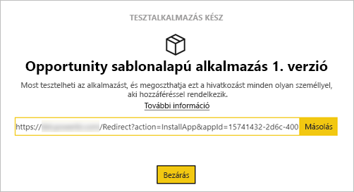

    A soron következő kibocsátáskezelési folyamat első lépését is elvégezte.

## A sablonalkalmazás kiadásának kezelése

Mielőtt nyilvánosan kiadná ezt a sablonalkalmazást szeretne meggyőződni róla, hogy az készen áll a használatra. A Power BI létrehozta a kiadáskezelési panelt, ahol követheti és megfigyelheti a teljes alkalmazáskiadási folyamatot. A szakaszok közötti váltást is elindíthatja. A gyakori szakaszok az alábbiak:

- Tesztalkalmazás készítése: csak a szervezeti teszteléséhez.
- A vizsgálati csomag előléptetése üzem előtti szakaszba: a szervezeten kívüli teszteléséhez.
- Üzem előtti csomag előléptetése üzemi szakaszba: termékverzió.
- Az összes csomag törlése vagy újrakezdés az előző szakasztól.

Az URL-címe nem módosul a kiadási szakaszok között. Az előléptetés nem befolyásolja az URL-címet.

Vegyük sorra a szakaszokat:

1. A sablon munkaterületén válassza a **Kiadáskezelés** lehetőséget.

    

2. Válassza az **Alkalmazás létrehozása** lehetőséget.

    Ha létrehozta a fenti **Tesztcélú sablonalkalmazás létrehozása** lépésben a tesztalkalmazást, akkor a **Tesztelés** mellett már látható egy sárga pont, és itt nem kell az **Alkalmazás létrehozása** lehetőséget választania. Ha kiválasztja, akkor visszatér a sablonalkalmazás létrehozási folyamatához.

3. Válassza a **Hivatkozás beolvasása** lehetőséget.

    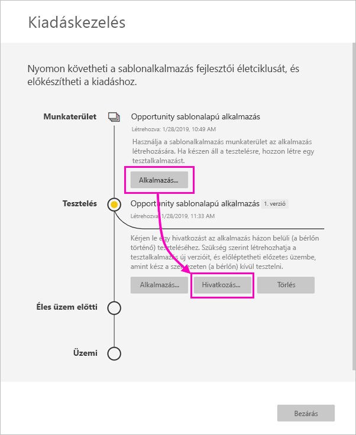

4. Ha tesztelni szeretné az alkalmazás telepítési folyamatát, másolja le az értesítési ablakban lévő hivatkozást, és illessze be egy új böngészőablakba.

    Innentől ugyanazt az eljárást fogja követni, mint amit az ügyfelei is követni fognak. Az ő verziójukat megtekintheti a [Sablonalkalmazások telepítése és terjesztése a szervezetnél](service-template-apps-install-distribute.md) szakaszban.

5. A párbeszédpanelen válassza a **Telepítés** lehetőséget.

    Ha a telepítés sikeres, megjelenik egy értesítés, hogy az új alkalmazás készen áll a használatra.

6. Válassza az **Ugrás az alkalmazásra** lehetőséget.
7. **Az új alkalmazás használatának első lépései** szakaszban ugyanúgy fogja látni az alkalmazását, ahogyan az az ügyfelei számára is meg fog jelenni.

    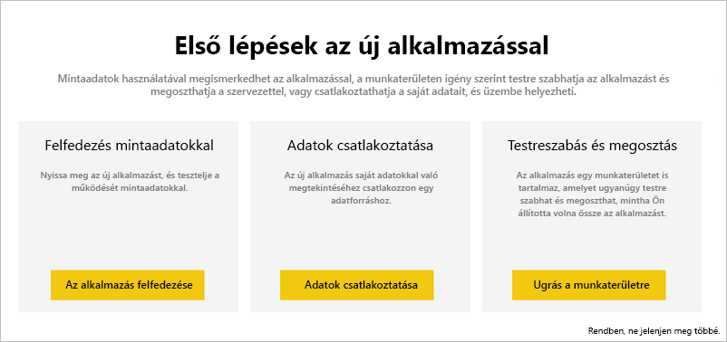
8. Válassza **Az alkalmazás felfedezése** lehetőséget a tesztalkalmazás mintaadatokkal történő ellenőrzéséhez.
9. Ha valamilyen módosítást szeretne végezni, térjen vissza az alkalmazáshoz az eredeti munkaterületen. Frissítse a tesztalkalmazást, amíg elégedett nem lesz az eredménnyel.
10. Ha készen áll az alkalmazás előléptetésére az üzem előtti állapotba a bérlőn kívüli további teszteléshez, térjen vissza a **Kiadáskezelés** panelre, és válassza az **Alkalmazás előléptetése** lehetőséget. 

    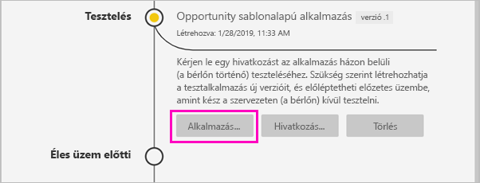
    >[!NOTE]
    > Az alkalmazás előléptetése után az nyilvánosan elérhetővé válik a cégen kívül.

    Ha ez a lehetőség nem jelenik meg, a lépjen kapcsolatba a felügyeleti portálon a Power BI rendszergazdájával, hogy adjon az Ön számára [engedélyeket sablonalkalmazások fejlesztéséhez](service-admin-portal.md#template-apps-settings).
11. A választás megerősítéséhez válassza az **Előléptetés** lehetőséget.
12. Másolja le ezt az új URL-címet, hogy megoszthassa a bérlőn kívül a teszteléshez. Ezt a hivatkozást kell elküldenie az alkalmazás AppSource-ban történő terjesztési folyamatának megkezdéséhez is. Ehhez hozzon létre egy [új Cloud Partner Portal-ajánlatot](https://docs.microsoft.com/azure/marketplace/cloud-partner-portal/power-bi/cpp-publish-offer). A Cloud Partner Portalra csak éles üzem előtti hivatkozásokat küldjön be. A csomagot Power BI-gyártáshoz csak az alkalmazás jóváhagyása és az AppSource-on való sikeres közzététele után léptetheti elő.
13. Ha az alkalmazás készen áll az üzemi használatra vagy az AppSource-on keresztüli megosztásra, térjen vissza a **Kiadáskezelés** panelre, és válassza az **Alkalmazás előléptetése** lehetőséget az **Üzem előtti** elem mellett.
14. A választás megerősítéséhez válassza az **Előléptetés** lehetőséget.

    Az alkalmazás most már üzemi környezetben van, és készen áll a terjesztésre.

    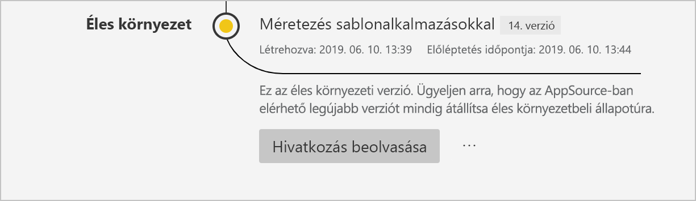

Az alkalmazás világszerte több ezer Power BI-felhasználó számára történő elérhetővé tételéhez javasoljuk, hogy töltse fel az AppSource-ba. Részletekért tekintse át [A Power BI-alkalmazásra vonatkozó ajánlat](https://docs.microsoft.com/azure/marketplace/cloud-partner-portal/power-bi/cpp-power-bi-offer) weblapot.

## Következő lépések

Arról, hogyan használják a sablonalkalmazást az ügyfelek a [Sablonalkalmazások telepítése, testreszabása és terjesztése a szervezetnél](service-template-apps-install-distribute.md) szakaszban olvashat.

Az alkalmazás terjesztését részletesen [A Power BI-alkalmazásra vonatkozó ajánlat](https://docs.microsoft.com/azure/marketplace/cloud-partner-portal/power-bi/cpp-power-bi-offer) weblapon ismerheti meg.
