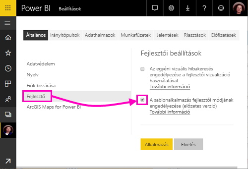
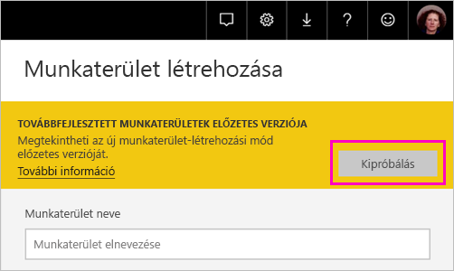
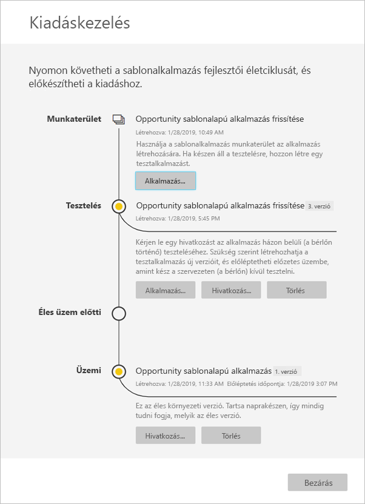

# Sablonalkalmazás létrehozása a Power BI-ban (előzetes verzió)

A Power BI új *sablonalkalmazásai* lehetővé teszik a Power BI-partnerek részére, hogy kevés kódolással vagy anélkül hozzanak létre Power BI-alkalmazásokat, és helyezzék azokat üzembe a Power BI bármely ügyfele számára.  Ez a cikk lépésekre bontott utasításokat tartalmaz Power BI-sablonalkalmazás létrehozásához. 

Ha létre tud hozni Power BI-jelentéseket és -irányítópultokat, akkor *sablonalkalmazás-létrehozóvá* válhat, aki elemzési tartalmat hozhat létre és csomagolhat egy *alkalmazásba*. Ezt követően üzembe helyezheti az alkalmazást más Power BI-bérlőkben bármely elérhető platformon, például az AppSource-on keresztül, vagy úgy, hogy a saját webszolgáltatásában használja. Készítőként létrehozhat védett elemzési csomagokat terjesztéshez. 

A Power BI bérlői rendszergazdái szabályozzák, hogy a vállalatuknál ki hozhat létre sablonalkalmazásokat, és ki telepítheti azokat. Azok, akik számára ez engedélyezett telepíthetik a sablonalkalmazást, majd módosíthatják és terjeszthetik azt a vállalatuk Power BI-felhasználói számára.

## Előfeltételek 

A sablonalkalmazások létrehozásának követelményei az alábbiak:  

- Egy [Power BI Pro-licenc](service-self-service-signup-for-power-bi.md)
- A [Power BI Desktop telepítése](desktop-get-the-desktop.md) (nem kötelező)
- A [Power BI alapvető fogalmainak](service-basic-concepts.md) ismerete
- Sablonalkalmazás létrehozásához szükséges engedélyek. Részletekért tekintse meg a Power BI [felügyeleti portálján a sablonalkalmazás beállításait](service-admin-portal.md#template-apps-settings-preview).

## Alkalmazásfejlesztői mód engedélyezése

Ha más Power BI-bérlőkbe terjeszthető sablonalkalmazást szeretne létrehozni, akkor alkalmazásfejlesztői módba kell lépnie. Máskülönben csak a saját cégében hoz létre alkalmazást a Power BI-felhasználók számára.
 
1. Nyissa meg a Power BI szolgáltatást egy böngészőben.
2. Lépjen a **Beállítások** > **Általános** > **Fejlesztő** > **A sablonalkalmazás fejlesztői módjának engedélyezése** beállításra.

    

    Ha ez a lehetőség nem jelenik meg, a lépjen kapcsolatba a felügyeleti portálon a Power BI rendszergazdájával, hogy adjon az Ön számára [engedélyeket sablonalkalmazások fejlesztéséhez](service-admin-portal.md#template-apps-settings-preview).

3. Kattintson az **Alkalmaz** elemre.

## A sablonalkalmazás munkaterületének létrehozása

Ha más Power BI-bérlőkbe terjeszthető sablonalkalmazást szeretne létrehozni, akkor azt az egyik új alkalmazás-munkaterületen kell létrehoznia. 
 
1. A Power BI szolgáltatásban válassza a **Munkaterületek** > **Alkalmazás munkaterületének létrehozása** lehetőséget. 
 
    

3. Az **Alkalmazás munkaterületének létrehozása** **Továbbfejlesztett munkaterületek – előzetes verzió** alatt válassza a **Kipróbálás** lehetőséget.

    

5. Adjon meg egy nevet, leírást (nem kötelező) és egy embléma képét (nem kötelező) az alkalmazás-munkaterülethez.

4. Válassza a **Sablonalkalmazás kifejlesztése** lehetőséget.

    

5. Kattintson a **Mentés** gombra.

## Tartalom létrehozása a sablonalkalmazásban

Csakúgy, mint a szokásos Power BI-munkaterületeknél, a következő lépés a tartalmak létrehozása a munkaterületen.  A sablonalkalmazásoknak ebben az előzetes verziójában a következő típusok közül csak egy támogatott: egy adathalmaz, egy jelentés és egy irányítópult.

- [Power BI-tartalom létrehozása](power-bi-creator-landing.md) az alkalmazás-munkaterületen.

Ha paramétereket használ a Power Queryben, győződjön meg róla, hogy jól meghatározott típussal (például szöveg) rendelkeznek-e. A bármely és a bináris típusok nem támogatottak. 

A [Tippek sablonalkalmazások készítéséhez a Power BI-ban (előzetes verzió)](service-template-apps-tips.md) szakasz javaslatokat tartalmaz, amelyeket megfontolhat, amikor jelentéseket és irányítópultokat hoz létre a sablonalkalmazásához.

## Tesztcélú sablonalkalmazás létrehozása

Most, hogy van tartalom a munkaterületen, készen áll, hogy becsomagolja azt egy sablonalkalmazásba. Az első lépés egy tesztcélú sablonalkalmazás létrehozása, amely csak a szervezeten belülről érhető el a bérlőjében.

1. A sablonalkalmazás munkaterületén válassza az **Alkalmazás létrehozása** lehetőséget. 

    
 
    Itt további paramétereket adhat meg a sablonalkalmazáshoz négy kategóriában. 

    **Védjegyezés**

    - Alkalmazás neve 
    - Leírás
    - Alkalmazásembléma (nem kötelező)
    - Alkalmazás színe 

    **Tartalom** 

    - Alkalmazás kezdőlapja (nem kötelező): Egy jelentés vagy irányítópult meghatározása, amely az alkalmazás kezdőlapja lesz.  
    
    **Vezérlő** 

    Beállíthat több, az alkalmazás felhasználói számára érvényes korlátozást az alkalmazás tartalmára vonatkozóan. Ezzel a vezérlővel védelmet biztosíthat bizonyos szellemi tulajdonokhoz, amelyeket az alkalmazás tartalmazhat.

    **Hozzáférés**

    - A tesztelési fázisban eldöntheti, hogy kik azok a szervezetnél, akik telepíthetik és tesztelhetik az alkalmazását.

    Ne aggódjon, később is visszatérhet, és megváltoztathatja ezeket a beállításokat.  

2. Válassza az **Alkalmazás létrehozása** lehetőséget. 

    Egy üzenet foga tájékoztatni a tesztalkalmazás elkészültéről, amely tartalmazni fog egy hivatkozást, amelyet lemásolhat és megoszthat az alkalmazástesztelőkkel.

    

    A soron következő kibocsátáskezelési folyamat első lépését is elvégezte.

    

## A sablonalkalmazás kiadásának kezelése

Mielőtt nyilvánosan kiadná ezt a sablonalkalmazást szeretne meggyőződni róla, hogy az készen áll a használatra. A Power BI létrehozta a kiadáskezelési panelt, ahol követheti és megfigyelheti a teljes alkalmazáskiadási folyamatot. A szakaszok közötti váltást is elindíthatja. A gyakori szakaszok az alábbiak: 

- Tesztalkalmazás készítése: csak a szervezeti teszteléséhez. 
- A vizsgálati csomag előléptetése üzem előtti szakaszba: a szervezeten kívüli teszteléséhez.
- Üzem előtti csomag előléptetése üzemi szakaszba: termékverzió. 
- Az összes csomag törlése vagy újrakezdés az előző szakasztól. 

Vegyük sorra a szakaszokat.

1. A sablonalkalmazás munkaterületén válassza a **Kiadáskezelés** lehetőséget.

    

2. Válassza az **Alkalmazás létrehozása** lehetőséget. 

    Ha létrehozta a fenti **Tesztcélú sablonalkalmazás létrehozása** lépésben a tesztalkalmazást, akkor a **Tesztelés** mellett már látható egy sárga pont, és itt nem kell az **Alkalmazás létrehozása** lehetőséget választania. Ha kiválasztja, akkor visszatér a sablonalkalmazás létrehozási folyamatához.
 
3. Válassza a **Hivatkozás beolvasása** lehetőséget.

    
 
9. Ha tesztelni szeretné az alkalmazás telepítési folyamatát, másolja le az értesítési ablakban lévő hivatkozást, és illessze be egy új böngészőablakba. 

    Innentől ugyanazt az eljárást fogja követni, mint amit az ügyfelei is követni fognak. Az ő verziójukat megtekintheti a [Sablonalkalmazások telepítése és terjesztése a szervezetnél](service-template-apps-install-distribute.md) szakaszban.
 
10. A párbeszédpanelen válassza a **Telepítés** lehetőséget.

    Ha a telepítés sikeres, megjelenik egy értesítés, hogy az új alkalmazás készen áll a használatra. 
 
11. Válassza az **Ugrás az alkalmazásra** lehetőséget.
 
12. **Az új alkalmazás használatának első lépései** szakaszban ugyanúgy fogja látni az alkalmazását, ahogyan az az ügyfelei számára is meg fog jelenni. 

    

13. Válassza **Az alkalmazás felfedezése** lehetőséget a tesztalkalmazás mintaadatokkal történő ellenőrzéséhez.

1. Ha valamilyen módosítást szeretne végezni, térjen vissza az alkalmazáshoz az eredeti munkaterületen. Frissítse a tesztalkalmazást, amíg elégedett nem lesz az eredménnyel.

9. Ha készen áll az alkalmazás előléptetésére az üzem előtti állapotba a bérlőn kívüli további teszteléshez, térjen vissza a **Kiadáskezelés** panelre, és válassza a **Tesztelés** mellett az **Alkalmazás előléptetése** lehetőséget.
 
    

11. A választás megerősítéséhez válassza az **Előléptetés** lehetőséget. 

12. Másolja le ezt az új URL-címet, hogy megoszthassa a bérlőn kívül a teszteléshez. Ezt a hivatkozást kell elküldenie az alkalmazás AppSource-ban történő terjesztési folyamatának megkezdéséhez is.

12. Ha az alkalmazás készen áll az üzemi használatra vagy az AppSource-on keresztüli megosztásra, térjen vissza a **Kiadáskezelés** panelre, és válassza az **Alkalmazás előléptetése** lehetőséget az **Üzem előtti** elem mellett.
 
11. A választás megerősítéséhez válassza az **Előléptetés** lehetőséget. 

    Az alkalmazás most már üzemi környezetben van, és készen áll a terjesztésre.

    

Az alkalmazás világszerte több ezer Power BI-felhasználó számára történő elérhetővé tételéhez javasoljuk, hogy töltse fel az AppSource-ba. Részletekért tekintse át [A Power BI-alkalmazásra vonatkozó ajánlat](https://docs.microsoft.com/azure/marketplace/cloud-partner-portal/power-bi/cpp-power-bi-offer) weblapot. 

## Alkalmazás frissítése

Most, hogy az alkalmazása üzemi környezetbe került, újrakezdheti a tesztelési fázist anélkül, hogy az üzemi környezetben lévő alkalmazás működését megzavarná. 

1. A **Kiadáskezelés** panelen válassza az **Alkalmazás létrehozása** lehetőséget.

1. Menjen végig ismét az alkalmazás-létrehozási folyamaton. 
2. Miután megadta a **Védjegyezés**, a **Tartalom**, a **Vezérlő** és a **Hozzáférés** beállításait, válassza ismét az **Alkalmazás létrehozása** lehetőséget.
3. Válassza a **Bezárás** lehetőséget, és térjen vissza **Kiadáskezelés** panelre. 

    Láthatja, hogy most már két verzióval rendelkezik: Egy verzióval üzemi környezetben, valamint egy új tesztelési verzióval. 

    

## Következő lépések

Arról, hogyan használják a sablonalkalmazást az ügyfelek a [Sablonalkalmazások telepítése, testreszabása és terjesztése a szervezetnél](service-template-apps-install-distribute.md) szakaszban olvashat.

Az alkalmazás terjesztését részletesen [A Power BI-alkalmazásra vonatkozó ajánlat](https://docs.microsoft.com/azure/marketplace/cloud-partner-portal/power-bi/cpp-power-bi-offer) weblapon ismerheti meg.

