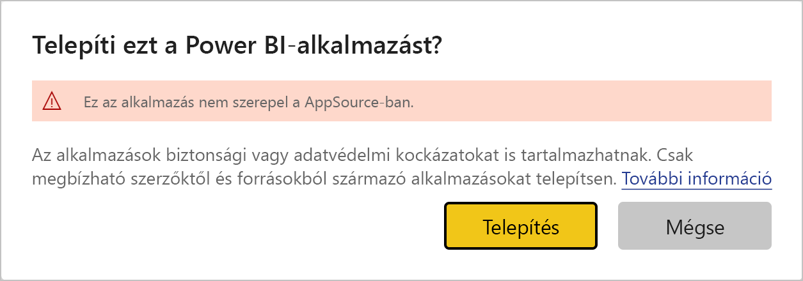

# Sablonalkalmazások telepítése és terjesztése a szervezetnél – Power BI

Ön Power BI-elemző? Ha igen, ebből a cikkből megtudhatja, hogyan telepíthet *sablonalkalmazásokat*, amelyekkel könnyedén kapcsolódhat a vállalkozása működtetéséhez használt olyan szolgáltatásokhoz, mint például a Salesforce, a Microsoft Dynamics és a Google Analytics. Módosíthatja az irányítópultot és a jelentéseket, hogy megfeleljen a szervezet követelményeinek, majd terjesztheti azokat *alkalmazásként* a munkatársainak. 

Ha érdekli, hogyan hozhat létre sablonalkalmazásokat, hogy saját maga terjeszthesse azokat, akkor olvassa el a [Sablonalkalmazás létrehozása a Power BI-ban](service-template-apps-create.md) cikket. A Power BI-partnerek kevés kódolással vagy anélkül hozhatnak létre Power BI-alkalmazásokat, és helyezhetik üzembe azokat bármely Power BI-ügyfél részére. 

## Előfeltételek  

Az alábbiakban a sablonalkalmazások telepítésének, testreszabásának és terjesztésének követelményeit olvashatja: 

- Egy [Power BI Pro-licenc](service-self-service-signup-for-power-bi.md)
- A [Power BI alapvető fogalmainak](service-basic-concepts.md) ismerete
- Érvényes telepítési hivatkozás a sablonalkalmazás létrehozójától vagy az AppSource-ból. 
- Engedélyek sablonalkalmazások telepítéséhez. 

## Sablonalkalmazás telepítése

Kaphat egy sablonalkalmazásra mutató hivatkozást. Ellenkező esetben kereshet az AppSource-ban egy Önt érdeklő sablonalkalmazást. A telepítése után mindkét esetben módosíthatja azt, és terjesztheti a saját cégén belül.

### Keresés az AppSource-ban egy böngészőből

A böngészőben kattintson erre a hivatkozásra az AppSource Power BI-alkalmazásokat megjelenítő szűrővel történő megnyitásához:

- https://appsource.microsoft.com/marketplace/apps?product=power-bi

### Keresés az AppSource-ban a Power BI szolgáltatásból

1. A Power BI szolgáltatás navigációs paneljén válassza az **Alkalmazások** > **Alkalmazások letöltése** lehetőséget.

    

2. Válassza az AppSource-ban az **Alkalmazások** lehetőséget.

    

3. Tallózzon az alkalmazáshoz, vagy keresse meg azt, majd válassza a **Letöltés most** lehetőséget.

4. A párbeszédpanelen válassza a **Telepítés** lehetőséget.

    Ha Power BI Pro-licenccel rendelkezik, az alkalmazás telepítése a társított munkaterülettel együtt történik. Az alkalmazást a társított munkaterületen szabhatja testre.

    Ha a telepítés sikeres, megjelenik egy értesítés, hogy az új alkalmazás készen áll a használatra.
4. Válassza az **Ugrás az alkalmazásra** lehetőséget.
5. **Az új alkalmazás használatának első lépései** szakaszban három lehetőség közül választhat:

    

    - **Az alkalmazás felfedezése**: Alapszintű példa adatfeltárás. Kezdjen itt az alkalmazás működésének megtapasztalásához. 
    - **Adatok csatlakoztatása**: Módosítsa az adatforrást a mintaadatokról a saját adatforrására. Újra meghatározhatja az adatkészlet paramétereit és az adatforráshoz tartozó hitelesítő adatokat. Tekintse át az [Ismert korlátozások](service-template-apps-tips.md#known-limitations) szakaszt a sablonalkalmazásokra vonatkozó tippeket tartalmazó cikkben. 
    - **Ugrás a munkaterületre** (a legspeciálisabb beállítás): az alkalmazás készítője által engedélyezett bármilyen módosítást végrehajthat.

    Vagy ezt a párbeszédpanelt kihagyva közvetlenül is hozzáférhet a társított munkaterülethez a navigációs panel **Munkaterületek** szakaszában.
    >[!NOTE]
    >Egy sablonalkalmazás telepítése egy *vállalati alkalmazást* és egy *munkaterületet* is telepít. További információ az [alkalmazások Power BI-beli terjesztéséről](service-create-distribute-apps.md).
 
6. A munkatársakkal való megosztás előtt érdemes kapcsolódni a saját adataihoz. Módosíthatja a jelentés vagy az irányítópultot is, hogy megfelelően működjön a cégében. Ekkor más jelentéseket vagy irányítópultokat is felvehet.

   Ha egy olyan alkalmazás telepítési hivatkozását választja, amely nem található az AppSource-on, egy ellenőrző párbeszédpanelen kell megerősítenie a döntést.

   

   >[!NOTE]
   >Ha olyan sablonalkalmazásokat szeretne telepíteni, amelyek nem találhatók az AppSource-on, rendszergazdai engedélyre lesz szüksége. Részletekért tekintse meg a Power BI [felügyeleti portálján a sablonalkalmazás beállításait](service-admin-portal.md#template-apps-settings).

## Az alkalmazás testreszabása és közzététele

Miután frissítette az alkalmazást a cége számára, készen áll a közzétételére. A lépések ugyanazok, mint bármely más alkalmazás közzétételekor.

1. Amikor végzett a testreszabással, a munkaterület listanézetében válassza a jobb felső sarokban az **Alkalmazás frissítése** lehetőséget.  

    

2. A **Részletek** nézetben módosíthatja a leírást és a háttér színét.

   

3. **Navigáció** nézetben használhatja alkalmazásához az új navigációszerkesztőt, vagy megadhatja kezdőlapként az irányítópultot vagy a jelentést. Részletes leírást a [Navigációs felület megtervezése](service-create-distribute-apps.md#design-the-navigation-experience) című cikkben talál.

   

4. A **Hozzáférés** területen hozzáférést adhat a kijelölt felhasználók vagy a teljes cég számára.  

   

5. Válassza az **App frissítése** lehetőséget. 

6. Miután sikeresen közzétette, lemásolhatja a hivatkozást, és megoszthatja bárkivel, aki számára hozzáférést biztosított. Ha megosztotta velük, akkor a hivatkozást az AppSource **Saját szervezet** lapján is láthatják.

## Sablonalkalmazás frissítése

A sablonalkalmazások készítői az AppSource-on vagy közvetlen hivatkozással bocsáthatják ki a sablonalkalmazások új verzióit. Ez után Ön az alkalmazás újratelepítésekor frissítheti a sablonalkalmazást ugyanazzal vagy egy újabb verzióval.

  >[!NOTE]
  >Egy új verzió telepítése a jelentéseken és irányítópultokon végzett összes módosítást felülírja. Ha meg szeretné tartani a módosított jelentéseket és irányítópultokat, telepítés előtt más néven és más helyre mentheti azokat.

- **Meglévő verzió felülírása:** Felülírja a meglévő munkaterületet a sablonalkalmazás frissített verziójával.

   

- **Telepítés új munkaterületre:** A munkaterület és az alkalmazás új verzióját telepíti, amelyet újra kell konfigurálni

### Felülírási viselkedés

* A felülírás nem az alkalmazáson, hanem a *munkaterületen* belüli jelentéseket, irányítópultokat és adathalmazokat módosítja. A felülírás nem változtatja meg az alkalmazásbeli navigációt, beállításokat és engedélyeket.
* A munkaterület frissítése után az *alkalmazás frissítése* is szükséges a munkaterületen történt változásoknak a vállalati alkalmazásban való érvényesítéséhez.
* A felülírás megtartja a konfigurált paramétereket és a hitelesítést. A frissítés után automatikus adathalmaz-frissítés indul el. Ez alatt a vállalati alkalmazásban, a jelentésekben és az irányítópultokon a *mintaadatok* jelennek meg.
  
* A felülírás mindig mintaadatokat nyújt a frissítés befejezéséig. Ha a sablonalkalmazás készítője módosította az adathalmazt vagy a paramétereket, akkor a munkaterület és az alkalmazás felhasználói továbbra is a *mintaadatokat* létják a felületen.
* A felülírás sohasem törli a munkaterülethez adott *új* jelentéseket vagy irányítópultokat. Az eredeti jelentéseket és irányítópultokat írja felül az eredeti készítő által végzett módosításokkal.

>[!IMPORTANT]
>Felülírás után ne feledkezzen meg [az alkalmazás frissítéséről](#customize-and-publish-the-app), hogy a jelentések és irányítópultok módosításai a vállalati alkalmazás felhasználói számára is megjelenjenek.

## Következő lépések

[Munkaterületek létrehozása a munkatársakkal a Power BI-ban](service-create-workspaces.md)
