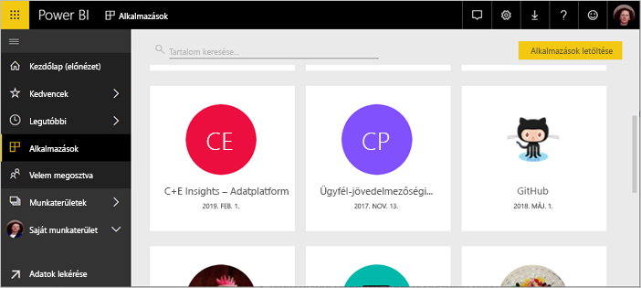
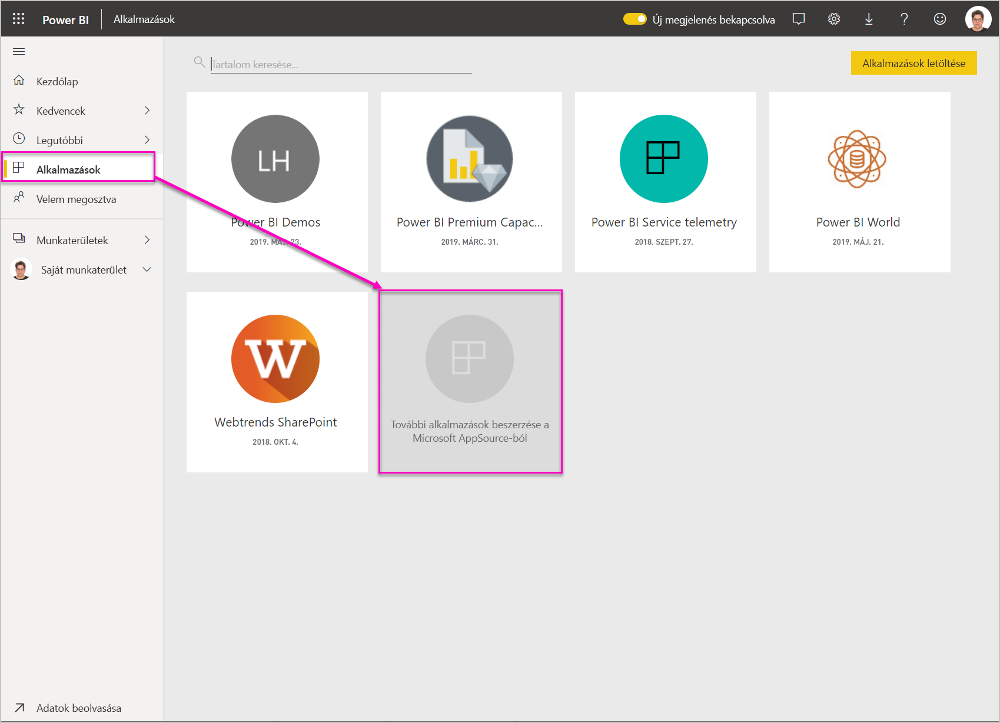
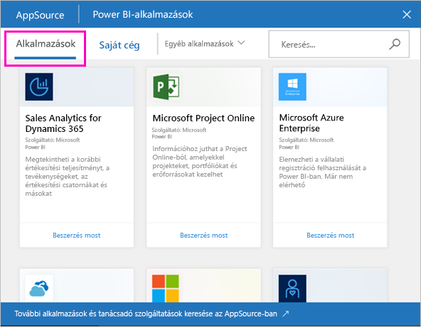
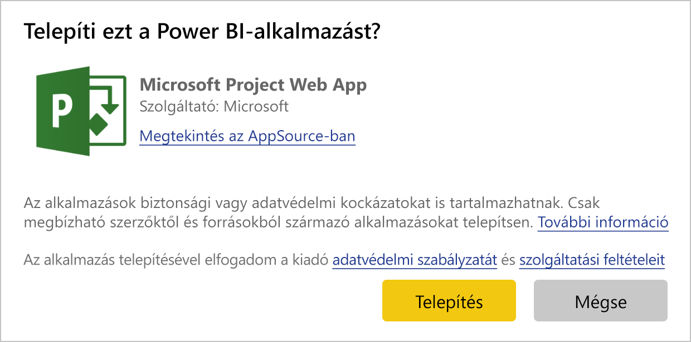
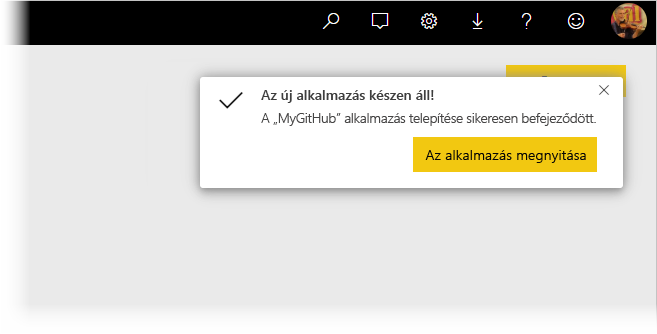
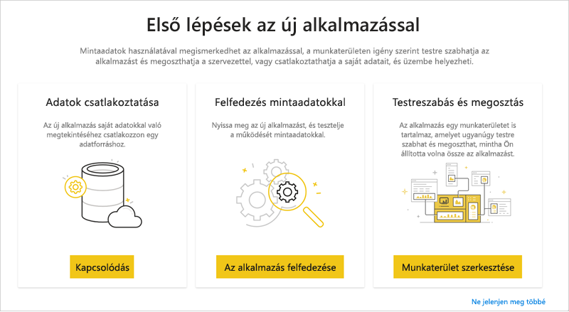
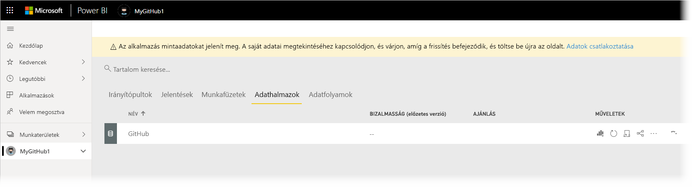
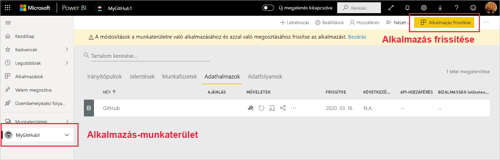
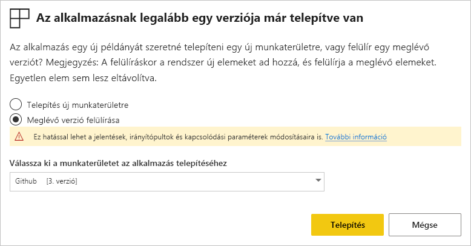

# Sablonalkalmazások telepítése és terjesztése a vállalatnál

Ön Power BI-elemző? Ha igen, ebből a cikkből megtudhatja, hogyan telepíthet [sablonalkalmazásokat](service-template-apps-overview.md), amelyekkel könnyedén kapcsolódhat a vállalkozása működtetéséhez használt olyan szolgáltatásokhoz, mint például a Salesforce, a Microsoft Dynamics és a Google Analytics. A sablonalkalmazás előre elkészített irányítópultját és jelentéseit úgy módosíthatja, hogy megfeleljenek a vállalati igényeknek, majd [alkalmazásként](consumer/end-user-apps.md) terjesztheti azokat a munkatársak körében. 

Ha érdekli, hogyan hozhat létre saját sablonalkalmazásokat, amelyeket a vállalaton kívül terjeszthet, olvassa el a [Sablonalkalmazás létrehozása a Power BI-ban](service-template-apps-create.md) cikket. A Power BI-partnerek kevés kódolással vagy anélkül hozhatnak létre Power BI-alkalmazásokat, és azokat bármely Power BI-ügyfél részére elérhetővé tehetik. 

## Előfeltételek  

Sablonalkalmazás telepítéséhez, testreszabásához és terjesztéséhez a következők szükségesek: 

* [Power BI Pro-licenc](service-self-service-signup-for-power-bi.md).
* Engedélyek sablonalkalmazások telepítéséhez a bérlőben.
* Az alkalmazás érvényes telepítési hivatkozása, amelyet az AppSource-ból vagy az alkalmazás készítőjétől szerezhet be.
* A [Power BI alapfogalmainak](service-basic-concepts.md) alapos ismerete.

## Sablonalkalmazás telepítése

1. A Power BI szolgáltatás navigációs paneljén válassza az **Alkalmazások** > **Alkalmazások letöltése** lehetőséget.

    

1. A megjelenő AppSource-ablakban válassza az **Alkalmazások** lehetőséget. Tallózzon a kívánt alkalmazáshoz, vagy keresse meg azt, majd válassza a **Letöltés most** lehetőséget.

    

1. A megjelenő párbeszédablakban válassza a **Telepítés** lehetőséget.

    
    
    Az alkalmazás az ahhoz társított munkaterülettel lesz telepítve. **Ha úgy dönt, hogy testreszabja az alkalmazást, ezt a társított munkaterületen kell megtennie**.

    > [!NOTE]
    > Ha egy olyan alkalmazás telepítési hivatkozását használja, amely nem található az AppSource-on, egy ellenőrző párbeszédpanel a döntés megerősítését kéri.
    >
    >Az AppSource-on nem megtalálható sablonalkalmazás telepítéséhez a rendszergazdától kell megfelelő engedélyeket kérnie. A részleteket a Power BI felügyeleti portáljának [Sablonalkalmazás beállításai](service-admin-portal.md#template-apps-settings) szakaszában találhatja meg.

    A telepítés sikeres befejezésekor értesítést kap arról, hogy az új alkalmazás használatra kész.

    

## Csatlakozás adatokhoz

1. Válassza az **Ugrás az alkalmazásra** lehetőséget. Megjelenik **Az új alkalmazás használatának első lépései** ablak.

   

1. Kattintson a **Csatlakozás** lehetőségre.
    
    Ekkor egy vagy több egymást követő párbeszédpanel nyílik meg, amelyeken a mintaadatokról a saját adatforrására módosítja az adatforrást. Ehhez általában az adathalmaz paramétereit és az adatforrásbeli hitelesítő adatokat kell újra megadni. Lásd: [Ismert korlátozások](service-template-apps-overview.md#known-limitations).
    
    Az alábbi példában az adatokhoz való kapcsolódás két párbeszédpanelen történik.

   

    Ha végzett a kapcsolódási párbeszédpanelek kitöltésével, megkezdődik a kapcsolódás folyamata. Egy értesítésszalag tájékoztatja arról, hogy mintaadatokat tekint meg.

    

    Várjon a kapcsolódás és az adatfrissítés befejeződéséig. A folyamat befejeződését úgy az adathalmaz sorában (új felület) vagy lapfülén (régi felület) látható folyamatjelzőn figyelheti meg.

   A kapcsolódás és az adatfrissítés befejeződése után frissítse a böngésző tartalmát. Az értesítésszalag ekkor arról tájékoztatja, hogy az alkalmazáson végzett módosítások alkalmazásához és megosztásához frissítenie kell az alkalmazást.

    

## Az alkalmazás testreszabása és megosztása

A böngészőnek az adatkapcsolat és az adatok frissítése utáni frissítésekor más az alkalmazással társított munkaterületet láthatja. Ekkor már az összes ottani elemet ugyanúgy szerkesztheti, mint bármely munkaterületen. Tartsa azonban szem előtt, hogy a végzett módosítások felül lesznek írva, ha új verzióra frissíti az alkalmazást, hacsak nem menti más néven a módosított elemeket. [Tájékozódjon a felülírás részleteiről](#overwrite-behavior).

További információk a munkaterületen lévő elemek szerkesztéséről:
* [A Power BI jelentésszerkesztőjének bemutatása](service-the-report-editor-take-a-tour.md)
* [A Power BI szolgáltatás alapfogalmai tervezők számára](service-basic-concepts.md)

Ha végzett a munkaterületi elemeken végrehajtani kívánt módosításokkal, már készen áll az alkalmazás közzétételére és megosztására. Ennek módjáról az [Alkalmazás közzététele](service-create-distribute-apps.md#publish-your-app) szakaszban tájékozódhat.

## Sablonalkalmazás frissítése

A sablonalkalmazások készítői időnként új, fejlettebb verziókat bocsátanak ki az AppSource-on, közvetlen hivatkozáson vagy mindkettőn keresztül.

Ha eredetileg az AppSource-ról töltötte le az alkalmazást, amikor új verzió válik elérhetővé a sablonalkalmazáshoz, kétféleképpen kap értesítést:
* Egy frissítési szalag jelenik meg a Power BI szolgáltatásban, amely értesíti Önt az új alkalmazásverzióról.
  
* Értesítés jelenik meg a Power BI értesítési paneljén.

  

>[!NOTE]
>Ha az alkalmazást eredetileg nem az AppSource-on, hanem közvetlen hivatkozás útján szerezte be, az új verziók megjelenéséről csak úgy értesülhet, ha kapcsolatba lép az alkalmazás készítőjével.

  A frissítés telepítéséhez kattintson az értesítősáv vagy az értesítési központ **Beszerzés** elemére, vagy keresse meg ismét az alkalmazást az AppSource-on és válassza a **Letöltés most** lehetőséget. Ha a frissítéshez közvetlen hivatkozást kapott a sablonalkalmazás készítőjétől, egyszerűen kattintson a hivatkozásra.
  
  A rendszer rákérdez, hogy az aktuális verziót kívánja felülírni, vagy új munkaterületre szeretné telepíteni az új verziót. Alapértelmezés szerint a „felülírás” vagy kijelölve.

  

- **Meglévő verzió felülírása:** Felülírja a meglévő munkaterületet a sablonalkalmazás frissített verziójával. [Tájékozódjon a felülírás részleteiről](#overwrite-behavior).

- **Telepítés új munkaterületre:** A munkaterület és az alkalmazás új verzióját telepíti, amelyet újra kell konfigurálnia (tehát csatlakoznia kell az adatokhoz és definiálnia kell a navigációt és az engedélyeket).

### Felülírási viselkedés

* A felülírás nem az alkalmazáson, hanem a munkaterületen belüli jelentéseket, irányítópultokat és adathalmazokat módosítja. A felülírás nem változtatja meg az alkalmazásbeli navigációt, beállításokat és engedélyeket.
* A munkaterület frissítése után az **alkalmazás frissítése is szükséges a munkaterületen történt változásoknak az alkalmazásban való érvényesítéséhez**.
* A felülírás megtartja a konfigurált paramétereket és a hitelesítést. A frissítés után automatikus adathalmaz-frissítés indul el. **A frissítés folyamán az alkalmazás, a jelentések és irányítópultok mintaadatokat jelenítenek meg**.

  

* A felülírás mindig mintaadatokat nyújt a frissítés befejezéséig. Ha a sablonalkalmazás készítője módosította az adathalmazt vagy a paramétereket, akkor a munkaterület és az alkalmazás felhasználói a frissítés befejezéséig nem látják az új adatokat. Ez alatt az idő alatt végig a mintaadatokat fogják látni.
* A felülírás sohasem törli a munkaterülethez adott új jelentéseket vagy irányítópultokat. Csak az eredeti jelentéseket és irányítópultokat írja felül az eredeti készítő által végzett módosításokkal.

>[!IMPORTANT]
>Felülírás után ne feledkezzen meg [az alkalmazás frissítéséről](#customize-and-share-the-app), hogy a jelentések és irányítópultok módosításai a vállalati alkalmazás felhasználói számára is megjelenjenek.

## Következő lépések

[Munkaterületek létrehozása a munkatársakkal a Power BI-ban](service-create-workspaces.md)
