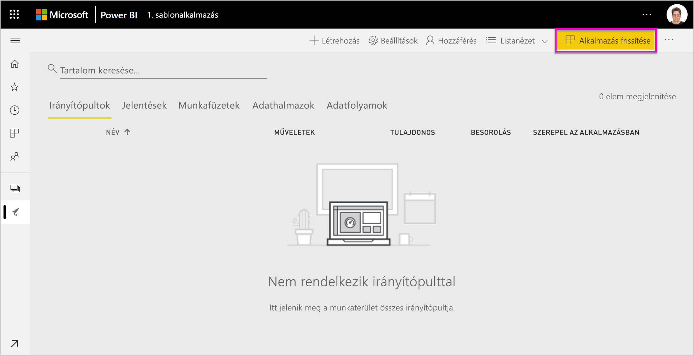
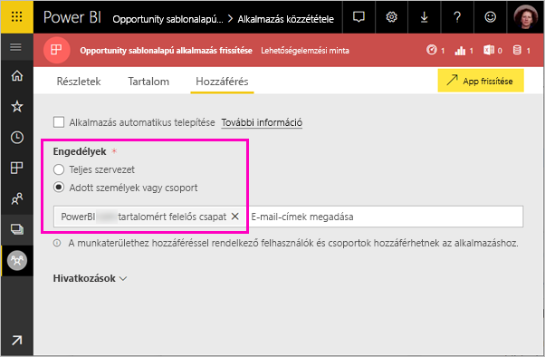

# Sablonalkalmazások telepítése és terjesztése a szervezetnél – Power BI (előzetes verzió)

Ön Power BI-elemző? Ha igen, ebből a cikkből megtudhatja, hogyan telepíthet *sablonalkalmazásokat*, amelyekkel könnyedén kapcsolódhat a vállalkozása működtetéséhez használt olyan szolgáltatásokhoz, mint például a Salesforce, a Microsoft Dynamics és a Google Analytics. Módosíthatja az irányítópultot és a jelentéseket, hogy megfeleljen a szervezet követelményeinek, majd terjesztheti azokat *alkalmazásként* a munkatársainak. 

Ha érdekli, hogyan hozhat létre sablonalkalmazásokat, hogy saját maga terjeszthesse azokat, akkor olvassa el a [Sablonalkalmazás létrehozása a Power BI-ban](service-template-apps-create.md) cikket. A Power BI-partnerek kevés kódolással vagy anélkül hozhatnak létre Power BI-alkalmazásokat, és helyezhetik üzembe azokat bármely Power BI-ügyfél részére. 

## Előfeltételek  

Az alábbiakban a sablonalkalmazások telepítésének, testreszabásának és terjesztésének követelményeit olvashatja: 

- Egy [Power BI Pro-licenc](service-self-service-signup-for-power-bi.md)
- A [Power BI alapvető fogalmainak](service-basic-concepts.md) ismerete
- Érvényes telepítési hivatkozás a sablonalkalmazás létrehozójától vagy az AppSource-ból. 
- Engedélyek sablonalkalmazások telepítéséhez. 

## Sablonalkalmazás telepítése

Kaphat egy sablonalkalmazásra mutató hivatkozást. Ellenkező esetben kereshet az AppSource-ban egy Önt érdeklő sablonalkalmazást. A telepítése után mindkét esetben módosíthatja azt, és terjesztheti a saját cégén belül.

### Keresés az AppSource-ban egy böngészőből

A böngészőben kattintson erre a hivatkozásra az AppSource Power BI-alkalmazásokat megjelenítő szűrővel történő megnyitásához:

- https://appsource.microsoft.com/marketplace/apps?product=power-bi

### Keresés az AppSource-ban a Power BI szolgáltatásból

1. A Power BI szolgáltatás bal oldali navigációs paneljén válassza az **Alkalmazások** > **Alkalmazások letöltése** lehetőséget.

    

2. Válassza az AppSource-ban az **Alkalmazások** lehetőséget.

    

3. Tallózzon az alkalmazáshoz, vagy keresse meg azt, majd válassza a **Letöltés most** lehetőséget.

2. A párbeszédpanelen válassza a **Telepítés** lehetőséget.

    Ha Power BI Pro-licenccel rendelkezik, az alkalmazás telepítése a társított alkalmazás-munkaterülettel együtt történik. Az alkalmazást a társított munkaterületen szabhatja testre.

    Ha a telepítés sikeres, megjelenik egy értesítés, hogy az új alkalmazás készen áll a használatra. 

3. Válassza az **Ugrás az alkalmazásra** lehetőséget.
4. **Az új alkalmazás használatának első lépései** szakaszban három lehetőség közül választhat:

    

    - **Az alkalmazás felfedezése**: Alapszintű példa adatfeltárás. Kezdjen itt az alkalmazás működésének megtapasztalásához. 
    - **Adatok csatlakoztatása**: Módosítsa az adatforrást a mintaadatokról a saját adatforrására. Újra meghatározhatja az adatkészlet paramétereit és az adatforráshoz tartozó hitelesítő adatokat. Tekintse át az [Ismert korlátozások](service-template-apps-tips.md#known-limitations) szakaszt a sablonalkalmazásokra vonatkozó tippeket tartalmazó cikkben. 
    - **Ugrás a munkaterületre** (a legspeciálisabb beállítás): az alkalmazás készítője által engedélyezett bármilyen módosítást végrehajthat.

    Vagy ezt a párbeszédpanelt kihagyva közvetlenül is hozzáférhet a társított munkaterülethez a bal oldali navigációs panel **Munkaterületek** szakaszában.   
 
5. A munkatársakkal való megosztás előtt érdemes kapcsolódni a saját adataihoz. Módosíthatja a jelentés vagy az irányítópultot is, hogy megfelelően működjön a cégében. Ekkor más jelentéseket vagy irányítópultokat is felvehet.

## Az alkalmazás frissítése és terjesztése

Miután frissítette az alkalmazást a cége számára, készen áll a közzétételére. A lépések ugyanazok, mint bármely más alkalmazás közzétételekor. 

1. Amikor végzett a testreszabással, a munkaterület listanézetében válassza a jobb felső sarokban az **Alkalmazás frissítése** lehetőséget.  

    

2. A **Részletek** nézetben módosíthatja a leírást és a háttér színét.

   

3. A **Tartalom** területen kiválaszthatja a kezdőlapot, amely lehet az irányítópult vagy a jelentést.

   

4. A **Hozzáférés** területen hozzáférést adhat a kijelölt felhasználók vagy a teljes cég számára.  

   

5. Válassza az **App frissítése** lehetőséget. 

6. Miután sikeresen közzétette, lemásolhatja a hivatkozást, és megoszthatja bárkivel, aki számára hozzáférést biztosított. Ha megosztotta velük, akkor a hivatkozást az AppSource **Saját szervezet** lapján is láthatják.

## Következő lépések 

[Munkaterületek létrehozása a munkatársakkal a Power BI-ban](service-create-workspaces.md)

 

 
