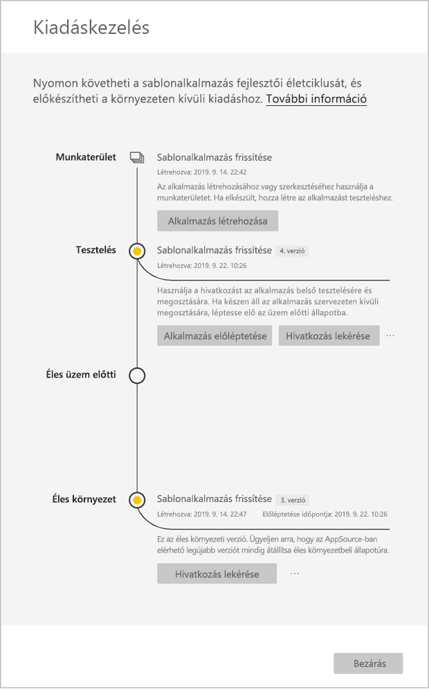

# Sablonalkalmazás frissítése, törlése és kinyerése

Most, hogy az alkalmazása üzemi környezetbe került, újrakezdheti a tesztelési fázist anélkül, hogy az üzemi környezetben lévő alkalmazás működését megzavarná.
## Alkalmazás frissítése

1. A **Kiadáskezelés** panelen válassza az **Alkalmazás létrehozása** lehetőséget.
2. Menjen végig ismét az alkalmazás-létrehozási folyamaton.
3. Miután megadta a **Védjegyezés**, a **Tartalom**, a **Vezérlő** és a **Hozzáférés** beállításait, válassza ismét az **Alkalmazás létrehozása** lehetőséget.
4. Válassza a **Bezárás** lehetőséget, és térjen vissza **Kiadáskezelés** panelre.

   Láthatja, hogy most már két verzióval rendelkezik: Egy verzióval üzemi környezetben, valamint egy új tesztelési verzióval.

    

5. Ha készen áll az alkalmazás előléptetésére az üzem előtti állapotba a bérlőn kívüli további teszteléshez, térjen vissza a Kiadáskezelés panelre, és válassza a **Tesztelés** mellett az **Alkalmazás előléptetése** lehetőséget.
6. A hivatkozás immáron használható. Küldje be újra a Cloud Partner Portalra (CPP-re) a [Power BI-alkalmazásajánlat frissítéséről](https://docs.microsoft.com/azure/marketplace/cloud-partner-portal/power-bi/cpp-update-existing-offer) szóló cikk lépéseit követve.
7. A CPP-ben **közzé kell tennie** újra az ajánlatot, valamint ismét érvényesíteni kell.

>[!NOTE]
>Az alkalmazást csak akkor léptetheti elő a gyártási fázisra, ha jóvá lett hagyva a Cloud Partner Portalon, valamint már közzétette.

## Munkaterület kinyerése
Egy sablonalkalmazás korábbi verziójára váltás mostantól minden eddiginél könnyebb a kinyerési funkciónak köszönhetően. Az alábbi lépésekkel egy adott alkalmazásverziót nyerhet ki a különböző kiadási fázisokból egy új munkaterületre:

1. A Kiadáskezelés panelen kattintson a Továbbiak **(...)** , majd a **Kinyerés** lehetőségre.

     
2. A párbeszédpanelen adja meg a kinyert munkaterület nevét. Ekkor megjelenik egy új munkaterületet.

Az új munkaterületi verziókezelési beállítások alaphelyzetbe kerülnek, Ön pedig az újonnan kinyert munkaterületen fejlesztheti és terjesztheti a sablonalkalmazást.

## Sablonalkalmazás verziójának törlése
A sablonalkalmazás munkaterülete az aktív elosztott sablonalkalmazás forrása. A sablonalkalmazás felhasználóinak védelme érdekében nem törölhetők munkaterületek úgy, hogy előtte nem távolította el annak összes létrehozott alkalmazásverzióját.
Egy alkalmazásverzió törlése az alkalmazás URL-címét is törli, amely ezután nem használható.

1. A Kiadáskezelés panelen kattintson a három pontra **(...)** , majd a **Törlés** lehetőségre.
 
  

>[!NOTE]
>Ügyeljen arra, hogy ne törölje azt az alkalmazásverziót, amelyet ügyfelek vagy az **AppSource** használ, ezzel ugyanis használhatatlanná teszi azt.

## Következő lépések

Arról, hogyan használják a sablonalkalmazást az ügyfelek a [Sablonalkalmazások telepítése, testreszabása és terjesztése a szervezetnél](service-template-apps-install-distribute.md) szakaszban olvashat.

Az alkalmazás terjesztését részletesen [A Power BI-alkalmazásra vonatkozó ajánlat](https://docs.microsoft.com/azure/marketplace/cloud-partner-portal/power-bi/cpp-power-bi-offer) weblapon ismerheti meg.
