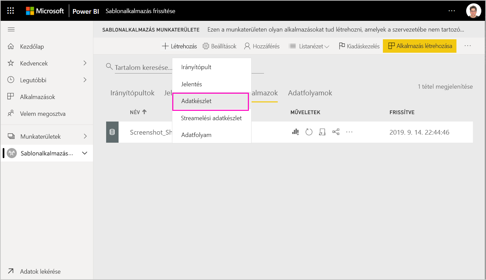
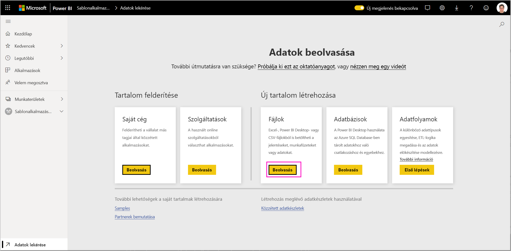
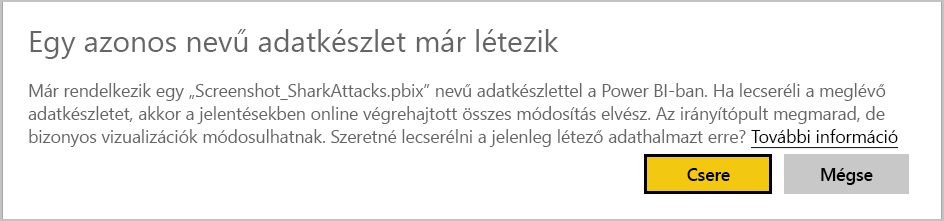

# Sablonalkalmazás frissítése, törlése és kinyerése

Most, hogy az alkalmazása üzemi környezetbe került, újrakezdheti a tesztelési fázist anélkül, hogy az üzemi környezetben lévő alkalmazás működését megzavarná.
## Alkalmazás frissítése

Ha a módosításokat a Power BI Desktopban végezte, kezdje az 1. lépéssel. Ha a módosításokat nem a Power BI Desktopban végezte, kezdje a 4. lépéssel.

1. Töltse fel a frissített adathalmazt a meglévő adathalmaz felülírásával. **Ügyeljen arra, hogy pontosan ugyanazt az adathalmaznevet használja**. Ha más nevet használ, új adathalmazt hoz létre az alkalmazást frissítő felhasználók számára.

1. Importálja a .pbix-fájlt a számítógépéről.

1. Erősítse meg a felülírás szándékát.

1. A **Kiadáskezelés** panelen válassza az **Alkalmazás létrehozása** lehetőséget.
1. Menjen végig ismét az alkalmazás-létrehozási folyamaton.
1. Miután megadta a **Védjegyezés**, a **Tartalom**, a **Vezérlés** és a **Hozzáférés** beállításait, válassza ismét az **Alkalmazás létrehozása** lehetőséget.
1. Válassza a **Bezárás** lehetőséget, és térjen vissza **Kiadáskezelés** panelre.

   Láthatja, hogy most már két verzióval rendelkezik: Egy verzióval üzemi környezetben, valamint egy új tesztelési verzióval.

    

1. Ha készen áll az alkalmazás előléptetésére az üzem előtti állapotba a bérlőn kívüli további teszteléshez, térjen vissza a Kiadáskezelés panelre, és válassza a **Tesztelés** mellett az **Alkalmazás előléptetése** lehetőséget.

   Most egy éles és egy előkészítő fázisban található verzióval rendelkezik.

   

   A hivatkozás immáron használható. **Az éles üzem előtti fázisban az Alkalmazás előléptetése gomb szürkén jelenik meg**. Ennek az a célja, hogy meggátolja a jelenlegi alkalmazásverzió éles linkjének véletlen felülírását az előtt, hogy a Cloud Partner Portal ellenőrizhette és jóváhagyhatta volna az új alkalmazásverziót.

1. Küldje be újra a linket Cloud Partner Portalra (CPP-re) a [Power BI-alkalmazásajánlat frissítéséről](https://docs.microsoft.com/azure/marketplace/cloud-partner-portal/power-bi/cpp-update-existing-offer) szóló cikk lépéseit követve. A Cloud Partner Portalon újra **közzé kell tennie** az ajánlatot, valamint ismét érvényesíttetnie kell, illetve meg kell várnia a jóváhagyást.

   Az ajánlat jóváhagyása után az Alkalmazás előléptetése gomb ismét aktívvá válik. 
1. Léptesse elő az alkalmazást az éles fázisba.
   
### Frissítési viselkedés

1. Az alkalmazás frissítésével a sablonalkalmazás telepítője számára elérhetővé válik a [Sablonalkalmazás frissítése](service-template-apps-install-distribute.md#update-a-template-app) lehetőség a már telepített munkaterületen anélkül, hogy elveszítené a kapcsolódási konfigurációt.
1. A telepítő [felülírási viselkedését](service-template-apps-install-distribute.md#overwrite-behavior) ismertető szakasz írja e, hogy az adathalmaz változásai hogyan érintik a telepített sablonalkalmazást.
1. Sablonalkalmazás frissítésekor (felülírásakor) az először visszaállítja a mintaadatokat, és automatikusan újra fog kapcsolódni a felhasználói konfigurációval (paraméterek és hitelesítő adatok). A frissítés befejezéséig a jelentésekben, irányítópultokon és a vállalati alkalmazásban a mintaadatok sáv jelenik meg.
1. Ha olyan új lekérdezési paramétert vett fel a frissített adathalmazhoz, amely felhasználói beavatkozást igényel, akkor be kell jelölnie a *Kötelező* jelölőnégyzetet. A telepítő így rákérdez majd a kapcsolati sztringre az alkalmazás telepítése után.
 

## Munkaterület kinyerése
Egy sablonalkalmazás korábbi verziójára váltás mostantól minden eddiginél könnyebb a kinyerési funkciónak köszönhetően. Az alábbi lépésekkel egy adott alkalmazásverziót nyerhet ki a különböző kiadási fázisokból egy új munkaterületre:

1. A Kiadáskezelés panelen kattintson a Továbbiak **(...)** , majd a **Kinyerés** lehetőségre.

     
2. A párbeszédpanelen adja meg a kinyert munkaterület nevét. Ekkor megjelenik egy új munkaterületet.

Az új munkaterületi verziókezelési beállítások alaphelyzetbe kerülnek, Ön pedig az újonnan kinyert munkaterületen fejlesztheti és terjesztheti a sablonalkalmazást.

## Sablonalkalmazás verziójának törlése
A sablon-munkaterület az aktív elosztott sablonalkalmazás forrása. A sablonalkalmazás felhasználóinak védelme érdekében nem törölhetők munkaterületek úgy, hogy előtte nem távolította el annak összes létrehozott alkalmazásverzióját.
Egy alkalmazásverzió törlése az alkalmazás URL-címét is törli, amely ezután nem használható.

1. A Kiadáskezelés panelen kattintson a három pontra **(...)** , majd a **Törlés** lehetőségre.
 
 

>[!NOTE]
>Ügyeljen arra, hogy ne törölje azt az alkalmazásverziót, amelyet ügyfelek vagy az **AppSource** használ, ezzel ugyanis használhatatlanná teszi azt.

## Következő lépések

Arról, hogyan használják a sablonalkalmazást az ügyfelek a [Sablonalkalmazások telepítése, testreszabása és terjesztése a szervezetnél](service-template-apps-install-distribute.md) szakaszban olvashat.

Az alkalmazás terjesztését részletesen [A Power BI-alkalmazásra vonatkozó ajánlat](https://docs.microsoft.com/azure/marketplace/cloud-partner-portal/power-bi/cpp-power-bi-offer) weblapon ismerheti meg.
