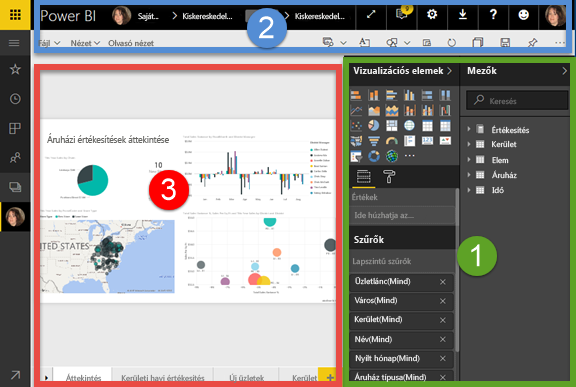
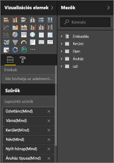
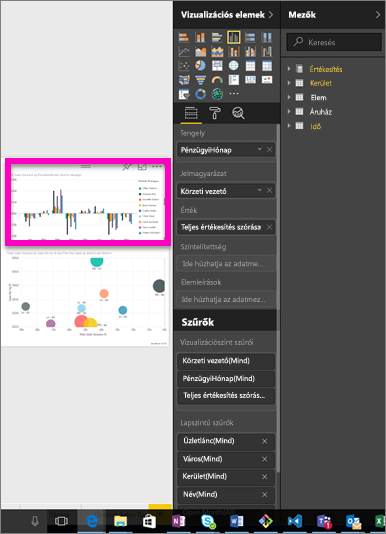
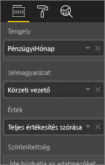
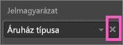
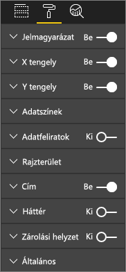
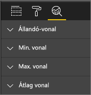
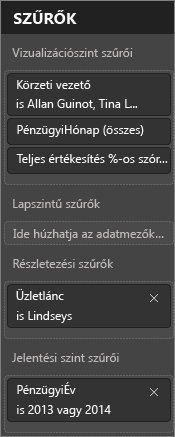
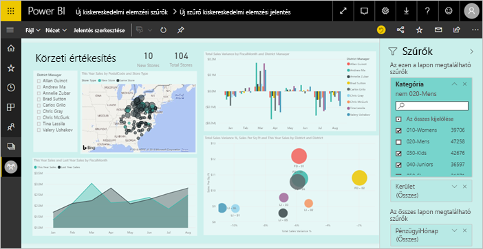
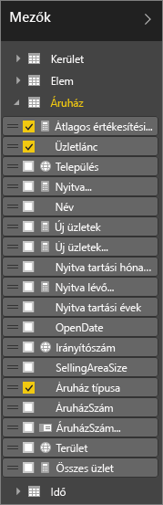

# A Power BI jelentésszerkesztőjének bemutatása

A Power BI szolgáltatásban és a Power BI Desktopban használt *jelentésszerkesztő* hasonló. Jelentések létrehozását általában a Power BI Desktopban kezdjük. Ezt követően a jelentéseket közzéteheti a Power BI szolgáltatásban, ahol további módosításokat is végezhet rajtuk. Ugyancsak a Power BI szolgáltatásban hozhatja létre a jelentéseken alapuló irányítópultokat.

Ha elkészült az irányítópultok és a jelentések létrehozásával, terjesztheti őket a jelentés felhasználói számára. Attól függően, hogy hogyan osztja meg őket, a végfelhasználók használhatják a jelentéseket a Power BI szolgáltatásban Olvasó nézetében, de nem szerkeszthetik azokat. További információ arról, [mi mindenre használhatják a jelentésfelhasználók a Power BI szolgáltatást](consumer/end-user-reading-view.md). 

Ez a videó bemutatja a jelentésszerkesztőt a Power BI Desktopban. Ez a cikk a Power BI szolgáltatás jelentésszerkesztőjét mutatja be. 

<iframe width="560" height="315" src="https://www.youtube.com/embed/IkJda4O7oGs" frameborder="0" allowfullscreen></iframe>

A Power BI szolgáltatásban a jelentésszerkesztő csak Szerkesztő nézetben érhető el. Egy jelentés szerkesztési nézetben történő megnyitásához a jelentés tulajdonosának vagy létrehozójának, vagy a jelentést tartalmazó alkalmazás-munkaterületen közreműködőnek kell lennie.

A Power BI jelentésszerkesztőjének felülete három részből áll:  

1. A **Mezők**, a **Megjelenítések** és a **Szűrők** panel
2. A felső navigációs sáv    
3. A jelentésvászon     

## 1. A jelentésszerkesztő paneljei

A jelentés első megnyitásakor három panel látható: Vizualizációk, Szűrők és Mezők. A bal oldali Megjelenítések és Szűrők panel a vizualizációk megjelenését – típusát, színeit, szűrését és formázását – szabályozza.  A jobb oldali Mezők panel a vizualizációban felhasználandó adatok kezelésére szolgál. 

A jelentésszerkesztőben megjelenő tartalom a jelentésvásznon alkalmazott kijelöléstől függően változik.  Egy külön vizualizáció kijelölésekor például:

|  |  |
| --- | --- |
|  |<ul><li>A Megjelenítések panel felső része a használt vizualizációtípust adja meg. Ez ebben a példában csoportosított oszlopdiagram.  </li> <li>A Megjelenítések panel alsó része (előfordulhat, hogy le kell görgetnie) a vizualizációhoz használt mezőket mutatja. Ez a diagram a FiscalMonth, a DistrictManager, és a Total Sales Variance mezőket ábrázolja.   </li><li>A Szűrők panelen (előfordulhat, hogy le kell görgetnie) az esetleg használt szűrők látszanak.   </li><li>A Mezők panel felsorolja az elérhető táblákat és – a táblanév kibontása után – a táblát alkotó mezőket is. Sárga színű szöveg jelzi, hogy a vizualizáció felhasználja a táblának legalább egy mezőjét.  </li><li> A kijelölt vizualizációhoz tartozó Formázás panel megnyitásához válassza a festőhenger ikont.  </li><li> Az Elemzés panel megjelenítéséhez válassza a nagyító ikont.</ul> |

## A Vizualizációk panel

Itt választható ki a vizualizáció típusa. A kis képek az úgynevezett *sablonok*. A fenti ábrán a Csoportosított sávdiagram van kijelölve. Ha kezdetben nem választ vizualizációtípust, hanem a mezők kiválasztásával kezdi összeállítani a vizualizációt, akkor a Power BI választ típust Ön helyett. Megtarthatja a Power BI választását, vagy megváltoztathatja a típust egy másik sablon kiválasztásával. Akárhányszor választhat másikat, amíg rá nem talál az adatait legjobban szemléltető vizualizációtípusra.

### A vizualizációk mezőinek kezelése

Az ezen a panelen látható *gyűjtők* a kiválasztott vizualizációtípustól függően változnak.  Ha például sávdiagramot választott, akkor a következő gyűjtőket látja: Értékek, Tengely és Jelmagyarázat. Egy mező kijelölésekor vagy a vászonra történő húzásakor a Power BI hozzáadja a mezőt az egyik gyűjtőhöz.  A Mezők listából közvetlenül a gyűjtőkbe is húzhat mezőket.  Néhány gyűjtő csak bizonyos adattípusokat tartalmazhat.  Az **Értékek** gyűjtő például nem fogad el nem numerikus mezőket. Ha például az **employeename** (alkalmazott neve) mezőt húzza az **Értékek** gyűjtőbe, akkor a Power BI azt a **count of employeename** (employeename mezők darabszáma) értékre változtatja.

### Mező eltávolítása
Mezőt a mező neve mellett jobbra látható **×** választásával távolíthat el a vizualizációból.

További információ: [Vizualizáció hozzáadása Power BI-jelentéshez](visuals/power-bi-report-add-visualizations-i.md)

### Vizualizációk formázása
A festőhenger ikonra kattintva nyissa meg a Formázás panelt. Az elérhető lehetőségek a választott vizualizációtípustól függnek.

A formázási lehetőségek száma szinte végtelen.  A megismerésükhöz fedezze fel őket saját maga, vagy olvassa el az alábbi cikkeket:

* [Vizualizáció címének, hátterének és jelmagyarázatának testre szabása](visuals/power-bi-visualization-customize-title-background-and-legend.md)
* [Formázás színekkel](visuals/service-getting-started-with-color-formatting-and-axis-properties.md)
* [Az X és az Y tengely tulajdonságainak beállítása](visuals/power-bi-visualization-customize-x-axis-and-y-axis.md)

### Elemzés hozzáadása vizualizációhoz
Az Elemzés panel megnyitásához válassza a nagyító ikont. Az elérhető lehetőségek a választott vizualizációtípustól függnek.

    
A Power BI szolgáltatás Elemzés paneljével dinamikus referenciavonalak adhatók a vizualizációkhoz, kiemelve a fontos trendeket vagy elemzési eredményeket. További tudnivalókat talál a következő két cikkben: [Az Elemzés panel a Power BI szolgáltatásban](service-analytics-pane.md), [Az Elemzés panel a Power BI Desktopban](desktop-analytics-pane.md).

- - -
## A Szűrők panel
A Szűrők panel használatával megtekintheti, beállíthatja és szerkesztheti a jelentés állandó szűrőit az oldal, a jelentés, a részletezés és a vizualizáció szintjén. Igen, végezhet ad-hoc szűrést a jelentésen és a vizualizációkon az elemek kiválasztásával vagy szeletelők és más eszközök használatával, de ha a Szűrők panelt használja, a szűrők állapota mentve is lesz a jelentésben. 

A Szűrők panelnek egy másik hatékony funkciója is van: képes szűrést végezni ***olyan mező használatával, amely a jelentés egyik vizualizációjában sem szerepel***. Vizsgáljuk ezt meg közelebbről. Amikor létrehozunk egy jelentést, a Power BI automatikusan hozzáadja a vizualizációkban szereplő összes mezőt a Szűrők panel vizualizációk szintű szűrő területéhez.  Ha azonban olyan szűrőt szeretne használni a vizualizáció, oldal, részletezés vagy jelentés szintű szűrőkben, amely jelenleg nem szerepel a vizualizációkban, akkor azt át kell húznia a Szűrők területre.   

További információ: [Szűrő hozzáadása jelentéshez](power-bi-report-add-filter.md).

Új szűrési felület érhető el előzetes verzióban. Az új szűrőket úgy formázhatja, hogy azok a jelentéssel megegyezően jelenjenek meg. A szűrők zárolhatók is, és el is rejthetők a jelentés felhasználói számára. 

További információ az [új szűrési felületről](power-bi-report-filter.md).

- - -
## A Mezők panel
A Mezők panel az adatai között található, vizualizációk létrehozásához felhasználható táblákat és mezőket sorolja fel.

|  |  |
| --- | --- |
|  |<ul><li>Új vizualizáció létrehozásához húzzon egy mezőt az oldalra.  Mezőt meglévő vizualizációra húzva is felvehet.  </li> <li>A mezők melletti jelölőnégyzet bejelölésekor a Power BI hozzáadja a mezőt az aktív (vagy új) vizualizációhoz. Azt is eldönti, hogy melyik gyűjtőben helyezze el a mezőt.  Így dől el például, hogy a mező jelmagyarázatként, tengelyként vagy értékként lesz felhasználva. A Power BI becslés alapján dönt, de Ön igény szerint áthelyezheti a mezőt egy másik gyűjtőbe.   </li><li>A kijelölt mező mindenképpen hozzáadódik a jelentésszerkesztő Megjelenítések paneljéhez.</li></ul> |

**MEGJEGYZÉS**: A Power BI Desktop használatakor lehetőség van egyebek között a mezők elrejtésére/felfedésére és számítások hozzáadására is.

### A mezőikonok jelentése
**∑ Összesítések** Az összesített numerikus érték például egy összeg- vagy egy átlagszámítás eredménye. Az összesítések az adatokkal együtt importálódnak (a jelentés alapjául szolgáló adatmodellben vannak meghatározva).
További információ: [Összesítések Power BI-jelentésekben](service-aggregates.md).

 **Számított mértékek (más néven számított mezők)**  
Minden számított mezőhöz saját nem változtatható képlet tartozik. A számítás módja nem módosítható, egy összeg például csak összeg lehet. További információ: [A mértékek ismertetése](desktop-measures.md)

 **Egyedi mezők**  
Az ezzel az ikonnal jelölt mezők az Excelből importálódtak, és úgy vannak beállítva, hogy minden érték megjelenjen még akkor is, ha duplikált. Az adatok között lehet például két „Szabó János” nevű személyre vonatkozó rekord, és ezek mindegyike egyediként lesz kezelve – nem összegződnek.  

** Földrajzi hely mezők**  
A földrajzi helyet megadó mezők térképes vizualizációkhoz használhatók. 

** Hierarchia**  
A hierarchiát alkotó mezők a nyíl választásával fedhetők fel. 

## 2. A felső navigációs sáv
A felső navigációs sávon számos művelet elérhető, és ezek köre folyamatosan bővül. Az egyes műveletekről a Power BI-dokumentáció tartalomjegyzéke vagy a keresőmező használatával találhat további információt.

## 3. A jelentésvászon
A jelentésvásznon jelenik meg a munkája. A Mezők, a Szűrők és a Megjelenítések panel használatával létrehozott vizualizációk a jelentésvásznon állítódnak össze és jelennek meg. A vászon alján látható fülek mindegyike a jelentés egy-egy oldalát jelöli. A fület választva megnyílik a hozzá tartozó oldal. 

## Következő lépések
[Jelentés létrehozása](service-report-create-new.md)

További információk a jelentésekről használatáról a [Power BI szolgáltatásban](service-report-create-new.md), a [Power BI Desktopban](desktop-report-view.md) és a [Power BI Mobile-alkalmazásokban](consumer/mobile/mobile-apps-view-phone-report.md).

[Alapfogalmak Power BI-tervezőknek](service-basic-concepts.md)

További kérdései vannak? [Kérdezze meg a Power BI közösségét](http://community.powerbi.com/)

