# Oktatóanyag: Gépi tanulási modell létrehozása a Power BI-ban

Ebben az oktatóanyagban egy bináris előrejelzési modellt fog létrehozni és alkalmazni a Power BI-ban az **automatizált gépi tanulás** használatával. Az oktatóanyag alapján létrehozhat egy Power BI-adatfolyamot, és az adatfolyamban megadott entitások felhasználásával közvetlenül a Power BI-ban taníthat be és ellenőrizhet egy gépi tanulási modellt. Ezután a modellt új adatok pontozására, és így előrejelzések létrehozására használjuk.

Először létre kell hoznia egy bináris előrejelzési gépi tanulási modellt, amely az online vásárlók vásárlási szokásait jelzi előre az online munkamenet-attribútumaik alapján. A gyakorlathoz teljesítményteszt-alapú gépi tanulási adatkészletet használunk. A modell betanítása után a Power BI automatikusan létrehoz egy ellenőrzési jelentést, amely ismerteti a modell eredményeit. Tekintse át az ellenőrzési jelentést, és ezután felhasználhatja a modellt a saját adatainak pontozására.

Az oktatóanyag a következő lépésekből áll:
> [!div class="checklist"]

> * Adatfolyam létrehozása a bemeneti adatokkal
> * Gépi tanulási modell létrehozása és betanítása
> * A modell ellenőrzési jelentésének áttekintése
> * A modell alkalmazása egy adatfolyam-entitásra
> * A modell pontozott kimenetének felhasználása egy Power BI-jelentésben

## Adatfolyam létrehozása a bemeneti adatokkal

Az oktatóanyag első része a bemeneti adatokat tartalmazó adatfolyam létrehozását ismerteti. Az alábbi szakaszban bemutatott folyamat több lépésből áll, amelyek közül az első az adatok lekérése.

### Adatok lekérése

Az adatfolyam létrehozásának első lépése az adatok előkészítése. Példánkban egy olyan online munkamenet-sorozatból nyertük ki a gépi tanulás adatkészletét, amelynek egy része vásárlással végződött. Az adatkészletben a munkamenetek attribútumai találhatók, amelyeket a modell betanítására használunk.

Az adatkészlet letölthető az UC Irvine webhelyről. Az adatkészlet a jelen oktatóanyag céljaira elérhető a következő hivatkozáson is: [online_shoppers_intention.csv](https://raw.githubusercontent.com/santoshc1/PowerBI-AI-samples/master/Tutorial_AutomatedML/online_shoppers_intention.csv).

### Az entitások létrehozása

Ahhoz, hogy létre tudja hozni az adatfolyamban az entitásokat, be kell jelentkeznie a Power BI szolgáltatásba, és egy olyan munkaterületre kell navigálnia a dedikált kapacitásán belül, amelyben engedélyezve van az AI.

Ha még nincs munkaterülete, létrehozhat egyet. Ehhez válassza a **Munkaterületek** elemet a Power BI szolgáltatás bal oldali navigációs ablaktáblájában, majd a megjelenő panel alján válassza a **Munkaterület létrehozása** lehetőséget. Ez megnyit egy panelt a jobb oldalon, ahol megadhatja a munkaterület adatait. Írja be a munkaterület nevét, majd válassza a **Speciális** lehetőséget. A választógombbal győződjön meg róla, hogy a munkaterület dedikált kapacitást használ, és olyan dedikáltkapacitás-példányhoz van rendelve, amelyhez be van kapcsolva az AI előzetes verziója. Kattintson a **Mentés** gombra.

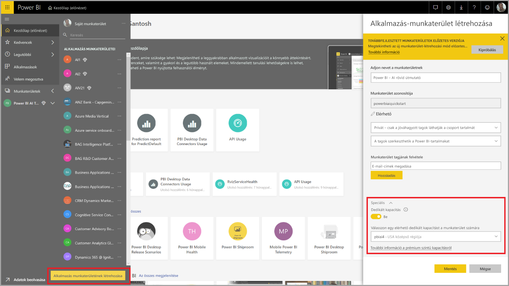

Ha létrehozta a munkaterületet, választhatja az üdvözlő képernyő alján jobbra a **Kihagyás** lehetőséget, az alábbi kép szerint.

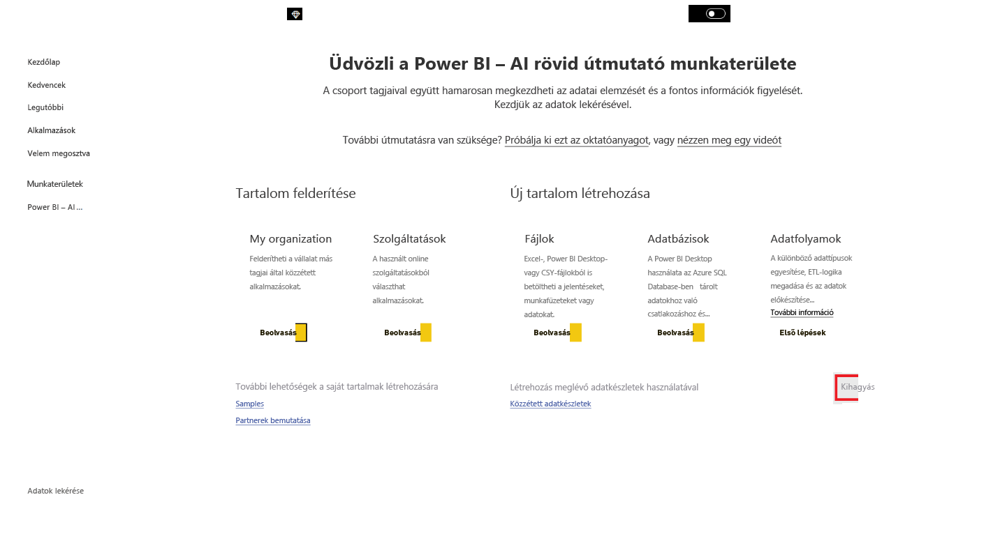

 Válassza a **Létrehozás** lehetőséget a munkaterület jobb felső sarkában, majd válassza az **Adatfolyam** elemet.

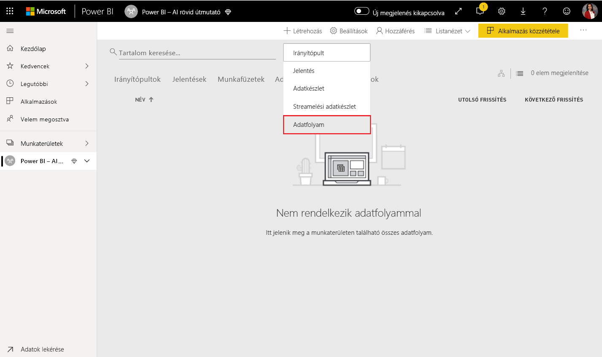

Válassza az **Új entitások hozzáadása** lehetőséget. Ez elindítja a **Power Query** szerkesztőjét a böngészőben.

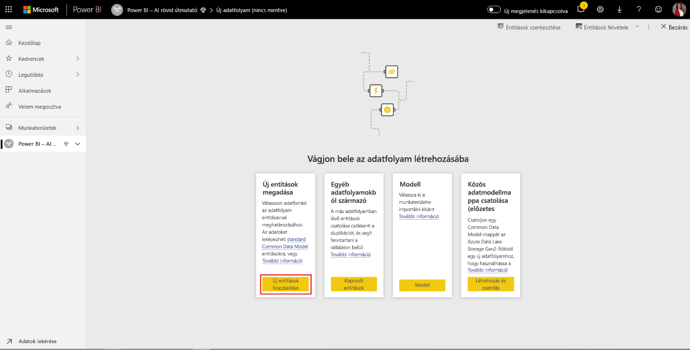

Adatforrásként válassza a **Text/CSV fájl** lehetőséget az alábbi kép szerint.

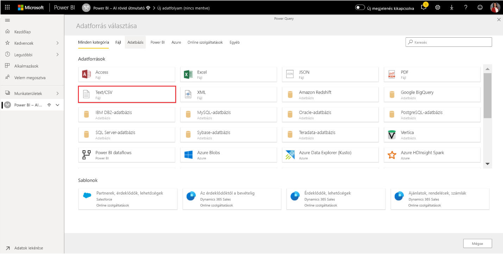

Az ekkor megjelenő **Csatlakozás adatforráshoz** lapon illessze be az _online_shoppers_intention.csv_ fájlra mutató hivatkozást a **Fájl elérési útja vagy URL-címe** mezőbe, majd kattintson a **Tovább** elemre.

`https://raw.githubusercontent.com/santoshc1/PowerBI-AI-samples/master/Tutorial_AutomatedML/online_shoppers_intention.csv`

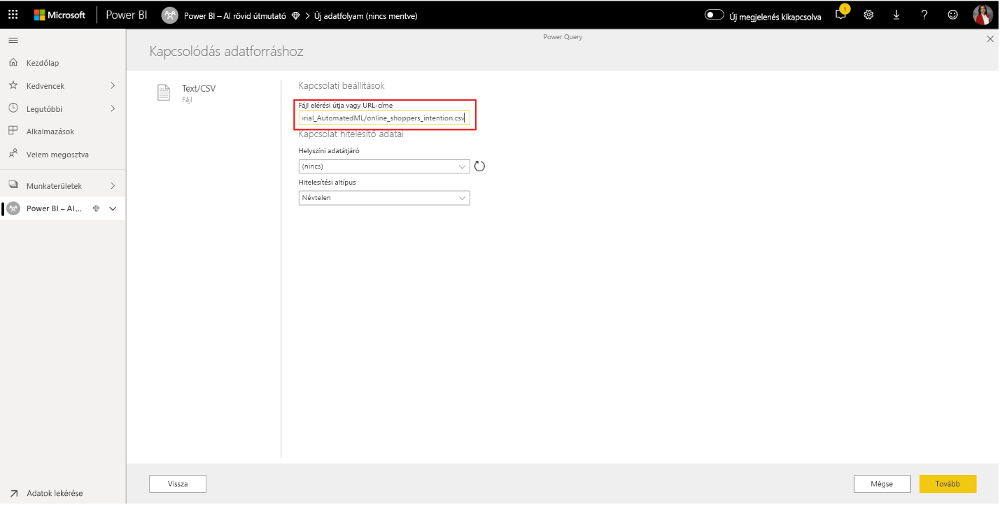

A Power Query-szerkesztő megjeleníti a CSV-fájl adatainak előnézetét. A jobb oldali panelen látható Név mező értékének módosításával felhasználóbarátabb nevet adhat a lekérdezésnek. A Query (Lekérdezés) nevet például az _Online Visitors_ (Online látogatók) névre módosíthatja.

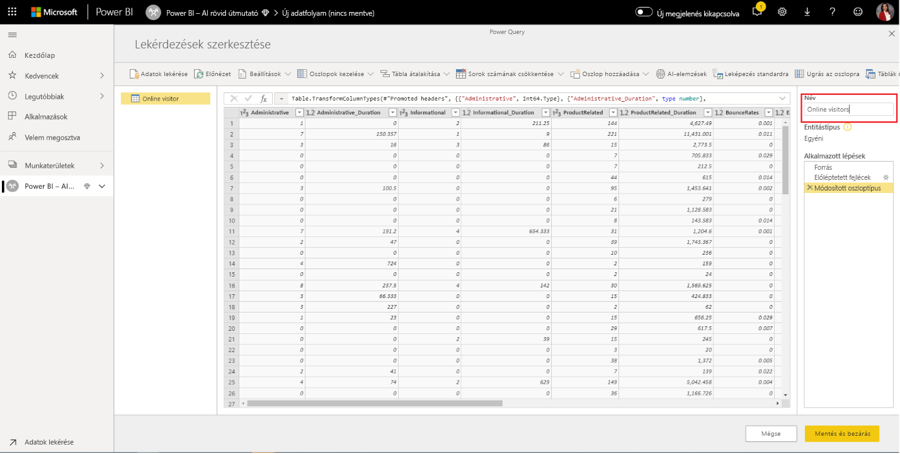

A Power Query automatikusan kikövetkezteti az oszlopok típusát. Az oszlop típusát az attribútumtípus az oszlop fejlécének tetején található ikonjára kattintva módosíthatja. Ebben a példában a Revenue (Bevétel) oszlop típusát a True/False (Igaz/hamis) értékre módosítjuk.

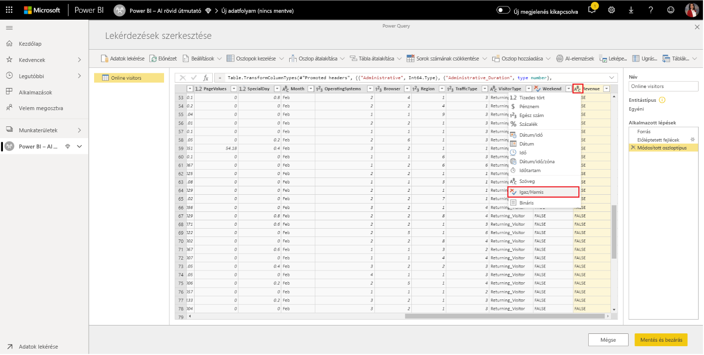

A Power Query-szerkesztő bezárásához válassza a **Mentés és bezárás** lehetőséget. Adjon nevet az adatfolyamnak, majd a párbeszédpanelen válassza a **Mentés** lehetőséget az alábbi képnek megfelelően.

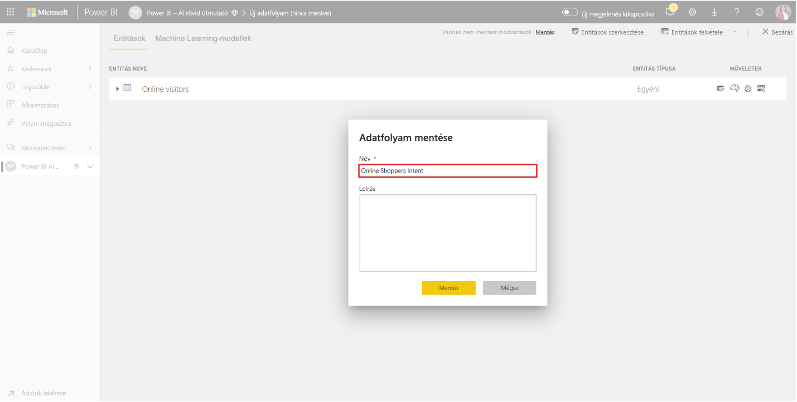

## Gépi tanulási modell létrehozása és betanítása

Gépi tanulási modell felvételéhez válassza a **Műveletek** listában az **ML-modell alkalmazása** gombot a betanítási és címkeadatokat tartalmazó alapentitáshoz, majd kattintson a **Gépi tanulási modell hozzáadása** lehetőségre.

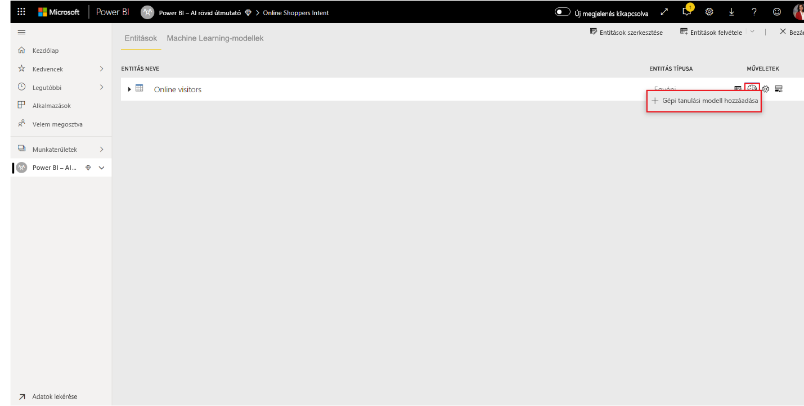

A gépi tanulási modell létrehozásának első lépése az előzményadatok azonosítása, az előrejelezni kívánt eredménymezőt is beleértve. A modell létrehozásához ezekből az adatokból tanul a rendszer.

A példánkban használt adatkészlet esetében ez a **Revenue** mező. Jelölje ki a **Revenue** (Bevétel) mezőt eredménymezőként, majd kattintson a **Tovább** elemre.

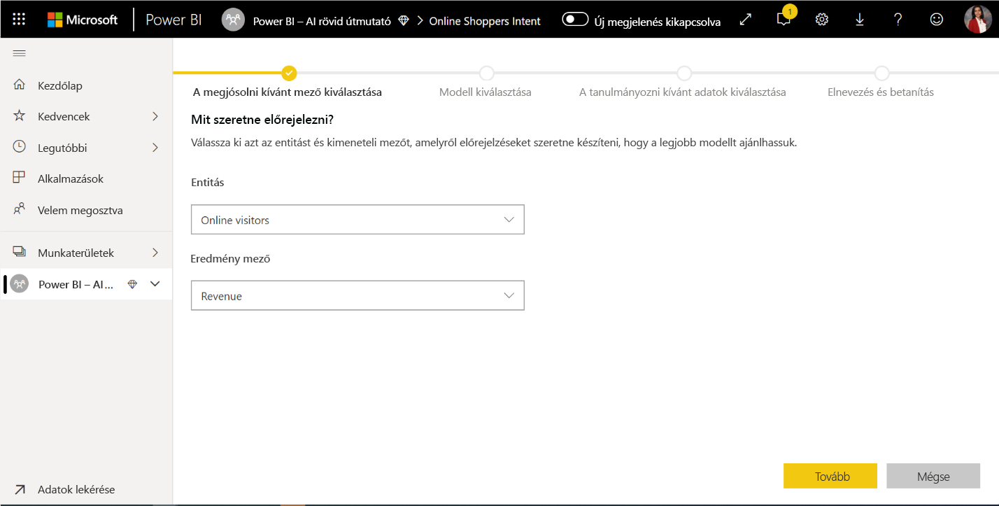

A továbbiakban ki kell választanunk a létrehozni kívánt gépi tanulási modellt. A Power BI elemzi az eredménymezőben megadott értékeket, és javaslatot tesz a mező előrejelzéséhez létrehozható gépi tanulási modelltípusokra.

Mivel példánkban bináris eredményt várunk arra a kérdésre, hogy a felhasználó vásárol-e vagy sem, a Bináris előrejelzés lehetőség ajánlott. Mivel azt szeretnénk előrejelezni, hogy mely felhasználók fognak vásárolni, a True (Igaz) lehetőséget adja meg a Revenue (Bevétel) azon eredményeként, amely a legjobban érdekli. Emellett felhasználóbarát címkéket is megadhat a modell értékelési eredményeit összefoglaló, automatikusan előállított jelentésben használandó eredményekhez. Ezután kattintson a Tovább gombra.

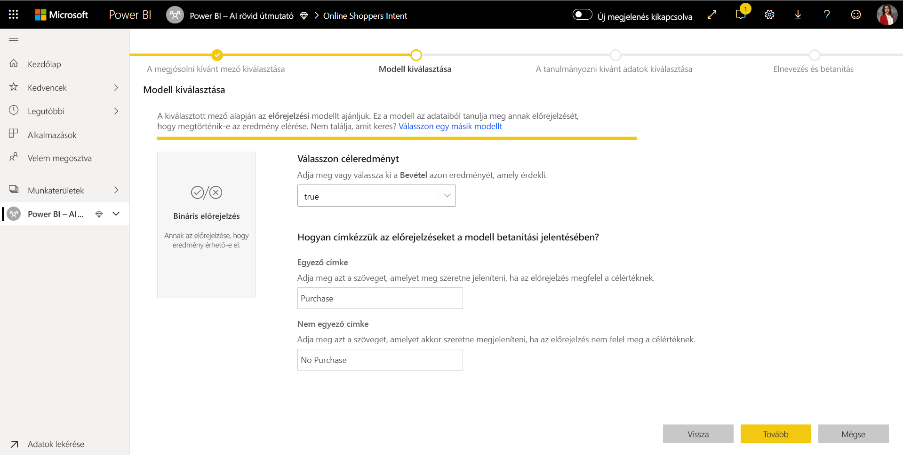

Ezt követően a Power BI előzetes vizsgálatot végez az adatok egy mintáján, és javaslatot tesz azokra a bemenetekre, amelyek pontosabb előrejelzéseket eredményezhetnek. Ha a Power BI nem javasol egy mezőt, magyarázat jelenik meg mellette. Lehetősége van úgy módosítani a kijelöléseket, hogy csak azok a mezők szerepeljenek bennük, amelyeket tanulmányozni szeretne a modellel, vagy az entitás neve melletti jelölőnégyzet bejelölésével az összes mezőt is kiválaszthatja. A bemenetek jóváhagyásához kattintson a **Tovább** elemre.

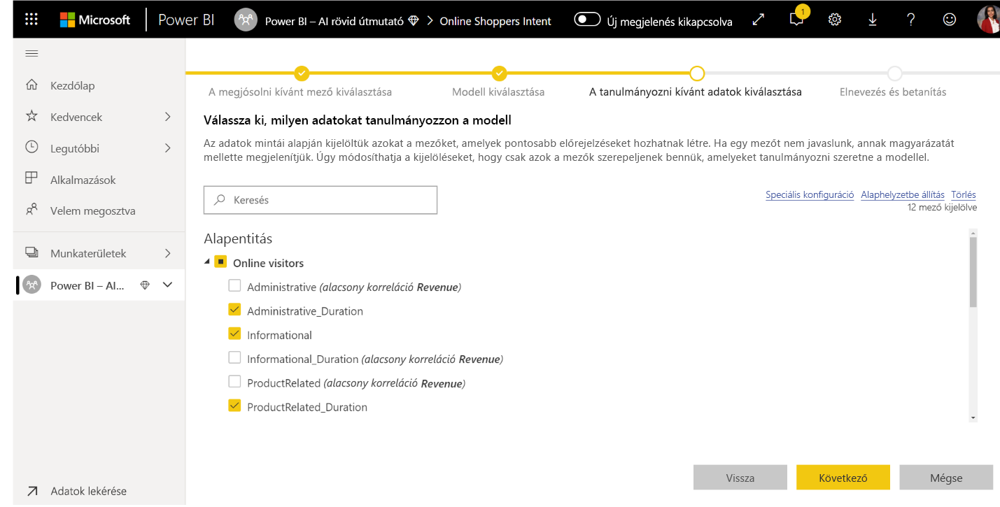

Az utolsó lépésben meg kell adnia a modell nevét. A modellnek adja a _Vásárlási szándék előrejelzése_ nevet. Dönthet úgy, hogy csökkenti a betanítási időt, hogy gyors eredményeket kapjon, vagy hogy növeli a betanítással töltött időt, hogy a modell a lehető legjobb legyen. Ezután válassza a **Mentés és betanítás** lehetőséget a modell betanításának megkezdéséhez.

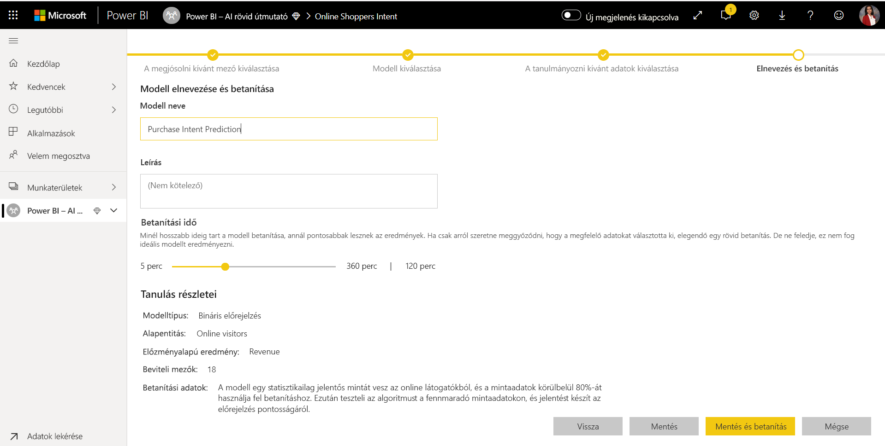

A betanítási folyamat kezdő lépései az előzményalapú adatok mintavételezése és normalizálása, valamint az adatkészlet felosztása _Vásárlási szándék előrejelzése betanítási adatok_ és _Vásárlási szándék előrejelzése tesztadatok_ csoportra.

A betanítási folyamat az adatkészlet méretétől függően néhány perctől akár az előző képernyőn kiválasztott betanítási időig is eltarthat. Ekkor a modell megjelenik az adatfolyam **Gépi tanulási modellek** lapján. A Kész állapot azt jelzi, hogy a modell várólistára került, vagy már betanítás alatt áll.

A modell betanításának és ellenőrzésének folyamatát az adatfolyam állapotából ellenőrizheti. Ez az információ a munkaterület **Adatfolyamok** lapján, folyamatban lévő adatfrissítésként jelenik meg.

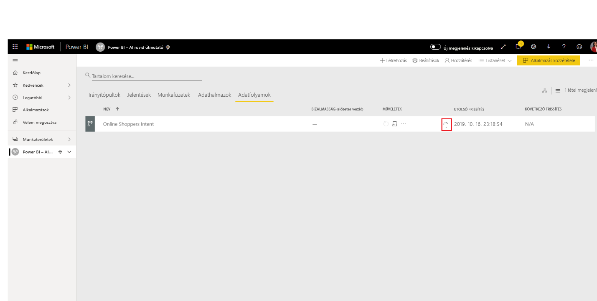

Ha a modell betanítása lezárult, az adatfolyam megjeleníti a legújabb frissítés időpontját. Az adatfolyam **Gépi tanulási modellek** lapjára lépve ellenőrizheti, hogy a modell betanítása lezárult-e. A létrehozott modellnek ilyenkor **Betanított** állapotban kell lennie, és a **Legutóbbi betanítás időpontjának** már frissülnie kellett.

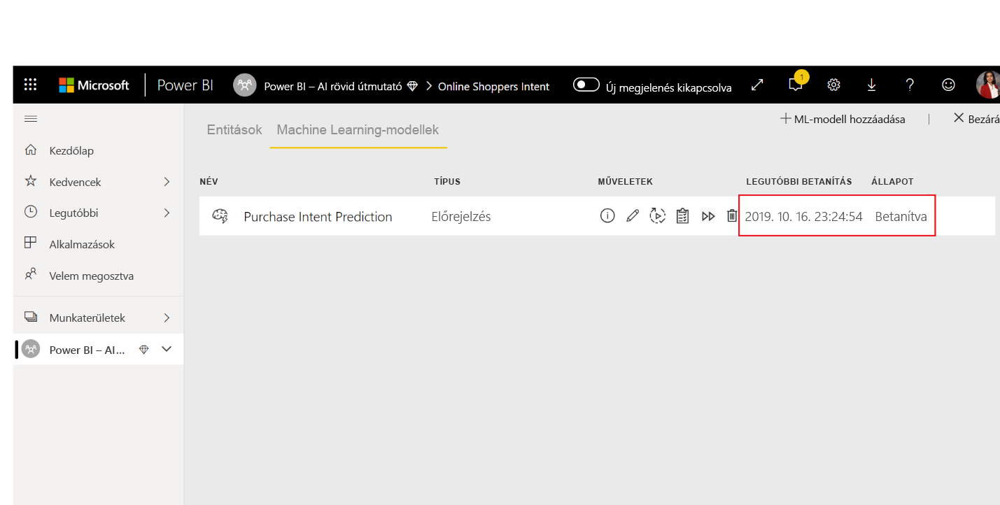

## A modell ellenőrzési jelentésének áttekintése
A modell ellenőrzési jelentésének áttekintéséhez a Gépi tanulási modellek lapon kattintson a Betanítási jelentés megtekintése gombra a modellhez tartozó Műveletek oszlopban. A jelentés a gépi tanulási modell valószínű teljesítményét ismerteti.

A modell legfontosabb előrejelzőinek megtekintéséhez a jelentés **Modell teljesítménye** oldalán válassza a **Legfontosabb előrejelzők** megtekintése elemet. Ha kijelöli valamelyik előrejelzőt, megtekintheti a hozzá tartozó eredmények eloszlását.

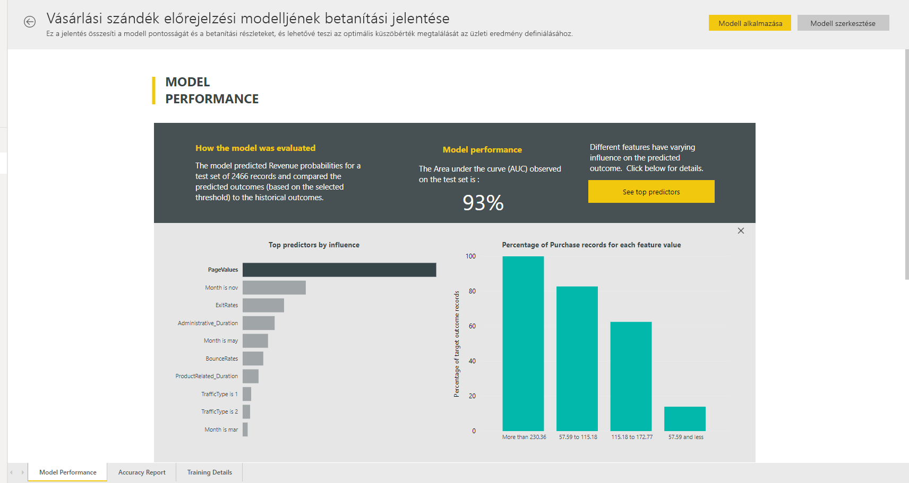

A Modell teljesítménye oldalon lévő **Valószínűségi küszöb** szeletelő használatával megvizsgálhatja a Pontosságra és Visszahívásra gyakorolt hatást.

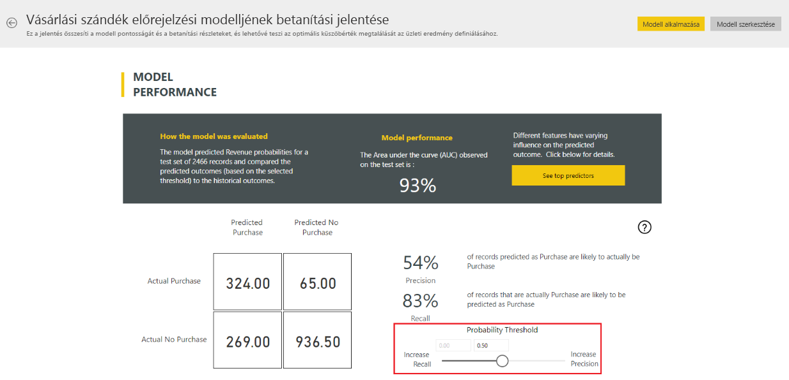

A jelentés további oldalai a modell teljesítményének statisztikai mérőszámait ismertetik.

A jelentés egy Betanítási adatok lapot is tartalmaz, amely ismerteti a futtatott iterációkat, a funkciók bemenetekből kinyeréséhez használt módszereket és a felhasznált végső modell hiperparamétereit.

## A modell alkalmazása egy adatfolyam-entitásra

Kattintson a jelentés tetején látható **Modell alkalmazása** gombra a modell meghívásához. Az **Alkalmaz** párbeszédpanelen megadhatja azt a célentitást, amelynek adataira a modellt alkalmazni kell.

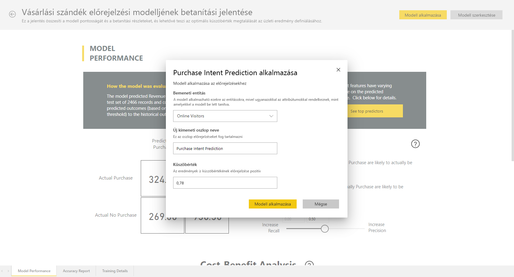

Amikor a rendszer erre kéri, **frissítse** az adatfolyamot a modell eredményeinek megtekintéséhez.

A modell alkalmazása két új entitást hoz létre, az **enriched <modellnév>** (bővített <modellnév>), illetve a **<modellnév> explanations** (<modellnév> magyarázatai) utótaggal. Ebben az esetben a modell **Online Visitors** (Online látogatók) entitásra való alkalmazásakor a modell előrejelzett kimenetét tartalmazó **Online Visitors enriched Purchase Intent Prediction**, illetve az előrejelzés legfontosabb rekordspecifikus befolyásoló tényezőit tartalmazó **Online Visitors enriched Purchase Intent Prediction explanations** entitás jön létre. 

A bináris előrejelzési modell alkalmazása négy oszlopot hoz létre, amelyek az előrejelzett eredményt, a valószínűségi pontszámot, a legfőbb rekordspecifikus befolyásoló tényezőket, illetve a magyarázatindexet tartalmazzák, előtagjuk pedig a megadott oszlopnév.  

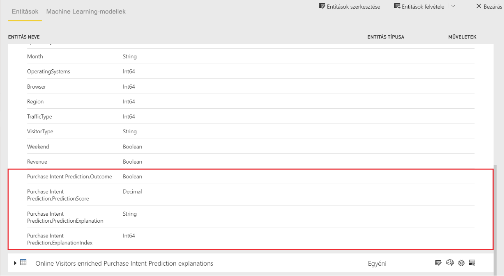

Miután az adatfolyam frissítése lezajlott, az eredményeket az **Online Visitors enriched Purchase Intent Prediction** entitást kiválasztva tekintheti meg.

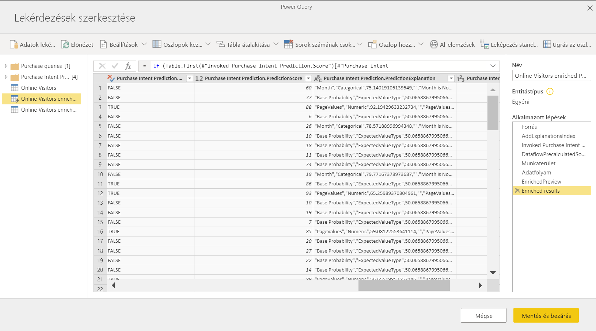

## A modell pontozott kimenetének felhasználása Power BI-jelentésben

A gépi tanulási modellből származó pontozott kimenetek használatához a Adatfolyamok összekötővel csatlakozhat az adatfolyamhoz a Power BI Desktopból. Az **Online Visitors enriched Purchase Intent Prediction** entitás segítségével mostantól beillesztheti a modellből származó előrejelzéseket a Power BI-jelentésekbe.

## Következő lépések

Ebben az oktatóanyagban bináris előrejelzési modellt hozott létre és alkalmazott a Power BI-ban az alábbi lépéseket követve:

* Adatfolyam létrehozása a bemeneti adatokkal
* Gépi tanulási modell létrehozása és betanítása
* A modell ellenőrzési jelentésének áttekintése
* A modell alkalmazása egy adatfolyam-entitásra
* A modell pontozott kimenetének felhasználása Power BI-jelentésben

A gépi tanulás Power BI-ban történő automatizálásával kapcsolatos további információért lásd: [Automatizált gépi tanulás a Power BI-ban](service-machine-learning-automated.md).
