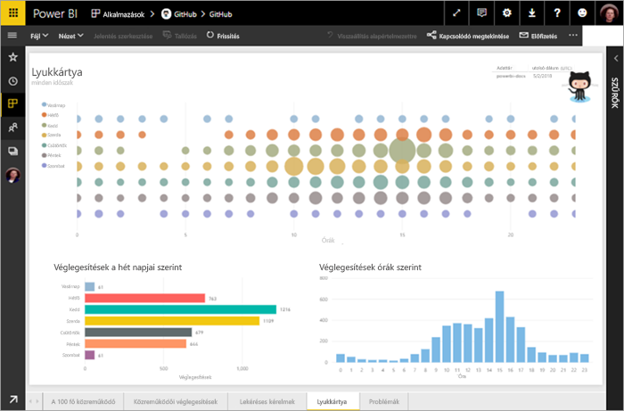
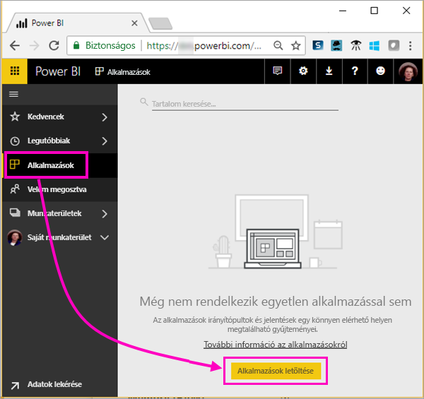
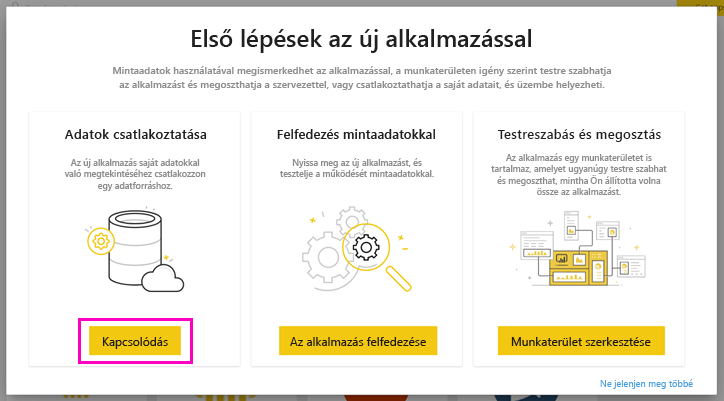
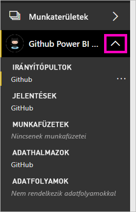
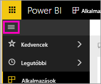
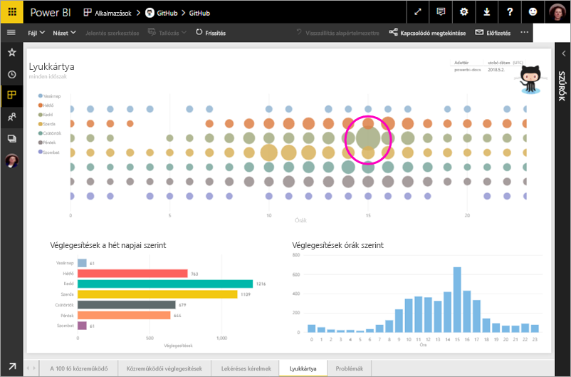
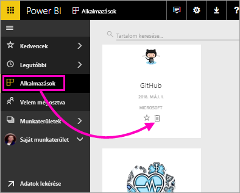

# Oktatóanyag: Csatlakozás GitHub-adattárhoz a Power BI segítségével
Ebben az oktatóanyagban valódi, GitHub szolgáltatásbeli adatokhoz csatlakozhat a Power BI segítségével, és automatikusan hozhat létre Power BI-irányítópultokat és -jelentéseket. A Power BI nyilvános adattárához (más néven *tárházához*) fog csatlakozni, hogy választ kapjon olyan kérdésekre, mint: Hány közreműködő dolgozik a nyilvános Power BI-tartalmon? kik a fő közreműködők, a hét mely napján történik a legtöbb közreműködés, és sok más kérdés. 

A jelen oktatóanyagban az alábbi lépéseket fogja végrehajtani:

> [!div class="checklist"]
> * GitHub-fiók létrehozása, ha még nincs fiókja 
> * Bejelentkezés a Power BI-fiókjába, vagy regisztrálás, ha még nincs fiókja
> * A Power BI szolgáltatás megnyitása
> * A GitHub alkalmazás megkeresése
> * Adatok megadása a Power BI nyilvános GitHub-adattárának eléréséhez
> * A GitHub-adatokból készült irányítópult és jelentés megtekintése
> * Erőforrások felszabadítása az alkalmazás törlésével

Ha még nem regisztrált a Power BI-ra, a kezdés előtt [hozzon létre egy ingyenes próbaverziós fiókot](https://app.powerbi.com/signupredirect?pbi_source=web).

## Előfeltételek

Az oktatóanyag követéséhez létre kell hoznia egy GitHub-fiókot, ha nincs még fiókja. 

- Hozzon létre egy [GitHub-fiókot](https://docs.microsoft.com/contribute/get-started-setup-github).

## Csatlakozás
1. Jelentkezzen be a Power BI szolgáltatásba (https://app.powerbi.com). 
2. A bal oldali navigációs panelen válassza az **Alkalmazások** ikont, majd az **Alkalmazások letöltése** lehetőséget.
   
    

3. Válassza az **Alkalmazások** lehetőséget, írja be a **GitHub** szöveget a keresőmezőbe, majd válassza a **Letöltés most** gombot.
   
    

4. A **Telepíti ezt a Power BI-alkalmazást?** területen válassza a **Telepítés** lehetőséget.
5. **Az új alkalmazása elkészült** területen válassza az **Ugrás az alkalmazáshoz** lehetőséget.
6. **Az új alkalmazás használatának első lépései** résznél válassza az **Csatlakozás** lehetőséget.

    

7. Adja meg az adattár nevét és tulajdonosát. Az adattár URL-címe https://github.com/MicrosoftDocs/powerbi-docs, az **Adattár tulajdonosa** a **MicrosoftDocs**, az **Adattár** neve pedig **powerbi-docs**. 
   
    

5. Adja meg a GitHub-fiókja hitelesítő adatait. Előfordulhat, hogy a Power BI kihagyja ezt a lépést, ha korábban már bejelentkezett a GitHubba a böngészőjében. 

6. A **Hitelesítési módszernél** hagyja kijelölve az **oAuth2** bejelentkezési lehetőséget \> **jelentkezzen be**.

7. Kövesse a GitHub-hitelesítés lépéseit. Engedélyezze a Power BI-nak a GitHub-adatok elérését.
   
   A Power BI ezután már képes elérni a GitHub szolgáltatást az adatok beolvasásához.  Az adatok naponta egyszer frissülnek.

8. Miután a Power BI importálta az adatokat, megjelenik az új GitHub-munkaterület tartalma. 
9. Kattintson a munkaterület neve melletti nyílra a bal oldali navigációs sávon. Láthatja, hogy a munkaterület egy irányítópultot és egy jelentést tartalmaz. 

    

10. Válassza az irányítópult neve melletti **További lehetőségek** (...) elemet, majd az **Átnevezés** menüpontot, és gépelje be a **GitHub-irányítópult** nevet.
 
     

8. Válassza a globális navigációs ikont a bal oldali navigációs panel kis méretűre állításához, hogy több szabad hely legyen a képernyőn.

    

10. Válassza ki a GitHub-irányítópultot.
    
    A GitHub-irányítópult élő adatokat tartalmaz, ezért az Ön által látott értékek eltérhetnek az itt szemléltetettől.

    

    

## Kérdés feltevése

1. Vigye a kurzort a **Tegyen fel kérdést az adataival kapcsolatban** területre. A Power BI felkínál néhány **kérdést a kezdéshez**. 

1. Válassza a **how many users are there** (Hány felhasználó van?) kérdést.
 
    

13. A **how many** és a **users are there** közé gépelje be a **pull requests per** szöveget. 

     A Power BI ekkor létrehoz egy sávdiagramot, melyen a lekéréses kérelmek személyenkénti száma (pull requests per user) látható.

    

13. Rögzítse az irányítópulton a rajzszög választásával, majd **lépjen ki a Q&A-ból**.

## GitHub-jelentés megtekintése 

1. Válassza a GitHub-irányítópulton a **Pull Requests by Month** (Lekéréses kérelmek hónapok szerint) oszlopdiagramot a vonatkozó jelentés megnyitásához.

    

2. Jelöljön ki egy felhasználónevet a **Total pull requests by user** (Összes lekéréses kérelem felhasználó szerint) diagramon. Ezen a példán az látható, hogy a többség februárra esik.

    

3. Válassza a **Punch Card** (Pontgyűjtés) fület a jelentés következő lapjának megtekintéséhez. 
 
    

    Úgy tűnik, hogy kedd 15 óra az a leggyakoribb nap és időpont, amikor a felhasználók *véglegesítik* a munkájukat, azaz beadják az általuk végzett módosításokat.

## Erőforrások felszabadítása

Most, hogy befejezte ezt az oktatóanyagot, törölheti a GitHub alkalmazást. 

1. A bal oldali navigációs sávon válassza az **Alkalmazások** lehetőséget.
2. Vigye a mutatót a GitHub csempe fölé, és válassza a **Törlés** lehetőséget.

    

## Következő lépések

Ebben az oktatóanyagban csatlakozott egy nyilvános GitHub-adattárhoz, és beolvasta az adatokat, melyeket a Power BI irányítópultként és jelentésként formázott. Ezután megválaszolt néhány kérdést az adatokkal kapcsolatban az irányítópult és a jelentés felfedezésével. Folytatásként megismerheti, hogy hogyan csatlakozhat más szolgáltatásokhoz, mint például a Salesforce, a Microsoft Dynamics és a Google Analytics. 
 
> [!div class="nextstepaction"]
> [Kapcsolódás online szolgáltatásokhoz](service-connect-to-services.md)

