# Oktatóanyag: Machine Learning Studio-modell meghívása a Power BI-ban (előzetes verzió)

Ebben az oktatóanyagban azt a folyamatot vizsgáljuk meg, amellyel az **Azure Machine Learning Studio**-modellből lehet információkat beépíteni a Power BI-ba. Az oktatóanyag útmutatást nyújt a következőkhöz is: jogosultság adása Power BI-felhasználónak az Azure ML-modellhez való hozzáféréshez; adatfolyam létrehozása; valamint az Azure ML-modellből származó információk alkalmazása az adatfolyamban. Hivatkozást is talál benne egy rövid útmutatóhoz, amelynek segítségével létrehozhat egy Azure ML-modellt, ha még nem rendelkezik modellel.

Az oktatóanyag az alábbi lépéseket tartalmazza:

> [!div class="checklist"]
> * Azure Machine Learning-modell létrehozása és közzététele
> * Hozzáférés biztosítása Power BI-felhasználónak a modell használatához
> * Adatfolyam létrehozása
> * Az Azure ML-modellből származó adatok használata az adatfolyamban

## Azure ML-modell létrehozása és közzététele

Kövesse az [Útmutató 1. lépés: Machine Learning Studio-munkaterület létrehozása](https://docs.microsoft.com/azure/machine-learning/studio/walkthrough-1-create-ml-workspace) című anyag útmutatásait **Machine Learning**-munkaterület létrehozásához.

Ugyanezeket a lépéseket bármely, már létező Azure ML-modell vagy adatkészlet esetén is használhatja. Ha még nincs közzétett modellje, percek alatt létrehozhat egy modellt az [Első adatelemzési kísérlet létrehozása az Azure Machine Learning Studióban](https://docs.microsoft.com/azure/machine-learning/studio/create-experiment) című témakör útmutatásai alapján, amelyben Azure ML-modell állítható be autók árának előrejelzéséhez.

Az [Azure Machine Learning Studio-webszolgáltatás üzembe helyezése](https://docs.microsoft.com/azure/machine-learning/studio/publish-a-machine-learning-web-service) című témakör lépéseit követve webszolgáltatásként közzéteheti az Azure ML-modellt.

## Hozzáférés biztosítása Power BI-felhasználó számára

Ahhoz, hogy a Power BI-ból hozzáférjen az Azure ML-modellhez, **Olvasási** jogosultsággal kell rendelkeznie az Azure-előfizetéshez és az erőforráscsoporthoz, és **Olvasási** jogosultsággal az Azure Machine Learning Studio-webszolgáltatáshoz a Machine Learning Studio-modelleknél.  Azure Machine Learning Service-modellek esetén **olvasási** hozzáférésre van szükség a Machine Learning Service-munkaterülethez.

Az alábbi lépésekben azt feltételezzük, hogy Ön az egyik adminisztrátora annak az Azure-előfizetésnek és erőforráscsoportnak, amelyben a modell közzé lett téve.

Jelentkezzen be az [Azure Portalra](https://portal.azure.com), majd keresse meg az **Előfizetések** oldalt, amelyet megtalálhat a navigációs menü **Minden szolgáltatás** listájában is.

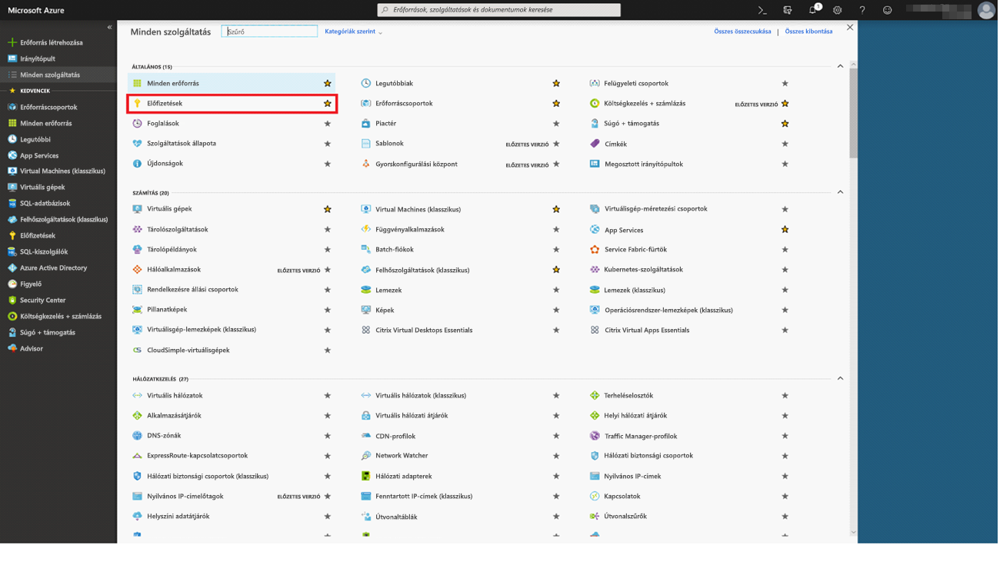

Válassza ki azt az Azure-előfizetést, amelyet a modell közzétételéhez használt, majd válassza a **Hozzáférés-vezérlés (IAM)** lehetőséget. Válassza a **Szerepkör-hozzárendelés hozzáadása**, majd az **Olvasó** lehetőséget, és válassza ki a megfelelő Power BI-felhasználót. Ha végzett, kattintson a **Mentés** gombra. Az alábbi képen ezek a kiválasztások láthatóak.

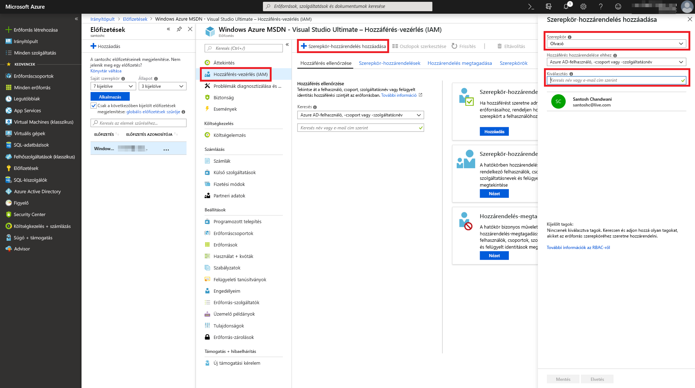

A fenti lépések megismétlésével biztosíthat **Közreműködői** szerepkör-hozzáférést a Power BI-felhasználónak ahhoz a konkrét Machine Learning-webszolgáltatáshoz, amelyben az Azure ML-modell üzembe lett helyezve.

## Adatfolyam létrehozása

### Adatok beszerzése az adatfolyam létrehozásához

Jelentkezzen be a Power BI szolgáltatásba azokkal a felhasználói hitelesítő adatokkal, amelyekhez hozzáférést biztosított az Azure ML-modellhez az előző lépésben.

Ebben a lépésben azt feltételezzük, hogy Ön már rendelkezik azokkal az adatokkal CSV-formátumban, amelyeket pontozni szeretne az Azure ML-modellben.  Ha a Machine Learning Studióban a modell létrehozásához az **Autóárak kísérletet** használta, az ehhez tartozó adatkészlet az alábbi hivatkozással megosztva elérhető:

* [Azure Learning Studio-mintamodell](https://github.com/santoshc1/PowerBI-AI-samples/blob/master/Tutorial_MLStudio_model_integration/Automobile%20price%20data%20_Raw_.csv)

### Adatfolyam létrehozása

Ahhoz, hogy létre tudja hozni az adatfolyamban az entitásokat, be kell jelentkeznie a Power BI szolgáltatásba. Lépjen egy olyan munkaterületre a dedikált kapacitásán belül, amelyben engedélyezve van az AI előzetes verzió.

Ha még nincs munkaterülete, létrehozhat egyet. Ehhez válassza a **Munkaterületek** elemet a bal oldali menüben, majd a panel alján válassza az **Alkalmazás-munkaterület létrehozása** lehetőséget.  Ez megnyit egy panelt, ahol megadhatja a munkaterület adatait. Írja be a munkaterület nevét, majd válassza a **Mentés** lehetőséget.

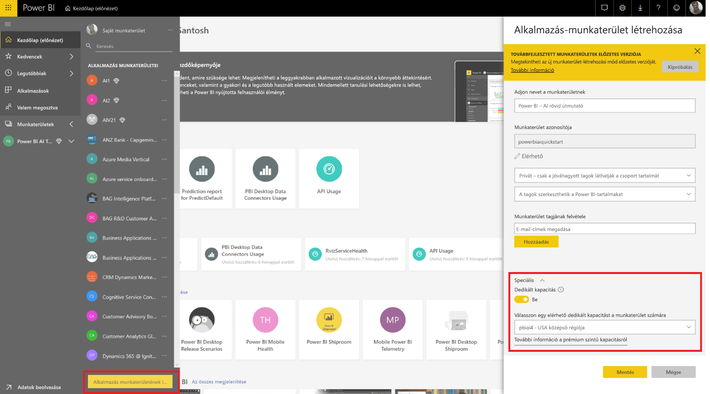

Ha létrehozta a munkaterületet, az üdvözlő képernyő alján válassza a **Kihagyás** lehetőséget.

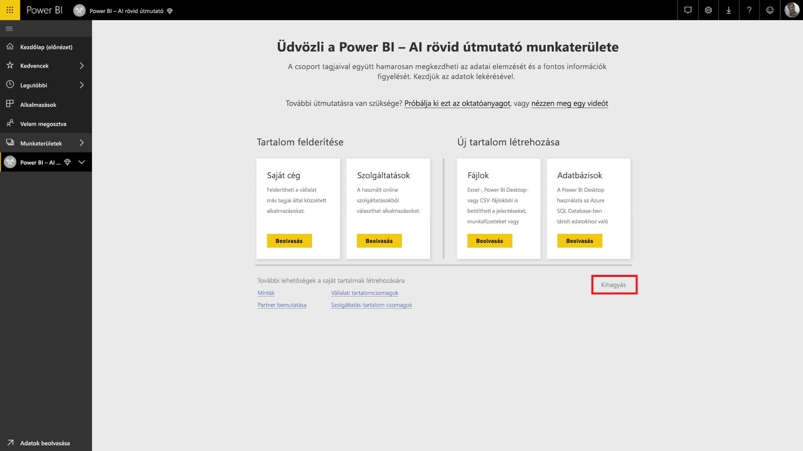

Válassza az **Adatfolyamok (előzetes verzió)** lapot, majd válassza a **Létrehozás** lehetőséget a munkaterület jobb felső sarkában, majd válassza az **Adatfolyam** elemet.

Válassza az **Új entitások hozzáadása** lehetőséget, amely elindítja a **Power Query-szerkesztőt** a böngészőben.

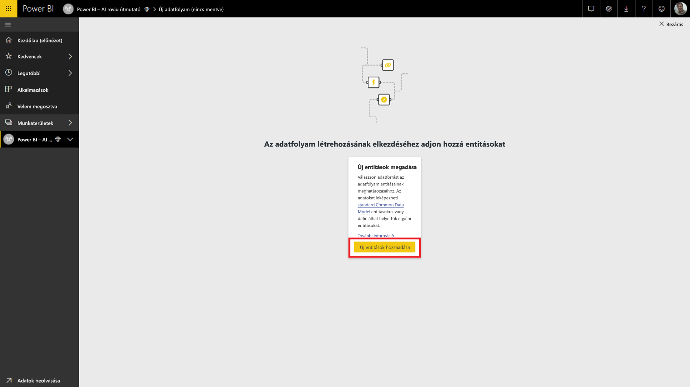

Adatforrásként válassza a **Szöveg/CSV-fájl** lehetőséget.

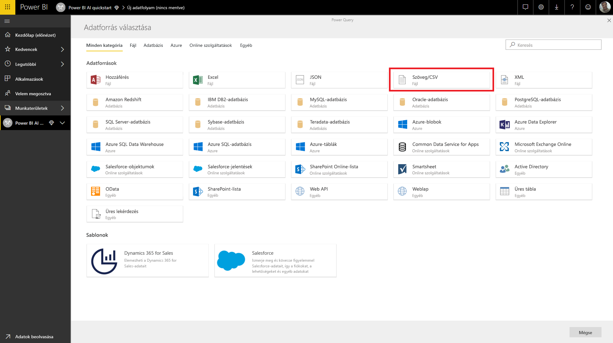

A következő képernyőn a rendszer kérni fogja, hogy kapcsolódjon egy adatforráshoz. Illessze be azoknak az adatoknak a hivatkozását, amelyet az Azure ML-modell létrehozásához is használt. Ha az _Autógyártási árak_ adatokat használta, az alábbi hivatkozást illessze be a **Fájl elérési útja vagy URL-cím** szövegmezőbe, majd válassza a **Következő** elemet.

`https://raw.githubusercontent.com/MicrosoftLearning/Principles-of-Machine-Learning-Python/master/Module7/Automobile%20price%20data%20_Raw_.csv`

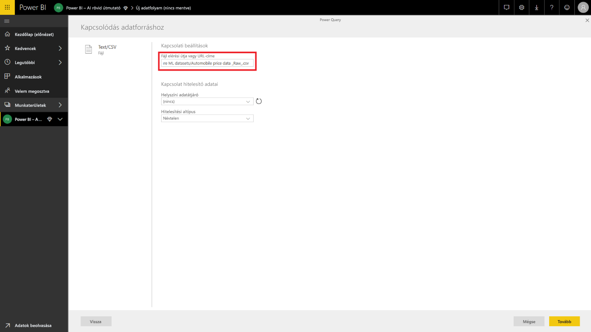

A Power Query-szerkesztő megjeleníti a CSV-fájl adatainak előnézetét. A parancssávon válassza a **Tábla átalakítása** elemet, majd válassza az **Első sor használata fejlécként** lehetőséget.  Ez hozzáadja az _Előléptetett fejlécek_ lekérdezési lépést a jobb oldali **Alkalmazott lépések** panelhez. A jobb oldali panelen a lekérdezést át is nevezheti, és választhat egy beszédesebb nevet is, például _Autóárak_.

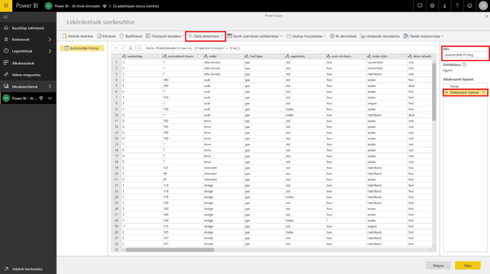

A forrásadatkészletünkben vannak „?” jelölésű ismeretlen értékek is.  Ezt megtisztíthatjuk úgy, ha a „?” karaktereket „0”-ra cseréljük, hogy elkerüljük a későbbi esetleges problémákat.  Válassza ki a *normalized-losses*, *bore*, *stroke*, *compression-ratio*, *horsepower*, *peak-rpm* és *price* nevű oszlopokat az oszlopfejlécre kattintással, majd kattintson az „Oszlopok átalakítása” lehetőségre, és válassza az „Értékek lecserélése” lehetőséget.  Cserélje le a „?”-et a „0” értékre.

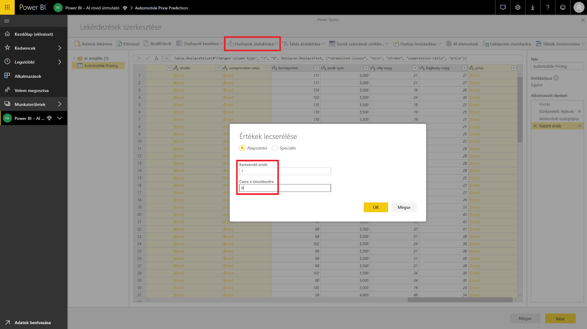

A Szöveges/CSV-forrásból származó tábla minden oszlopa szöveges oszlopként lesz kezelve.  Most a numerikus oszlopokat kell módosítanunk a megfelelő adattípusokra.  A Power Queryben ez úgy végezhető el, ha az oszlopfejlécben az adattípus szimbólumra kattint.  Az oszlopokat módosítsa az alábbi típusokra:

- **Egész szám**:  symboling, normalized-losses, curb-weight, engine-size, horsepower, peak-rpm, city-mpg, highway-mpg, price
- **Tizedes tört**:  wheel-base, length, width, height, bore, stroke, compression-ratio

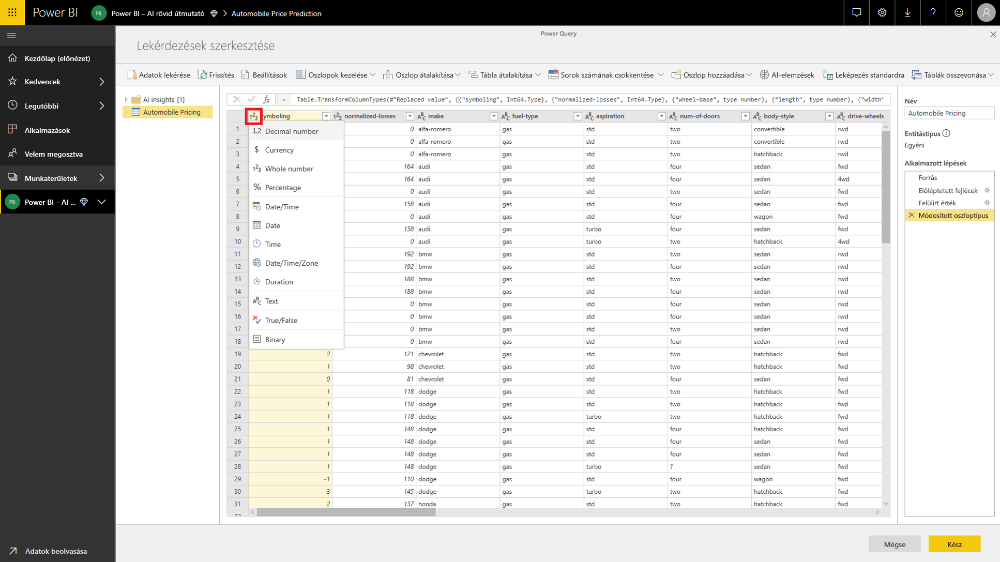

A Power Query-szerkesztő bezárásához válassza a **Kész** lehetőséget. Most megjelenik az entitások listája az _Autóárak_ adatokkal, amelyeket most adtunk hozzá. A jobb felső sarokban válassza a **Mentés** lehetőséget, adjon nevet az adatfolyamnak, majd válassza a **Mentés** lehetőséget.

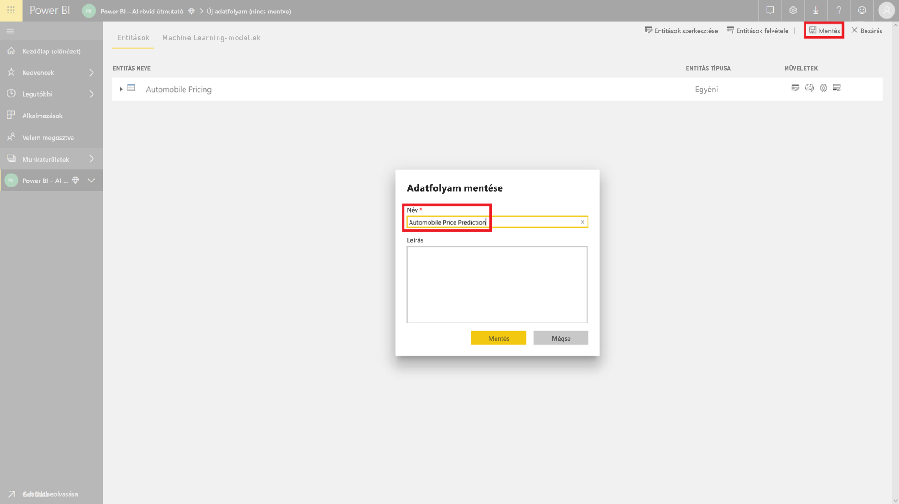

### Az adatfolyam frissítése

Ha menti az adatfolyamot, megjelenik egy értesítés az adatfolyam mentéséről. Válassza a **Frissítés most** lehetőséget – ezzel betölti az adatokat a forrásból az adatfolyamba.

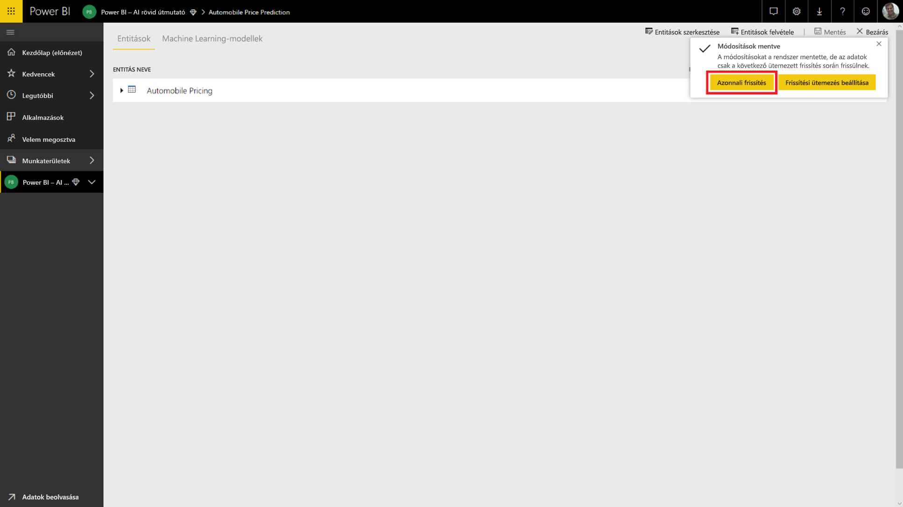

A jobb felső sarokban válassza a **Bezárás** lehetőséget, és várja meg, amíg az adatfolyam frissítése befejeződik.

Az adatfolyamot a **Műveletek** parancsok használatával is frissítheti. Az adatfolyam megjeleníti a frissítés befejeződésének időbélyegzőjét is.

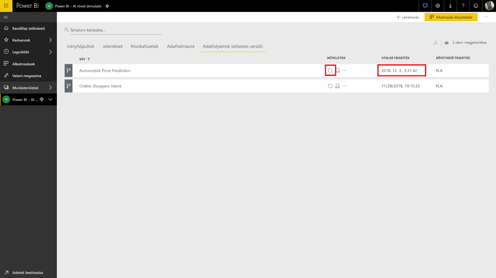

## Az Azure ML-modellből származó adatok alkalmazása

Az _Autós árelőrejelzés_ Azure ML-modellhez való hozzáféréshez szerkesztheti az _Autós árak_ entitást, amelyhez hozzá szeretnénk adni az előrejelzett árat.

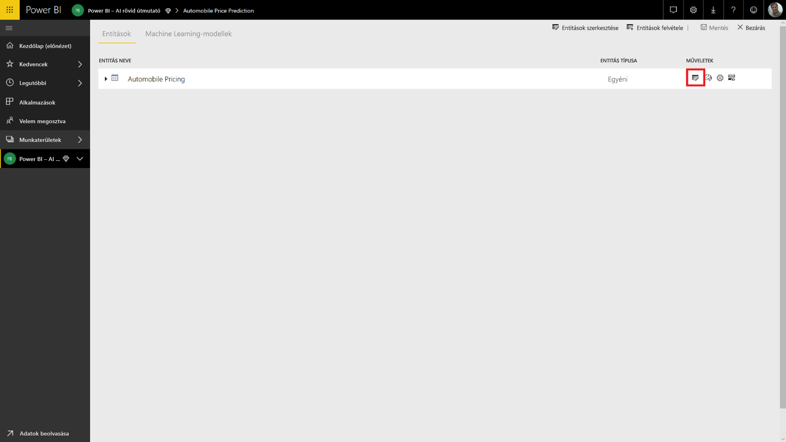

A **Szerkesztés** ikon kiválasztásával megnyílik a Power Query-szerkesztő az adatfolyam entitásaival.

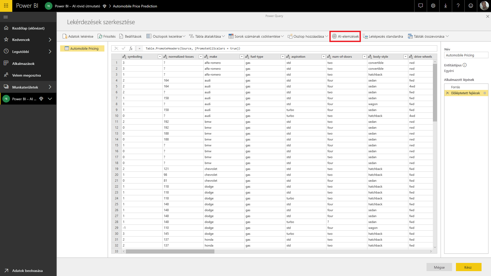

Válassza a menüszalag **AI-elemzések** gombját, majd a bal oldali navigációs menü _Azure Machine Learning-modellek_ elemét.

Azok az Azure ML-modellek, amelyekhez hozzáférést kapott, Power Query-függvényekként jelennek meg az *AzureML* előtaggal.  Ha az _AutomobilePricePrediction_ modellnek megfelelő függvényre kattint, a modell webszolgáltatásának paraméterei függvényparaméterekként lesznek listázva.

Az Azure ML-modell meghívásához bemenetként a kijelölt entitás bármelyik oszlopát megadhatja. Emellett megadhat egy állandó értéket is, amelyet bemenetként használhat. Ehhez a bemeneti párbeszédpanelen be kell kapcsolnia az oszlop ikont. Ha egy oszlopnév megegyezik valamelyik függvény paraméternevével, az oszlopot a rendszer automatikusan bemenetként javasolja.  Ha az oszlopnév nem egyezik, kiválaszthatja azt a legördülő listából.

Az _Automobile Pricing Prediction_ modell esetén a bemeneti paraméterek az alábbiak:

- make
- body-style
- wheel-base
- engine-size
- horsepower
- peak-rpm
- highway-mpg

Esetünkben a tábla megegyezik a modell betanításához használt adatkészlettel, ezért minden paraméternél a megfelelő oszlop van kiválasztva.

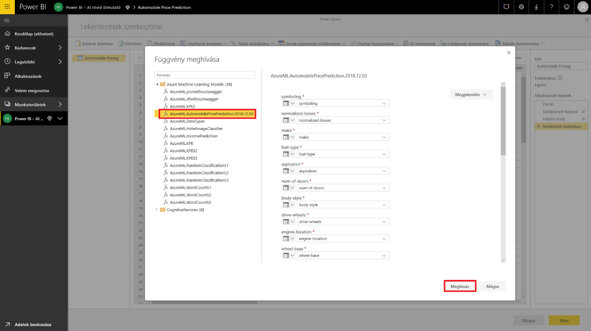

A **Meghívás** lehetőséggel megtekintheti az Azure ML-modell kimenetét új oszlopként az entitástáblában. Láthatja, hogy a modell meghívása a lekérdezés lépéseként is megjelenik.

A modell kimenete a kimeneti oszlop rekordjaként jelenik meg. Az oszlop kibontásával több egyéni kimeneti paramétert kaphat különálló oszlopokban. Esetünkben csak a _Scored Labels_ (Pontozott címkék) az érdekes, amely az autók előrejelzett árát tartalmazza.  Ezért megszüntetjük a többi kiválasztását, és az **OK** gombot választjuk.

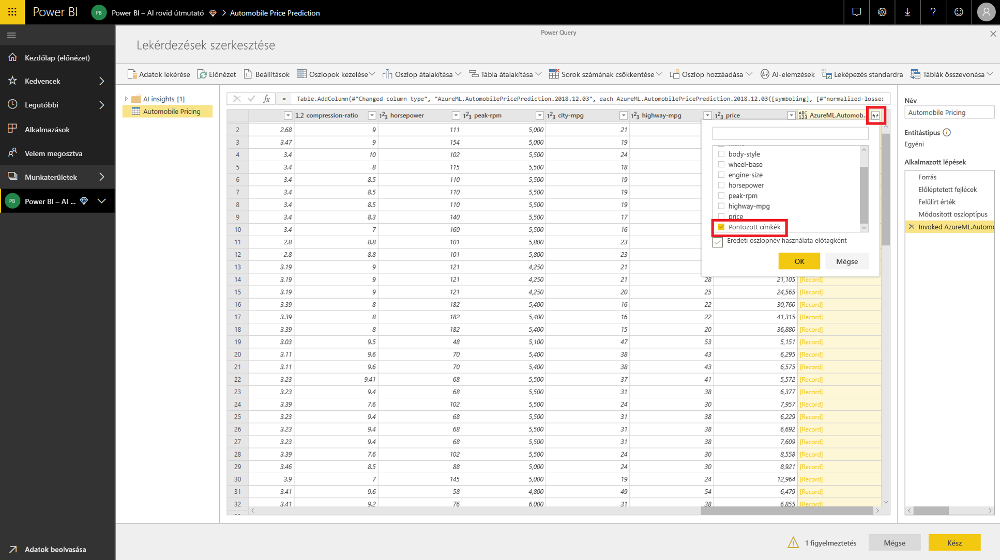

Az eredményül kapott *Scored Labels* oszlopban megtalálhatók az Azure ML-modellből származó árelőrejelzések.

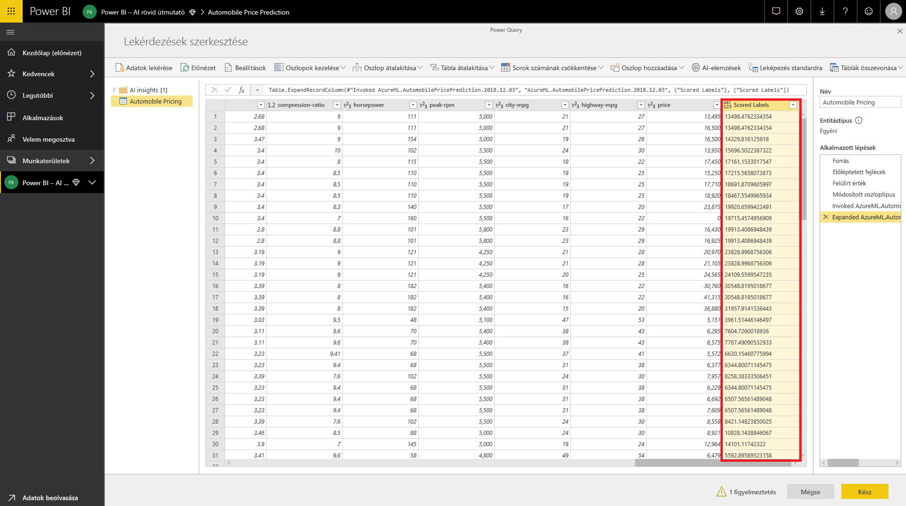

Az adatfolyam mentése után a rendszer az entitástábla minden új vagy frissített sora esetén automatikusan meghívja az Azure ML-modellt, amikor az adatfolyam frissül.

## Erőforrások felszabadítása

Ha már nincs szüksége az ennek a cikknek a használata közben létrehozott Azure-erőforrásokra, törölje azokat, hogy ne kelljen díjat fizetnie értük.  Ha már nincs szüksége rájuk, a létrehozott adatfolyamokat is törölheti.

## Következő lépések

Ebben az oktatóanyagban létrehozott egy egyszerű kísérletet az Azure Machine Learning Studióval egy egyszerű adatkészlet használatával az alábbi lépéseket követve:

- Azure Machine Learning-modell létrehozása és közzététele
- Hozzáférés biztosítása Power BI-felhasználónak a modell használatához
- Adatfolyam létrehozása
- Az Azure ML-modellből származó adatok használata az adatfolyamban

[Az Azure Machine Learning integrálása a Power BI-jal (Előzetes verzió)](service-machine-learning-integration.md) című témakörben további információt talál arról, hogyan integrálható az Azure Machine Learning a Power BI-ban.
