# <a name="tutorial-use-cognitive-services-in-power-bi"></a>Oktatóanyag: A Cognitive Services használata a Power BI-ban

A Power BI-ban elérhető több Azure Cognitive Services-funkció is, amelyekkel bővítheti az adatfolyamok adatait az önkiszolgáló adat-előkészítésnél. A támogatott szolgáltatások jelenleg a következők: [Hangulatelemzés](https://docs.microsoft.com/azure/cognitive-services/text-analytics/how-tos/text-analytics-how-to-sentiment-analysis), [Kulcsszókeresés](https://docs.microsoft.com/azure/cognitive-services/text-analytics/how-tos/text-analytics-how-to-keyword-extraction), [Nyelvfelismerés](https://docs.microsoft.com/azure/cognitive-services/text-analytics/how-tos/text-analytics-how-to-language-detection) és [Képcímkézés](https://docs.microsoft.com/azure/cognitive-services/computer-vision/concept-tagging-images). Az átalakítások a Power BI szolgáltatásban vannak végrehajtva, és nem igényelnek Azure Cognitive Services-előfizetést. Ennek a funkciónak a használatához Power BI Premium szükséges.

A Cognitive Services átalakításai támogatva vannak az [Adatfolyamokhoz való önkiszolgáló adat-előkészítésnél](https://powerbi.microsoft.com/blog/introducing-power-bi-data-prep-wtih-dataflows/). A kezdéshez használja az alábbi, szövegelemzéshez és képcímkézéshez használható lépésenkénti példákat.

Az oktatóanyag a következőket ismerteti:

> [!div class="checklist"]
> * Adatok importálása az adatfolyamba
> * Véleménypontszám és kulcsszavak keresése adatfolyam szöveges oszlopában
> * Csatlakozás az eredményekhez a Power BI Desktopból


## <a name="prerequisites"></a>Előfeltételek

Az oktatóanyag elvégzéséhez az alábbiakra lesz szüksége: 

- Power BI-fiók. Ha még nem regisztrált a Power BI-ra, a kezdés előtt [hozzon létre egy ingyenes próbaverziós fiókot](https://app.powerbi.com/signupredirect?pbi_source=web).
- Hozzáférés Power BI Premium kapacitáshoz az AI számítási feladat engedélyezésével. Az előzetes verzió ideje alatt ez a számítási feladat alapértelmezés szerint ki van kapcsolva. Ha prémium szintű kapacitást használ, és az AI Insights nem jelenik meg, kérje meg a Prémium szintű kapacitás rendszergazdáját, hogy engedélyezze az AI számítási feladatot a felügyeleti portálon.

## <a name="text-analytics"></a>Szövegelemzés

Ennek a szakasznak a lépéseit követve végezze el az oktatóanyag szövegelemzési részét.

### <a name="step-1-apply-sentiment-scoring-in-power-bi-service"></a>1\. lépés: Vélemények pontozása a Power BI szolgáltatásban

Először lépjen a prémium szintű kapacitással rendelkező Power BI-munkaterületre, és hozzon létre egy új adatfolyamot a képernyő jobb felső részén található **Létrehozás** gombbal.

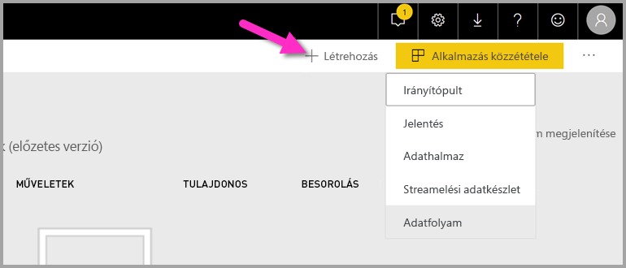

Az adatfolyam párbeszédpanelen megjelennek az új adatfolyam létrehozásához használható lehetőséget. Válassza az **Új entitások hozzáadása** lehetőséget. Az adatforrások menüjében válassza a **Szöveg/CSV** lehetőséget.

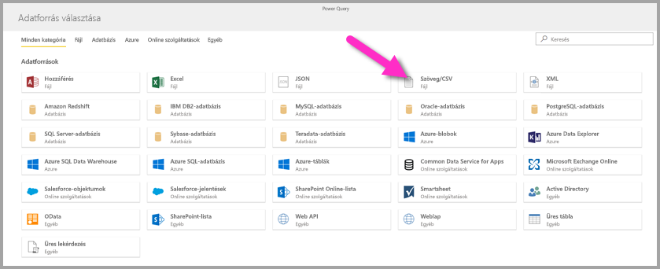

Illessze be ezt az URL-címet az URL-cím mezőbe: [https://pbiaitutorials.blob.core.windows.net/textanalytics/FabrikamComments.csv](https://pbiaitutorials.blob.core.windows.net/textanalytics/FabrikamComments.csv), majd kattintson a **Következő** lehetőségre.

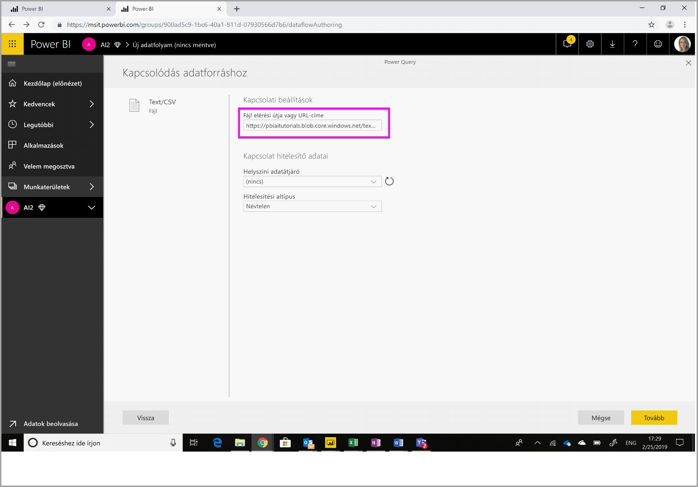

A felső szalagon válassza a **Tábla átalakítása** lehetőséget, majd az **Első sor használata fejlécként** elemet. Az adatok most már használhatók szövegelemzéshez, az ügyfél-megjegyzések oszlopban pedig használhatjuk a Véleménypontozást és a Kulcsszókeresést is.

A Power Query-szerkesztőben válassza az **AI-elemzések** lehetőséget.

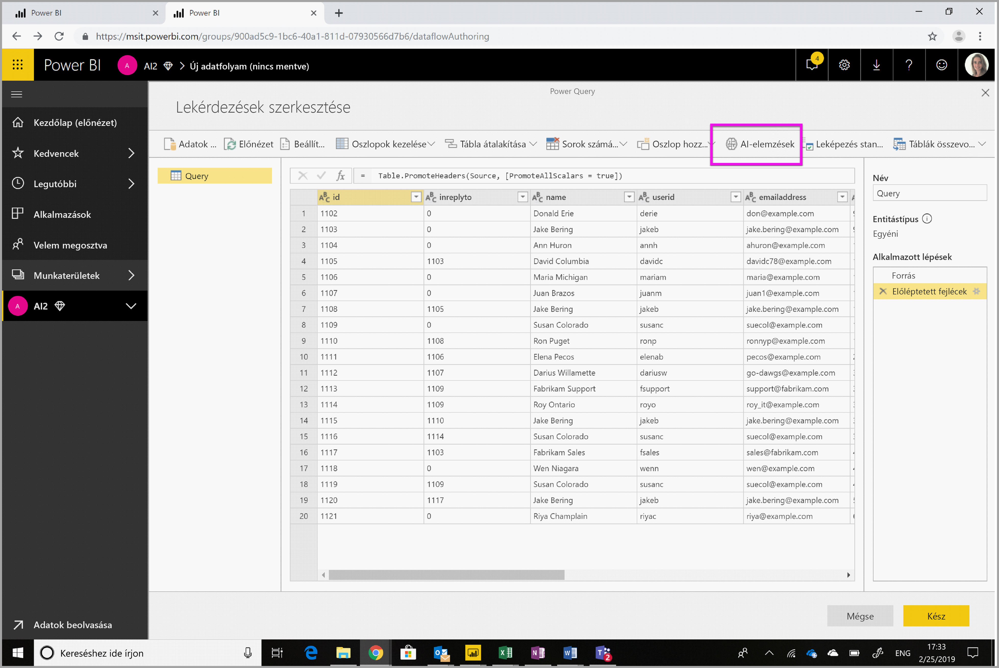

Bontsa ki a **Cognitive Services** mappát, majd válassza ki a használni kívánt függvényt. Ebben a példában a megjegyzés oszlopban található véleményt pontozzuk, de ugyanezeket a lépéseket használva kipróbálhatja a Nyelvfelismerést és a Kulcsszókeresést is.

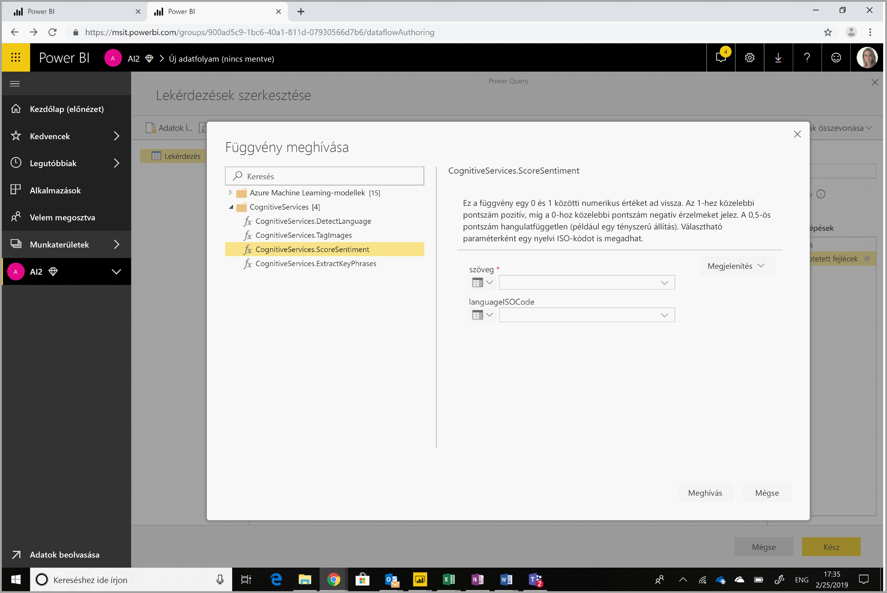

A függvény kiválasztását követően megjelennek a kötelező és a választható mezők. A példában szereplő értékelések véleménypontozásához válassza ki az értékelések oszlopát szöveges bemenetként. A kulturális információ nem kötelező bemenet, és ISO-formátum szükséges hozzá. Ha például angol nyelvűként szeretné kezelni a szöveget, akkor az „en” kódot kell megadnia. Ha ez a mező üres, a Power BI a vélemények pontozása előtt észlelni fogja a nyelvet.

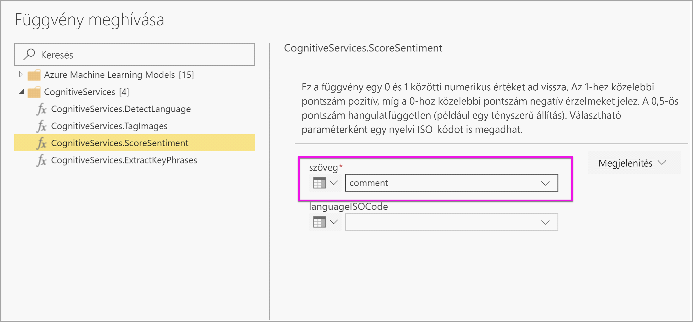

A függvény futtatásához válassza a **Meghívás** lehetőséget. A táblához egy új oszlop lesz hozzáadva, amely tartalmazza az egyes sorok véleménypontszámát. Most visszaléphet az **AI insights** (AI-elemzések) területre, és ugyanezzel a módszerrel elvégezheti a kulcsszókeresést is.

Ha végzett a transzformációkkal, módosítsa a lekérdezés nevét „Ügyfél-megjegyzések” szövegre, és válassza a **Kész** lehetőséget.

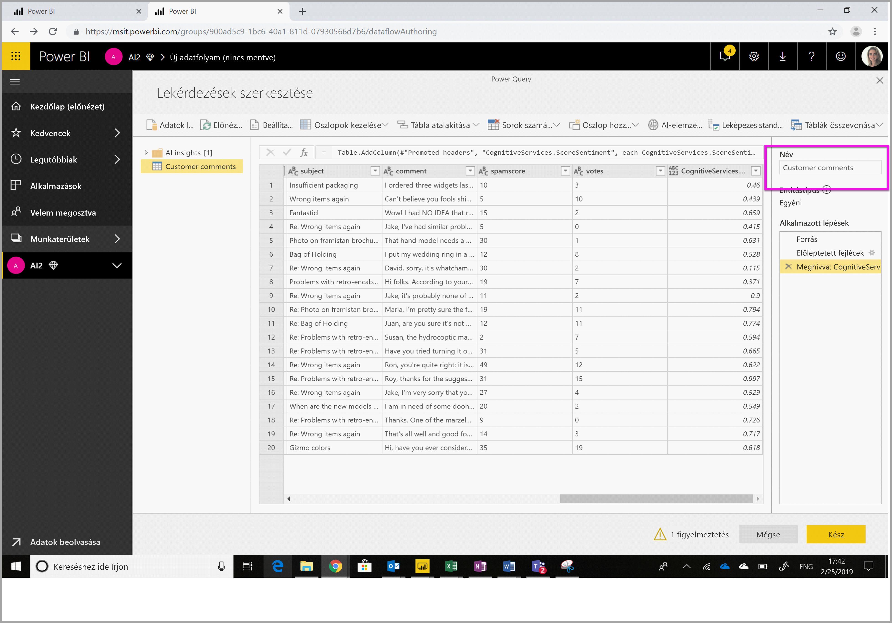

**Mentse** az adatfolyamot, és adja neki a Fabrikam nevet. Válassza az adatfolyam mentése után megjelenő **Frissítés** gombot.

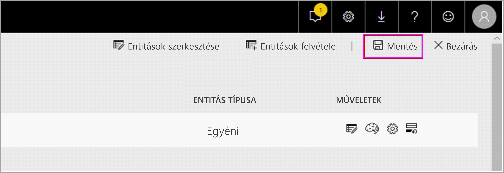

A mentés és frissítés után az adatfolyam már használható Power BI-jelentésben is.

### <a name="step-2-connect-from-power-bi-desktop"></a>2\. lépés: Csatlakozás a Power BI Desktopból

Nyissa meg a Power BI Desktopot. A Kezdőlap menüszalagon válassza az **Adatok lekérése** lehetőséget.

A Power BI szakaszban lépjen a **Power BI-adatfolyamok (Bétaverzió)** területre, majd válassza a **Kapcsolódás** lehetőséget.

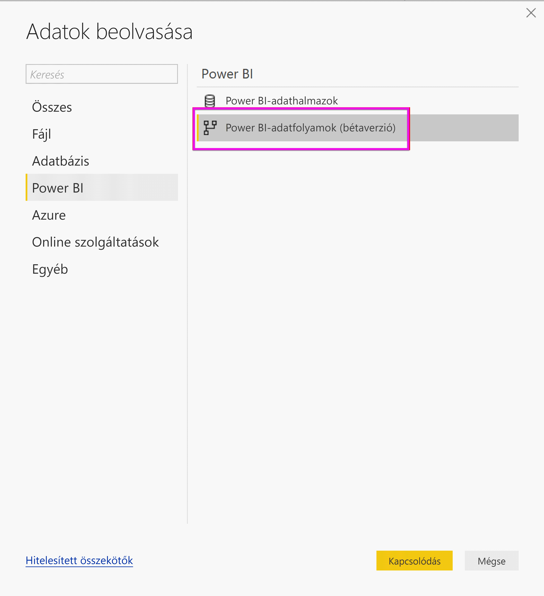

Mivel ez egy előzetes verziójú funkció, az összekötő kérni fogja, hogy fogadja el az előzetes verzió használati feltételeit. Ha ezeket elfogadta, jelentkezzen be szervezeti fiókjával.

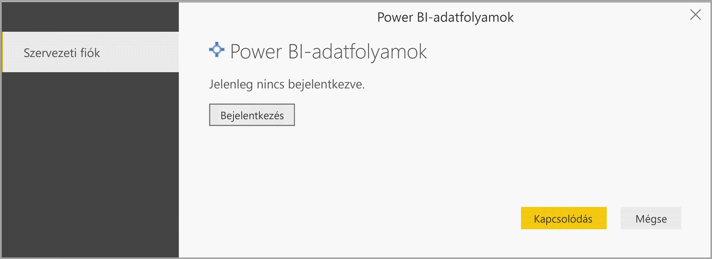

Válassza ki az imént létrehozott adatfolyamot. Keresse meg az ügyfél-megjegyzések táblát, és kattintson a **Betöltés** lehetőségre.

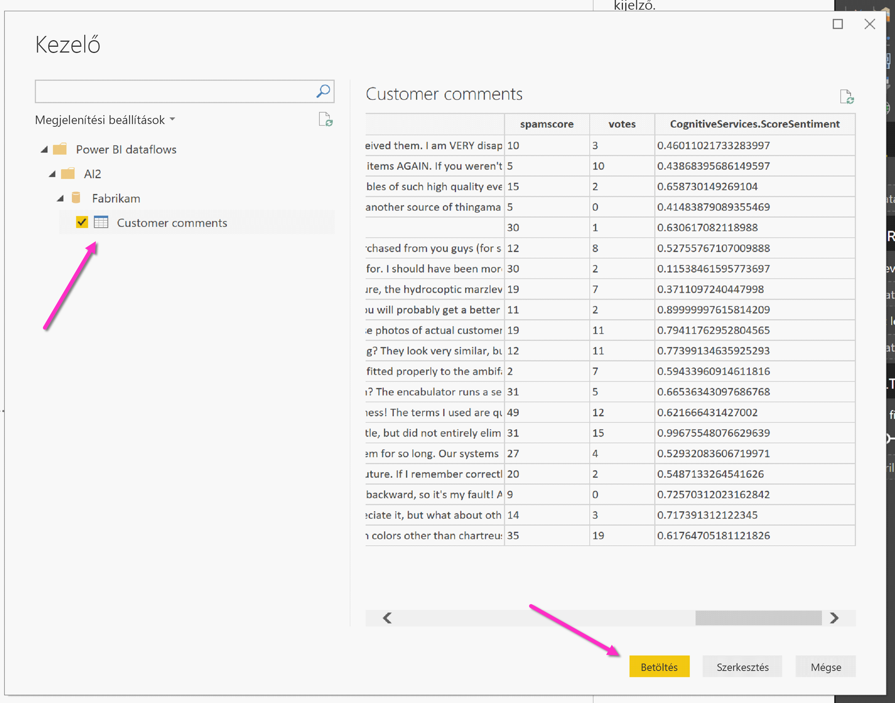

Ha az adatok betöltődtek, elkezdheti létrehozni a jelentést.

## <a name="image-tagging"></a>Képcímkézés

Lépjen egy Prémium szintű kapacitást tartalmazó Power BI-munkaterületre. A képernyő jobb felső sarkában található **Létrehozás** gomb használatával hozzon létre egy új adatfolyamot.


Válassza az **Új entitások hozzáadása** lehetőséget.

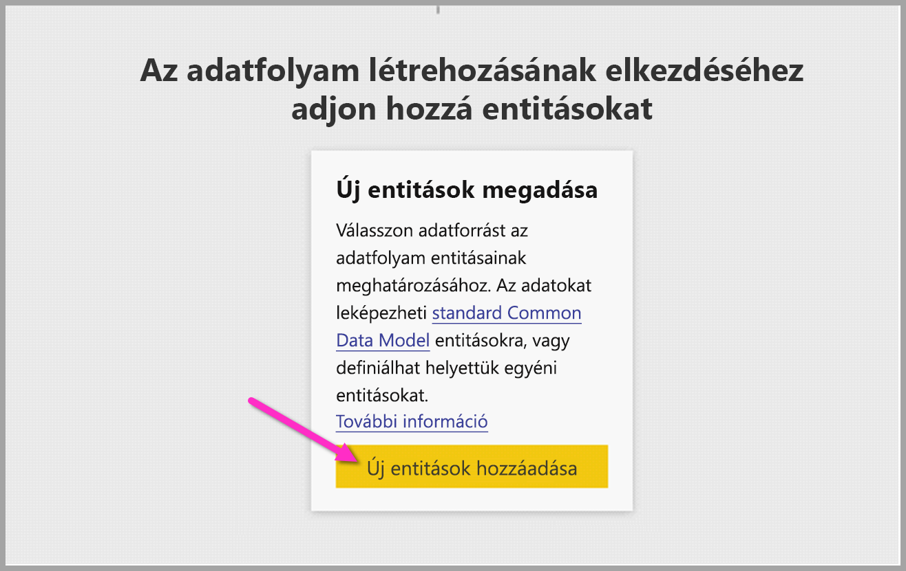

Ha a rendszer azt kéri, hogy válasszon adatforrást, válassza az **Üres lekérdezés** lehetőséget.

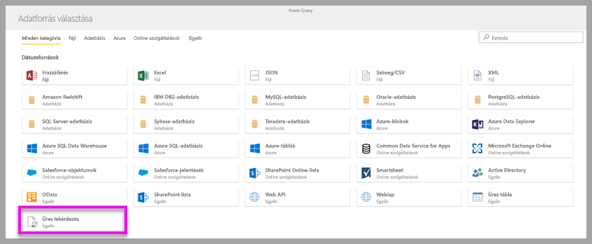

Másolja az alábbi lekérdezést a lekérdezésszerkesztőbe, és kattintson a Következő lehetőségre. Az alábbi URL-címeket lecserélheti más képekre, és újabb sorokat is hozzáadhat. A *Web.Contents* függvény a kép URL-címét binárisként importálja. Ha binárisként tárolt képeket tartalmazó adatforrással rendelkezik, azokat közvetlenül is használhatja.


```python
let
  Source = Table.FromRows({
  { Web.Contents("https://images.pexels.com/photos/87452/flowers-background-butterflies-beautiful-87452.jpeg") },
  { Web.Contents("https://upload.wikimedia.org/wikipedia/commons/5/53/Colosseum_in_Rome%2C_Italy_-_April_2007.jpg") }}, { "Image" })
in
  Source
```

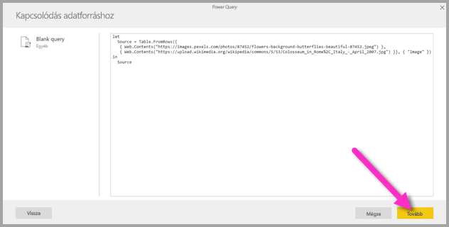

Ha a hitelesítő adatokat kéri a rendszer, válassza a *Névtelen* lehetőséget.

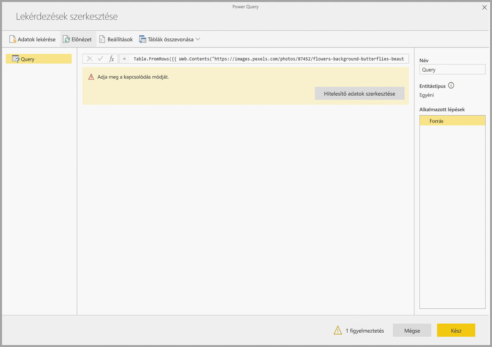

Az alábbi kép fog megjelenni.

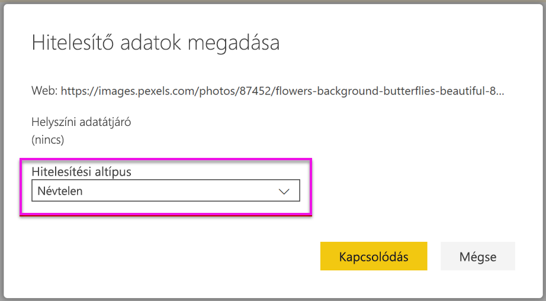

A rendszer minden egyes weblap esetén kérni fogja a hitelesítő adatokat.

A lekérdezésszerkesztőben válassza az **AI-elemzések** lehetőséget.

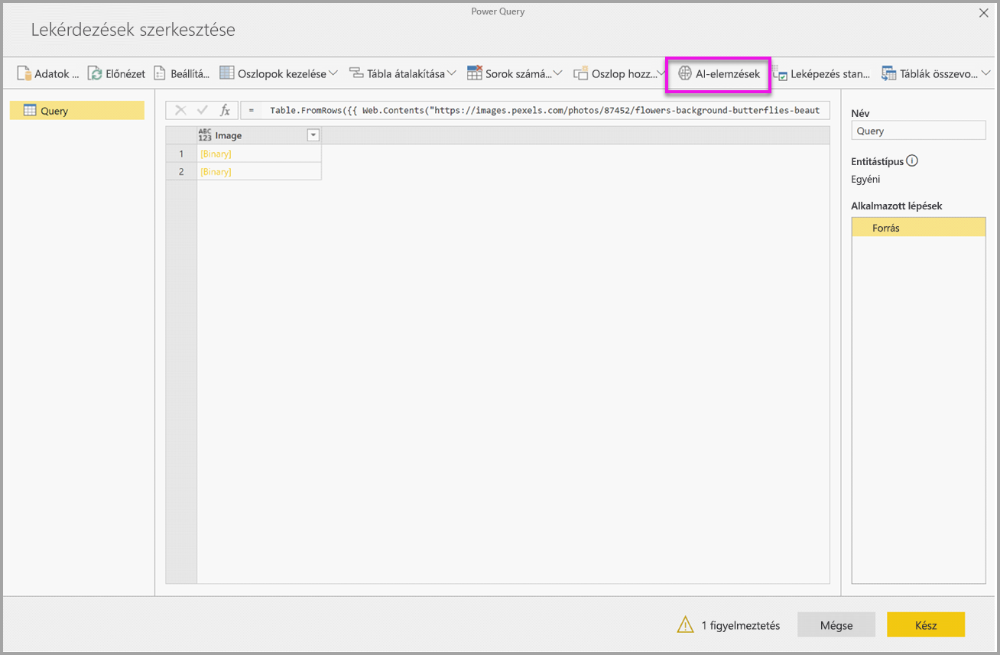

Jelentkezzen be a **szervezeti fiókjával**.

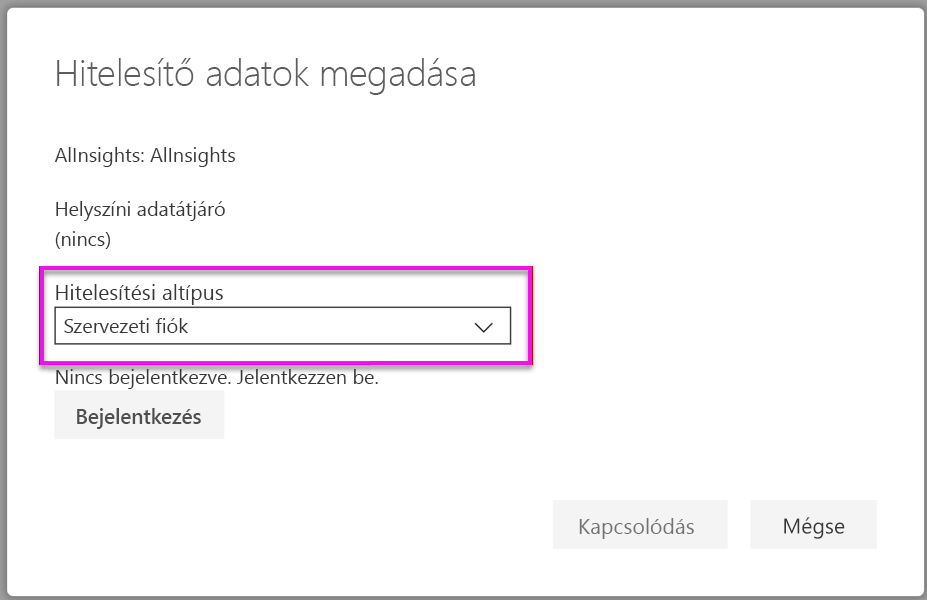

Válassza ki a képcímkézési (Tag Images) függvényt, az oszlopmezőben adja meg a _[Binary]_ , a kulturális információ mezőben pedig az _en_ értéket. 

> [!NOTE]
> Legördülő lista jelenleg nem használható oszlop kiválasztásához. Ezt a problémát a privát előzetes verzióban orvosoljuk majd.

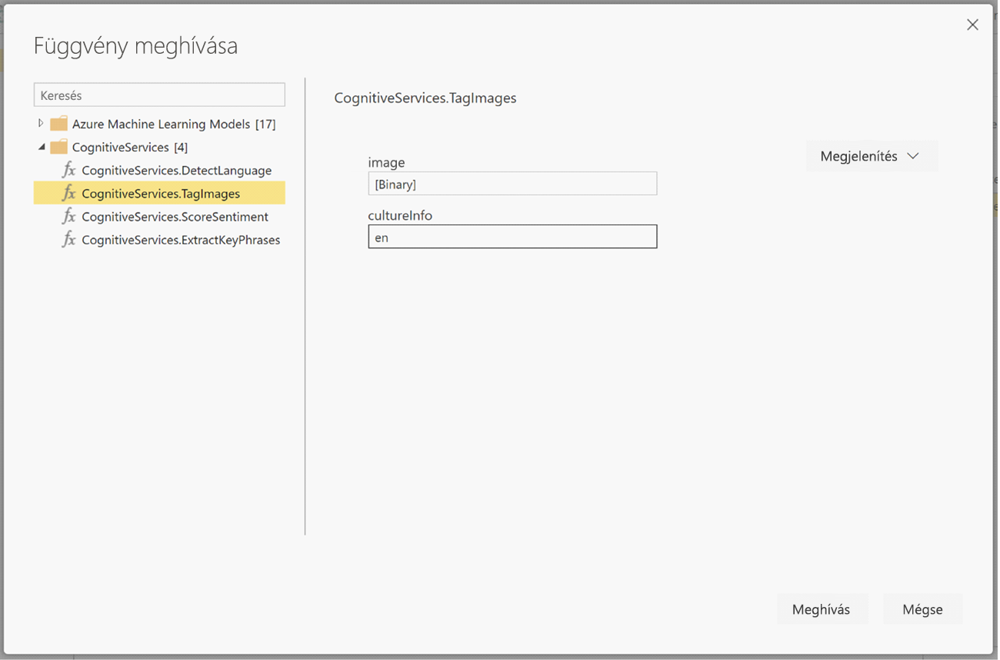

A függvényszerkesztőben távolítsa el az oszlopnévből az idézőjeleket. 

> [!NOTE]
> Az idézőjelek eltávolítása ideiglenes megoldás. Ezt a hibát az előzetes verzió ideje alatt hamarosan megoldjuk.

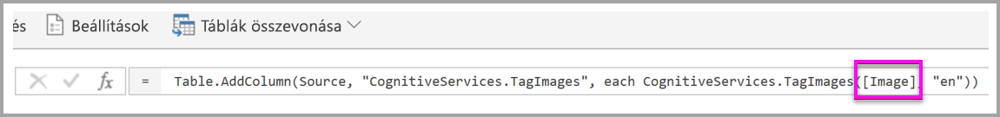

A függvény visszatérési értéke egy mindkét címkét tartalmazó rekord vesszővel tagolt formátumban, json-rekordként. A kibontás gombot választva oszlopként hozzáadhatja a táblához akár az egyiket, akár mindkettőt.

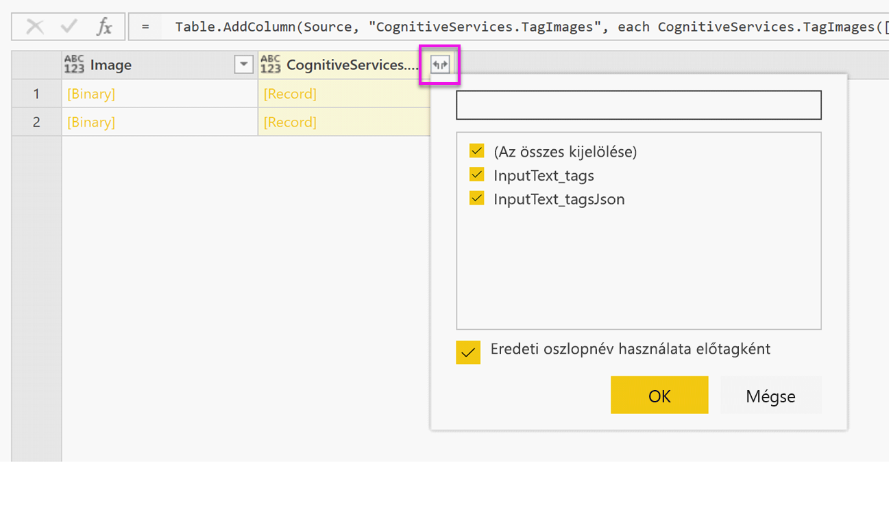

Az adatfolyam mentéséhez válassza a **Kész** lehetőséget. A mentés után az Adatfolyamok-összekötőkkel csatlakozhat az adatfolyamhoz a Power BI Desktopból. (Ennek lépéseit a jelen dokumentum 5. oldalán találja meg.)

## <a name="clean-up-resources"></a>Erőforrások felszabadítása

Ha már nincs szüksége rá, törölje a lekérdezést. Ehhez kattintson jobb gombbal a lekérdezés nevére a Power Query-szerkesztőben, majd válassza a **Törlés** lehetőséget.

## <a name="next-steps"></a>Következő lépések

Ebben az oktatóanyagban vélemények pontozására és képcímkésére használható függvényeket használt egy Power BI-adatfolyamra. Ha bővebben is szeretne megismerkedni a Power BI-ban használható Cognitive Services szolgáltatással, olvassa el az alábbi cikkeket is.

* [Cognitive Services-szolgáltatások az Azure-ban](https://docs.microsoft.com/azure/cognitive-services/)
* Első lépések az [önkiszolgáló adat-előkészítésben adatfolyamoknál](service-dataflows-overview.md)
* További információ a [Power BI Premiumról](https://powerbi.microsoft.com/power-bi-premium/)

Az alábbi cikkeket is érdekesnek találhatja.

* [Oktatóanyag: Machine Learning Studio (klasszikus) modell meghívása a Power BI-ban (előzetes verzió)](service-tutorial-invoke-machine-learning-model.md)
* [Az Azure Machine Learning integrálása a Power BI-jal (Előzetes verzió)](service-machine-learning-integration.md)
* [A Cognitive Services a Power BI-ban (Előzetes verzió)](service-cognitive-services.md)