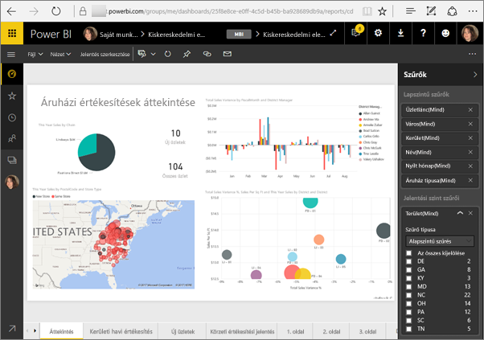
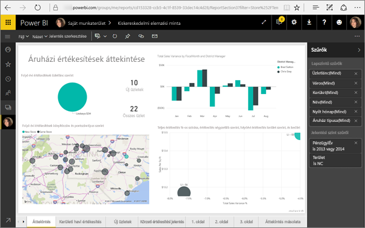
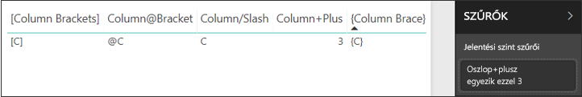
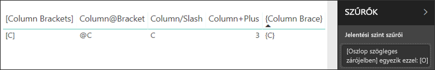

# <a name="filter-a-report-using-query-string-parameters-in-the-url"></a>Jelentés szűrése lekérdezésisztring-paraméterek URL-címben való használatával

A Power BI szolgáltatásban megnyitott jelentések minden egyes oldalának saját egyedi URL-címe van. Az adott jelentésoldal a jelentésvászon Szűrők paneljének használatával szűrhető.  A jelentés előzetes szűréséhez az URL-címhez is hozzáadhat lekérdezésisztring-paramétereket. Tegyük fel, hogy egy jelentést meg szeretne mutatni a munkatársainak, és előre szűrni szeretné azt a számukra. A szűrés egyik módja az, hogy a jelentés alapértelmezett URL-címéhez szűrési paramétereket ad, majd a teljes új URL-címet küldi el e-mailben.



## <a name="uses-for-query-string-parameters"></a>Lekérdezésisztring-paraméterek felhasználási módjai

Tegyük fel, hogy a Power BI Desktopban dolgozik. Más Power BI-jelentésekre mutató hivatkozásokat tartalmazó jelentést kíván létrehozni – de a más jelentésekben lévő információnak csak egy részét szeretné megjeleníteni. Megteheti, hogy először lekérdezésisztring-paraméterek használatával szűri a jelentéseket, majd menti az URL-címeket. Ez után létrehoz egy, ezeket az új jelentés-URL-címeket tartalmazó táblázatot a Desktopban.  Végül közzéteszi és megosztja a jelentést.

A lekérdezésisztring-paraméterek másik felhasználási módja speciális Power BI-megoldások létrehozásához való.  A DAX használatával olyan jelentés hozható létre, amely dinamikusan generál szűrt jelentés-URL-címet az alapján, hogy mit jelölt ki éppen az ügyfél az aktuális jelentésben. Az URL-címet választó ügyfelek csak a nekik szánt információt látják. 

## <a name="query-string-parameter-syntax-for-filtering"></a>Lekérdezésisztring-paraméterek szintaxisa szűréshez

Paraméterek használatával a jelentés egy vagy több értékre szűrhető még akkor is, ha az értékek szóközöket vagy speciális karaktereket tartalmaznak. Az alapvető szintaxis nagyon egyszerű – kezdje a jelentés URL-címével, adjon hozzá egy kérdőjelet, majd a szűrési szintaxist.

URL-cím?filter=***Tábla***/***Mező*** eq '***érték***'


* A **Tábla** és a **Mező** nevei megkülönböztetik a kis- és nagybetűket, az **érték** viszont nem.
* A jelentésnézetben rejtett mezők is szűrhetők.

### <a name="field-types"></a>Mezőtípusok

A mezőtípus lehet szám, dátum és idő vagy sztring, és a használt típusnak egyeznie kell az adathalmazban megadottal.  Egy tábla oszlopának „sztring” beállítása például nem működik, ha dátum, idő vagy numerikus értéket keres egy adathalmaz dátumként beállított oszlopában, például a Table/StringColumn eq 1 oszlopban.

* A **sztringeket** aposztrófok között kell megadni – ’vezető neve’.
* A **számok** nem igényelnek különleges formázást
* A **dátumokat és időpontokat** aposztrófok között kell megadni. Az OData v3-ban ezeket a datetime szónak kell megelőznie. Az OData v4-ben ez nem szükséges.

Ha egyelőre nem minden világos, akkor olvasson tovább, és bővebb kifejtést is találhat.  

## <a name="filter-on-a-field"></a>Szűrés egy mező alapján

Tegyük fel például, hogy a jelentés URL-címe a következő.


A térkép-vizualizáción (fent) látható, hogy üzleteink vannak Észak-Karolinában.

>[!NOTE]
>Ez a példa a [Kiskereskedelmi elemzési mintán](sample-datasets.md) alapszik.
> 

Ha úgy szeretné szűrni a jelentést, hogy csak az Észak-Karolinában („NC”) található üzletek adatait jelenítse meg, akkor fűzze hozzá az URL-címhez a következőt;

?filter=Store/Territory eq 'NC'


>[!NOTE]
>Az *NC* (North Carolina, Észak-Karolina) érték a **Store** (Üzlet) tábla **Territory** (Terület) mezőjében található meg.
> 

A jelentés szűrve lett Észak-Karolinára, és a jelentés oldalán található összes vizualizáció csak Észak-Karolina adatait jeleníti meg.



## <a name="filter-on-multiple-fields"></a>Szűrés több mező alapján

Ha további paramétereket fűz az URL-címhez, több mező alapján is végezhet szűrést. Térjünk vissza az eredeti szűrési paraméterhez.

```
?filter=Store/Territory eq 'NC'
```

További mezők alapján úgy szűrhet, hogy az „**and**” kulcsszót és egy újabb mezőt ad meg a fentinek megfelelő formátumban. Íme egy példa.

```
?filter=Store/Territory eq 'NC' and Store/Chain eq 'Fashions Direct'
```

<iframe width="640" height="360" src="https://www.youtube.com/embed/0sDGKxOaC8w?showinfo=0" frameborder="0" allowfullscreen></iframe>

## <a name="operators"></a>Operátorok

A Power BI az „**and**” operátoron kívül sok továbbit is támogat. Ezek az operátorok az alábbi táblázatban az általuk támogatott tartalomtípussal együtt vannak felsorolva.

|operátor  | definíció | sztring  | szám | Dátum |  Példa|
|---------|---------|---------|---------|---------|---------|
|**and**     | és |  igen      | igen |  igen|  termék/ár le 200 and ár gt 3.5 |
|**eq**     | egyenlő |  igen      | igen   |  igen       | Cím/Város eq ’Kalocsa’ |
|**ne**     | nem egyenlő |   igen      | igen  | igen        |  Cím/Város ne ’Sopron’ |
|**ge**     |  nagyobb vagy egyenlő, mint       | nem | igen |igen |  termék/ár ge 10
|**gt**     | nagyobb, mint        |nem | igen | igen  | termék/ár gt 20
|**le**     |   kisebb vagy egyenlő, mint      | nem | igen | igen  | termék/ár le 100
|**lt**     |  kisebb, mint       | nem | igen | igen |  termék/ár lt 20
|**in****     |  a következők között van       | igen | igen |  igen | Diák/Életkor in (27, 29)


\** az **in** használatakor az **in** operátortól jobbra lévő értékek zárójelek közötti, vesszővel elválasztott listaként, vagy egy kollekciót megadó kifejezésként adhatók meg.

### <a name="numeric-data-types"></a>Numerikus adattípusok

A Power BI URL-címekben a szűrők az alábbi formátumú számokat tartalmazhatják.

|Számtípus  |Példa  |
|---------|---------|
|**integer**     |   5      |
|**long**     |   5L vagy 5l      |
|**double**     |   5.5 vagy 55e-1 vagy 0.55e+1 vagy 5D vagy 5d vagy 0.5e1D vagy 0.5e1d vagy 5.5D vagy 5.5d vagy 55e-1D vagy 55e-1d     |
|**decimal**     |   5M vagy 5m vagy 5.5M vagy 5.5m      |
|**float**     | 5F vagy 5f vagy 0.5e1F vagy 0.5e-1d        |

### <a name="date-data-types"></a>Dátum adattípusok

A Power BI az OData V3 és V4 **Date** és **DateTimeOffset** adattípusokat is támogatja.  A dátumok megadása EDM formátumban (2019-02-12T00:00:00) történik, tehát he megad egy dátumot ÉÉÉÉ-HH-NN formátumban, a Power BI ezt ÉÉÉÉ-HH-NNT00:00:00 időpontként értelmezi.

Miért számít ez a megkülönböztetés? Tegyük fel, hogy létrehoz egy **Table/Date gt 2018-08-03** lekérdezésisztring-paramétert.  Az eredmények között lesz 2018. augusztus 3., vagy csak 2018. augusztus 4-étől kezdődnek? Mivel a Power BI **Táblázat/Dátum gt 2018-08-03T00:00:00** formátumra fordítja le a lekérdezést, az eredményekben minden nem nulla időösszetevővel rendelkező dátum szerepel, mert azok a **2018-08-03T00:00:00** dátumnál nagyobbak.

## <a name="special-characters-in-url-filters"></a>Speciális karakterek URL-szűrőkben

A speciális karakterek és szóközök igényelnek némi további formázást. Ha a lekérdezés szóközöket, kötőjeleket vagy egyéb nem ASCII-karaktereket tartalmaz, a speciális karakterek előtagjaként használjon olyan *feloldókaraktert*, amely aláhúzásjellel és egy X karakterrel (**_x**) kezdődik, majd a 4 számjegyű **Unicode**-karakter után még egy aláhúzásjelet tartalmaz. Ha a Unicode-karakter kevesebb mint négy számjegyből áll, akkor nullákkal kell kiegészítenie. Az alábbiakban néhány példa következik.

|Azonosító  |Unicode  | Kódolás a Power BI-ban  |
|---------|---------|---------|
|**Táblázat neve**     | A szóköz kódja: 0x20        |  Table_x0020_Name       |
|**Column**@**Number**     |   A @ kódja: 0x40     |  Column_x0040_Number       |
|**[Column]**     |  A [ kódja: 0x0058, a ] kódja pedig: 0x0050       |  _x005B_Column_x005D       |
|**Column+Plus**     | A + kódja: 0x2B        |  Column_x002B_Plus       |

Table_x0020_Name/Column_x002B_Plus eq 3 


Table_x0020_Special/_x005B_Column_x0020_Brackets_x005D_ eq '[C]' 

### <a name="use-dax-to-filter-on-multiple-values"></a>Szűrés több értékre a DAX használatával

A szűrés egy másik módja, ha létrehoz egy számított oszlopot, amely két mezőt egyetlen értékké fűz össze. Ezt követően már szűrhet erre az értékre.

Legyen a két mező például a Territory (Terület) és a Chain (Üzletlánc). [Hozzon létre egy új számított oszlopot](desktop-tutorial-create-calculated-columns.md) (Mezőt) a Power BI Desktopban, TerritoryChain (TerületÜzletlánc) néven. Ne feledje, hogy a **Mező** neve nem tartalmazhat szóközöket. Az oszlop DAX-képlete a következő.

TerritoryChain = [Territory] & " - " & [Chain]

Tegye közzé a jelentést a Power BI szolgáltatásban, majd az URL-cím lekérdezési sztringjével szűrje azt úgy, hogy csak az Észak-Karolinában található Lindseys üzletek adatait jelenítse meg.

    https://app.powerbi.com/groups/me/reports/8d6e300b-696f-498e-b611-41ae03366851/ReportSection3?filter=Store/TerritoryChain eq 'NC–Lindseys'

## <a name="pin-a-tile-from-a-filtered-report"></a>Szűrt jelentésből származó csempe rögzítése

Miután lekérdezésisztring-paraméterek használatával szűrte a jelentést, abból származó vizualizációkat rögzíthet az irányítópulton.  Az irányítópulton található csempe a szűrt adatokat jeleníti meg, az irányítópult csempéjére kattintva pedig megnyílik a létrehozásához használt jelentés.  Az URL-címmel végrehajtott szűrés azonban nem lesz mentve a jelentéssel együtt. Amikor kiválasztja a csempét az irányítópulton, a jelentés szűretlen állapotban nyílik meg.  Tehát az irányítópult csempéjén megjelenített adatok nem egyeznek a jelentésben szereplő vizualizációban megjelenített adatokkal.

Ez az eltérés akkor hasznos, ha különböző eredményeket szeretne megjeleníteni: a szűrt adatokat az irányítópulton, a nem szűrt adatokat pedig a jelentésben.

## <a name="considerations-and-troubleshooting"></a>Megfontolandó szempontok és hibaelhárítás

Lekérdezésisztring-paraméterek használatakor néhány szemponttal érdemes tisztában lenni.

* Az *in* használatakor az *in* operátortól jobbra lévő értékeket zárójelek közötti, vesszővel elválasztott listaként kell megadni.    
* A Power BI jelentéskészítő kiszolgálón [adhat át jelentésparamétereket](https://docs.microsoft.com/sql/reporting-services/pass-a-report-parameter-within-a-url?view=sql-server-2017.md) úgy, hogy belefoglalja őket a jelentés URL-címébe. Ezek az URL-paraméterek nincsenek előtaggal ellátva, mert a rendszer közvetlenül átadja őket a jelentésfeldolgozó motornak.
* A lekérdezési sztringgel végzett szűrés a [webes közzététellel](service-publish-to-web.md) együtt nem működik.
* [A SharePoint Online-ban jelentéskijelzővel történő beágyazás](service-embed-report-spo.md) nem támogatja az URL-szűrőket.
* A long adattípus maximális értéke a JavaScript korlátozásai miatt 2^53-1.
* A jelentés URL-címének szűrői legfeljebb 10 kifejezést tartalmazhatnak (10 kifejezést, AND operátorral).

## <a name="next-steps"></a>Következő lépések

[Vizualizáció rögzítése az irányítópulton](service-dashboard-pin-tile-from-report.md)  
[Regisztráljon ingyenes próbára](https://powerbi.microsoft.com/get-started/)

További kérdései vannak? [Kérdezze meg a Power BI közösségét](http://community.powerbi.com/)
