# Használati metrikák figyelése Power BI-irányítópultokhoz és -jelentésekhez

Ha irányítópultokat és jelentéseket készít, akkor a használati metrikák segítenek megérteni azok hatásosságát. Az irányítópultra vagy jelentésre vonatkozó használati metrikák futtatásával feltárhatja, hogyan használják a szervezetén belül az irányítópultokat és jelentéseket, ki használja azokat, és milyen célra.  

A használati metrikai jelentések csak olvashatók. A használati metrikai jelentésekről azonban másolatot készíthet. A másolással egy szabványos Power BI-jelentést hoz létre, amelyet szerkeszthet. A Power BI Desktopban saját jelentéseket is készíthet a mögöttes adathalmaz alapján, amely a munkaterület összes irányítópultjának és jelentésének használati metrikáit tartalmazza. A másolt jelentésben először csak a kijelölt irányítópult vagy jelentés metrikái jelennek meg. Az alapértelmezett szűrő eltávolításával hozzáférhet a mögöttes adathalmazhoz, a kiválasztott munkaterület összes használati metrikájával együtt. Még az adott felhasználók nevét is láthatja, ha a rendszergazda ezt engedélyezte.

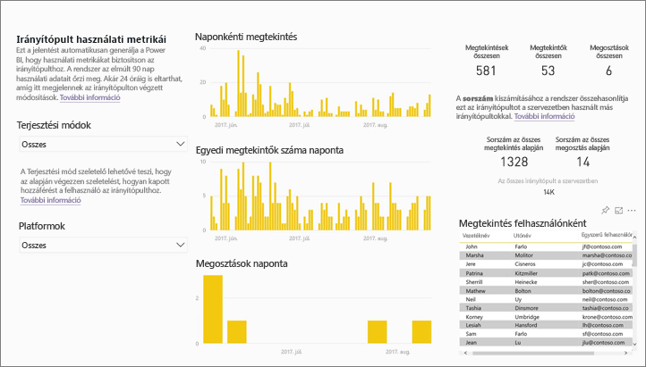

> [!NOTE]
> A használati metrikák mérik a SharePoint Online-ban beágyazott jelentések használatát. A használati metrikák azonban nem követik nyomon a „felhasználó a hitelesítő adatok tulajdonosa” és az „alkalmazás a hitelesítő adatok tulajdonosa” folyamaton keresztül beágyazott irányítópultokat és a jelentéseket. A használati metrikák a [webes közzétételen](service-publish-to-web.md) keresztül beágyazott jelentések használatát sem követik nyomon.

## A használati metrikák jelentősége

A tartalom felhasználási módjának ismerete segít az eredményesség szemléltetésében és a feladatok fontossági sorrendjének felállításában. Egy használati metrika megmutathatja, hogy az egyik jelentést naponta használja a szervezet egy jelentős része, vagy éppen azt, hogy egy létrehozott irányítópultot senki sem tekint meg. Az ilyen visszajelzés felbecsülhetetlen értékű útmutatást nyújt a munkaszervezésben.

Használati metrikai jelentéseket csak a Power BI szolgáltatásban futtathat. A mentett, vagy irányítópulton rögzített használati metrikák azonban mobileszközökön is megnyithatók és kezelhetők.

## Előfeltételek

- A használati metrikai adatok futtatásához és eléréséhez Power BI Pro-licenc szükséges. A használati metrika funkció azonban a hozzájuk rendelt licenc típusától függetlenül minden felhasználónál rögzíti a használattal kapcsolatos adatokat.
- Egy adott irányítópult vagy jelentés használati metrikai adataihoz akkor férhet hozzá, ha szerkesztési jogosultsággal éri el.
- A tartalomkészítők számára a Power BI-rendszergazda által engedélyezve kell lenniük a használati metrikáknak. A Power BI-rendszergazda a felhasználónkénti adatok használati metrikákban való gyűjtését is engedélyezheti. Tovább tájékozódhat [ezeknek a beállításoknak a felügyeleti portálon való engedélyezéséről](service-admin-portal.md#control-usage-metrics). 

## Használati metrikai jelentés megtekintése

1. Kezdje a munkát az irányítópultot vagy jelentést tartalmazó munkaterületen.
2. Akár a munkaterület tartalomlistájában, akár magán az irányítópulton vagy jelentésben válassza a **Használati metrikák**   ikonját.

    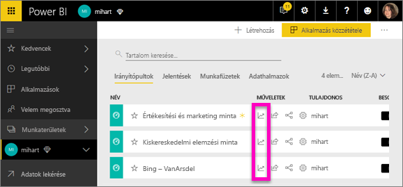

    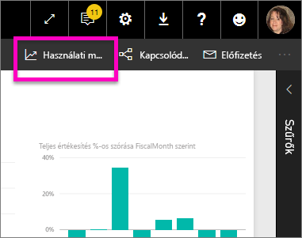
3. Amikor először teszi ezt, a Power BI létrehozza a használati metrikai jelentést, és értesíti önt, amikor elkészült.

    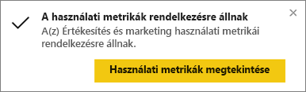
4. Az eredmény megtekintéséhez válassza a **Használati metrikák megtekintése** lehetőséget.

    A használati metrikák hasznos segítséget nyújtanak a Power BI-irányítópultok és -jelentések létrehozásához és fenntartásához. Szeretné tudni, hogy a jelentése mely oldalai a leghasznosabbak, és melyeket kellene kihagynia? Megtudhatja, ha szűkíti a listát **Jelentésoldalak** szerint. Fontolgatja, hogy kialakítson-e mobil elrendezést az irányítópulthoz? A **Platformok** szerinti szűkítés révén megtudhatja, hogy hány felhasználó éri el a tartalmat mobilalkalmazáson, és hány a weben keresztül.

5. A vizualizáció irányítópultra történő felvételéhez vigye a kurzort az egyik vizualizáció fölé, és válassza a kitűzés ikont. Vagy a felső menüsávon válassza az **Élő oldal rögzítése** lehetőséget, amivel a teljes oldalt rögzítheti az irányítópulton. Az irányítópulton egyszerűbben követheti a használati metrikákat, és meg is oszthatja őket.

    > [!NOTE]
    > Ha egy használati metrikai jelentésből származó csempét hozzáad egy irányítópulthoz, akkor az az irányítópult már nem adható hozzá alkalmazáshoz.

### Használati metrikai jelentés irányítópulthoz

### Használati metrikai jelentés jelentéshez

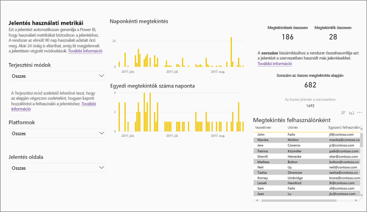

## Tudnivalók a használati metrikai jelentésről

Ha a **Használati metrikák** lehetőséget vagy az egyik irányítópult vagy jelentés melletti  ikont választja, a Power BI egy előre elkészített, az utolsó 90 napra vonatkozó jelentést készít az adott tartalomról.  A jelentés azokhoz a már jól ismert Power BI-jelentésekhez hasonló. Szeletelhető az alapján, hogy a felhasználók hogyan kaptak hozzáférést, és hogy weben, mobilalkalmazáson vagy más lehetőségen keresztül érték el. Az irányítópultok és jelentések változásait az új adatokkal naponta frissülő használati metrikai jelentések is tükrözik.  

A használati metrikai jelentések nem jelennek meg a **Legutóbbi**, a **Munkaterületek**, a **Kedvencek** vagy más tartalomlistákon. Nem lehet őket hozzáadni egy alkalmazáshoz. Ha egy használati metrikai jelentésből származó csempét hozzáad egy irányítópulthoz, akkor az az irányítópult már nem adható hozzá alkalmazáshoz.

A jelentés adatainak részletes vizsgálatára vagy a mögöttes adathalmazra épülő saját jelentés készítésére két lehetősége van: 

- Másolatot készíthet a jelentésről a Power BI szolgáltatásban. Ennek részleteiről a cikk egy későbbi, [A használati metrikai jelentés másolatának mentése](#save-a-copy-of-the-usage-metrics-report) című szakaszában olvashat.
- Csatlakozhat az adathalmazhoz a Power BI Desktopból. Az adathalmaz neve minden munkaterületen „Report Usage Metrics Model”. A részleteket a [Kapcsolat létrehozása közzétett adathalmazzal](desktop-report-lifecycle-datasets.md#establish-a-power-bi-service-live-connection-to-the-published-dataset) című szakaszban találja.

    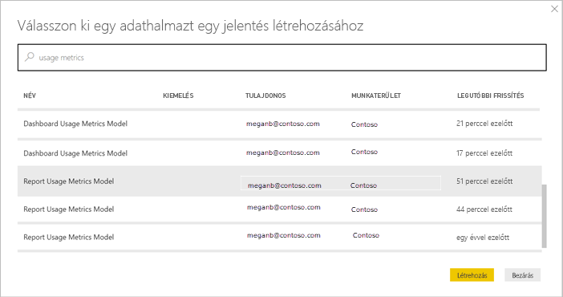

## Melyik metrikák szerepelnek a jelentésben?

| Metric | Irányítópult | Jelentés | Leírás |
| --- | --- | --- | --- |
| Hozzáférési mód szerint |igen |igen |Hogyan érik el a felhasználók a tartalmat. Három mód lehetséges: a felhasználók elérhetik a jelentést vagy irányítópultot azáltal, hogy egy [munkaterület](consumer/end-user-experience.md) tagjai, hogy a tartalom [meg van osztva velük](service-share-dashboards.md), vagy egy tartalomcsomag/alkalmazás telepítésével.  Megjegyzendő, hogy az alkalmazáson keresztül történő hozzáférés "tartalomcsomagként” számítódik be. |
| Platform szerint |igen |igen |A Power BI szolgáltatáson (powerbi.com) keresztül, vagy mobileszközzel érték el az irányítópultot vagy jelentést? Mobileszköznek számít minden iOS-, Android- és Windows-alkalmazásunk is. |
| Jelentésoldalak szerint |nem |igen |Ha a jelentés terjedelme egy oldalnál nagyobb, akkor az a megtekintett oldal(ak) szerint vizsgálható. Ha a listában „Üres” elem látható, az azt jelenti, hogy egy oldalt a közelmúltban adtak hozzá a jelentéshez (az új oldal tényleges neve 24 órán belül megjelenik a szűrési listában) és/vagy azt, hogy a jelentésből oldalakat töröltek. Az "Üres" elem ezeket az eseteket jelzi. |
| Naponkénti megtekintés |igen |igen |A naponkénti megtekintések teljes száma – megtekintésnek számít, ha egy felhasználó betölt egy jelentésoldalt vagy egy irányítópultot. |
| Egyedi megtekintők száma naponta |igen |igen |Az irányítópultot vagy jelentést megtekintő *különböző* felhasználók száma (az AAD-felhasználói fiók alapján). |
| Megtekintés felhasználónként |igen |igen |A megtekintések száma az utolsó 90 napban, egyedi felhasználókra lebontva. |
| Megosztások naponta |igen |nem |Ahányszor az irányítópultot megosztották másik felhasználóval vagy csoporttal. |
| Megtekintések összesen |igen |igen |Megtekintések száma az utolsó 90 napban. |
| Megtekintők összesen |igen |igen |Egyedi megtekintők száma az utolsó 90 napban. |
| Megosztások összesen |igen |nem |Ahányszor az irányítópultot megosztották az utolsó 90 napban. |
| Szervezeten belüli mennyiség |igen |igen |A teljes szervezeten belüli összes olyan irányítópult vagy jelentés száma, amelyet legalább egyszer megtekintettek az utolsó 90 napban.  Rangsorolás kiszámításához használható. |
| Rang: Megtekintések összesen |igen |igen |Hányadik ez az irányítópult vagy jelentés a szervezeten belüli irányítópultok vagy jelentések rangsorában az utolsó 90 napban történt megtekintések száma szerint. |
| Rang: Megosztások összesen |igen |nem |Hányadik ez az irányítópult a szervezeten belüli irányítópultok rangsorában az utolsó 90 napban történt megosztások száma szerint. |

## A használati metrikai jelentés másolatának mentése

A **Mentés másként** lehetőséggel a használati metrikai jelentést szabványos Power BI-jelentéssé konvertálhatja, amelyet aztán az aktuális igényeinek megfelelően testre szabhat. A Power BI Desktop használatával egyéni használati metrikai jelentést is készíthet a mögöttes adathalmaz alapján. A részleteket a [Kapcsolat létrehozása közzétett adathalmazzal](desktop-report-lifecycle-datasets.md#establish-a-power-bi-service-live-connection-to-the-published-dataset) című szakaszban találja.

Az alapul szolgáló adatkészlet ráadásul magában foglalja a munkaterület összes irányítópultjának és jelentésének használati adatait. Ezzel további lehetőségek válnak elérhetővé. Készíthet például olyan jelentést, amely a munkaterületén belüli összes irányítópultot összehasonlítja használat alapján. Használati metrikai irányítópultot is készíthet Power BI-alkalmazásához az alkalmazásban megosztott valamennyi tartalom használati adatainak összegzésével.  A szűrő eltávolítását és [a munkaterületre vonatkozó összes használati metrika megjelenítését](#see-all-workspace-usage-metrics) a cikk későbbi része ismerteti.

### Használati jelentés másolatának létrehozása

Amikor másolatot készít a csak olvasható, előre elkészített használati jelentésről, a Power BI a jelentés szerkeszthető másolatát hozza létre. Első látásra ugyanolyannak tűnhet. Csakhogy a jelentés most már megnyitható Szerkesztő nézetben, hozzáadhat vizualizációkat, szűrőket és oldalakat, módosíthat vagy törölhet meglévő vizualizációkat, és további lehetőségek is megnyílnak. A Power BI az aktuális munkaterületre menti az új jelentést.

1. Az előre elkészített használati metrikai jelentésben válassza a **Fájl > Mentés másként** lehetőséget. A Power BI szerkeszthető Power BI-jelentést hoz létre, amelyet az aktuális munkaterületre ment.

    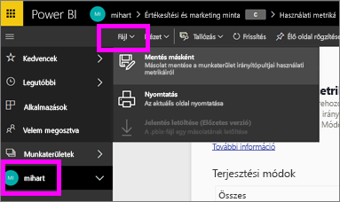
2. Nyissa meg a jelentést Szerkesztő nézetben és [dolgozzon vele ugyanúgy, mint bármely más Power BI-jelentéssel](service-interact-with-a-report-in-editing-view.md). Hozzáadhat például új oldalakat, készíthet új vizualizációkat, felvehet szűrőket, formázhatja a betűtípusokat és színeket, stb.

    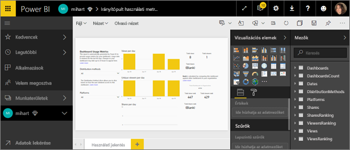
3. Az új jelentés az aktuális munkaterület **Jelentések** lapjára lesz mentve, és fel lesz véve a **Legutóbbi** tartalomlistára.

    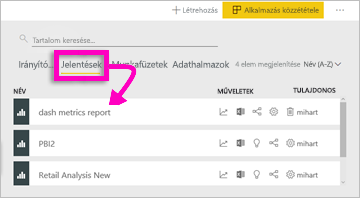

## Az *összes* munkaterület-használati metrika megjelenítése

Ahhoz, hogy a munkaterület valamennyi irányítópultjának vagy valamennyi jelentésének metrikái megjelenjenek, törölnie kell egy szűrőt. A jelentés alapértelmezés szerint úgy van szűrve, hogy csak a létrehozásához használt irányítópult vagy jelentés metrikáit jelenítse meg.

1. Az új, szerkeszthető jelentés Szerkesztés módban való megnyitásához válassza a **Jelentés szerkesztése** lehetőséget.

    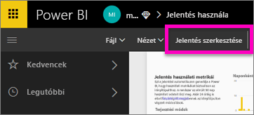
2. A keresse meg a **Jelentésszintű szűrők** gyűjtőt a Szűrők panelen, és távolítsa el a szűrést a **ReportGuid** melletti radír választásával.

    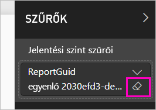

    A jelentésben így már a teljes munkaterület metrikái megjelennek.

## Power BI-rendszergazdai vezérlőelemek használati metrikákhoz

A használati metrikai jelentés olyan funkció, amelyet a Power BI vagy Office 365 rendszergazdája kapcsolhat be vagy ki. A rendszergazdák részletesen szabályozhatják, hogy mely felhasználók férnek hozzá a használati metrikákhoz. Ez alapértelmezés szerint a szervezet összes felhasználójánál **engedélyezve** van.

> [!NOTE]
> Csak a Power BI-bérlő rendszergazdái látják a Felügyeleti portált és a szerkesztési beállításokat. 

Alapértelmezés szerint a felhasználónkénti adatok engedélyezve vannak a használati metrikákhoz, a tartalomfelhasználói fiókadatok pedig szerepelnek a metrikajelentésekben. Ha a rendszergazdák ezt az információt egyes felhasználók esetében nem szeretnék felfedni, letilthatják a funkciót megadott biztonsági csoportok, vagy a teljes szervezet számára. A fiókadatok ekkor *névtelenként* jelennek meg a jelentésben.

Amikor a teljes szervezet számára letiltja a használati metrikákat, a rendszergazda a **teljes meglévő használati metrikai tartalom törlése** lehetőséggel törölni tud minden meglévő jelentést és irányítópult-csempét, amely a használati metrikai jelentések használatával készült. Ezen a módon minden használati metrikai adat hozzáférhetetlenné válik a szervezet valamennyi felhasználója számára, akik esetleg már használják is azokat. A meglévő használati metrikai tartalom törlése nem vonható vissza.

Ezeket a beállításokat a Felügyeleti portálról szóló cikk [Használati metrikák szabályozása](service-admin-portal.md#control-usage-metrics) című szakasza ismerteti részletesen. 

## Használati metrikák az országos felhőkben

A Power BI elérhető különálló országos felhőkben. Ezek a felhők ugyanolyan szintű biztonságot, adatvédelmet, megfelelőséget és átláthatóságot kínálnak, mint a Power BI globális verziója, de a szolgáltatásnyújtás, az adatok tárolási helye, a hozzáférés és a vezérlés terén a helyi jogszabályoknak megfelelő egyedi modellel kombinálva. Ennek a helyi jogszabályok szerint kialakított egyedi modellnek köszönhetően a használati metrikák az országos felhőkben nem érhetők el. További információért lásd az [szuverén felhők](https://powerbi.microsoft.com/clouds/) weblapját.

## Megfontolandó szempontok és korlátozások

### Az auditnaplók és a használati metrikák közötti eltérések

Fontos tisztában lenni a használati metrikák és az auditnaplók összehasonlításakor jelentkező különbségekkel és azok magyarázatával. Az *auditnaplók* a Power BI szolgáltatástól származó adatokból vannak gyűjtve, a *használati metrikák* viszont az ügyfélen. A tevékenységek összesített száma az auditnaplókban és a használati metrikákban nem mindig egyezik. Ennek okai a következők:

* A használati metrikák olykor kevesebb tevékenységet számlálnak az inkonzisztens hálózati kapcsolatok, reklámblokkolók vagy más körülmények miatt, amelyek megzavarják az események elküldését az ügyfélről.
* A használati metrikák nem tartalmaznak bizonyos nézettípusokat. Erről már volt szó a cikk korábbi részében.
* A használati metrikák olykor több tevékenységet számlálnak olyan helyzetekben, amikor az ügyfél úgy frissül, hogy nem kell kérelmet visszaküldenie a Power BI szolgáltatásnak.

### További szempontok

A tartalmat legalább egyszer meg kell jelenítenie a saját munkaterületén, a munkaterületen belülről. Ha a tartalom nincs legalább egyszer megjelenítve magáról a munkaterületről, akkor az adatok nincsenek egybevetve a Használati metrikák jelentésbeli alkalmazásnézetekkel. A jelentésbeli adatok feldolgozásának elakadása úgy szüntethető meg, hogy legalább egyszer megjeleníti a tartalmat a saját munkaterületéről.

## Gyakori kérdések

A használati metrikák és az auditnaplók esetleges eltérésein kívül a használati metrikákkal kapcsolatos alábbi kérdések és válaszok is hasznosak lehetnek felhasználók és rendszergazdák számára:

**KÉRDÉS:**    Nem tudok használati metrikát futtatni egy irányítópulton vagy jelentésen

**VÁLASZ:**    Használati metrikát csak olyan tartalmon használhat, amelynek tulajdonosa, vagy amelyhez szerkesztési jogosultsága van.

**KÉRDÉS:**    Rögzíti a használati metrika a beágyazott irányítópultokon és jelentéseken keresztül történő megtekintéseket?

**VÁLASZ:**    A használati metrikák jelenleg nem támogatják a használati adatok gyűjtését beágyazott irányítópultok, jelentések, valamint a [webes közzétételi](service-publish-to-web.md) folyamat esetében. Ezekben az esetekben a meglévő webes elemző platformok használatát ajánljuk az üzemeltető alkalmazás vagy portál használatának nyomon követéséhez.

**KÉRDÉS:**    Semmilyen tartalmon sem tudok használati metrikát futtatni.

**1. VÁLASZ:**    Ezt a funkciót a rendszergazdák kikapcsolhatják a szervezeten belül.  Kérdezze meg a rendszergazdától, hogy ez-e a helyzet.

**2. VÁLASZ:**    A használati metrika a Power BI Pro funkciója.

**KÉRDÉS:**    Úgy látom, hogy az adatok nem naprakészek. Nem jelennek meg például a terjesztési módok, oldalak hiányoznak egy jelentésből, stb.

**VÁLASZ:**    Az adatok frissülése akár 24 órát is igénybe vehet.

**KÉRDÉS:**    A munkaterületen négy jelentés van, de a használati metrikai jelentésben csak három látszik.

**VÁLASZ:**    A használati metrikai jelentésben csak azok a jelentések (vagy irányítópultok) jelennek meg, amelyekhez az utolsó 90 napban hozzáfértek.  Ha egy jelentés (vagy irányítópult) nem jelenik meg, akkor valószínűleg több mint 90 napja használták utoljára.

## Következő lépések

[A Power BI felügyelete a felügyeleti portálon](service-admin-portal.md)

További kérdései vannak? [Kérdezze meg a Power BI közösségét](https://community.powerbi.com/)
